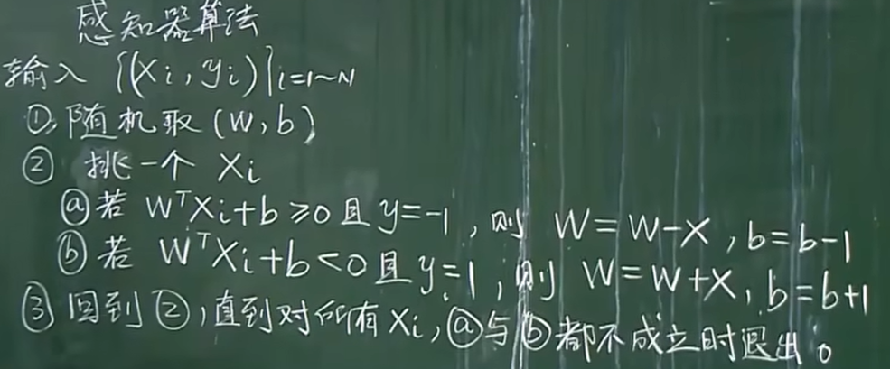
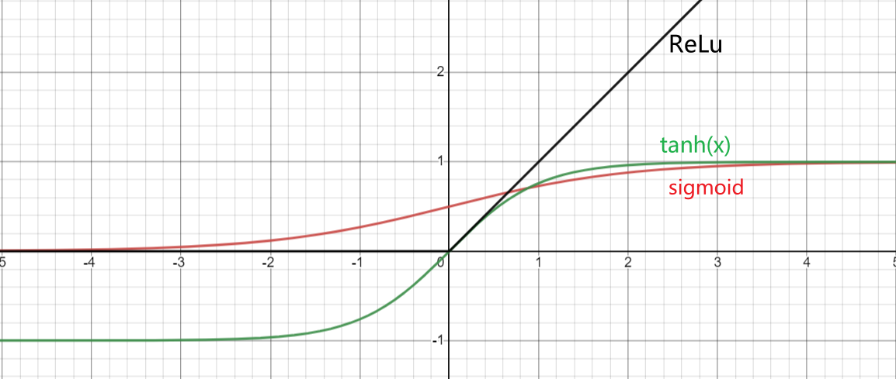
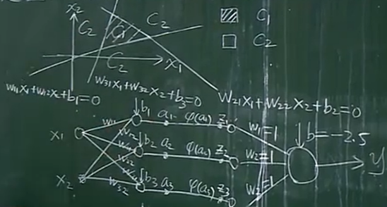
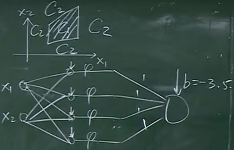
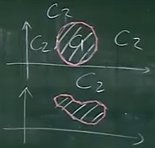
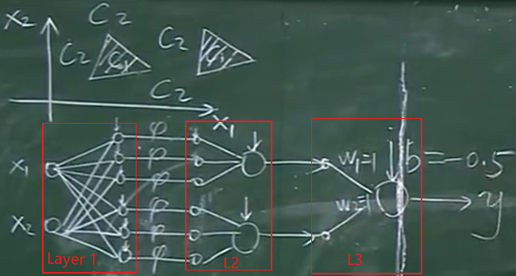
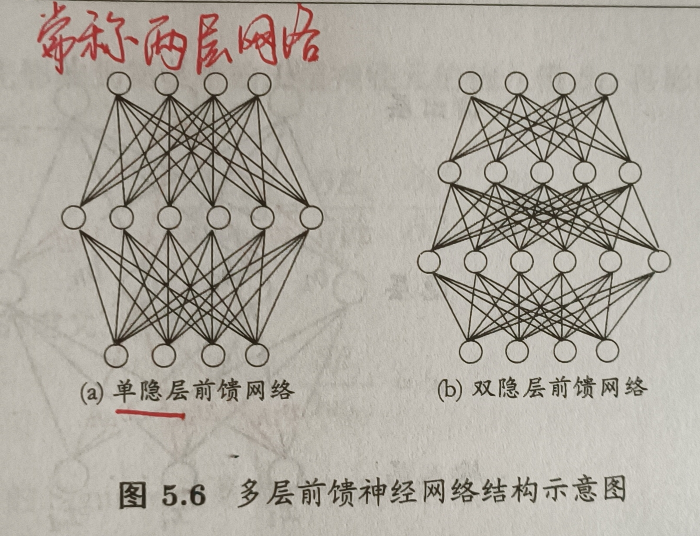
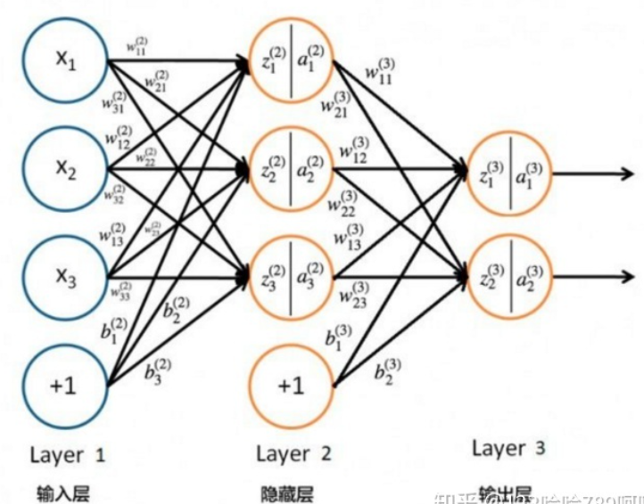
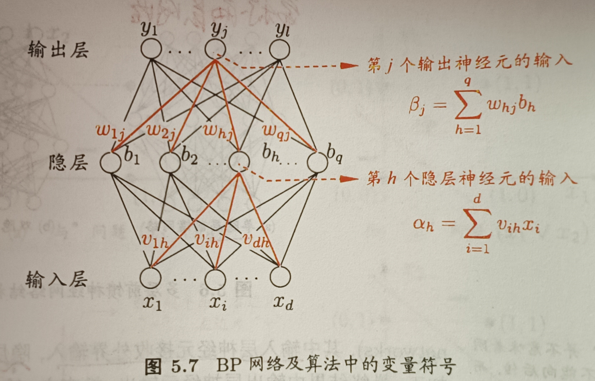

# Note

## 0. 神经网络

**感知机**$(Perceptron)$：由两层神经元组成，输入层输入信号，输出层是神经元。只有输出层神经元进行激活函数处理，即只有一层功能神经元。

**神经网络**$(Neural\ Network)$是由具有适应性的简单单元组成的广泛并行互连的网络，它的组织能够模拟生物圣经系统对真实世界物体所做出的的交互反应。**神经网络由多个神经元按一定的层次结构连接得来。**

**神经元**$(neuron)$：神经网络中最基本的成分。如果某神经元的电位超过某一阈值，它就会被激活，即“兴奋”起来，兴奋的神经元会向其他神经元发送化学物质。

  

如图所示，神经元将总输入值与神经元的阈值对比，然后通过**激活函数**$(activation\ function)$处理以产生神经元的输出。

理想的激活函数是符号函数/阶跃函数$sign$，但其**不连续**，故不用。

- 选取$Sigmoid$函数

$$\phi(x)=\frac{1}{1+e^{-x}}$$

性质：$ f'(x) = f(x)(1-f(x))$

- 选取双曲正切函数

$$\phi(x)=tanh(x)=\frac{e^x-e^{-x}}{e^x+e^{-x}}$$

性质：$ f'(x) = 1-f^2(x)$

- 选取$ReLU$函数($Rectified\ Linear\ Units$)

$$
\phi(x) = max(0,x)
$$

- 选取$leak\ ReLU$
  - 让$ReLu$小于0的部分的导数为某个$\beta$（认为直接置为0有些武断）

  

**为何要加个非线性的激活函数？**
若没有该函数，多层神经元结合之后仍然是线性模型，仍然是感知机的形式，对于非线性可分数据，仍然无解。

==**定理：三层神经网络可以模拟所有决策面。**==
  
  

- **多层前馈神经网络**：每层神经元与下一层神经元**全互连**，神经元之间不存在同层连接，不存在跨层连接。
  - 输入层神经元接收外界收入
  - **隐含层$hidden\ layer$与输出层神经元对信号进行加工**
  - 输出层神经元输出最终结果
- 神经网络的学习过程，就是**根据训练数据来调整神经元之间的“连接权”以及每个功能神经元的阈值**。

## 1. 前向传播算法

前向传播算法$forward\ propagation$: 将上一层的输出作为下一层的输入，并计算下一层的输出，一直算到输出层。

  

> $a_i^{(j)}$:表示第j层第i个神经元的激活项(输出值)
> $W^{(j)}$:表示第j层的权重矩阵，控制从第$j$层到第$j+1$层的映射

由图，$Layer\ 2$的输出$a_1^{(2)}, a_2^{(2)}, a_2^{(2)},$为：
$$
\begin{array}{l}
a_{1}^{(2)}=\sigma\left(z_{1}^{(2)}\right)=\sigma\left(w_{11}^{(2)} x_{1}+w_{12}^{(2)} x_{2}+w_{13}^{(2)} x_{3}+b_{1}^{(2)}\right) \\
a_{2}^{(2)}=\sigma\left(z_{2}^{(2)}\right)=\sigma\left(w_{21}^{(2)} x_{1}+w_{22}^{(2)} x_{2}+w_{23}^{(2)} x_{3}+b_{2}^{(2)}\right) \\
a_{3}^{(2)}=\sigma\left(z_{3}^{(2)}\right)=\sigma\left(w_{31}^{(2)} x_{1}+w_{32}^{(2)} x_{2}+w_{33}^{(2)} x_{3}+b_{3}^{(2)}\right)
\end{array}
$$

$Layer\ 3$的输出$a_1^{(3)}, a_2^{(3)}$为：

$$
\begin{array}{l}
a_{1}^{(3)}=\sigma\left(z_{1}^{(3)}\right)=\sigma\left(w_{11}^{(3)} a_{1}^{(2)}+w_{12}^{(3)} a_{2}^{(2)}+w_{13}^{(3)} a_{3}^{(2)}+b_{1}^{(3)}\right) \\
a_{2}^{(3)}=\sigma\left(z_{2}^{(3)}\right)=\sigma\left(w_{21}^{(3)} a_{1}^{(2)}+w_{22}^{(3)} a_{2}^{(2)}+w_{23}^{(3)} a_{3}^{(2)}+b_{2}^{(3)}\right)
\end{array}
$$

可见，代数法一个个表示输出比较复杂，故采取**向量化**；
$$
\begin{array}{l}
z^{(l)}=W^{(l)} a^{(l-1)}+b^{(l)} \\
a^{(l)}=\sigma\left(z^{(l)}\right)
\end{array}
$$

## 2. 反向传播算法

反向传播$Back\ Propagation (BP)$:是“**误差逆传播算法**”的简称，允许来自代价函数的信息通过网络向后流动，以便计算梯度。
主要思想是**梯度下降法求局部极值**。

反向传播是一种与最优化方法（如梯度下降法）结合使用的，用来训练人工神经网络的常见方法。该方法对网络中所有权重计算损失函数的梯度。这个梯度会反馈给最优化方法，用来更新权值以最小化损失函数。

  

> $x_i$: 输入神经元；共$d$个神经元，对应$d$个属性描述
> $y_i$: 输出神经元：共$l$个神经元，对应$l$个输出值
> $b_i$: 隐层神经元，共$q$个神经元
> $v_{ih}$: 输入层第$i$个神经元与隐层第$h$个神经元之间的连接权
> $w_{hj}$: 隐含层第$h$个神经元与输出层第$j$个神经元之间的连接权
> $\gamma_h$: 隐含层第$h$个神经元的阈值
> $\theta_j$: 输出层第$j$个神经元的阈值

## 参数设置

训练建议：

1. 一般情况下，在训练集上的目标函数的平均值(cost)会随着训练的深入而不断减小，如果这个指标有增大情况，停下来。有两种情况:第一是采用的模型不够复杂，以致于不能在训练集.上完全拟合;第二是已经训练很好了。
2. 分出一些验证集(Validation Set) ,训练的本质目标是在验证集上获取最大的识别率。因此训练一段时间后，必须在验证集上测试识别率，保存使验证集上识别率最大的模型参数，作为最后结果。
3. 注意调整学习率(Learning Rate) ,如果刚训练几步cost就增加，一般来说是学习率太高了;如果每次cost变化很小，说明学习率太低。