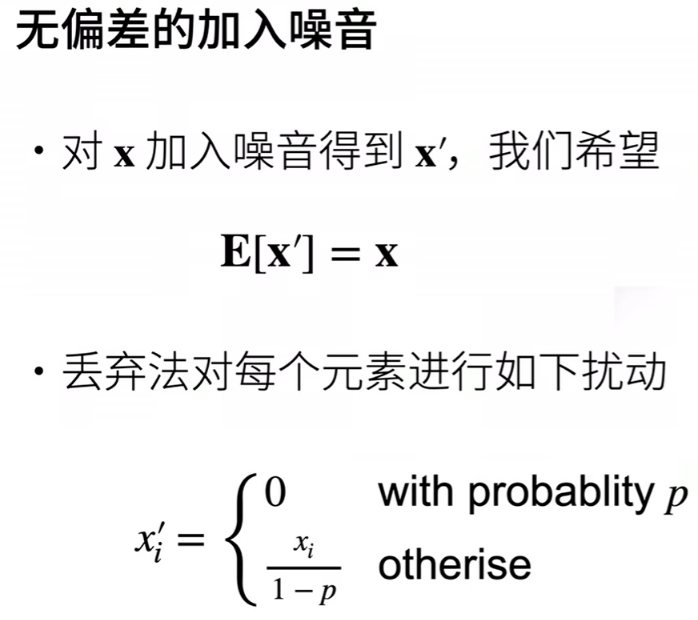
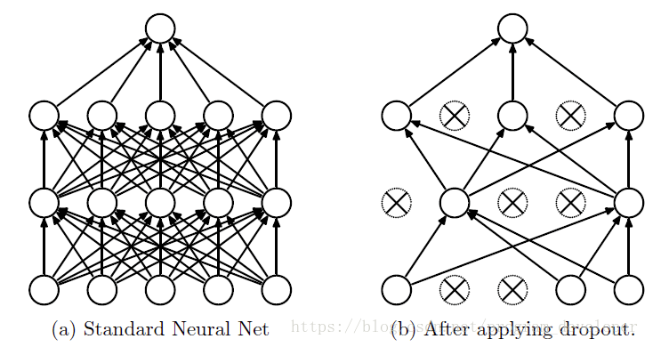
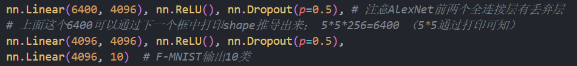

# Dropout

[toc]

## 原因

如果模型的参数太多，而训练样本又太少，训练出来的模型很容易产生过拟合的现象。为了解决过拟合，一般采用模型集成的方法，但训练大模型时极其费时，故AlexNet提出Dropout（大约花费两倍训练时间即可）

## 定义

  
**让一部分元素变为0，一部分放大**，使**均值不变**。
$E(x') = p*0 + (1-p)*\frac{x}{1-p}$

Dropout说的简单一点就是：我们在前向传播的时候，让某个神经元的激活值以一定的概率p停止工作，这样可以使模型泛化性更强，因为它不会太依赖某些局部的特征
  

## 使用过程

- 首先随机（临时）删掉网络中一半的隐藏神经元，输入输出神经元保持不变
- 然后把输入x通过修改后的网络前向传播，然后把得到的损失结果通过修改的网络反向传播。一小批训练样本执行完这个过程后，**在没有被删除的神经元**上按照随机梯度下降法更**新对应的参数**（w，b）。
- 然后继续重复这一过程

预测模型的时候，每一个神经单元的权重参数要乘以概率p。？？？（==为何，如何操作？==）

## 总结

- $dropout$是个**正则项**，在训练过程中影响着参数，在预测过程中不使用$dropout$
- 丢弃法将一些输出项随机设置0来空控制模型复杂度
- 常作用在**全连接层的隐藏层输出**上
  -   

- 丢弃概率是控制模型复杂度的超参数
