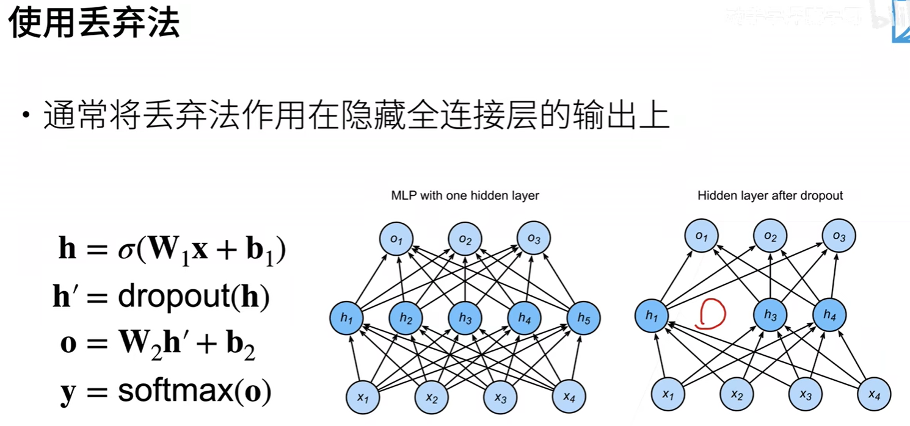

# Dropout

定义：
  
让一部分元素变为0，一部分放大，使**均值不变**。
$E(x') = p*0 + (1-p)*\frac{x}{1-p}$

  

$dropout$是个**正则项**，在训练过程中影响着参数，在预测过程中不使用$dropout

总结：

- 丢弃法将一些输出项随机设置0来空控制模型复杂度
- 常作用在多层感知机的隐藏层输出上
- 丢弃概率是控制模型复杂度的超参数
