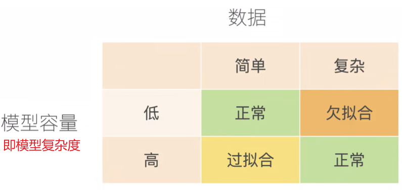
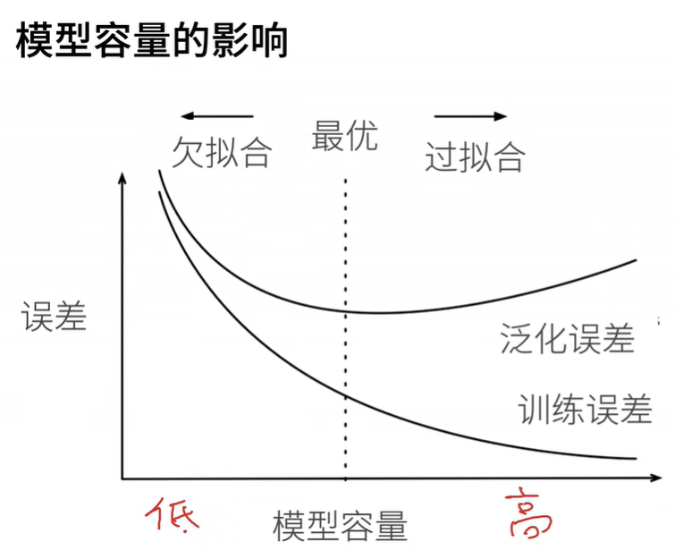
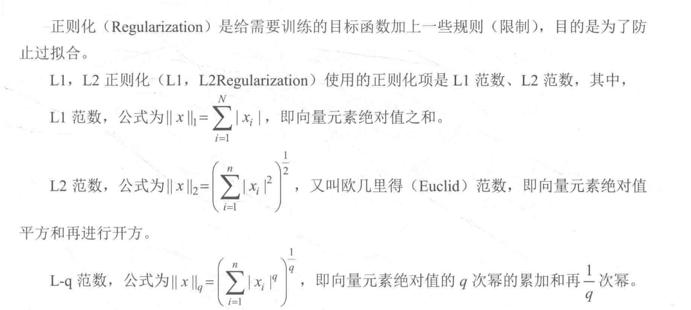
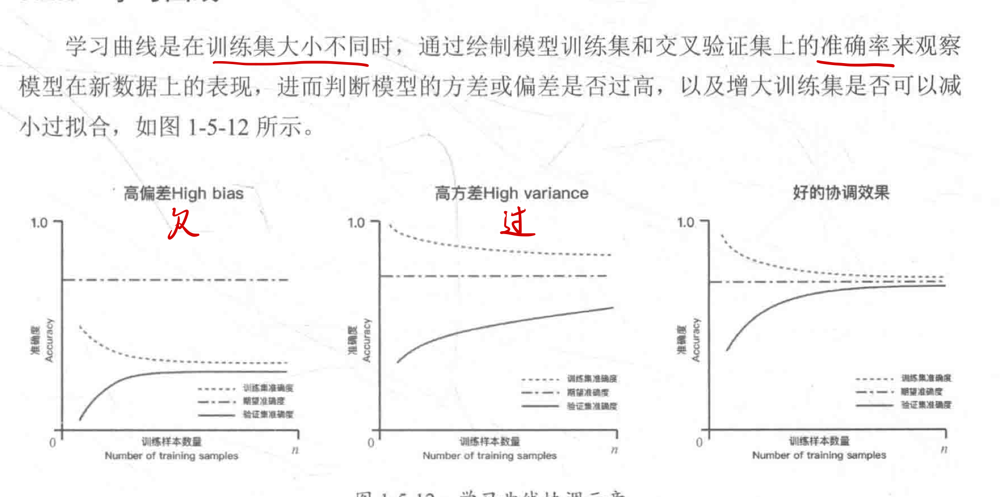
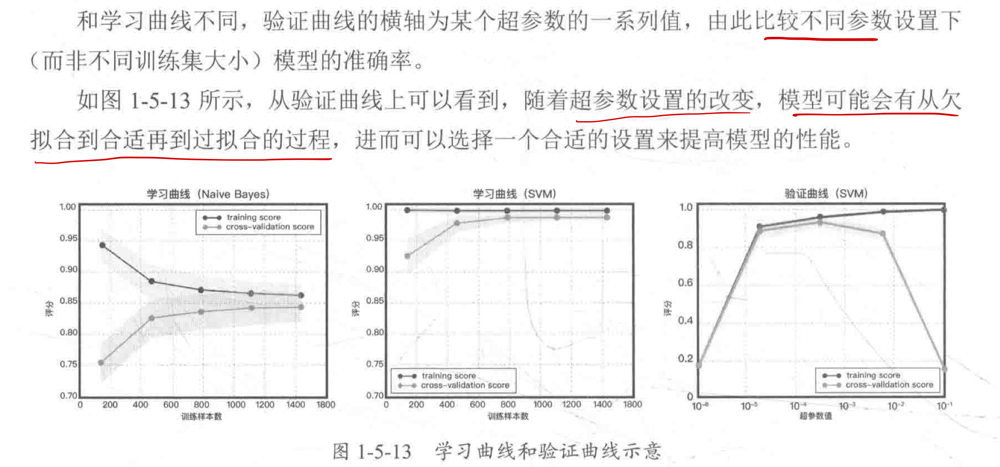

# Note

[toc]

## 五、模型验证

### 1. 模型评估的概念与方法

#### 1.1 欠拟合与过拟合

欠拟合$(underfitting)$又名高偏差$bias$
可通过增加额外的特征、增加多项式特征、减小$\lambda$的值等方法优化模型。
过拟合$(overfitting)$又名高方差$variance$
可通过手机更多的数据、使用更少的特征、增加$\lambda$的值等方法优化模型。

> 示例：在多项式回归中，degree越大/多项式次数，模型均方误差越小，拟合的效果越好；总能找到一条曲线将所有的样本点拟合，使得整体的均方误差为0；但在预测未知数据时，泛化能力降低，预测偏差增大。

##### 模型容量与数据

**模型容量**$Capacity$：即模型复杂度。是指**拟合各种函数的能力**，低容量的模型**难以拟合**训练数据(欠拟合)，高容量的模型可以**记住**所有的训练数据(过拟合)。
**故模型容量需要匹配数据的复杂度，否则导致欠拟合或过拟合。**
  

  

> 注意此处模型容量从低到高是指不同的模型，而非一个模型不同epoch的误差

#### 1.2 模型泛化与正则化

泛化$Generalization$：即模型处理新样本的能力
  
正则化$Regularization$：给需要训练的目标函数加上一些规则（限制），目的是为了防止过拟合。

  

岭回归$Ridge Regression$：对参数空间进行L2范数正则化的线性模型
$LASSO$回归：对参数空间进行L1范数正则化的线性模型

#### 1.3 回归模型的评估指标

平均绝对值误差$MAE$：$mean\_absolute\_error$:预测值与真实值之差的绝对值。
$$
MAE = \frac{1}{n} \sum_{i=1}^n |y_i - y_i|
$$

均方误差$MSE$：$mean\_square\_error$
$$
MSE = \frac{1}{n} \sum_{i=1}^n (f_i - y_i)^2
$$

均方根误差$RMSE$：$root\_mean_square_error$
$$
RMSE = \sqrt{MSE}
$$

$R$平均值：$r2\_score$：反映模型对观测值的拟合程度。
回归中模型clf.score返回的就是r2_score
  

#### 1.4 交叉验证

交叉验证$Cross Validation$是验证分类器性能的一种统计分析方法。常用的交叉验证方法包括简单交叉验证、K折交叉验证、留一法交叉验证和留P法交叉验证。

##### 简单交叉验证

将原始数据随机分为两组，训练集和验证集。

> [李沐说](https://www.bilibili.com/video/BV1kX4y1g7jp/?spm_id_from=333.788.recommend_more_video.0&vd_source=31f382886b368673a25ce3ff23e82bfc) 很多时候由于我们没有test测试集，为了偷懒将validation验证集写作test测试集。

```python
from sklearn.model_selection import train_test_split
X_trian, X_test, y_train, y_test = train_test_split(iris.data, iris.target, test_size=4, random_state=0)
```

##### K折交叉验证

> 在数据集不足时使用

$K-Fold\ Cross\ Validation$将原始数据均分为K组，然后将每个子集数据分别做一次**验证集**，其余K-1组子集数据作为**训练集**，这样会训练出K个模型。将K个模型最终的验证集的分类准确率取平均值作为其性能指标。

```python
from sklearn.model_selection import KFold
kf = KFold(n_splits=10)
```

##### 留一法交叉验证

$LOO-CV\ Leave-One-Out\ Cross\ Validation$留训练集中的一个样本作为检验集，其余N-1个作为训练集。可得到N个模型，最后取N个准确率的平均数。
**样本利用率最高，适合小样本。**

##### 留P法交叉验证

$LPO-CV$

### 2. 模型调参

#### 2.1 调参

调参的目的是达到整体模型的偏差和方差的大和谐，找到使模型性能最优的参数。参数分为：过程影响类参数、子模型影响类参数。

- 过程影响类参数：在子模型不变的前提下，调整“子模型数$n\_estimators$”“学习率$learning\_rate$”等参数，改变训练过程，从而提高整体模型的性能。
- 子模型影响类参数：调整“最大树深度$max_depth$”“分裂条件$criterion$”等参数，改编自模型的性能，从而提高整体模型的性能。

#### 2.2 网格搜索

网格搜索$Grid Search$是一种穷举搜索的调参手段。循环遍历所有候选参数。
形似网格
  

#### 2.3 学习曲线

  

#### 2.4 验证曲线

  
