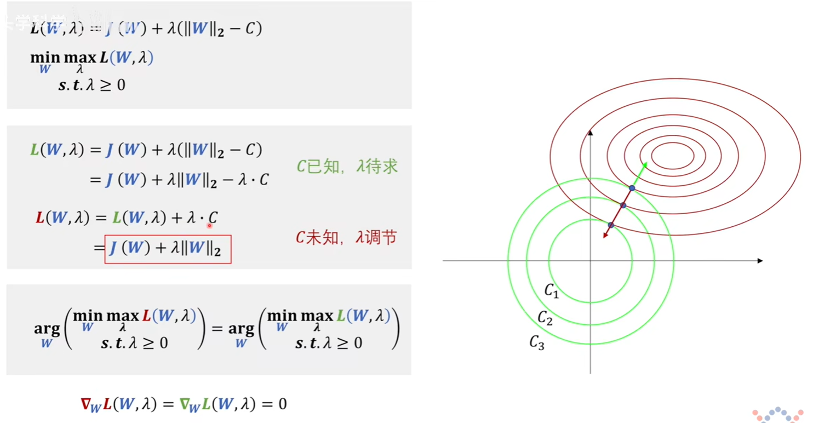

# Note

权重衰退通过$L2$正则项使得模型的参数不会过大，通过限制参数的选择范围来控制模型容量(复杂度)。

正则化权重是控制模型复杂度的超参数。

---

**正则化**：凡是能减少泛化误差而不是减少训练误差的方法都可以称作正则化方法。即可以减少过拟合的方法。

正则化是减少机器学习过拟合的过程，正则化最常见的方法之一就是对模型的权重进行$L1和L2$正则化。
那么如何理解$L1和L2$正则化？

拉格朗日乘数法的角度
权重衰减的角度
贝叶斯概率的角度

正则化一般用到的是$L1和L2$范数：
$L2范数$：$||W||_2 = \sqrt{|w_1|^2+|w_2|^2+...+|w_n|^2}$
$L1范数$：$||W||_1 = |w_1|+|w_2|+...+|w_n|$

  

> 由图可见$L1和L2$具备凸集的性质

---

我们训练神经网络的目的是使损失函数最小，不论$w和b$数值的大小。但是对于不同的$w和b$，可能得到相同的损失。
但是**我们在预测新样本时，神经网络中参数的值的大小就很关键了**。
比如当你的参数比较大时，**对于新样本中的误差和噪声，与大参数相乘后也会被放大**，那么就容易出问题。故要控制参数的取值不要那么大。

## 那么如何控制参数不要太大？

> 由于$b$只影响怎么平移，不重要，即控制参数$w$即可。

那么可以用**拉格朗日乘数法**来求参数范围受限时的最值：（给一个可行域，在可行域范围内求最值）

使用范数作为**硬性限制**：

$L1正则化$：
$$
min\ \ loss(W,b) \\
s.t.\ \ \  ||W||_1 - C\leq 0
$$

$L1$范数代表了$W$对应的那个点到原点的$L1$距离，使其$\leq C$，$C$越小意味着更强的正则项。

$L2正则化$：
$$
min\ \ loss(W,b) \\
s.t.\ \ \  ||W||_2 - C\leq 0
$$
  

使用范数作为**柔性限制**：
> 柔在何处？硬性限制中圆的半径$C$固定，柔性限制的半径$C$不固定，包含了任意半径的圆。[视屏](https://www.bilibili.com/video/BV1Z44y147xA?spm_id_from=333.999.0.0&vd_source=31f382886b368673a25ce3ff23e82bfc&t=1179.5)

下图中红绿问题取得最值时的参数$W$一样。二者问题等价。
  

由下图可见，$L1$正则化可带来**稀疏性**，稀疏性就是指在某些轴（$W$的某些项上）有值，而其他项是零。**即某些特征起作用，某些特征不起作用，即只通过某些特征就可以对新样本做出判断**。
> 下图可见，不同的$C$对应的最值点大多都在$y$轴上，$x$轴为0.

  
