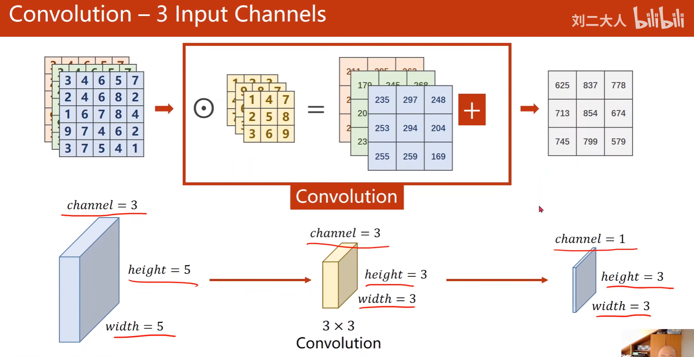

# 卷积神经网络

[toc]

由于在全连接层中将$(1,28,28)$的图片直接拉伸为$(1,784)$，丧失了空间结构信息

  

卷积神经网络的贡献：由手工设计卷积核变成自动学习卷积核。
> 之前手工设计卷积核比如傅里叶变换、Gabor变换与小波变换。

可以将图像卷积看成全连接网络的**权重共享**$(weight\ sharing)$，此处卷积核就是权值，不断在图像上滑动的过程就是共享权重的过程。

>**一个思路**：可以将卷积神经网络看成是全连接神经网络的权重共享，同时有一些$w$值为0。所以$CNN$和原来的多层全连接神经网络类似。
  
  

**整个网络的计算速度取决于卷积层，整个网络的参数个数取决于全连接层。**
因为卷积层的乘法和加法运算更多，故若想算的更快，要在卷积层做文章；若想占内存更小，要在连接层做文章。

## 从全连接层到卷积层

**对全连接层使用平移不变性和局部性得到卷积层**
平移不变性对应着卷积核(权重共享的作用(避免全连接层参数贼多的问题))
局部性对应着卷积核的大小限制

  
详见：[李沐课程](https://www.bilibili.com/video/BV1L64y1m7Nh/?p=1&vd_source=31f382886b368673a25ce3ff23e82bfc)

## 多输入输出通道

  

  

  

## 1*1卷积

因为使用了最小窗口，1*1卷积失去了卷积层的特有能力——在高度和宽度维度上，识别相邻元素间相互作用的能力。 其实卷积的唯一计算发生在通道上。

  

  

总结：

- **每个卷积核的通道数量和输入的通道数量一致，而卷积核的数量和输出的通道数量一致**
- 输出通道数是卷积层的超参数，而输入通道不是。
- 每个输入通道有独立的二维卷积核，所有通道结果相加得到一个输出通道结果
- 每个输出通道有独立的三维卷积核
