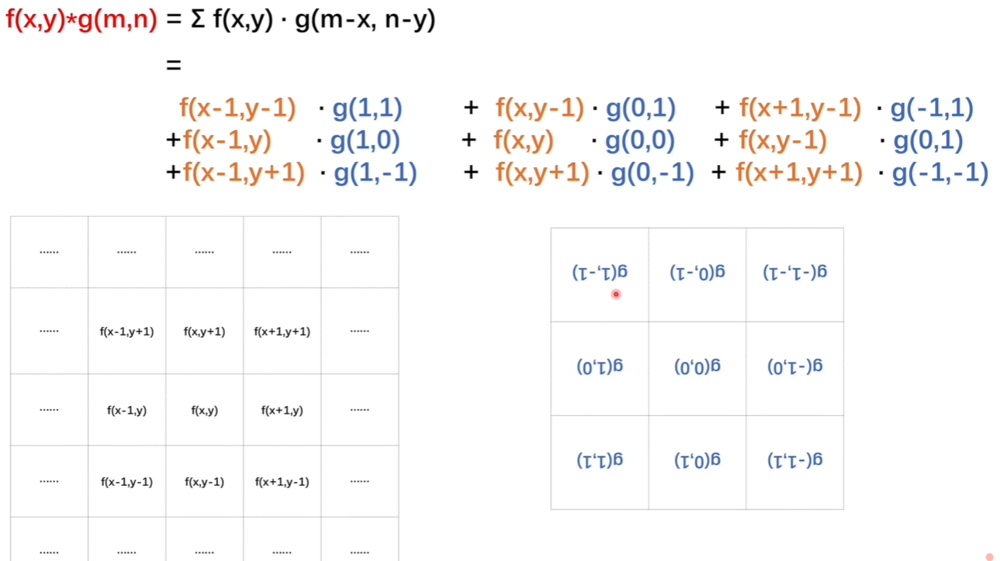
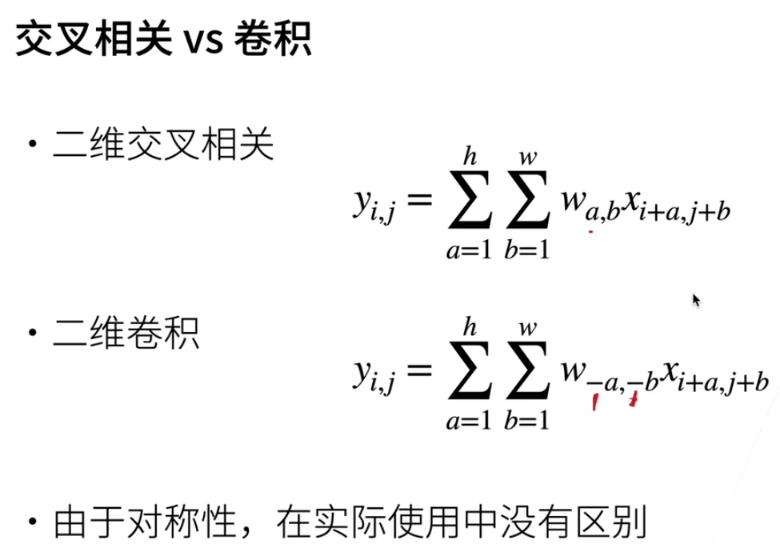

# Notes

[toc]

## 何为卷积？

从数学上讲，卷积是一种运算。
$f和g$的卷积为$(f*g)(n)$

其连续定义为：
$$
(f*g)(n) = \int_{-\infin}^{\infin}f(\tau)g(n-\tau)d\tau
$$
其离散定义为：
$$
(f*g)(n) = \sum_{\tau=-\infin}^{\infin}f(\tau)g(n-\tau)
$$

> 示例一：求两枚骰子结果之和为4的概率为:
> $(f*g)(4) = \sum\limits_{\tau=1}^{3} f(\tau)g(4-\tau)=f(1)g(3)+f(2)g(2)+f(3)g(1)$
> 其中$f(\tau)$为第一枚骰子投出$\tau$的概率
> 示例二：[B站王木头学科学](https://www.bilibili.com/video/BV1VV411478E?spm_id_from=333.337.search-card.all.click&vd_source=31f382886b368673a25ce3ff23e82bfc)

卷积的作用：**对于一个输入不稳定，输出稳定的系统，可用卷积求出系统存量。**
应该**将卷积当做是过去对现在的影响**
> $f$是不稳定的输入，$g$是稳定的输出；如$f$是一个人的进食系统，他想啥时候吃就啥时候吃，$g$是他的消化系统，应该是条稳定的曲线。

---

卷积神经网络即在图片交给神经网络之前，先对图片进行卷积操作。

## 什么是图片的卷积操作？此卷积与彼卷积有何联系？

我们知道图片的卷积操作是找个卷积核与图片进行对应位置的**先相乘再相加**。这和上述卷积操作的离散定义相吻合。

**卷积可以看做是过去对现在的影响**。比如吃饭的例子中，是t时刻之前所有x时间对t时刻产生的影响。**$g$函数里面的参数是$t-x$**

  

**图片的卷积可以看做是周围像素点对当前像素点产生的影响。**
如上图，便是$x - (x-1) = 1$，即为$g$的第一个参数，第二个参数为$y-(y-1)$
即f的左下角位置对应着g右上角的位置；可见这种对应关系有点**拧**，**只需将$g$函数旋转$180°$(如下图)，二者对应关系就一致了**。
  

**故$g$函数$\neq$卷积核**，$g$函数旋转180度之后才是卷积核。**我们的已知卷积核已经把旋转这个步骤忽略了。**
  

> 注：$g$函数规定了如何影响。

## 卷积操作是CNN第一层的关键，那么CNN第一层是在干什么？

我们知道**卷积操作的本质是处理一个像素点和周围像素点的关系**。
目前知道其处理完的结果应该是和原图差不多的图片(**利用平滑卷积核**)。

那卷积为何能提取局部特征？因为还有其他种类的卷积核。
某些卷积核可以对图片进行过滤，把某些特征保存下来，过滤掉其他特征，此类卷积核又称作**过滤器**。
如下图垂直边界滤波器和水平边界滤波器：
  

**故卷积核是对周围像素点的主动试探和选择，可通过该卷积核把周围有用的特征保留下来。**

比如用如下三个卷积核，就可以找出识别字母$x$所需的三个特征。
  

---

综上：卷积有三层含义：

1. 卷积用于求一个系统有不稳定的输入和稳定的输出，求系统的存量
2. 卷积核是规定周围像素点对当前像素点会产生怎样的影响(g函数为影响，旋转180度后为卷积核)
3. 卷积核是过滤器。一个过滤器的卷积核规定了一个像素点会如何试探周围像素点、如何筛选图像的特征

## 何为互相关？

互相关和卷积的区别在于卷积核是否进行翻转，互相关也称作不翻转卷积。
卷积：$Y=W*X$
互相关:$Y = W\otimes X$ = $rot180(W)*X$
> $rot180(.)$表示旋转180度。

神经网络中使用卷积是为了进行**特征抽取**，卷积核**是否进行翻转和其特征抽取的能力无关**，但互相关可减少不必要的操作和开销，故深度学习工具中卷积操作其实都是互相关操作。$^{2}$
  

## 介绍一下卷积的变种(步长&零填充)

接下来介绍一下**卷积的变种**：

**步长**$(Stride)$是指卷积核在滑动时的间隔。
**步长解决的问题是：如果步幅为0，那么从一个高维度到低维度需要很多层，很慢**
当图像大小为$(M,N)$，卷积核大小为$(m,n)$，步长为$(u,v)$时，卷积后的特征图大小为$(K,L)$。其中：
$$
K\leq \frac{M-m}{u}+1\\
L\leq \frac{N-n}{v}+1
$$
> 一般使$K,L$取整；
> 特征图$(feature\ map)$指卷积后的结果

**零填充**$(Zero\ Padding)$：在图像两端进行补零。
**填充解决的问题是：如果不填充，那么每卷积一层图片变小一点，这就使得网络不会有很深**

- 窄卷积$(Narrow\ Convolution)$：步长$(1,1)$，两端不补零，卷积后特征图大小$(M-m+1, N-n+1)$
- 宽卷积$(Wide\ Convolution)$：步长为$(1,1)$，两端补$(m-1,n-1)$个零，卷机后特征图大小$(M+m-1,N+n-1)$
- 等宽卷积$(Equal-Width\ Convolution)$：步长$(1,1)$，两端补零$(\frac{m-1}{2},\frac{n-1}{2})$个。

  

总结：

- 填充和步幅都是卷积层的超参数
- 填充在输入周围添加额外的行/列，来控制输出形状的减少量
- 步幅是每次滑动核窗口时的行/列的步长，可以成倍的减少输出形状

参考资料：

[1] : B站[王木头学科学](https://www.bilibili.com/video/BV1VV411478E?spm_id_from=333.337.search-card.all.click&vd_source=31f382886b368673a25ce3ff23e82bfc)

[2] : 神经网络与深度学习 - 邱锡鹏
