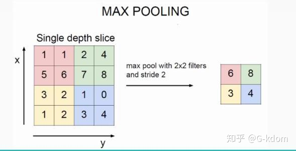

# 池化层

池化过程在一般卷积过程后。池化（pooling） 的**本质，其实就是采样**。Pooling 对于输入的 Feature Map，**选择某种方式对其进行降维压缩，以加快运算速度**。

采用较多的一种池化过程叫**最大池化**（Max Pooling），其具体操作过程如下：
  

池化过程类似于卷积过程，如上图所示，表示的就是对一个 $4\times4$ feature map邻域内的值，用一个 $2\times2$ 的filter，步长为2进行‘扫描’，选择最大值输出到下一层，这叫做 Max Pooling。max pooling常用的 $s=2\ f=2$ 的效果：特征图高度、宽度减半，通道数不变。

还有一种叫**平均池化**（Average Pooling）,就是从以上取某个区域的最大值改为求这个区域的平均值。
**池化的作用**

- 保留主要特征的同时减少参数和计算量，防止过拟合
- invariance(不变性)，这种不变性包括translation(平移)，rotation(旋转)，scale(尺度)。
  
Pooling 层说到底还是一个特征选择，信息过滤的过程。也就是说我们损失了一部分信息，这是一个和计算性能的一个妥协，随着运算速度的不断提高，我认为这个妥协会越来越小。

现在有些网络都开始少用或者不用pooling层了

## 自适应池化（$Adaptive\ Pooling$）与一般池化（$General\ Pooling$）

AdaptivePooling，自适应池化层。函数通过输入原始尺寸和目标尺寸，自适应地计算核的大小和每次移动的步长。如告诉函数原来的矩阵是7x7的尺寸，我要得到3x1的尺寸，函数就会自己计算出核多大、该怎么运动。

**区别**：

- AdaptivePooling的核的**大小和步长是函数自己计算**的，不需要人为设定；而General Pooling需要指定核的大小和步长。
- AdaptivePooling的**核是可变大小**的，且**步长也是动态的**；而General Pooling是固定核的大小和步长的。
- AdaptivePooling的**相邻池化窗口之间是可以出现重叠的**；General Pooling一般作用于图像中不重叠的区域。（也存在OverlappingPooling（重叠池化层））

  

> NiN中的自适应层由(1,10,5,5)->(1,10,1,1)就是：stride=5//1=5; kernel_size=5; padding=0; 即全局进行avg池化

  

FROM ：
[知乎](https://www.zhihu.com/search?type=content&q=%E6%B1%A0%E5%8C%96%E5%B1%82)
[CSDN](https://blog.csdn.net/xiyou__/article/details/121287909?ops_request_misc=%257B%2522request%255Fid%2522%253A%2522166503799916782414939786%2522%252C%2522scm%2522%253A%252220140713.130102334..%2522%257D&request_id=166503799916782414939786&biz_id=0&utm_medium=distribute.pc_search_result.none-task-blog-2~all~top_click~default-1-121287909-null-null.142^v51^new_blog_pos_by_title,201^v3^control&utm_term=adaptiveavgpool2d&spm=1018.2226.3001.4187)
