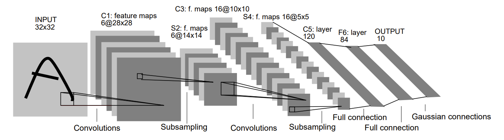
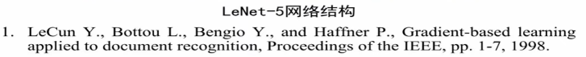
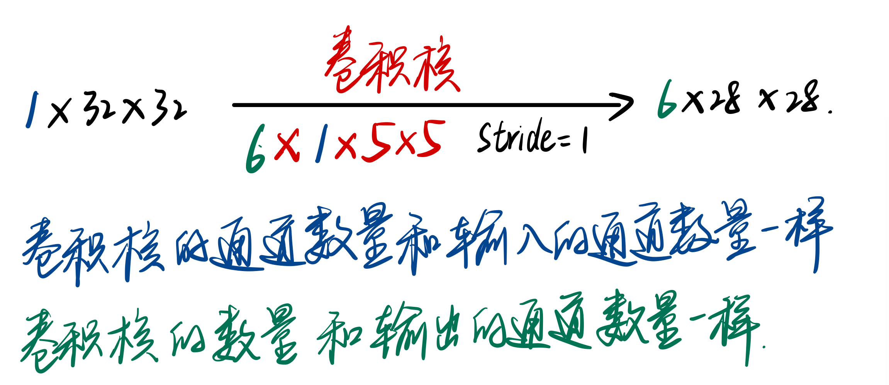

# LeNet

[toc]

  
  

## 0. Input层

输入单通道$32*32$像素图像；表示为$(C,W,H)$格式为$(1,32,32)$
本层不算$LeNet$的网络结构七层之一。

## 1. C1卷积层

  

- 卷积核：$6$个$5*5$，$Stride$为$(1,1)$，无填充。故$feature\ map$为$(\frac{32-5}{1}+1, \frac{32-5}{1}+1)=(28,28)$
- 参数个数：$6*(1*5*5+1)=156$
  - > +1是指一个卷积核对应一个偏置值$bias$
- 连接数：$(5*5+1)*6*28*28=122304$
  - > $feature\ map$上每个像素点对应$5*5+1=26$个连接，但是如果将深度为6的6个像素点作为一个的话，这一个对应的连接数为$(5*5+1)*6=156$个。
- 有122304个连接，但是我们只需要学习156个参数，主要是通过**权值共享**实现的。

## 2. S2池化层/下降采样层

$$6*28*28 --> 6*14*14$$

- 采样窗口：$2*2$，将窗口内$4$个值取平均数；$Stride$为$(2,2)$，无填充。
- S2层先降采样**再使用非线性激活函数**$f(wY+b)$输出，其中$f(.)$为激活函数，$Y$为采样后的输出，$w和b$为待学习的权重和偏置
- 参数个数：$6*(1+1)=12$
- 连接数：$(2*2+1)*14*14*6=5880$

> 详细说明：第一次卷积之后紧接着就是池化运算，使用 $2*2$核进行池化，于是得到了S2，6个$14*14$的特征图。S2这个pooling层是对C1中的2*2区域内的像素降采样然后乘以一个权值系数再加上一个偏置，然后将这个结果再做一次激活。于是每个池化核有两个训练参数，所以共有2x6=12个训练参数，但是有5x14x14x6=5880个连接。

## 3. C3卷积层

$$
6*14*14 -->16*10*10
$$

- 卷积核：$16*6*5*5$，$Stride$为$(1,1)$
- 参数个数：$6*(3*5*5+1)+6*(4*5*5+1)+3*(4*5*5+1)+1*(6*5*5+1)=1516$
- 连接数：$10*10*1516=151600$

## 4. S4池化层

$$
16*10*10 --> 16*5*5
$$

- 采样窗口：$2*2$，将窗口内$4$个值取平均数；$Stride$为$(2,2)$，无填充。
- 参数个数：$16*(1+1)=32$
- 连接数：$(2*2+1)*16*25=2000$

## 5. C5卷积层

> 不知为何李沐老师认为该层是全连接层，虽然好像是有点像

$$
16*5*5 --> 120*1*1
$$

- 卷积核：$120*16*5*5$，$Stride$为$(1,1)$
- 参数个数：$120*(16*5*5+1)=156=48120$
- 连接数：$120*(16*25+1)=48120$

## 6. F6全连接层

$$
120*1*1 --> 84*1*1
$$

- 参数个数：$84*(120+1)=10164$
- 连接数=参数个数

## 7. Output层 - 全连接层

$$
84*1*1 --> 10*1*1
$$

十个节点代表十个类别。

## 总结

- 先用卷积层来学习图片空间信息
- 然后使用全连接层来转换到类别空间

---

参考资料：
[1] 浙大机器学习 - 胡浩基
[2] 神经网络与深度学习 - 邱锡鹏
