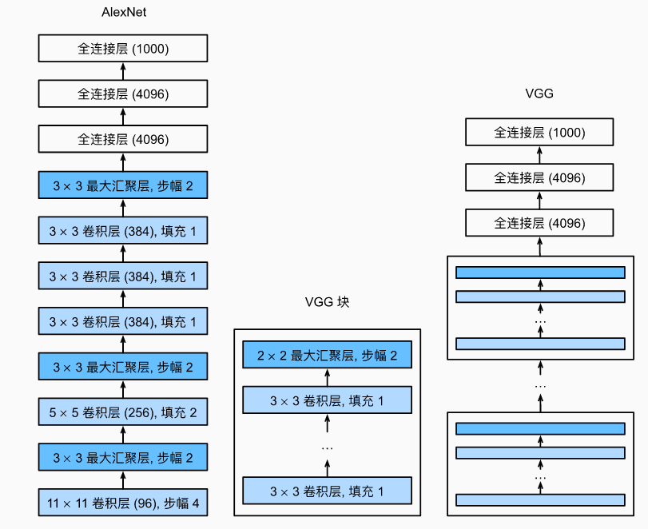
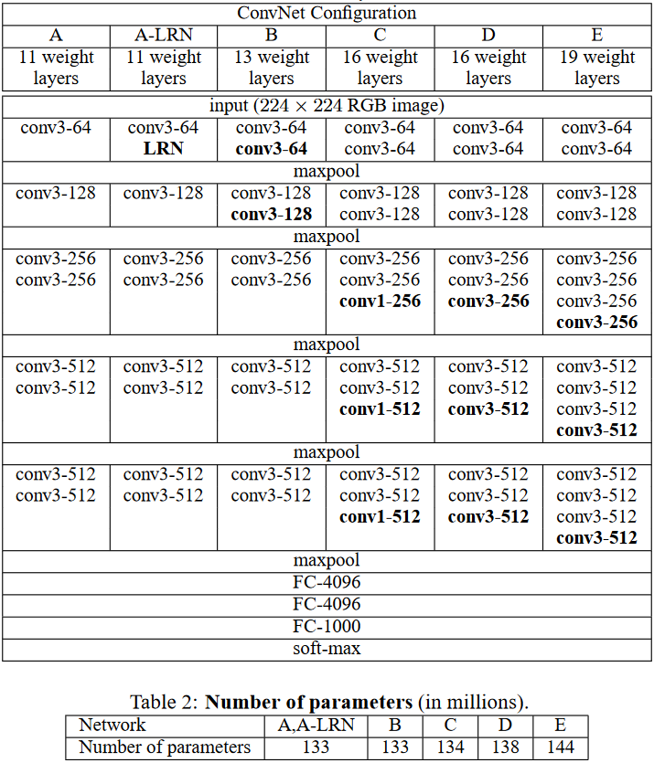

# VGGNet

由牛津大学计算机视觉组(Visual Geometry Group)提出，故称作VGGNet。

> - 虽然AlexNet证明深层神经网络卓有成效，但它没有提供一个通用的模板来指导后续的研究人员设计新的网络。之后将学习一些一些常用于设计深层神经网络的启发式概念。
> - 与芯片设计中工程师从放置晶体管到逻辑元件再到逻辑块的过程类似，神经网络架构的设计也逐渐变得更加抽象。研究人员开始从单个神经元的角度思考问题，发展到整个层，现在又转向块，重复层的模式。

**$VGGNet$是更大更深更有组织的$AlexNet$（使用重复的$VGG块$）**

在VGG论文中，Simonyan和Ziserman尝试了各种架构。特别是他们发现**深层且窄的卷积**比较浅层且宽的卷积更有效。

VGGNet探索了卷积神经网络的深度和其性能之间的关系，通过反复的堆叠3×3的小型卷积核和2×2的最大池化层，成功的构建了16~19层深的卷积神经网络。VGGNet获得了ILSVRC 2014年比赛的亚军和定位项目的冠军，在top5上的错误率为7.5%。目前为止，VGGNet依然被用来提取图像的特征。

  

  

**每个block让通道数翻倍 高宽减半**
VGG11: 8个卷积层 3个全连接层
