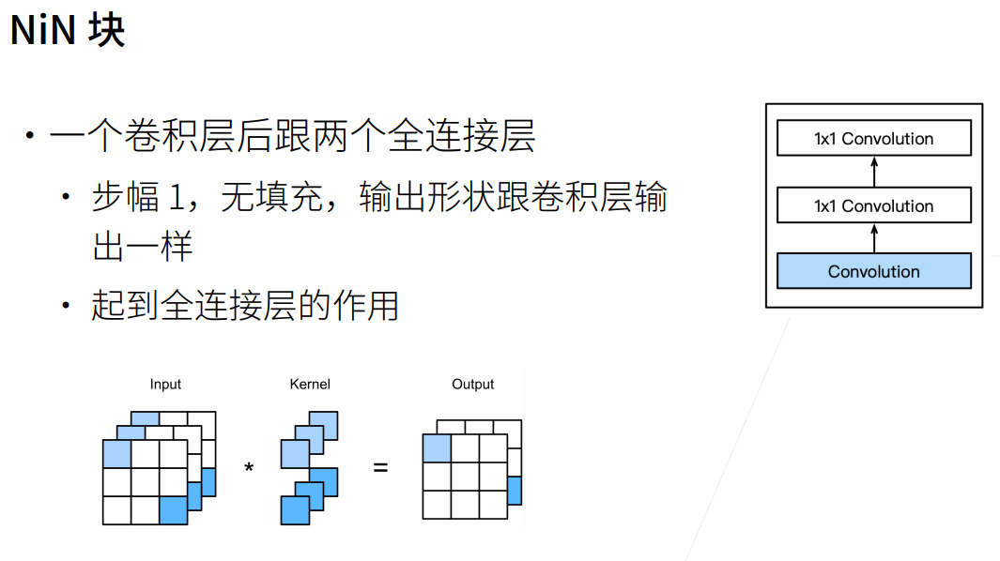

# Netword in Netword

> LeNet、AlexNet和VGG都有一个共同的设计模式：通过一系列的卷积层与汇聚层来提取空间结构特征；然后通过全连接层对特征的表征进行处理。 AlexNet和VGG对LeNet的改进主要在于如何扩大和加深这两个模块。然而，如果使用了全连接层，可能会完全放弃表征的空间结构。 网络中的网络（NiN）提供了一个非常简单的解决方案：在每个像素的通道上分别使用多层感知机。

**NiN解决了全连接层的问题。**
首先我们知道卷积层需要较少的参数，即:
$$参数个数 = 输入通道数*输出通道数*kernel\_size ^ 2$$

而全连接层参数贼多，即：
$$
参数个数 = 整个输入的像素(即输入通道数*宽*高)*整个输出的像素(即输出通道数*宽*高)\\
$$
经典网络第一个全连接层的参数(主要参数个数应该都是这一层导致的)：
$$
LeNet:16*5*5*120 = 48k \\
AlexNet:256*5*5*4096 = 26M \\
VGG:512*7*7*4096 = 102M
$$

**参数过多时很占内存，很占运算带宽，很容易过拟合。**

**NiN可以认为是没有使用全连接层**。
NiN的想法是在每个像素位置应用一个全连接层。如果我们将权重连接到每个空间位置，我们可以将其视为卷积层，或作为在每个像素位置上独立作用的全连接层。从另一个角度看，即将空间维度中的每个像素视为单个样本，将通道维度视为不同特征（feature）。

  

  

