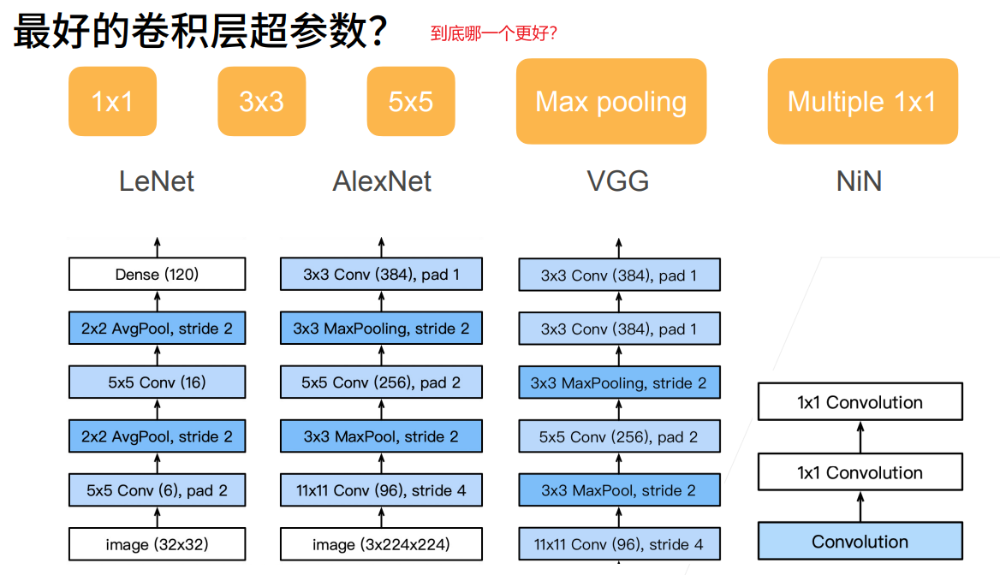
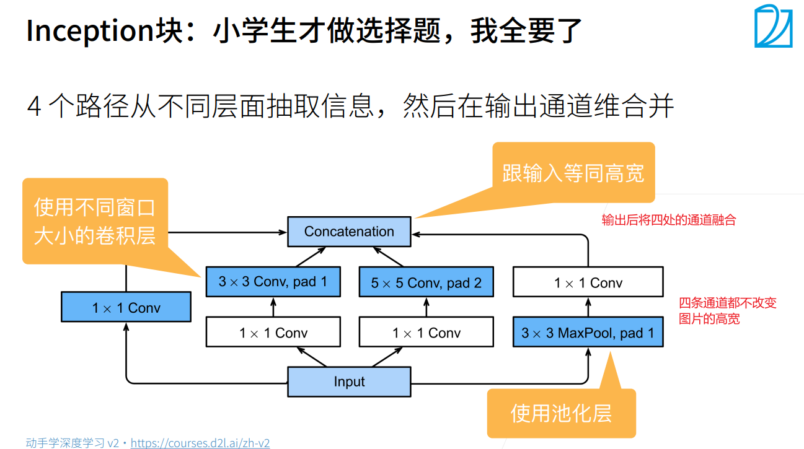
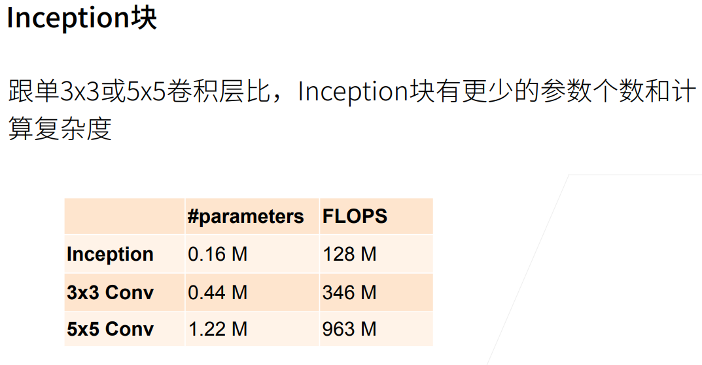
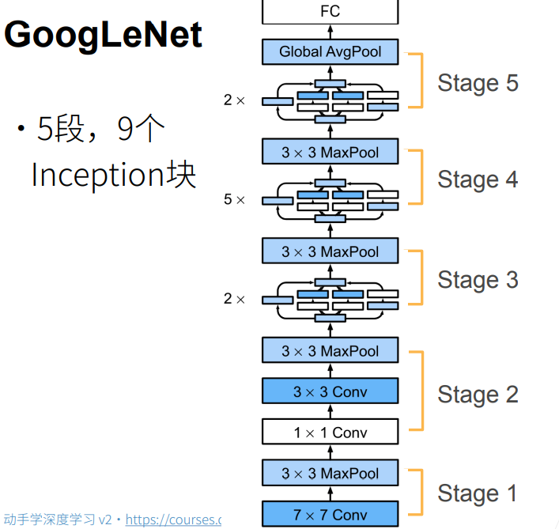
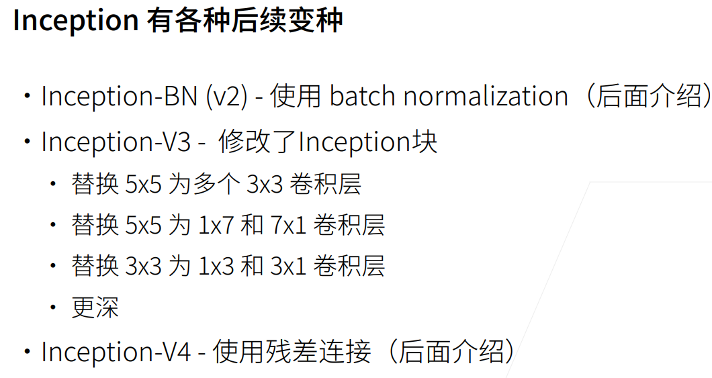
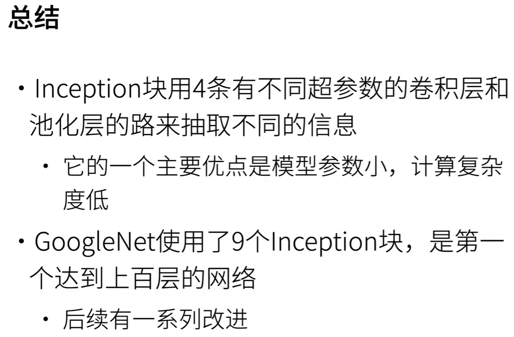

# GoogLeNet

GoogLeNet吸收了NiN中串联网络的思想，并在此基础上做了改进。这篇论文的一个重点是**解决了什么样大小的卷积核最合适的问题**。本文的一个观点是，有时**使用不同大小的卷积核组合**是有利的。

  

在$GoogLeNet$中，基本的卷积块被称为$Inception$块。这很可能得名于电影《盗梦空间》（Inception），因为电影中的一句话“我们需要走得更深”（$We\ need\ to\ go\ deeper$）。

  

> 白色的1*1卷积是用来降低通道数的，**通过降低通道数来控制模型复杂度（降低运算次数）**，如下图所示：
>   
> 蓝色的卷积和池化是用来抽取信息的

前三条路径使用窗口大小为1X1、3X3和5X5的卷积层，从不同空间大小中提取信息。中间的两条路径在输入上执行卷积，以减少通道数，从而降低模型的复杂性。第四条路径使用最大汇聚层，然后使用1X1卷积层来改变通道数。这四条路径都使用合适的填充来使输入与输出的高和宽一致，最后我们将每条线路的输出在通道维度上连结，并构成Inception块的输出。
  

  

  

  
