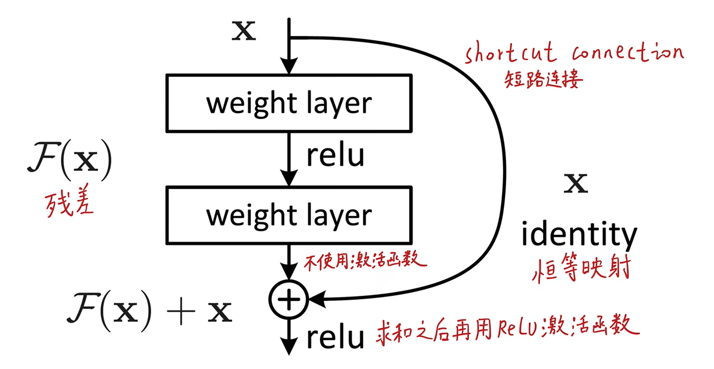

  

残差：预测值和真实值之间的偏差

ResNet解决的梯度消失的问题？使其能够训练1000层

---

  

[tutorial](https://blog.csdn.net/weixin_43135178/article/details/115447031?ops_request_misc=%257B%2522request%255Fid%2522%253A%2522166571813316800192218204%2522%252C%2522scm%2522%253A%252220140713.130102334..%2522%257D&request_id=166571813316800192218204&biz_id=0&utm_medium=distribute.pc_search_result.none-task-blog-2~all~top_click~default-1-115447031-null-null.142^v56^js_top,201^v3^control_2&utm_term=%E6%AE%8B%E5%B7%AE%E8%BF%9E%E6%8E%A5&spm=1018.2226.3001.4187)