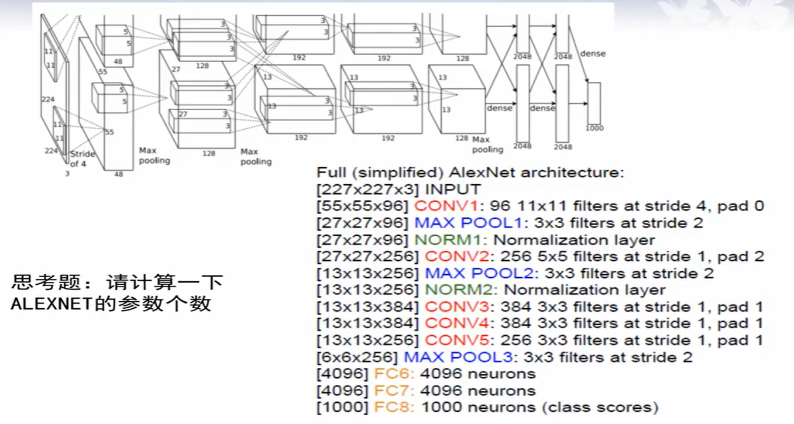
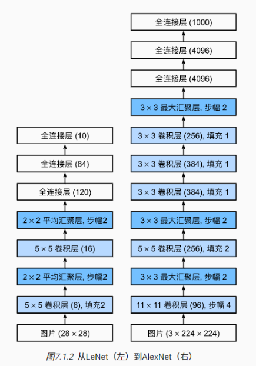

# AlexNet

> 标志着深度学狂潮的开始
> AlexNet是更大更深的LeNet，10x的参数个数（6000万个），260x的计算复杂度

**$AlexNet$的改进：**

1. **首次在神经网络中使用$ReLU$函数替代$sigmoid或tanh$函数**
   1. 每一次让有限的神经元被激活，不是一次将所有参数进行改变，使整个训练流程可以被控制
   2. 使网络训练以更快速度收敛，ReLU这种非饱和非线性函数大概比Sigmoid和tanh这种饱和非线性函数快6倍（Alex实验）
2. 为降采样操作起来个新名字 —— 池化$pooling$，把邻近的像素值看做是一个“池子”；
   1. **提出了最大池化**$MaxPooling$，梯度反向传播时，将池化后的梯度给到最大值那个像素，其他像素梯度置为0。
   2. > 求所有值的最大值是个非线性操作，那么就有了降采样+非线性操作，而求均值是线性操作，所以有所改进；即使给均值池化后面加个非线性激活函数效果也不如最大池化。
3. **随机丢弃**($Dropout$)。为了避免系统参数更新过快导致过拟合，每次利用训练样本更新参数时候，随机的“丢弃’一定比例的神经元，被丢弃的神经元将不参加训练过程，输入和输出该神经元的权重系数也不做更新。这样每次训练时，训练的网络架构都不一样，而**这些不同的网络架构却分享共同的权重系数**。实验表明，随机丢弃技术减缓了网络收敛速度，也以大概率避免了过拟合的发生。
   1. 可理解为训练了一堆网络，最后做个平均
   > 3和4是为了避免overfitting
4. **增加训练样本（数据增强）**。尽管$ImageNet$有120万张图片，但仍然不够。
   1. **$Generate\ image\ translation生成图像平移$（将$256*256$的图片随机截取$224*224$个像素）和$Horizontal\ reflection水平翻转$**
      1. 运用这两个组合可将一幅图变为2048幅图，(256-224) ^ 2 * 2
   2. **改变训练图片的RGB通道值**
      1. ​ 对ImageNet训练集的RGB像素值做PCA(主成分分析)，对每一张训练图片，加上多个找到的主成分，增加的幅度与相应的特征值乘以均值为0标准差为0.1的高斯分布的随机变量成正比。
      2. 作用：经过做PCA分析的处理，减少了模型的过拟合现象。可以得到一个自然图像的性质，改变图像的光照的颜色和强度，目标的特性是不变的，并且这样的处理有利于减少过拟合。
   > AlexNet在测试时，网络通过提取五个224×224补丁（四个角补丁和中心补丁）及其水平反射（总共十个补丁）进行预测，并取均值
5. **利用$GPU$加速训练过程**，强大的并行计算能力，使时间缩短数十倍。但训练仍然用了六天！$NVIDIA$因为$DL$大赚一波。

  

  
