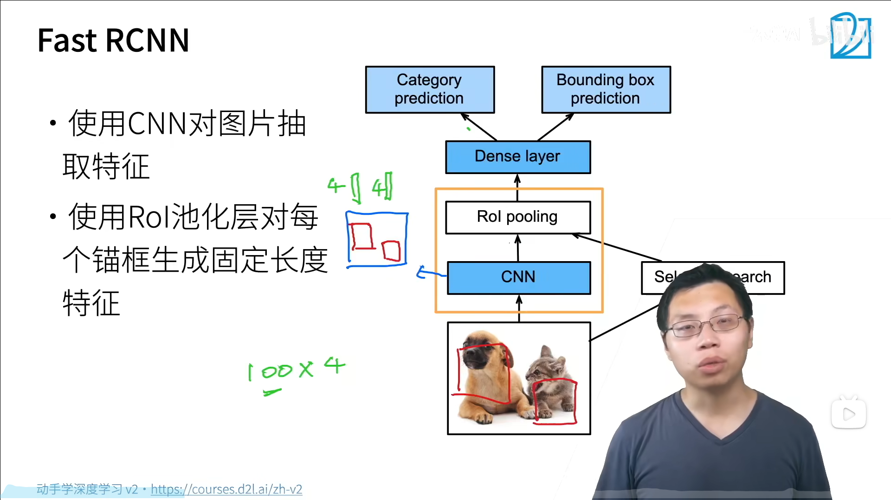
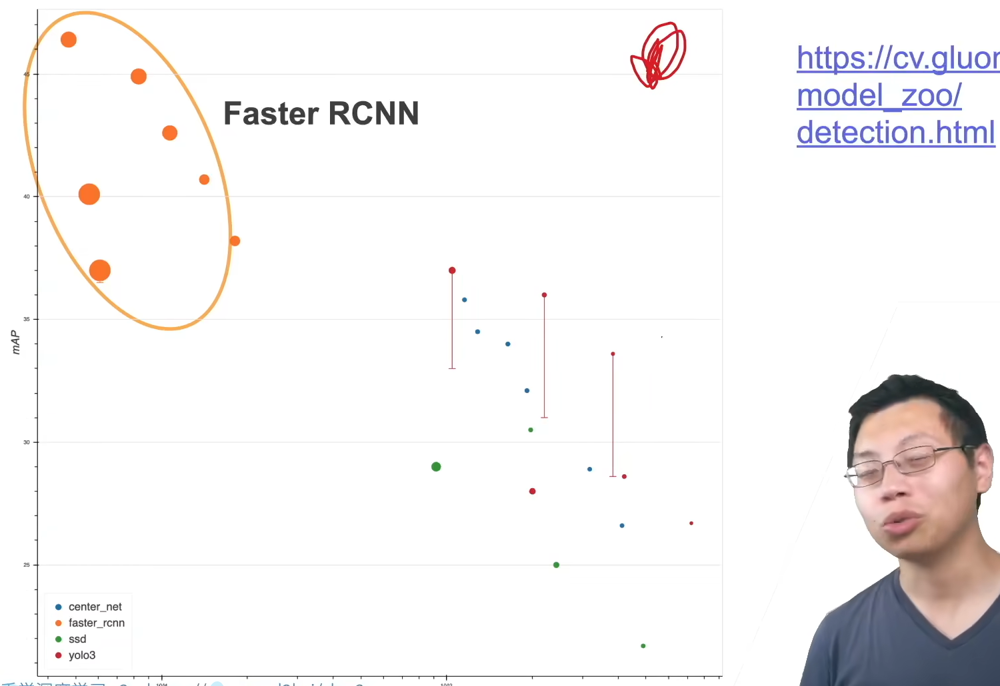
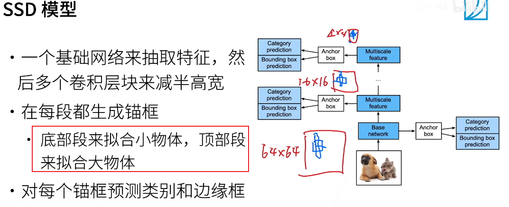

# Object Detection

图片分类：一张图片中有一个主体，给他分类出来即可。
目标检测：一张图片中有多个主体，要识别出所有感兴趣的物体，并且要框出其位置。

  
  

目标检测算法主要分为两个类型
（1）two-stage方法，如R-CNN系算法（region-based CNN），其主要思路是先通过启发式方法（selective search）或者CNN网络（RPN)产生一系列稀疏的候选框，然后对这些候选框进行分类与回归，two-stage方法的优势是准确度高
（2）one-stage方法，如Yolo和SSD，其主要思路是均匀地在图片的不同位置进行密集抽样，抽样时可以采用不同尺度和长宽比，然后利用CNN提取特征后直接进行分类与回归，整个过程只需要一步，所以其优势是速度快，但是均匀的密集采样的一个重要缺点是训练比较困难，这主要是因为正样本与负样本（背景）极其不均衡，导致模型准确度稍低

## anchor-based

  

### R-CNN

  
> eg：预训练模型=VGG

  
ROI层可以让每一个锚框变成想要的形状

### Fast-RCNN

  

之所以快：CNN那里是对整个图片进行特征抽取，而非RCNN中先搜索出锚框在对小框进行特征抽取。（锚框很多都是重叠的嘛）

### Faster-RCNN (two-stage)

  

使用一个神经网络(RPN)替代前面的selective search算法

RPN其实就是一个糙一点的目标检测：这里面有个二分类去判断这个anchor box是不是真的比较不错，以及一个offset值的预测

NMS是将类似的锚框消掉；最终得到比较好的锚框

  

  

Faster-RCNN并没有那么快；只有在对精度要求特别高的地方才会用（刷榜、paper），工业界很少用，因为目标检测算法要远贵于目标分类算法

### Mask-RCNN

  

  

### SSD

single shot multibox detection (只看一遍)
快，精度一般（作者很久没更新）

  

  

  

### YOLO

SSD对每个像素生成锚框
  

  
