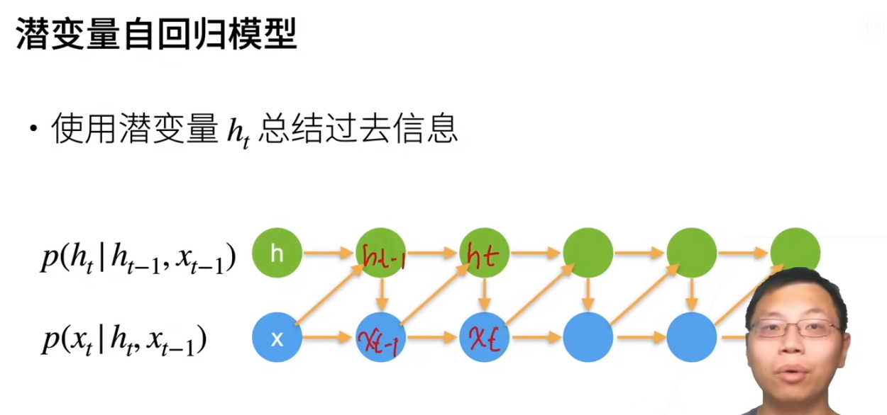
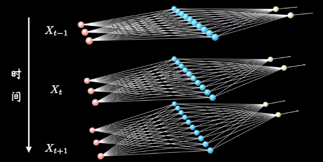
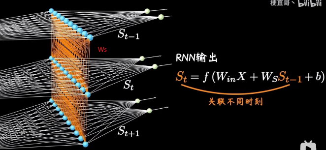
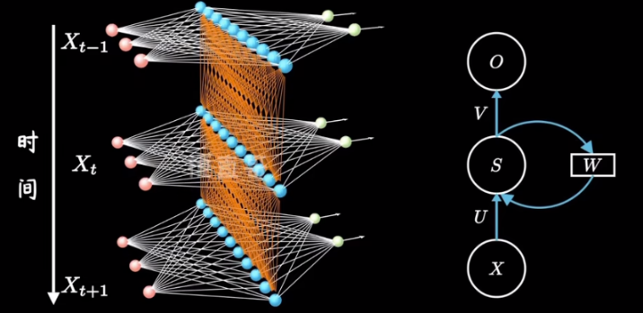
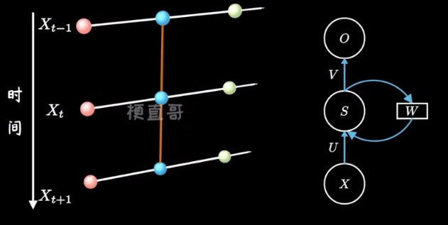
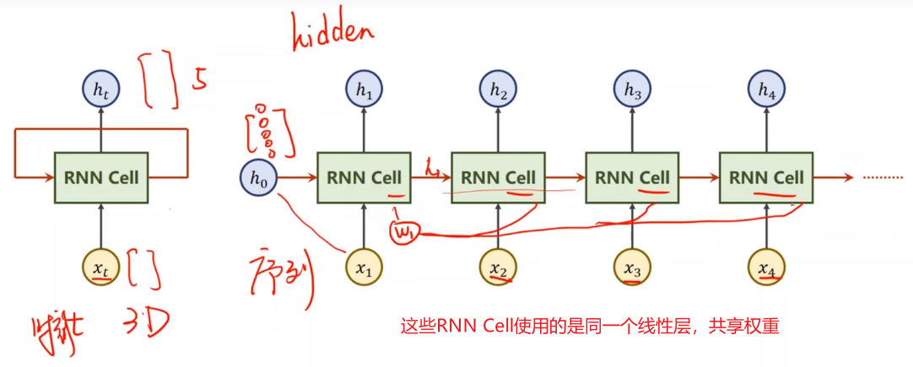
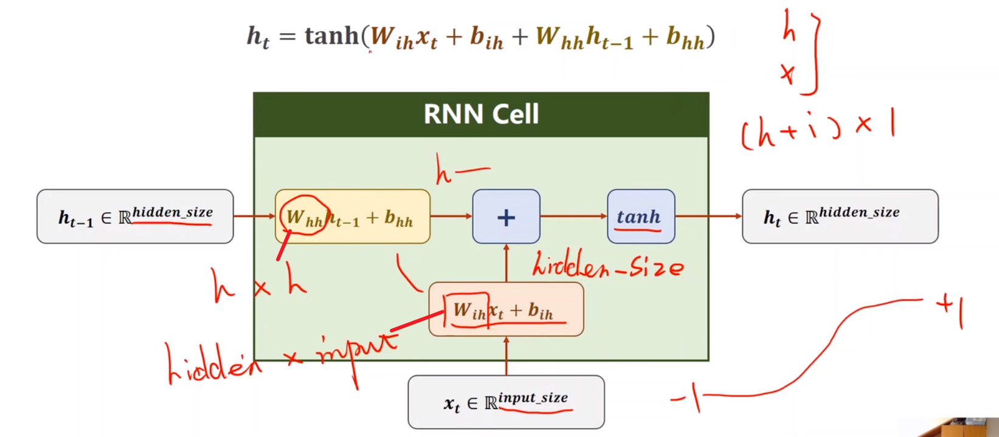
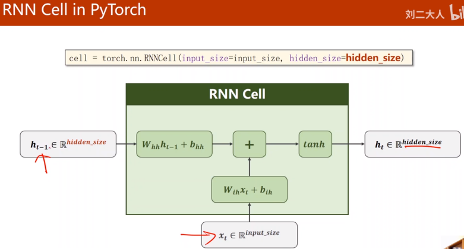
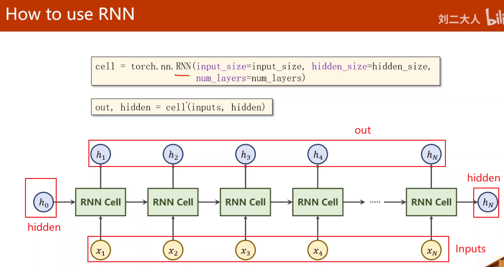

# note

  

  

  

  

  
由于无法长期记忆，所以提出了长短期记忆网络$(Long\ Short\ Term\ Memory)$ [LSTM](https://www.bilibili.com/video/BV1Z34y1k7mc/?spm_id_from=333.788&vd_source=31f382886b368673a25ce3ff23e82bfc)

  

  

  

  
numlayers = 1

  
numlayers = 3