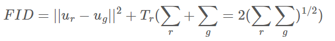

# Evaluation Metrics

## pixel-level evaluation metrics

侧重于生成图像和真实图像之间的像素级，忽略了更接近human perceptions的feature similarity

### L1 loss ↓

$$
\dfrac{1}{n}\sum_{i=1}^n abs(y_i-\hat{y_i})
$$

```python
def compute_l1_loss(img1, img2):
    img1 = img1 / 255
    img2 = img2 / 255
    return np.mean(np.abs(img1 - img2))
```

### RMSE ↓

RMSE(Root Mean Square Error)
$$
RMSE = \sqrt{\frac{1}{n}\sum_{i=1}^{n}(y_i - \hat{y}_i)^2}
$$

```python
def compute_rmse(img1, img2):
    img1 = img1 / 255
    img2 = img2 / 255
    mse = np.mean((img1 - img2) ** 2)
    return np.sqrt(mse)
```

### SSIM ↑

structural similarity(SSIM)用来衡量图片相似度的指标，也可用来判断图片压缩后的质量。

$ SSIM\in [0, 1]$,值越大，表示图像失真越小。

SSIM基于三个关键的图像视觉特性：亮度对比、对比度对比、结构对比
  

> 计算一张图片

```python
from skimage.metrics import structural_similarity as ssim
```

## perceptual-level metrics

### FID ↓

Frechet inception distance: 计算真实图像和生成图像的特征向量之间距离的一种度量。
FID的计算过程为：
对目标数据集的N张图片使用InceptionV3生成N*2048的向量，取平均值，得到$\mu_r$。

对生成的M张图片使用InceptionV3生成M*2048的向量，取平均得到$\mu_g$。

通过$\mu_r$和$\mu_g$得到$\Sigma_r$和$\Sigma_g$最后得到FID。
  

```shell
pip install torch-fidelity
# 计算IS
fidelity --gpu 0 --isc --input1 img_dir1/ 
# 计算FID
fidelity --gpu 0 --fid --input1 img_dir1/ --input2 img_dir2/
```

[link](https://github.com/mseitzer/pytorch-fid)

### PSNR ↑

PSNR(peak signal to noise ratio)单位是dB，值越大图像失真越少。一般来说，大于40dB说明图像质量几乎和原图一样好，30-40dB说明图像质量的失真损失在可接受范围内，20-30dB说明图像质量比较差，小于20说明图像失真严重。

> 计算一张图片

### LPIPS ↓

Learned Perceptual Image Patch Similarity(LPIPS)用于度量两张图片的差别
[link](https://github.com/richzhang/PerceptualSimilarity)
