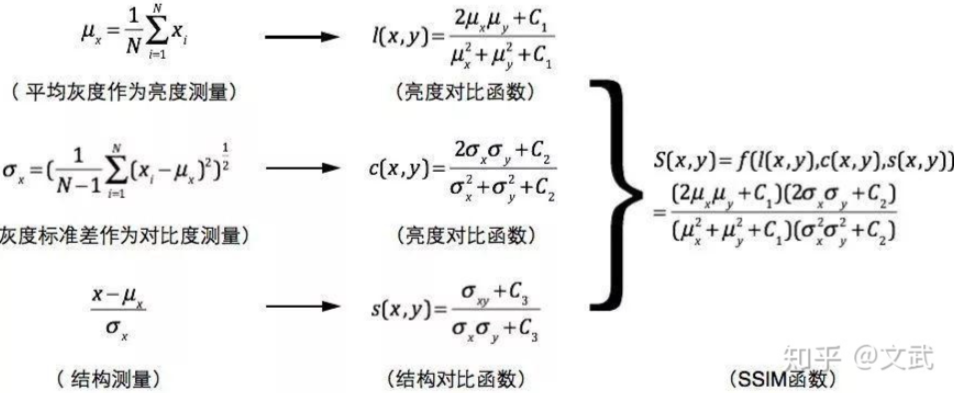

# Evaluation Metrics

## pixel-level evaluation metrics

侧重于生成图像和真实图像之间的像素级，忽略了更接近human perceptions的feature similarity

### MAE (L1 distance) ↓

$$
\dfrac{1}{n}\sum_{i=1}^n abs(y_i-\hat{y_i})
$$

```python
def compute_l1_loss(img1, img2):
    img1 = img1 / 255
    img2 = img2 / 255
    return np.mean(np.abs(img1 - img2))
```

> MSE (L2 distance)

### RMSE ↓

RMSE(Root Mean Square Error)
$$
RMSE = \sqrt{\frac{1}{n}\sum_{i=1}^{n}(y_i - \hat{y}_i)^2}
$$

```python
def compute_rmse(img1, img2):
    img1 = img1 / 255
    img2 = img2 / 255
    mse = np.mean((img1 - img2) ** 2)
    return np.sqrt(mse)
```

### SSIM ↑

structural similarity(SSIM)用来衡量图片相似度的指标，也可用来判断图片压缩后的质量。
与L2损失不同，SSIM仿造人类视觉系统实现了结构相似性的有关理论。

$ SSIM\in [0, 1]$,值越大，表示图像失真越小。

SSIM基于三个关键的图像视觉特性：亮度对比、对比度对比、结构对比
  

> 计算一张图片

```python
from skimage.metrics import structural_similarity as ssim
from PIL import Image
import numpy as np


def calc_ssim(img1_path, img2_path):

    img1 = Image.open(img1_path).convert('L') # 或者分别比较三个通道然后取均值
    img2 = Image.open(img2_path).convert('L')
    img2 = img2.resize(img1.size)
    img1, img2 = np.array(img1), np.array(img2)
    # 此处因为转换为灰度值之后的图像范围是0-255，所以data_range为255，如果转化为浮点数，且是0-1的范围，则data_range应为1
    ssim_score = ssim(img1, img2, data_range=255)
    return ssim_score
```

### PSNR

峰值信噪比(Peak Signal to Noise Ratio):单位为dB，其值越大，图像失真越少。
一般来说，PSNR高于40dB说明图像质量几乎与原图一样好；在30-40dB之间通常表示图像质量的失真损失在可接受范围内；在20-30dB之间说明图像质量比较差；PSNR低于20dB说明图像失真严重。

## perceptual-level metrics

### FID ↓

Frechet inception distance: 计算真实图像和生成图像的特征向量之间距离的一种度量。
FID的计算过程为：
对目标数据集的N张图片使用InceptionV3生成N*2048的向量，取平均值，得到$\mu_r$。

对生成的M张图片使用InceptionV3生成M*2048的向量，取平均得到$\mu_g$。

通过$\mu_r$和$\mu_g$得到$\Sigma_r$和$\Sigma_g$最后得到FID。

  


```shell
pip install torch-fidelity
# 计算IS
fidelity --gpu 0 --isc --input1 img_dir1/ 
# 计算FID
fidelity --gpu 0 --fid --input1 img_dir1/ --input2 img_dir2/
```

[link](https://github.com/mseitzer/pytorch-fid)

### PSNR ↑

PSNR(peak signal to noise ratio)单位是dB，值越大图像失真越少。一般来说，大于40dB说明图像质量几乎和原图一样好，30-40dB说明图像质量的失真损失在可接受范围内，20-30dB说明图像质量比较差，小于20说明图像失真严重。

> 计算一张图片

### LPIPS ↓

Learned Perceptual Image Patch Similarity(LPIPS)用于度量两张图片的差别。
paper: The Unreasonable Effectiveness of Deep Features as a Perceptual Metric
LPIPS 比传统方法（比如L2/PSNR, SSIM, FSIM）更符合人类的感知情况。LPIPS的值越低表示两张图像越相似，反之，则差异越大。
[link](https://github.com/richzhang/PerceptualSimilarity)

## Computational Efficiency Metric

### FLOPS

FLOPS(floating point operations per second): 每秒浮点数运算，即吞吐量，越大越好
**我们一般用的是FLOPs**

### FLOPs

FLOPs(Floating Point Operations): 浮点运算次数，指计算量，可以衡量一个模型/算法的computational complexity，越小越好

[link](https://github.com/MrYxJ/calculate-flops.pytorch/blob/main/README_CN.md)

### inference time

pass
