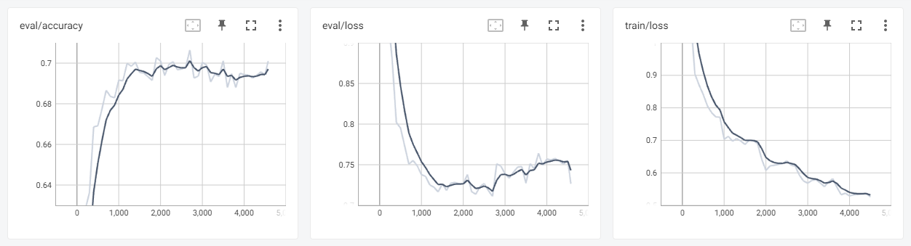
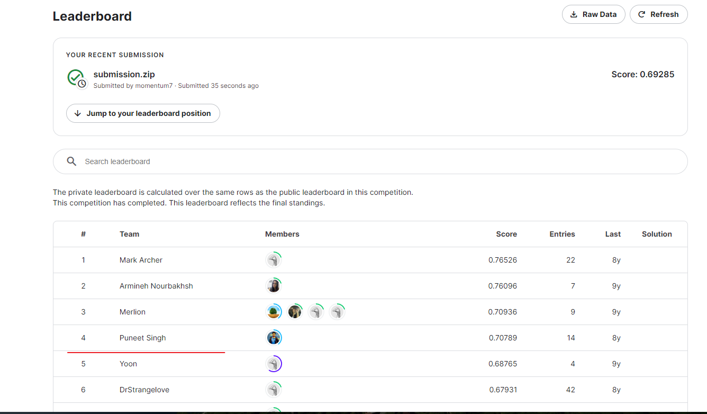

# 电影评论情感分类

[toc]

## 描述

烂番茄(Rotten Tomatoes)是一家美国电影和电视评论网站，从上面采集的电影评论数据集是用于情感分析的电影评论语料库。题目要求按照五个值的等级来标记短语：消极(negative)、有点消极(somewhat negative)、中性(neutral)、有点积极(somewhat positive)、积极(positive)。
训练集：
156060条，label表示为0,1,2,3,4
平均长度为7.2个单词
label分布为
测试集：
66292条，没有label

## logistic

1.首先把训练集和测试集中的phrase合并到一起，形成一个语料库。此外，还导入了一个“停词库”，其中包含对于情感分析没有作用的词汇，可以对语料库进行一个清洗。

2.使用词袋模型将单词转为向量，这里我使用的是sklearn中的CountVectorizer方法，这是一个非常常用的文本特征提取方法，可以将文本转换为一个系数矩阵，它会统计每个单词在每个文档中出现的次数，并将其转换为矩阵形式（也即one-hot编码）。
> 词袋模型不考虑词的顺序，只考虑所有的词的出现频率

3.将训练集按照3:1的比例划分为训练集和验证集，然后分别得到训练集和验证集的数字特征表示

4.使用logistic regression进行多分类，sklearn中的logistic多分类默认通过OVR(One Vs Rest)策略得出，也就是将多个分类结果(假设为n)分成是其中一种以及其他分类的和(剩下)，这样便可以有n种分类的模型进行训练，最终选择得分最高的的(预测率最高的的)便为分类结果即可。它所训练的时间是原来分类时间的n倍。
此外，还可以使用OVO(One VS One)模式，速度慢很多。

5.训练好logistic分类模型之后，将测试集transform处理之后便可进行分类

6.整理提交所需文件格式，完成本次竞赛。最终评分为:0.59826

## Bert

1. 同上，加载划分数据集，无需停词库。
2. 加载预训练模型BertForSequenceClassification，使用预训练模型的好处：
   1. bert预训练模型实在大规模语料中学习得到，所以他已经学会了很多词语之间的关系，对语言的语义有很多理解，能很方便地用到下游任务中，加速训练，加大准确度。
3. 使用AuTokenizer可以将训练集和验证集的文本进行分词并根据词表映射为id，转成token。
4. 创建Dataset类，将数据集封装为dataloader
5. 定义度量函数、训练参数
6. 开始训练
7. 测试，最终评分为0.6928

 
  
