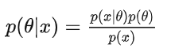
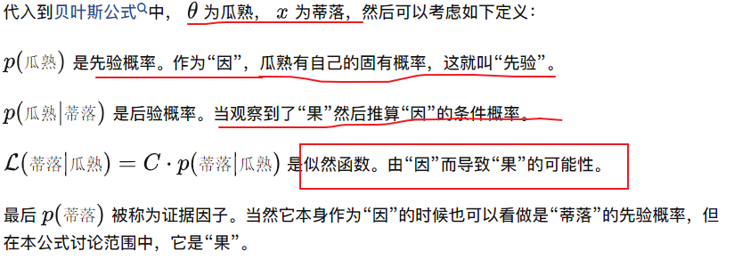

# Note

## 基础

  

分布：分布分为离散分布和连续分布;

- 离散分布：把所有的值列出来，然后分别计算取值的概率；01分布、二项分布
- **连续分布：又名概率密度函数/概率密度/密度函数(PDF)**:就是x取某一点的概率；泊松分布、均匀分布、指数分布、正态/高斯分布
  - 性质：非负、积分和为1

> 将概率理解为质量，质量 = 体积 x 密度，概率 = 区间 x 概率密度；所以概率密度就类似于物体某一点的密度；

(概率)分布函数：F(x)为f(x)的积分

- 离散型的概率分布函数：F(x)=P(X < x)
- 连续型的概率分布函数：$F_X(x)=\int _{-\infin}^xf_X(t)dt$

常用公式：

**条件概率**：
事件B发生的条件下，事件A发生的条件概率：
$$
P(A|B) = \frac{P(AB)}{P(B)}
$$

**乘法公式**：
条件概率公式推导：
$$
P(AB)=P(A|B)P(B) = P(B|A)P(A)
$$

推广：
$$
P(ABCD)=P(A)P(B|A)P(C|AB)P(D|ABC)
$$

**全概率公式**
对于一个事件组$B_1,B_2,..,B_n$，若他们是是完备事件组(交集均为空集；并集为全集)即他们是对样本空间$\Omega$进行了划分：
$$
P(A)=P(A|B_1)P(B_1)+P(A|B_2)P(B_2)+...+P(A|B_n)P(B_n)\\
=\sum _{i=1}^n P(A|B_i)P(B_i)
$$

**理解**：事件A的发生有多种可能的原因$B_i$，每一个原因都可能导致A发生，故B发生的概率是全部原因引起B发生的概率总和；

**逆概率公式/贝叶斯公式**
理解：在已知事件A发生的条件下，寻找导致A发生的各个原因$B_i$的概率(**从结果推原因**)
$$
P(B_i|A)=\frac{P(B_iA)}{P(A)}=\frac{P(A|B_i)P(B_i)}{\sum _{i=1}^n P(A|B_i)P(B_i)}
$$

**先验概率/后验概率**
$P(X=玩lol)=0.6；P(X=不玩lol)=0.4$，**这个概率是统计得到的,或者你自身依据经验给出的一个概率值**，我们称其为**先验概率**(prior probability)；

$P(Y=男性|X=玩lol)=0.8，P(Y=小姐姐|X=玩lol)=0.2$
$P(Y=男性|X=不玩lol)=0.2，P(Y=小姐姐|X=不玩lol)=0.8$

那么我想问在已知玩家为男性的情况下，他是lol玩家的概率是多少：

$$
p(X=玩lol | Y=男性)=\frac{(Y=男性|X=玩)(X=玩)}{(Y=男性|X=玩)(X=玩)+(Y=男性|X=不玩)(X=不玩)}
$$

其中$P(X=玩lol)=0.6；P(X=不玩lol)=0.4$为先验概率，最后算得的$p(X=玩lol | Y=男性)$为后验概率，即他获得的是在观察到**Y事件发生后**得到的。

**似然函数**
  

$$
似然函数：L(x|\theta)=C \times p(x|\theta)
$$
> C为常数，因为似然函数的绝对数值没有意义

再次举例：

举例西瓜书里“瓜熟蒂落”的例子：

- 首先要理解“瓜熟”是“因”，“蒂落”是“果”
- 其次要理解“瓜熟”并不一定会“蒂落”（就是那么顽强），而“蒂落”了也并不一定“瓜熟”（被熊孩子掰下来了）
- 也就是说一切都有概率存在。

  

## 极大似然估计 MLE

MLE是一种参数估计方法，根据给定样本估计总体的参数，即“模型已定，参数未知”。
目的：利用已知的样本结果，反推最有可能（最大概率）出现这些样本结果的参数值。
假设：MLE假设采样的所有数据都是服从独立同分布的。

## 隐变量模型

我们首先介绍什么是潜变量。顾名思义，潜变量就是观察不到的变量，这是相对于可观测变量而言的，比如说mnist数据集，可观测变量就是28x28维的图像变量。而我们认为，可观测变量是由潜变量产生的。我们记潜变量为z,可观测变量为x。举个例子，mnist数据中出现了一个手写数字7的图像，这个图像为什么会出现呢？我们认为，写这个数字的人首先脑子里想要写一个数字7，而写这个数字7需要什么元素呢？需要一横，一竖，同时这一横和一竖之间需要有一定的角度，这些元素就是所谓的潜变量，这个潜变量确定了，就能写出一个数字7。而我们观测到的只是这个数字7的图像，对应的潜变量则是不知道的。值得一提的是，稍微改变一下这个潜变量，也能得到一个数字7，比如说一横和一竖之间的角度稍微变化一点，对应的也是一个7，只不过和之前的7略有不同。

数据集中每个数据点x都有一个相应的潜变量z，z通过某一个变换f(z,θ)可以得到x。θ是这个变换的参数。这就是所谓的潜变量模型。

概率模型有时候既有观测变量$observable\ variable$，又含有隐变量$latent\ variable$。如果概率模型给定的都是观测变量，那么给定数据，可以直接使用MLE或者贝叶斯估计估计模型参数。但若模型含有隐变量，就不能简单地使用这些方法。
