# Note

[toc]

## 背景知识

### encoder and decoder

编码器和解码器的区别：
编码器一次性可看到整个句子
解码器只能一个一个地生成（自回归$auto-regression$:根据自己前面预测过的词预测自己（后面待预测的词））
由于解码是自回归的，所以预测的时候你当然不能看见后面的输出，但注意力机制中每次能看到整个完整的输入，所以在解码器训练时，在预测第t个时刻的输出时不能看到t时刻之后的输入：通过一个带掩码的注意力机制。

### attention

> 背景知识：
> 向量内积表征两个向量之间的夹角，还表征一个向量在另一个向量上的投影$ab=||a||\ ||b||cos\theta$，投影值越大说明两个向量**相关度越高**，如垂直向量之间无关。
> 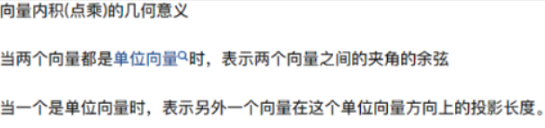  
---
注意力函数是一个将一个query和一些key-value对映射成一个输出的函数（query, keys, values, output均为向量），具体来说，==**输出output是value的加权求和**，每个value的**权重是这个value对应的key和query的相似度**==（compatibility function）计算而得。

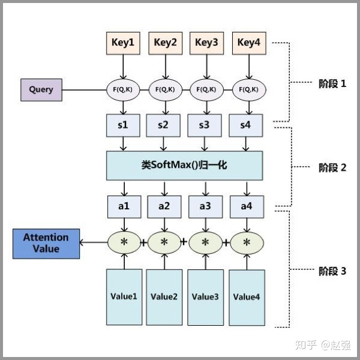  

第一步： query 和 key 进行相似度计算，得到权值
第二步：将权值进行归一化，得到直接可用的权重
第三步：将权重和 value 进行加权求和

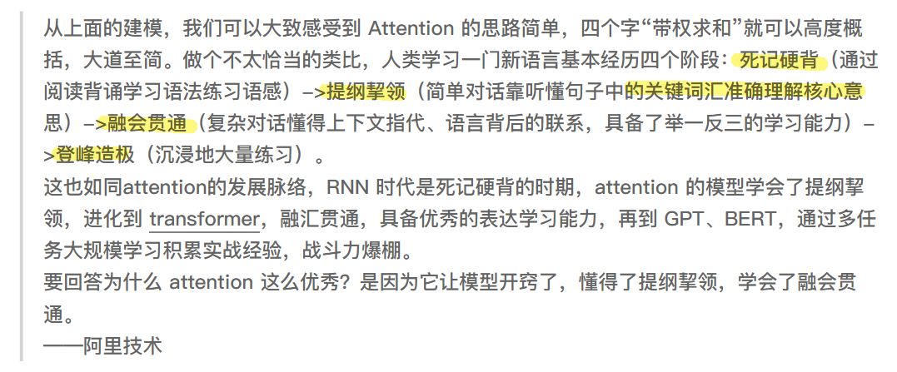  

## transformer正文

### 解决问题

由于$RNN(包括LSTM)$计算限制为顺序执行（只能随时间从左往右或者从右往左），这带来了两个问题：

- 限制了模型的并行能力，$t$时间片的计算依赖$t-1$时刻的计算结果
- 顺序计算的过程中信息会丢失，尽管LSTM等门机制的结构一定程度上缓解了长期依赖的问题，但是对于**特别长期的依赖现象**，LSTM依旧无能为力

> 长期依赖现象：RNN经过许多阶段传播后的梯度倾向于消失(大部分情况)或爆炸(很少，但对优化过程影响很大)。使得神经网络的优化变得困难。网络丧失了学习很久之前信息的能力。

**故**提出了完全采用$Attention$的$Transformer$

- 它不是顺序结构，具备更好的并行性

---

### encoder&decoder in transformer

Transformer的本质上是一个$Encoder-Decoder$的结构。
> 注：**只有最后一个Encoder的输出给到Decoder，而且是给到所有的decoder**

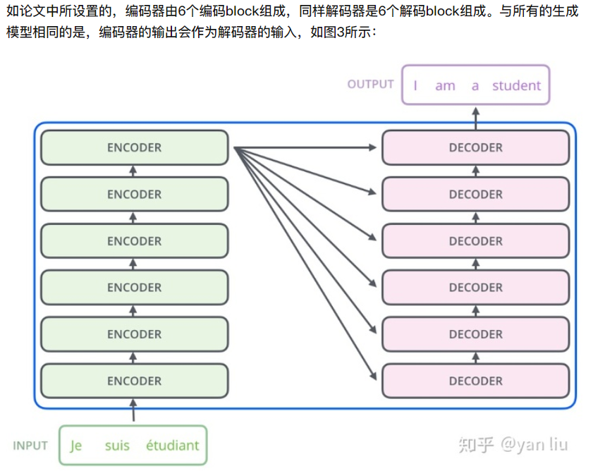  

**$encoder$结构**

输入是**单词的Embedding**，再加上**位置编码**，主要包括$self-attention和Feed\ Forward模块$；再额外加了一些处理，比如Skip Connection，做跳跃连接，然后还加了Normalization层。

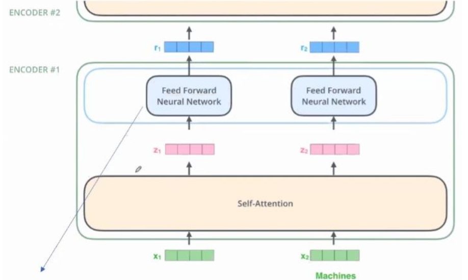  

自注意力模块：
$$
Attention(Q,K,V) = softmax(\frac{QK^T}{\sqrt{d_k}})V
$$

全连接模块：(两层全连接，中间有个ReLU)
$$
FFN(Z) = ReLu(ZW_1+b_1)W_2+b_2=max(0,ZW_1+b_1)W_2+b_2
$$

其中Z表示注意模块的输出。

注意：Self-Attention框里是所有的输入向量**共同参与**了这个过程，也就是说，和**通过某种信息交换和杂糅**，得到了中间变量和。而**全连接神经网络是割裂开**的，和各自**独立**通过全连接神经网络，得到了和。（所以叫做$Position-wised\ FFN$）

**$Decoder$结构**：
第一次输入是前缀信息，之后的就是上一次产出的Embedding，加入位置编码；
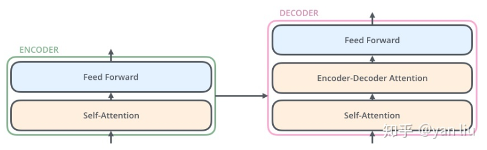  

- Self-Attention：**当前翻译**和**已经翻译**的前文之间的关系；
- Encoder-Decnoder Attention：**当前翻译**和**编码的特征向量**之间的关系。

---

### Encoder模块

#### self-attention模块

为什么叫Self-Attention呢，**就是一个句子内的单词，互相看其他单词对自己的影响力有多大**

attention和self-attention的区别：
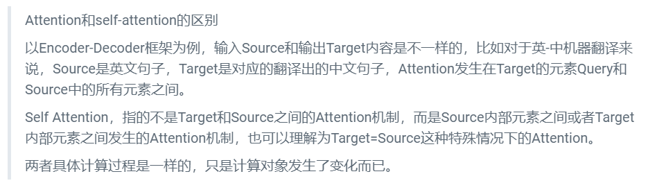  

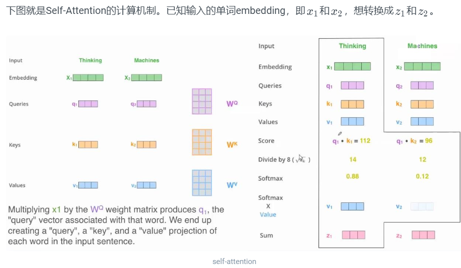  

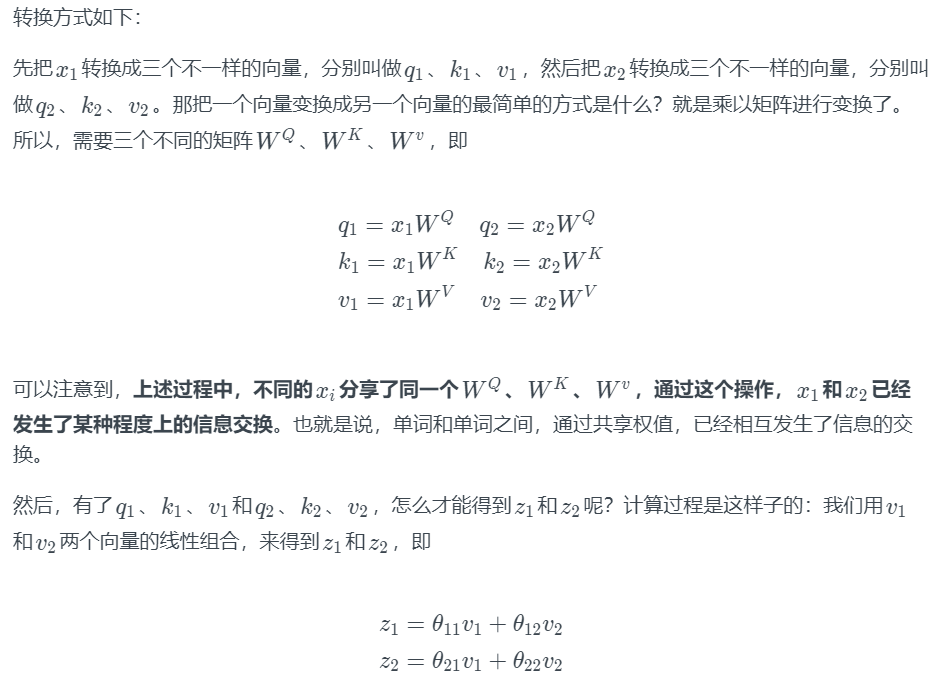  

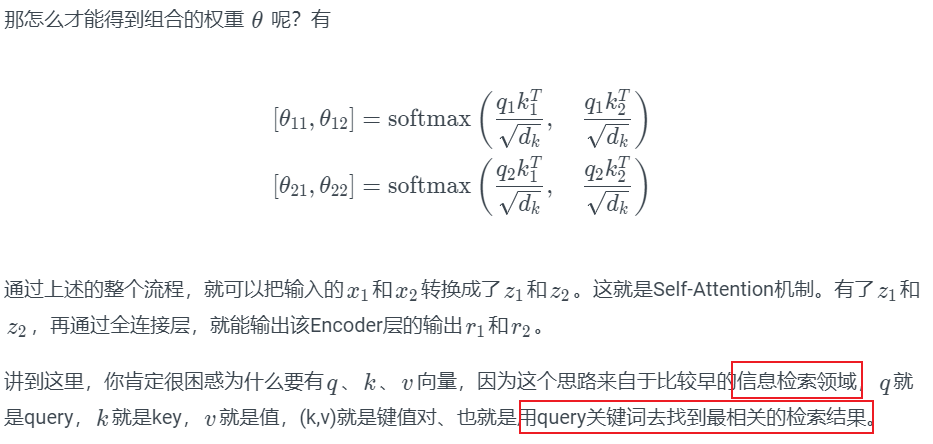  

实际计算过程中是采用基于矩阵的计算方式（矩阵加速更快）：
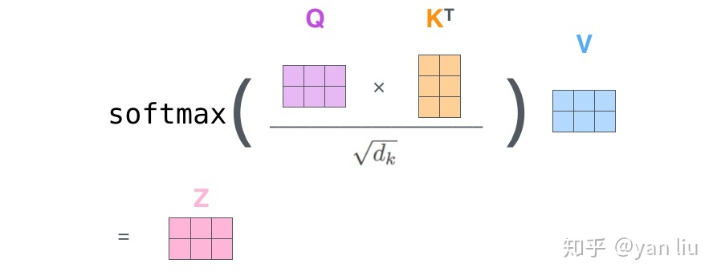  

### Scaled Dot-Product Attention

输入：queries和keys（维度都为dk）
values和output维度都为dv

1. 首先计算query和所有keys的内积（dot product）（内积值越大，表示两个向量之间的相似度越高）
   1. 矩阵$QK^T$表示$Q$矩阵中每个行向量与$K$矩阵每个列向量的内积，得到的$n*m$矩阵表示n个$query$分别与$m个key$之间的关联度。
2. 然后除以$\sqrt{d_k}$
   1. 原因：为了防止维数过高时的值过大导致softmax函数反向传播时发生梯度消失
3. 接着用一个softmax得到权重（一给定一个query，假设给定n个键值对的话，就得到了n个值，放入softmax就得到了非负和为1的权重）
4. 最后将权重作用到values上就得到输出

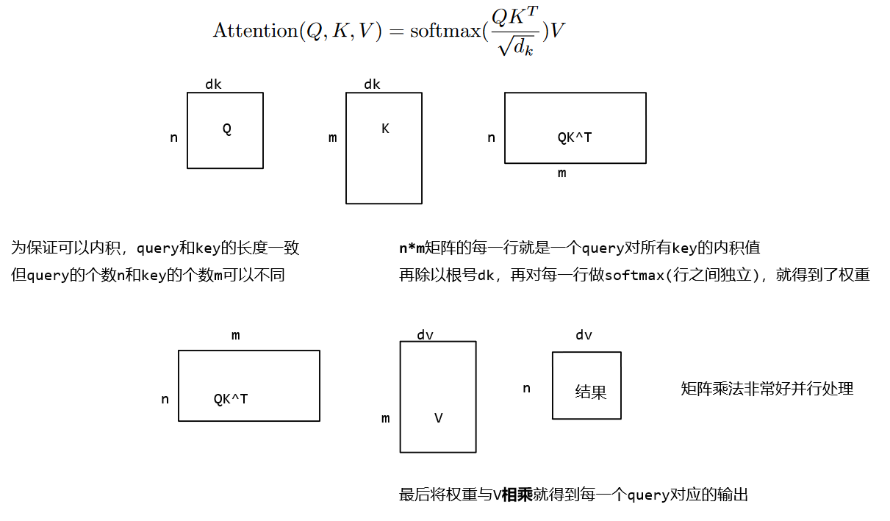  

然后对于**mask处理**，是将t之后的值换成很大的负值(eg -1e10)，而该值进入softmax做指数是就会变成零。所以计算t时刻的output时就只用到了前t-1个v值。

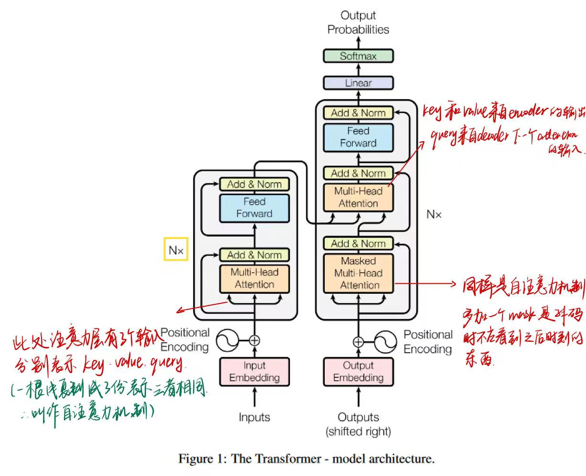  

#### multi-headed Attention

如果用不同的$W^Q$、$W^K$、$W^V$，就能得到不同的Q、K、V。**multi-headed Attention就是指用了很多个不同的$W^Q$、$W^K$、$W^V$。**

**优点**：可以让Attention有更丰富的层次。有多个Q、K、V的话，可以分别从多个不同角度来看待Attention。这样的话，输入，对于不同的multi-headed Attention，就会产生不同的z。
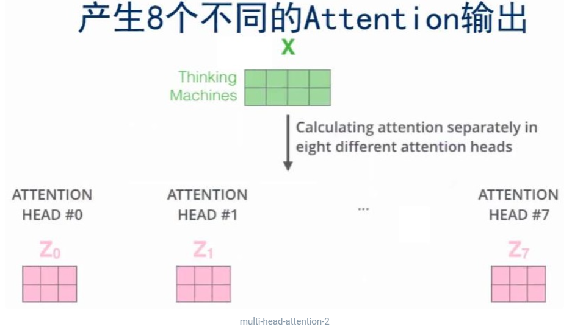  

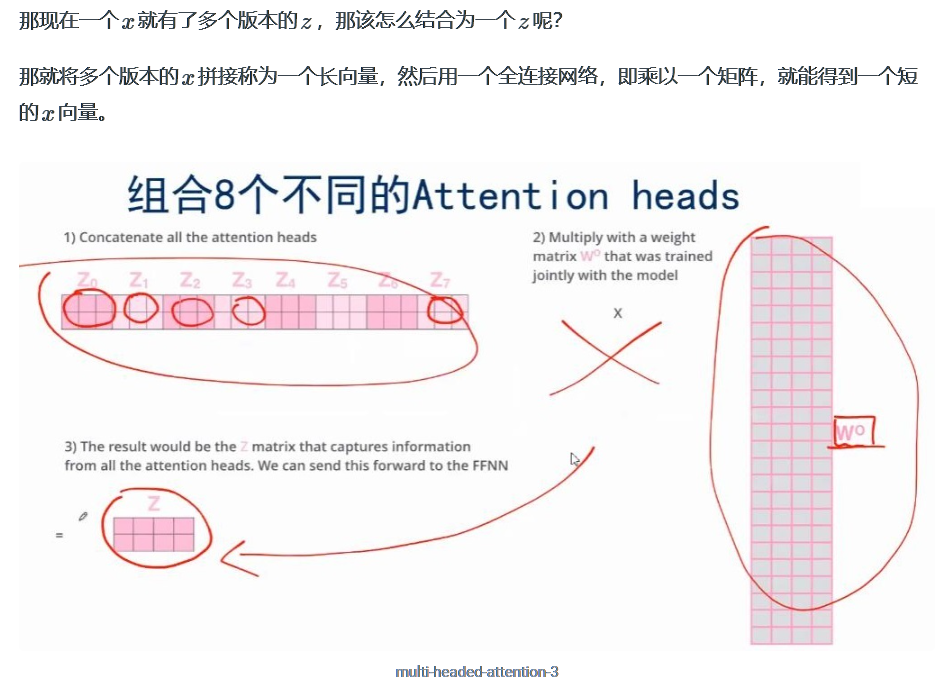

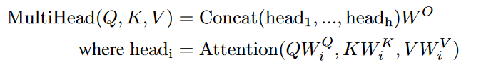  

#### 词向量Embedding

我们输入的是一个个的词($token$：eg '我','很','开心')，然后将其映射成一个向量，$embedding$就是给定任何一个词，去学习一个长为$d$的向量来表示它。
> 分词就是将句子、段落、文章这类型的长文本，分解为以字词（token）为单位的数据结构。

Encoder输入的是单词x的embedding格式
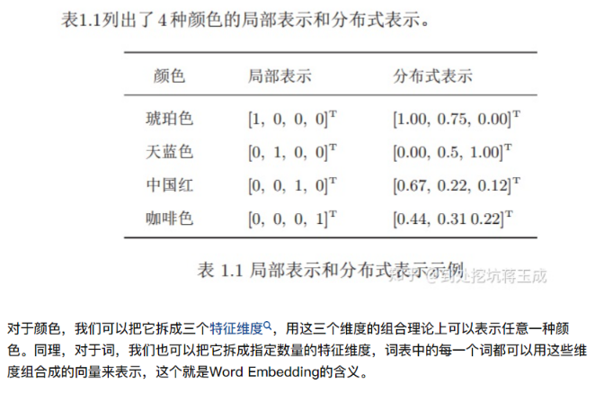  
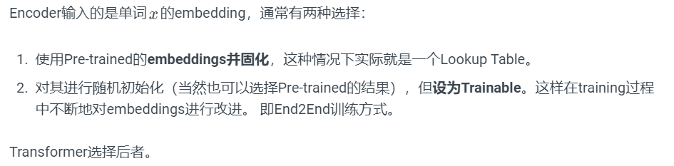  

#### 位置编码Positional Encoding

首先我们发现$attention$**是不会有时序信息的**，“输出时value的加权和，权重是query和key之间的距离”，这跟序列信息无关。这意味着我给你一句话，任意打乱后（语义肯定变了），attention结果仍然一致（顺序会变，但值不变），这有问题。
> RNN是将上一时刻的输出作为本时刻的输入，so可时序。

**$attention$是在输入中加入时序信息**。我们用长为512位的向量表示embedding向量，同时用等长的向量表示$positional\ encodeing$,具体的值使用周期不同的sin和cos函数算出来的。

---
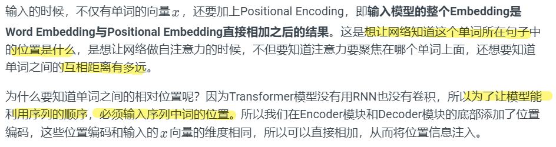  

具体计算方法：[详见here](https://luweikxy.gitbook.io/machine-learning-notes/self-attention-and-transformer)

#### skip connection & Layer Normalization

Add & Norm模块接在Encoder端和Decoder端每个子模块的后面，其中Add表示残差连接，Norm表示LayerNorm；Encoder端和Decoder端每个子模块实际的输出为：
$$
LayerNorm(x+Sublayer(x))
$$

skip connection：解决模型退化的问题
Layer Normalization：是一种正则化策略，避免模型过拟合。

### Decoder模块

Encoder与Decoder有三大主要的不同：

- Decoder SubLayer-1使用的是**Masked** Multi-Headed Attention机制，防止为了模型看到要预测的数据，防止泄露。
- SubLayer-2是一个Encoder-Decoder Multi-head Attention。
- LinearLayer和SoftmaxLayer作用于SubLayer-3的输出后面，来预测对应的word的probabilities。

**此阶段输入是什么？**

#### Masked Multi-Head Attention

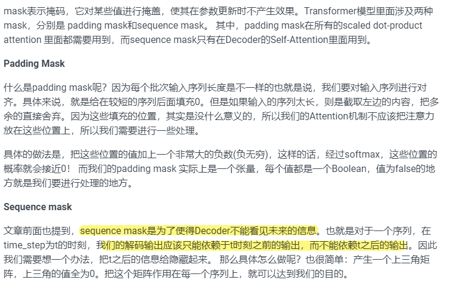  

### Encoder-Decoder注意力层

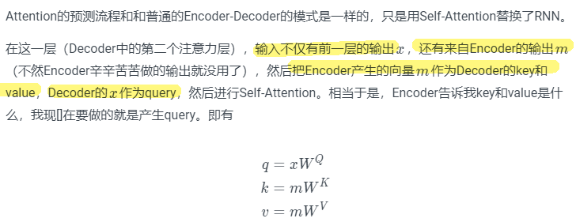  

## Transformer特点

优点：

- 支持并行计算
- 每层复杂度低于RNN
- Self-Attention模型更可解释，Attention结果的分布表明了该模型学习到了一些语法和语义信息。

## 从维度层面打通输入到输出

### 1.Encoder

对于机器翻译来说，**一个样本是由原始句子和翻译后的句子组成的**。比如原始句子是： “我爱机器学习”，那么翻译后是 ’i love machine learning‘。 则该一个样本就是由“我爱机器学习”和 "i love machine learning" 组成。

这个样本的原始句子的单词长度是length=4，即‘我’ ‘爱’ ‘机器’ ‘学习’。经过embedding后每个词的embedding向量是512。那么“我爱机器学习”这个句子的embedding后的维度是[4，512] （若是批量输入，则embedding后的维度是[batch, 4, 512]）。
> Transformer将每层的输出维度都定为512 以确保维度相同

**1.1 padding**
每个样本的原始句子的长度是不一样的，对于输入序列一般我们都要进行padding补齐，也就是说设定一个统一长度N，在较短的序列后面填充0到长度为N。
==假设样本中**句子**的最大长度是10==（10个token），那么对于长度不足10的句子，需要补足padding到10个长度，**shape就变为[10, 512]**, 补全的位置上的embedding数值自然就是0了。

**1.2 Padding Mask**
对于padding中那些补零的数据来说，我们的attention机制不应该把注意力放在这些位置上，所以我们需要进行一些处理。把这些位置的值加上一个非常大的负数(负无穷)，这样经过softmax后，这些位置的权重就会接近0。Transformer的padding mask实际上是一个张量，每个值都是一个Boolean，值为false的地方就是要进行处理的地方。

**1.3 Positional Embedding**
得到补全后的句子embedding向量后，直接输入encoder的话，那么是没有考虑到句子中的位置顺序关系的。此时需要再加一个位置编码向量（positional encoding），位置向量在模型训练中有特定的方式，可以表示每个词的位置或者不同词之间的距离；

文章提出两种方法：

- Learned Positional Embedding：绝对位置编码，即直接对不同的位置随机初始化一个postion embedding，这个postion embedding作为参数进行训练。
- **Sinusoidal Position Embedding**：相对位置编码，即三角函数编码。
shape也是[10, 512]

**1.4 attention**
input embedding + positional embedding = [10, 512]（即X）
经过自注意力层，本文将X分别乘8个$W_i^Q, W_i^K, W_i^V$得到8个不同的$Q,K,V$，然后放入公式
$$
MultiHead(Q,K,V)=Concat(head_1, ...,head_8)W^O\\
head_i = softmax(\frac{Q_iK_i^T}{\sqrt{d_k}}V_i)
$$
> 单头attention的$Q,K,V$的shape和多头attention 的每个头的$Q_i,K_i,V_i$的大小是不一样的，假如单头attention的$Q,K,V$的参数矩阵$W^Q, W^K, W^V$的shape分别是[512, 512]，那么8头attention的每个头的$Q_i,K_i,V_i$的参数矩阵$W_i^Q, W_i^K, W_i^V$大小是[512，512/8].

X[10, 512]乘以三个参数矩阵[512, 64]之后得到8个Q,K,V[10, 64]，attention之后[10, 63]，然后Concat为[10, 512]，然后乘$W^O$[512, 512]得到$Z$[10, 512]

**1.5 FeedForward**
第一层：[10, 512] -> [10, 2048]
第二层：[10, 2048] -> [10, 512]

**1.6 Add&Norm**
维度不变

### 2.Decoder

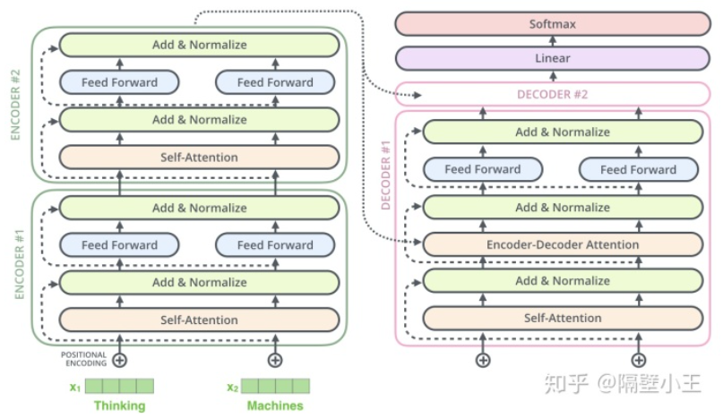  

注意：
encoder的输出并没直接作为decoder的直接输入。
==**只有最后一个Encoder的输出给到Decoder，而且是给到所有的decoder**==

**训练时：**
1.初始decoder的time step为1时(也就是第一次接收输入)，其输入为一个特殊的token，可能是目标序列开始的token(如< BOS >)，也可能是源序列结尾的token(如< EOS >)，也可能是其它视任务而定的输入等等，其**目标则是预测翻译后的第1个单词(token)是什么**；
2.然后< BOS >和预测出来的第1个单词一起，再次作为decoder的输入，得到第2个预测单词；
3.后续依此类推；

具体的例子如下：
样本：“我/爱/机器/学习”和 "i/ love /machine/ learning"

1. 把“我/爱/机器/学习”embedding后输入到encoder里去，**最后一层的encoder**最终输出的outputs [10, 512], 此outputs乘以新的参数矩阵，可以作为**decoder里每一层**用到的K和V；
2. 将< bos >作为**decoder的初始输入**，将decoder的**最大概率输出词** A1和‘i’**做cross entropy计算error**。
3. 将< bos >，"i" **作为decoder的输入**，将decoder的最大概率输出词 A2 和‘love’做cross entropy计算error。
4. 将< bos >，"i"，"love" 作为decoder的输入，将decoder的最大概率输出词A3和'machine' 做cross entropy计算error。
5. 将< bos >，"i"，"love "，"machine" 作为decoder的输入，将decoder最大概率输出词A4和‘learning’做cross entropy计算error。
6. 将< bos >，"i"，"love "，"machine"，"learning" 作为decoder的输入，将decoder最大概率输出词A5和终止符< /s >做cross entropy计算error。

==注意：Transformer输入的是一个序列对，因为编码器和解码器分别输入一个序列。此处编码器输入中文，解码器输入英文。==

**Sequence Mask**
上述**训练过程**是挨个单词串行进行的，那么能不能并行进行呢，当然可以。可以看到上述单个句子训练时候，输入到 decoder的分别是
< bos >
< bos >，"i"
< bos >，"i"，"love"
< bos >，"i"，"love "，"machine"
< bos >，"i"，"love "，"machine"，"learning"
那么为何不将这些输入组成矩阵，进行输入呢？这些输入组成矩阵形式如下：
[< bos >
< bos >，"i"
< bos >，"i"，"love"
< bos >，"i"，"love "，"machine"
< bos >，"i"，"love "，"machine"，"learning"]
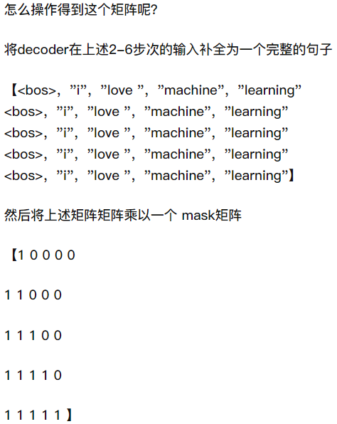  

**预测时：**
比如用 '机器学习很有趣'当作测试样本，得到其英语翻译。
这一句经过encoder后得到输出tensor，送入到decoder(并不是当作decoder的直接输入)：

1. 然后用起始符< bos >当作**decoder的 输入**，得到输出 machine
2. 用< bos > + machine 当作输入得到输出 learning
3. 用< bos > + machine + learning 当作输入得到is
4. 用< bos > + machine + learning + is  当作输入得到interesting
5. 用< bos > + machine + learning + is +  interesting 当作输入得到 结束符号< eos >我们就得到了完整的翻译 'machine  learning  is   interesting'

可以看到，在**测试过程中，只能一个单词一个单词的进行输出**，是串行进行的。

**train的时候是因为我们事先知道样本的全貌，可考虑使用mask机制进行并行操作。
test的时候不知道需要预测的下一个词语，故只能串行进行。**

参考：
[self-attention & transformer](https://luweikxy.gitbook.io/machine-learning-notes/self-attention-and-transformer)
[知乎 - 举例说明](https://zhuanlan.zhihu.com/p/166608727)