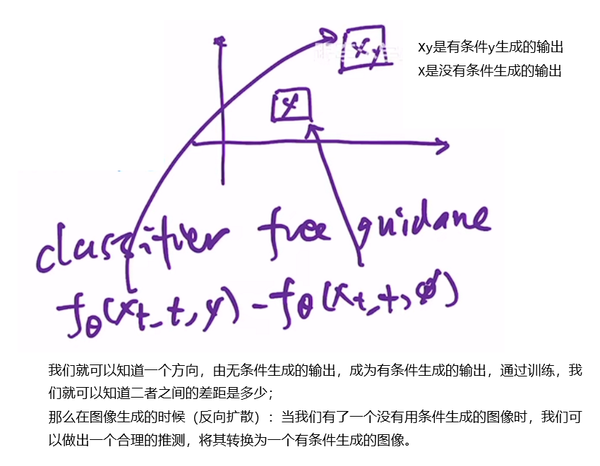
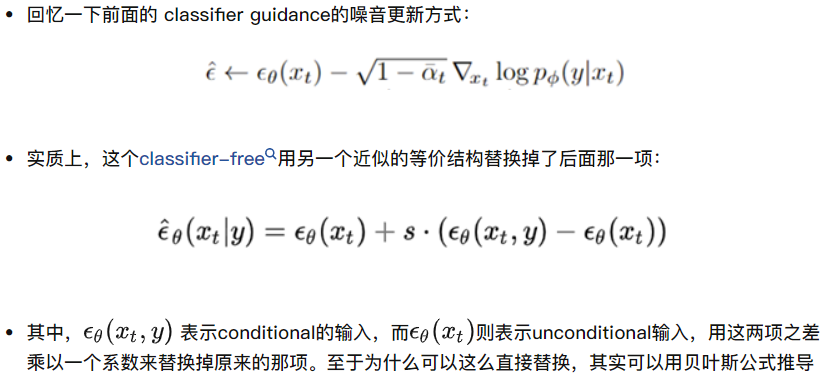

# Note

hierachical：先生成小分辨率64*64，然后用一个上采样模型生成256x256，然后再上采样到1024x1024。

## 1. Guided Diffusion

由于我们随机输入一张高斯噪声显然不能按照人的意愿生成我们想要的内容，因而需要额外的guidance以得到我们需要的图像。
一种想法是使用一个分类器模型的输出作为引导条件来指导扩散模型的去噪过程，从而得到我们想要的输出；

### 1.1 Classifier guidance

由diffusion models beats GANs on iamge synthesis提出；classifier guidance是用多样性换取写实性的一种简单、计算高效的方法。
这种方法不用额外训练扩散模型，直接在训练好的扩散模型上，使用分类器的输出作为引导条件来知道扩散模型的去噪过程，从而得到我们想要的输出。
  

在训练模型f的同时，再额外训练一个简单的图像分类器classifier，这个分类器一般是在加了噪声的ImageNet数据集上预训练好的。
分类器classifier的作用：当我们有了一个图片$x_t$之后，将他给到classifier判别分类是否正确，是否和文本特征匹配，会计算一个交叉熵损失，然后可以计算得到一些梯度$\nabla_g$，然后利用这个梯度去帮助模型进行采样和生成。
> 由于梯度中暗含了图片$x_t$中有没有一个物体、生成的物体是否真实，故借这个梯度去引导U-Net生成更像某类物体的图片。
加了classifier guidance机制之后，生成的图片逼真很多。

唯一需要改变的是在采样高斯分布的时候均值有所改变，期待噪声图像的采样中心越接近判别器引导的条件越好。

  
s被称作guidance scale，增加 s 以牺牲多样性为代价提高样本质量。
==here!!!!!!!!!!!!!!!!!!!!!!!!!!!!!!!!!!!!==

$$
p(x_{t-1}|x_t) = ||\epsilon - f_\theta(x_t, t, y)||
$$

其中$\epsilon$是我们正向扩散过程中添加的已知的固定的噪声，$f_\theta$函数是对应的反向扩散过程中的U-Net网络结构，$x_t$是输入，$t$是输入的time embedding，$y$是引导guidance（==可以是classifier，CLIP等多种引导方式==）

### 1.2 Classifier (free) Guidance

论文：Classifier-Free Diffusion Guidance

但是classifier guidance有一个缺陷，**需要另外一个模型来进行guidance，成本比较高，也不好控制**。

如果我们引入一个分类器作指导，当我们推理的时候，每一次迭代都需要额外计算一下分类信息，导致推理过程比较复杂。

故classifier free guidance诞生；
文章提出了一个等价结构替换掉了外部的分类器，从而可以直接用一个扩散模型你给来做条件生成任务。

过程：在训练模型的时候生成两个输出，一个是在有条件（conditional）的时候（加入引导信息的embedding）生成了一个输出，一个是在没有条件（unconditional）的时候生成的输出。
  

  

但输出两个是非常昂贵的，所以训练成本增加不少；但真的挺好用，所以GLIDE，DALLE2，Imagen都用到了。
GLIDE参数比DALLE少四倍，而且效果好很多。

故OpenAI就顺着GLIDE做了，抛弃了之前的顺着VQVAE的DALLE的做法，得到了DALLE2。

---

## 2. 模型

DALL-E2分为两个模块：CLIP和text-to-image模块，其中text-to-image又分为先验模块prior和decoder模块；
  

### 2.1 CLIP

由于CLIP使用自然语言监督信号，也就是对图像-文本对进行训练，所以CLIP能学到多模态的特征，能够将视觉的语义信息和文本的语义信息联系在一起，找到图片和文本之间的联合表示空间；==CLIP学好之后，在prior模块和decoder模块被冻住。==

==思考一下CLIP如何用到DALLE2中的？==
因为CLIP学到了很好的图片和文本对应的特征，在生成图像时，冻住CLIP，首先拿出==训练好的==CLIP的text encoder，将text编码为text embedding $z_t$，然后拿出训练好的CLIP的image encoder，将$z_t编码为z_i$，我们希望prior模型输出的图像特征和CLIP编码出的$z_i$越接近越好，这样来更新prior网络；

然后将训练好的prior网络和CLIP的text encoder串联起来，就可以根据我们的输入文本y生成对应的图像特征$z_i$了。

==那我为啥不直接给定文本，然后由CLIP得到对应的图像特征，然后给到decoder进行图片生成呢？==

### 2.2 Text-to-image process

$$
p(x|y) = p(x,z_i|y)=p(x|z_i,y)p(z_i|y)
$$

> (x,y)是图像文本对，$z_i和z_t$分别是image embedding和text embedding

第一个等式成立是因为$z_i和x$是一对一的关系，因为CLIP训练好之后，参数被锁住，所以从x到image embedding有一个固定的映射，二者对等。第二个等式由链式法则可推理得到。故两阶段模型是由概率依据的。

故我们要从y生成x，首先使用prior采样$z_i$，然后使用decoder采样得到$x$。

#### 2.2.1 Prior

由CLIP得到图片和文本之间的联系之后，给定一个文本y，由CLIP的text encoder将其变成text embedding，然后是prior过程；

Prior是给定文本y(or text embedding)去生成图像特征$z_i$；

本文实验了==AutoRegressive prior和diffusion prior==两种方式：

**AutoRegressive**
prior过程如果使用自回归模型，我们可以根据CLIP得到文本特征对应的image embedding作为ground truth，然后将自回归模型的预测和这个ground truth进行对比；
> 注意CLIP训练好后被锁住，zi和y一一对应。

但是本文实验得出**自回归模型的训练效率太低**；

**Diffusion model**
作者使用了一个transformer，由于输入输出都是embedding，所以用U-Net就不太合适；

DDPM提出之后，大家一直都是去预测噪声（残差），但作者发现对于特征的重建（或者是他们当前任务）来说，直接预测没有被污染过的图像特征$z_i$要比预测噪声比较好。所以$L_{prior}$中是$z_i而非\epsilon$.

这一堆技巧怎么有时候有用有时候没用。。？最有用的还是Scale matters.

#### 2.2.2 Decoder

Decoder就是使用==diffusion model==根据prior得到的的image embedding（也可以添加文本描述）生成图片的过程。

DALLE2使用的是改进的GLIDE模型，这个模型可以根据CLIP图像编码的$z_i$，还原出具有与$x$相同语义但又和$x$不完全一直的图像。

Decoder是GLIDE的变体，变化不大，首先用了CLIP的guidance（并非classifier），

DALLE2也使用了classifier free guidance，他们的guidance要么来自CLIP模型要么来自text caption，本文在10%的时间上将CLIP的特征设为0，字啊训练的时候50%的时间将文本特征扔掉了。

怎么去生成1024的高清大图呢？
**级联式生成**
构建两个扩散上采样模型，第一个从64x64 -> 256x256，第二个从256x256 -> 1024x1024；
为了训练稳定性，作者在训练时添加了很多噪声，比如高斯模糊。

为了降低计算资源和提升稳定性，模型只使用了卷积，并没有使用attention。

### 2.3 推理过程

经过上述CLIP，prior和decoder三个步骤，DALLE2预训练模型就搭建好了，此时可以丢弃早已训练好的CLIP中的image encoder，保留早已训练好的text encoder以及新训练好的prior和decoder；
这样一来，整个推理过程如下所示：
  
由CLIP的text encoder将text编码为text embedding，然后prior对将text embedding转换为image embedding，最后将降额 embedding进行解码生成图像。

## 3. 应用

### 3.1 图片处理

#### 3.1.1 Variation：根据一张图片生成很多风格类似的图片

生成的图片语义信息不变，关键内容不变，但不太关键的信息不一样，比如说形状和方向。
  
可见，左图保留了绘画中的时钟，模仿了超现实的绘画风格；右图保留了logo的重叠样式以及渐变色风格；但两幅图中该变量很多非必要的细节。

#### 3.1.2 Interpolation；在图像和图像之间做插值

通过遍历CLIP的特征空间中两个图像之间的所有特征然后decoder出来。

  
可见左边生成的图像更接近左图，右边的图像更接近右图，中间会有一些二者融合的图片。

#### 3.1.3 language-guided image manipulation

  

比如图一，从一个猫变成超级赛亚人风格的猫；图三是从一个成年狮子变成幼年狮子，很像抖音上的特效了。
原理：通过图像的CLIP特征，和两个文本描述的CLIP特征之间的差异进行插值，将文本差异运用于图像。

### 3.2 Text-to-Image

作者说明，这个prior(从caption->image embedding)对于text-to-image不是必须的。
我们可以有三个选择方式：1.只将caption输入给decoder生成图片；2.把caption经过CLIP得到的text embedding和caption输入给decoder生成图片；3.使用一个prior将caption->image embedding再输入给decoder

  
显然第一行效果最差，比如第二列是“一个带着派对帽子的柯基的油画”，第一行都没出现狗，第三列是“一个刺猬在使用计算器”，第一行都没出现计算器。
此外，作者具体量化了一下三者的评分指标，FID分数分别为16.55,9.16,7.99，所以有prior还是最强的。

## 4. 局限性和不足

## 5.question

### 为何不能直接使用CLIP生成text对应的image embedding呢？而非要训练一个prior去生成text embedding对应的image embedding？

CLIP能不能生成text对应的image embedding？
CLIP到底是做什么的？？
