# Note

[toc]

## 1. Guided Diffusion

### 1.0 unconditional & conditional

生成模型分为unconditional generation & conditional generation。
无条件生成追求生成样本的分布完全符合真实分布，往往是为了探索效果上界。
而有条件生成追求的应用层面的内容，因为它可以实现根据我们的意愿来控制输出结果。
举个例子，如果训练集都是MNIST，无条件生成是想要让生成样本的分布完全符合真实分布，然后生成的时候是从该分布中随意采样一个点，得到一个随意数字的图片。
而条件分布可以生成特定数字的图片。

扩散模型和VAE、GAN等模型的发展史相似，都是先出来无条件生成，比如DDPM，然后出现有条件生成。比如DALLE2和imagen都是文本生成图片模型（即文本条件扩散模型）

所以我先介绍一些条件生成模型，就是借助不同的guidance来指引扩散模型的去噪过程，从而得到我们想要的生成图片。

### 1.1 Classifier guidance

由diffusion models beat GANs on image synthesis提出；

classifier guidance就是每一步逆向过程中通过引入朝向目标类别的梯度信息，来实现针对性的生成。

一般加入类别条件能够比无类别条件生成更好的效果，这是因为加入类别条件的时候，实际上大大减小了生成时的多样性。

classifier guidance就是**用多样性换取写实性**的一种简单、计算高效的方法。

在训练模型f的同时，再额外训练一个简单的图像分类器classifier，这个分类器一般是在加了噪声的ImageNet数据集上预训练好的。
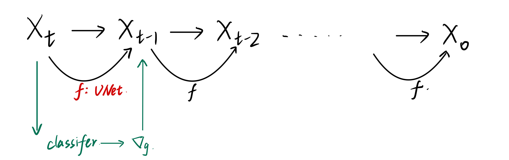  

分类器classifier的作用：当我们有了一个图片$x_t$之后，将他给到classifier判别分类是否正确，是否和文本特征匹配，然后计算目标类别和分类类别之间的交叉熵损失，可以计算得到一些梯度$\nabla_g$（'拿不拉g'），然后利用这个梯度去引导下一个step的生成采样。那么下一个样本的采样就会更像条件y一些。
> 由于梯度中暗含了图片$x_t$中有没有一个物体、生成的物体是否真实，故借这个梯度去引导U-Net生成更像某类物体的图片。

唯一需要改变的是在采样高斯分布的时候均值有所改变，期待噪声图像的采样中心越接近判别器引导的条件越好。

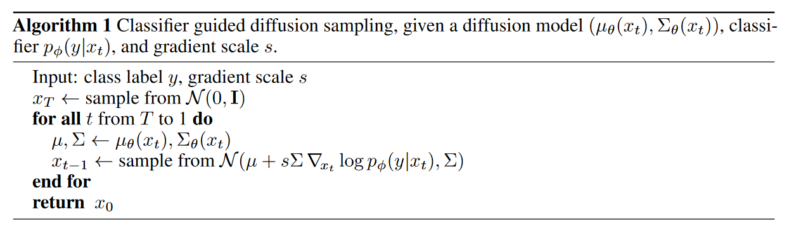

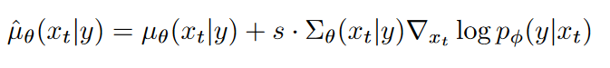  
s被称作guidance scale，增加 s 以牺牲多样性为代价提高样本质量。

$$
p(x_{t-1}|x_t) = ||\epsilon - f_\theta(x_t, t, y)||
$$

其中$\epsilon$是我们正向扩散过程中添加的已知的固定的噪声，$f_\theta$函数是对应的反向扩散过程中的U-Net网络结构，$x_t$是输入，$t$是输入的time embedding，$y$是引导guidance（==可以是classifier，CLIP，image等多种引导方式==）

### 1.2 Image/Text Guidance

论文：More Control for Free! Image Synthesis with
Semantic Diffusion Guidance

classifier guidance就是每一步逆向过程中通过引入朝向目标类别的梯度信息，来实现针对性的生成。

SDG文中，作者的guided   guidance一样：
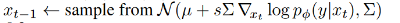  
作者将$F_\phi(x_t,y,t)=log(p_\phi(y|x_t))$称作引导函数。

**文本引导**/CLIP
即希望生成的图像符合文本的描述，如何度量一张图片是够和文本描述相符呢，自然的想到了CLIP模型，文本引导函数定义为：
$$F(x_t,l,t)=E'_I(x_t)·E_L(l)$$

其中EI是image encoder，加个撇的意思是将CLIP在加噪声的训练集上进行微调之后的image encoder。EL是指text encoder。将我们的引导文本l和图片x_t编码后计算余弦相似度，然后便可以得到梯度，让模型朝着文本引导的方向生成图片。
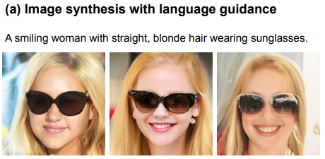  

**图片引导**
即希望生成的图片与一张参考图片相似。将参考图记为$x'_0$，而我们可以根据公式$q(x_t|x_0)$知道t时刻正向过程加了多少固定的噪声，我们把这个噪声加到参考图上，得到t时刻的带噪声的参考图$x'_t$，那么我们就可以对比$x'_t和x_t$来引导生成图片。
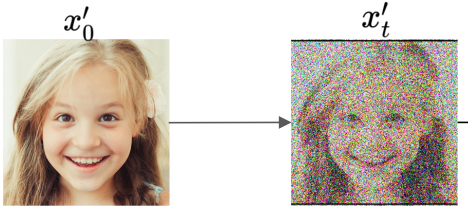  
图片内容引导函数（希望图片内容与参考图相似）：
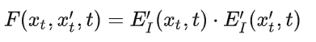
此外图片引导，文中还提到了图片结构引导（空间结构上相似）和图片风格引导。此处略。
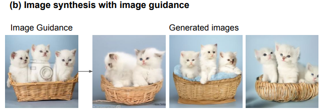  

**混合引导**
即将多种引导函数按比例加起来，就能够同时基于多种引导条件进行生成。
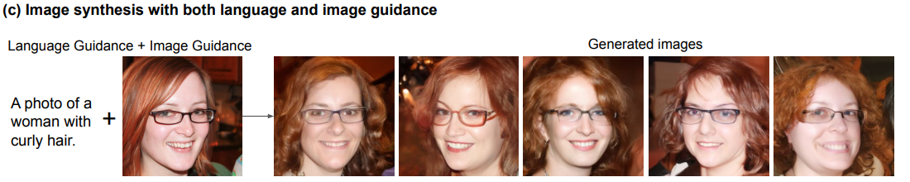  

**优点**
不需要重新训练扩散模型，直接在训练好的扩散模型上，使用分类器或其他网络的输出作为引导条件来知道扩散模型的去噪过程，从而得到我们想要的输出。
**缺点**
会引入比较多的额外计算时间，因为我们每一个step都要通过分类模型或其他模型求梯度进行优化；
此外引导模型和扩散模型分别进行训练，不利于进一步扩增模型规模，不能够通过联合训练获得更好的效果。

### 1.3 Classifier-Free Guidance

论文：Classifier-Free Diffusion Guidance

文章提出了一个等价结构替换掉了外部的分类器，从而可以直接用一个扩散模型你给来做条件生成任务。
作者对噪声估计模型$\epsilon_\theta(x_t)$加入额外的条件输入$\epsilon_\theta(x_t,y)$。

**训练**扩散模型的时候，同时训练有条件和无条件两种方式，无条件时，将条件y设为$NULL$，从而得到两个输出：一个是在有条件y的时候生成的输出$\epsilon_\theta(x_t,y)$，一个是在没有条件的时候生成的输出$\epsilon_\theta(x_t)$。

比如训练的时候用的图像文本对，想用text作为条件y，训练的时候用文本y生成了一个图像，然后**随机地**把文本条件去掉，用一个空集代替条件。通过训练我们就可以知道二者之间的差距大概有多少，然后我们在图像生成的时候，我们有了一个无条件图像输出的时候，也能根据这个差距得到一个有条件的输出。

反向扩散的时候，该方法通过以下方式结合有条件和无条件噪声得到结果：
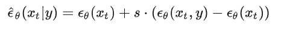  

> 我们得到两个输出也就是知道了一个调整的方向，和梯度的作用类似，所以在生成图像的时候，当我们有了一个无条件生成的图像时，我们可以将其转换为一个有条件生成的图像。

缺点：输出两个是非常**昂贵的**，而且扩散模型都需要重新训练，所以训练成本增加不少；**但真的挺好用**，所以GLIDE，DALLE2，Imagen都用到了。

故OpenAI就顺着GLIDE做了，抛弃了之前的顺着VQVAE的DALLE的做法，得到了DALLE2。

## 2. 模型

DALL-E2分为两个模块：CLIP和text-to-image模块，其中text-to-image又分为先验模块prior和decoder模块；
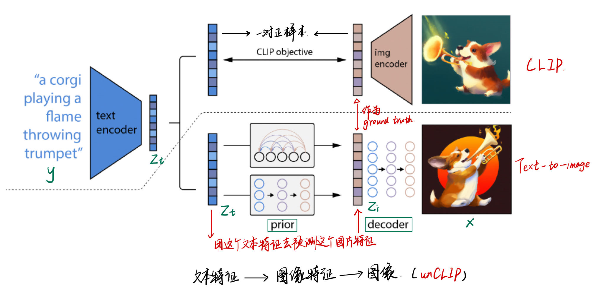  

### 2.1 CLIP

由于CLIP使用自然语言监督信号，也就是对图像-文本对进行训练，所以CLIP能学到图片和文本多模态的表示，能够将视觉的语义信息和文本的语义信息联系在一起，找到图片和文本之间的联合表示空间；CLIP学到的是文本和图像的匹配关系；把文本编码器和图像编码器都学的很好。==CLIP学好之后，在prior模块和decoder模块被冻住。==

==思考一下CLIP如何用到DALLE2中的？==

我们训练阶段，用的是CLIP的文本图像训练集WIT，这时有image和text，我们可以得到image embedding输入到prior，可以得到image embedding作为ground truth作为prior的学习目标。据此，我们便学得了一个prior网络。
当我们推理的时候，首先冻住CLIP，给定一个text，我们通过训练好的CLIP中的text encoder得到text embedding，然后此时，作为一个新的text，我们是没有一个对应的image的，**CLIP是没有通过text推得image的能力的**，所以此时我们需要通过prior网络将text embedding转为image embedding，完事。

然后将训练好的prior网络和CLIP的text encoder串联起来，就可以根据我们的输入文本y生成对应的图像特征$z_i$了。

### 2.2 Text-to-image process

$$
p(x|y) = p(x,z_i|y)=p(x|z_i,y)p(z_i|y)
$$

> (x,y)是图像文本对，$z_i和z_t$分别是image embedding和text embedding

第一个等式成立是因为$z_i和x$是一对一的关系，因为CLIP训练好之后，参数被锁住，所以从x到image embedding有一个固定的映射，二者对等。第二个等式由链式法则可推理得到。故两阶段模型是由概率依据的。

故我们要从y生成x，首先使用prior采样$z_i$，然后使用decoder采样得到$x$。

#### 2.2.1 Prior: test caption -> image embedding

由CLIP得到图片和文本之间的联系之后，给定一个文本y，由CLIP的text encoder将其变成text embedding，然后是prior过程；

Prior是给定文本y(or text embedding)去生成图像特征$z_i$；

本文实验了==AutoRegressive prior和diffusion prior==两种方式：

**AutoRegressive**
prior过程如果使用自回归模型，我们可以根据CLIP得到文本特征对应的image embedding作为ground truth，然后将自回归模型的预测和这个ground truth进行对比；
> 注意CLIP训练好后被锁住，zi和y一一对应。

但是本文实验得出**自回归模型的训练效率太低**；

**Diffusion model**
本文发现，该策略更加高效，能产生更加高质量的图像。
作者使用了一个transformer，由于输入输出都是embedding，所以用U-Net就不太合适；

DDPM提出之后，大家一直都是去预测噪声（残差），但作者发现对于特征的重建（或者是他们当前任务）来说，直接预测没有被污染过的图像特征$z_i$要比预测噪声比较好。所以$L_{prior}$中是$z_i而非\epsilon$.

这一堆技巧怎么有时候有用有时候没用。。？最有用的还是Scale matters.

#### 2.2.2 Decoder: image embedding -> image

Decoder就是使用==diffusion model==根据prior得到的的image embedding（也可以添加文本描述text caption）生成图片的过程。

DALLE2使用的是改进的GLIDE模型。

##### decoder of GLIDE

这个模型可以根据CLIP图像编码的$z_i$，还原出具有与$x$相同语义但又和$x$不完全一直的图像。

Decoder是GLIDE的变体，变化不大，首先用了CLIP的guidance（并非classifier），

DALLE2也使用了classifier free guidance，他们的guidance要么来自CLIP模型要么来自text caption，本文在10%的时间上将CLIP的特征设为0，字啊训练的时候50%的时间将文本特征扔掉了。

怎么去生成1024的高清大图呢？
**级联式生成**
构建两个扩散上采样模型，第一个从64x64 -> 256x256，第二个从256x256 -> 1024x1024；
为了训练稳定性，作者在训练时添加了很多噪声，比如高斯模糊。

为了降低计算资源和提升稳定性，模型只使用了卷积，并没有使用attention。

### 2.3 推理过程

经过上述CLIP，prior和decoder三个步骤，DALLE2预训练模型就搭建好了，此时可以丢弃早已训练好的CLIP中的image encoder，保留早已训练好的text encoder以及新训练好的prior和decoder；
这样一来，整个推理过程如下所示：
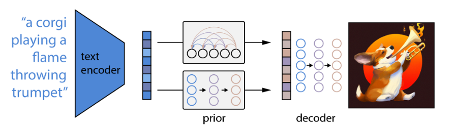  
由CLIP的text encoder将text编码为text embedding，然后prior对将text embedding转换为image embedding，最后将降额 embedding进行解码生成图像。

## 3. 应用

### 3.1 图片处理

#### 3.1.1 Variation：根据一张图片生成很多风格类似的图片

生成的图片语义信息不变，关键内容不变，但不太关键的信息不一样，比如说形状和方向。
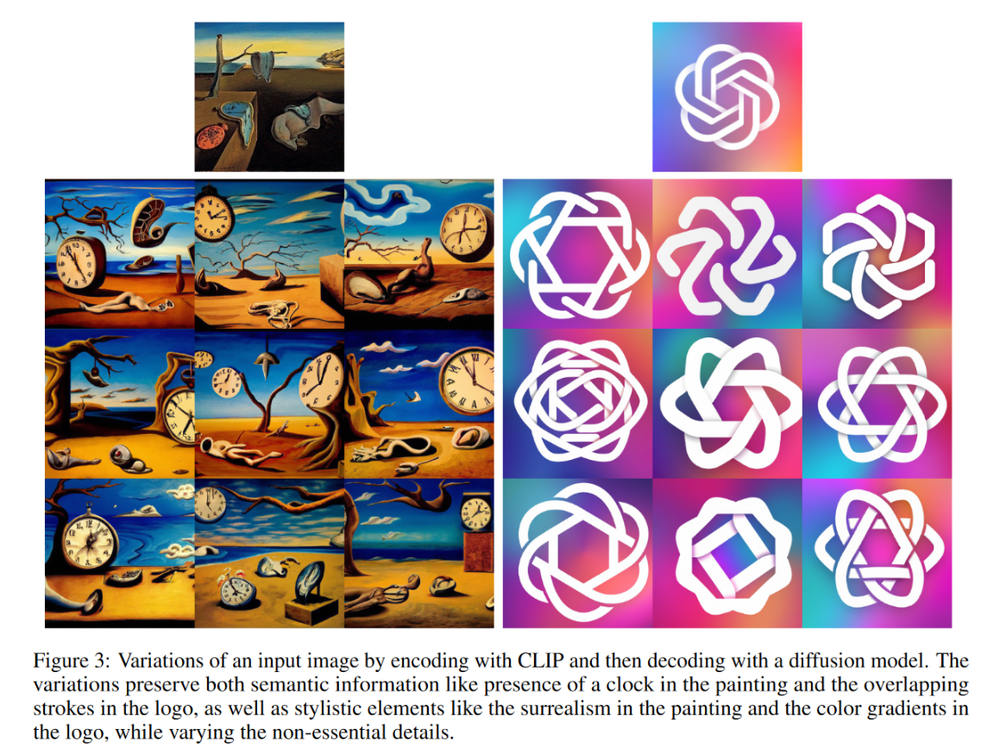  
可见，左图保留了绘画中的时钟，模仿了超现实的绘画风格；右图保留了logo的重叠样式以及渐变色风格；但两幅图中该变量很多非必要的细节。

#### 3.1.2 Interpolation；在图像和图像之间做插值

通过遍历CLIP的特征空间中两个图像之间的所有特征然后decoder出来。

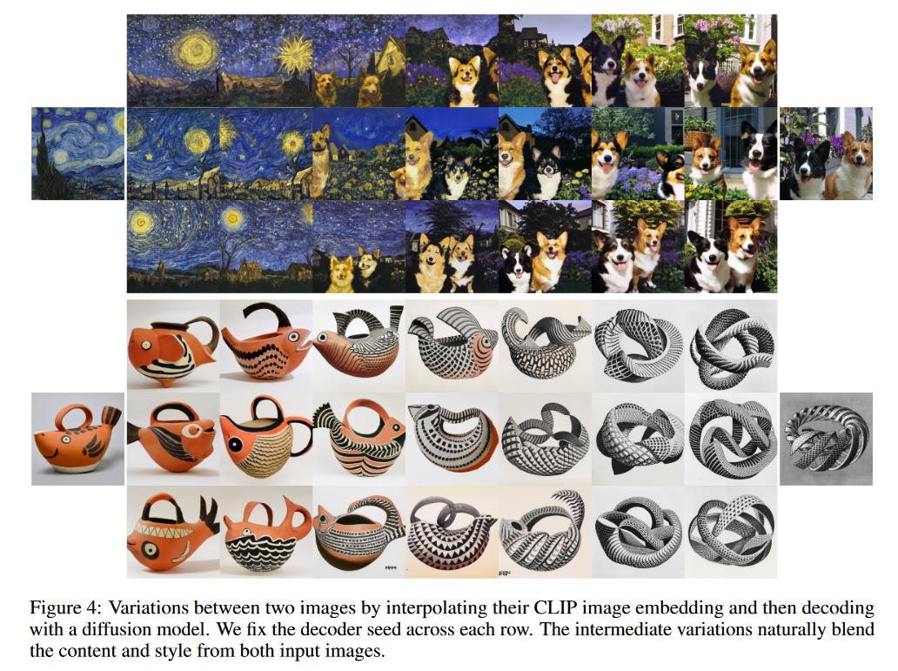  
可见左边生成的图像更接近左图，右边的图像更接近右图，中间会有一些二者融合的图片。

#### 3.1.3 language-guided image manipulation

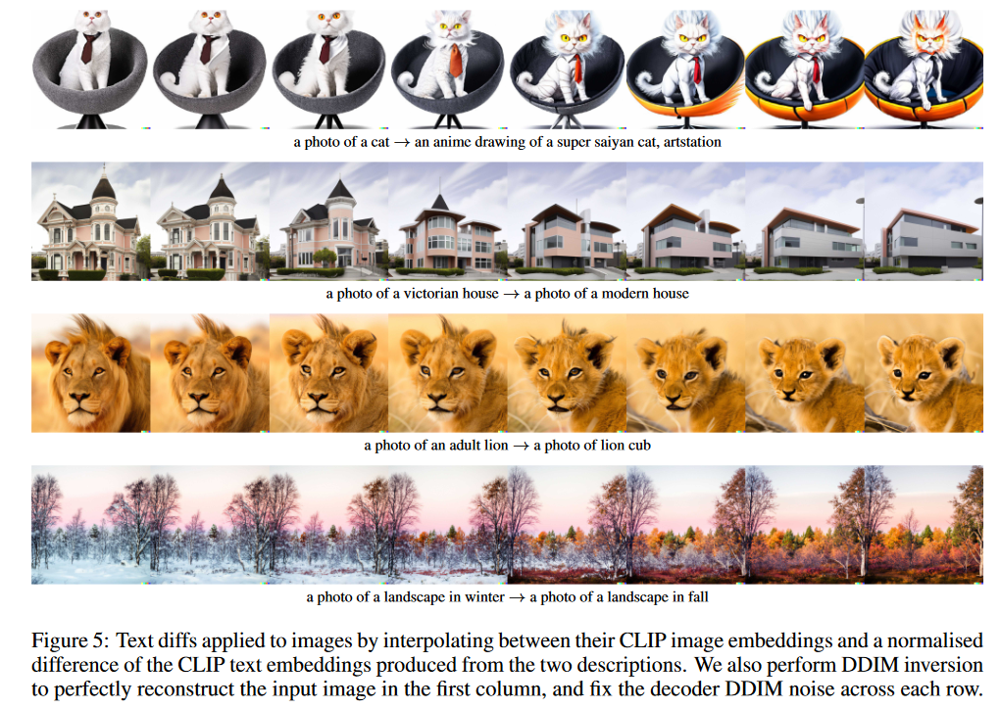  

比如图一，从一个猫变成超级赛亚人风格的猫；图三是从一个成年狮子变成幼年狮子，很像抖音上的特效了。
原理：通过图像的CLIP特征，和两个文本描述的CLIP特征之间的差异进行插值，将文本差异运用于图像。

### 3.2 Text-to-Image

作者说明，这个prior(从caption->image embedding)对于text-to-image不是必须的。
我们可以有三个选择方式：1.只将caption输入给decoder生成图片；2.把caption经过CLIP得到的text embedding和caption输入给decoder生成图片；3.使用一个prior将caption->image embedding再输入给decoder

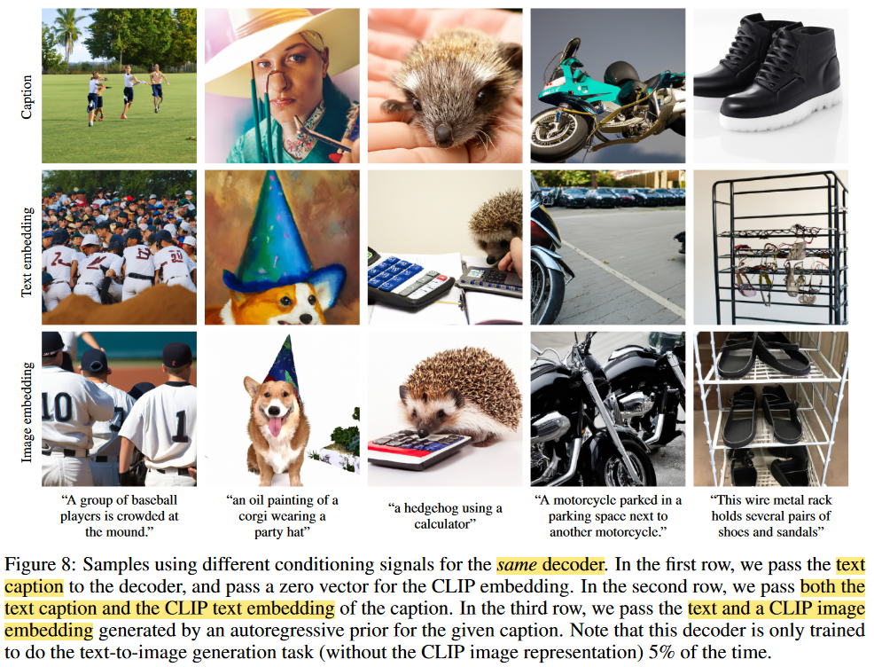  
显然第一行效果最差，比如第二列是“一个带着派对帽子的柯基的油画”，第一行都没出现狗，第三列是“一个刺猬在使用计算器”，第一行都没出现计算器。
此外，作者具体量化了一下三者的评分指标，FID分数分别为16.55,9.16,7.99，所以有prior还是最强的。

## 4. 局限性和不足

## 5.question

### 为何不能直接使用CLIP生成text对应的image embedding呢？而非要训练一个prior去生成text embedding对应的image embedding？

答：CLIP不具备从text embedding推导image embedding的能力。CLIP只是通过训练阶段的一堆文本图片对学到了很多文本和图片之间的关系，然后一般推理任务是分类：输入一个image，从学到的一堆多模态表征中找到最匹配的text，故而分类。而从text到image应该是难住它了。虽然我感觉也可以从多模态表征中找到与text最匹配的image，但应该是不够准的，而我们训练的prior网络是根据正确地图像文本对进行专门的text embedding到image embedding学习的过程。

[guidance](https://zhuanlan.zhihu.com/p/449284962)
[李沐](https://www.bilibili.com/video/BV17r4y1u77B/?spm_id_from=333.999.0.0&vd_source=31f382886b368673a25ce3ff23e82bfc)
