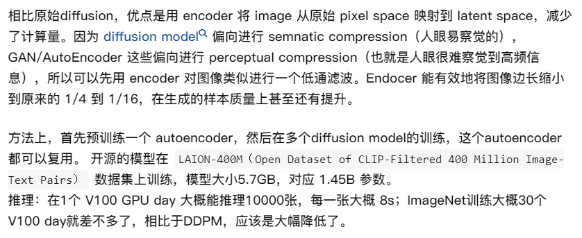
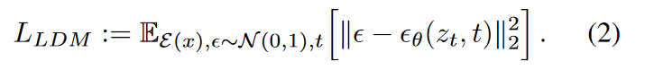

# Stable Diffusion

[toc]

## 补充知识

### 感知损失perceptual loss

## motivation

之前的扩散模型都是直接在像素空间进行操作operate directly in pixel space(也就是扩散和反向扩散的每一步出来的都在使用完整的图片)，当对模型进行优化的时候很耗计算资源，同时推理inference的时候由于需要一步步按顺序计算，所以非常昂贵。故本文想要使用更少的计算资源，同时保持DM的质量和灵活性，本文应用了预训练自编码器的潜在空间(latent space)。相比于前面的工作，在这种潜在空间训练DM，可在复杂度降低和细节保留之间达到一个接近最优的点。

通过在模型引入交叉注意力层cross-attention，将扩散模型转化为强大而灵活的生成器，用于文本或边界框等一般条件反射输入，并以卷积方式实现高分辨率合成。

动机：
  

## introduction

DMs是基于似然的模型，==容易在不可感知的数据细节的建模上花费过多的容量和计算资源==。这使得DM模型的训练相当耗费资源。

和大多数基于似然的模型一样，学习过程可大致分为两阶段：

- perceptual compression：感知压缩阶段；去除高频细节，但是仍然学习到很少的语义变化（semantic variation）；其实就是在训练自编码器，自编码器的潜在空间是一个比原始图像小的图像，学到原始图像的形状，但是像纹理等细节会被去除。
- semantic compression：语义压缩阶段；实际的生成模型学习数据的语义semantic和概念conception组成；其实就是实际生成模型（扩散模型）的学习阶段。

于是，本文的目标是首先找到一个感知上等效的（perceptually equivalent）但计算更合适的空间，我们将在该空间中训练用于高分辨率图像合成的扩散模型。

**本文将训练过程分为两个不同的阶段:(LDMs).**

- 训练一个autoencoder，它提供一个低维的(thereby efficient)表示空间，这个表示空间representational space在感知上等同于data space。
- 在学到的潜在空间训练扩散模型。

优点：
只需要训练一次通用的自动编码阶段，就可以多次用于扩散模型训练或探索不同的任务，比如img-to-img, text-to-img。

LDMs优点总结：

1. 与完全基于transformer的方法相比，本方法更适合高维数据；还可以高效地应用于百万像素图像的高分辨率合成。
2. 显著降低计算成本，在多个任务和数据集上实现了具有竞争力的性能。与基于像素的扩散方法相比，显著降低了推理成本。
3. 与之前的工作(同时学习编码器/解码器架构和score-based的先验)相比，方法不需要对重构和生成能力进行精确的权衡。这确保了仅需非常少的潜空间正则化下，即可有较合理的重建效果。
4. 对于超分辨率、图像修复和语义合成等条件密集输入型的任务，模型能以卷积的方式应用，并输出高达1024分辨率的图像。
5. 基于cross-attention的通用条件机制，实现了多模态训练。用它来训练类条件模型、文本到图像模型和布局到图像模型。

## method

<!-- 先训练好一个AutoEncoder（包括一个encoder和decoder）。因此，我们可以利用encoder压缩后的数据做diffusion操作，再用decoder恢复即可 -->

LDM通过分解生成建模中的感知压缩阶段perceptual和语义压缩阶段semantic

1. 首先用autoencoder修剪掉像素级的冗余，学习到一个在感知上等同于image space的latent space，可显著降低计算复杂度
2. 然后在学习到的latent space中用扩散过程生成语义概念semantic concepts

### perceptual image compression

感知压缩模型基于VQ-GAN，它包括一个autoencoder，这个autoencoder由一个感知损失（perceptual loss）和一个基于patch的对抗目标（patch-based adversarial objective）联合训练。

<!-- 由一个通过结合感知损失（perceptual loss）和基于patch GAN对抗训练的自动编码器（autoencoder）组成。 -->

这确保了真实感，并避免仅依靠像素空间损失（如L2，L1目标）而引入的模糊。

为了避免latent space的任意高方差，文章实验了两种正则化项：
>方差用来描述一个模型在不同训练集上的差异，表示模型的泛化能力；方差越大，模型泛化能力越弱，代表过拟合。所以需要使用正则化项避免高方差

$KL\text{-}reg.$：类似于VAE，对学习到潜空间的标准正态分布使用一个轻微的KL惩罚项。
$VQ\text{-}reg.$：在encoder中使用vector quantization layer（类似VQGAN应该）

"该模型可理解为VQGAN，但量化层被解码器吸收"

由于后续的扩散模型用于处理潜在空间z的二维结构，所以我们使用相对温和这种的压缩率并实现非常好的重建。这与之前的VQGAN、DALLE形成对比，他们依赖于学习到的空间z的任意1D排序来对其分布进行自回归建模，从而忽略了z的大部分固有结构。因此，本文的压缩模型可以更好地保留x的细节。

### latent diffusion models

我们训练好了perceptual compression models，包括encoder和decoder。我们现在可以访问一个高效的、低维度的latent space，其中高频的、难以察觉的细节被抽象掉了。与高维度的像素空间相比，隐空间更适合基于似然的生成模型，因为：（1）现在可以专注于数据的重要语义bits；（2）在低维度、计算效率更高的空间中进行训练。

这里与基于自回归的模型（VQGAN，DALLE）不同，本文可以利用我们的模型提供的特定与图像的归纳偏置。这包括从2D卷积层构建底层U-Net的能力，并使用重新加权的边界进一步地将目标集中在感知上最相关的位上。

  

$\epsilon_\theta(·,t)$为以时间为条件的U-Net网络。由于前向过程是固定的，所以在训练过程中可以从encoder中高效地获取zt，来自p(z)的样本可以通过decoder单词解码到图像空间。？？？

## ques

### 为什么传统的在pixel space上计算需要耗费大量的计算？

### 为什么在latent space中计算就可减少大量的计算？

答案见论文3.1上面。