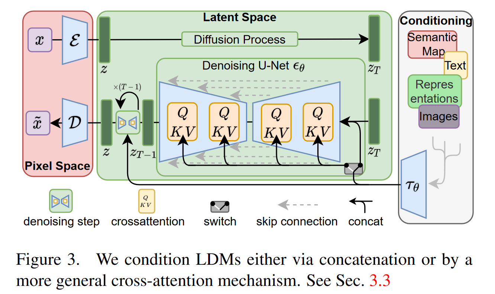
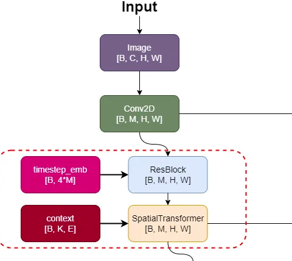
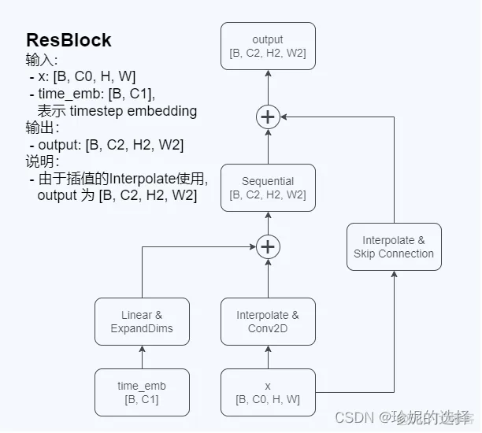
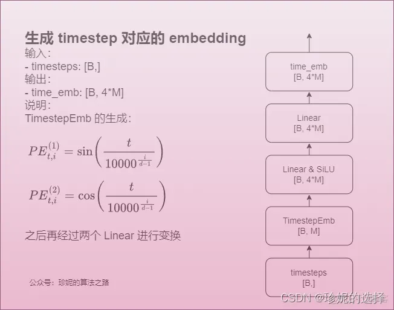
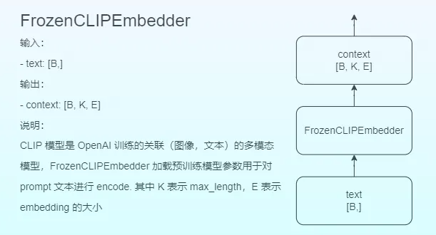

# Stable Diffusion

LDMs提供了一种基于扩散模型的条件图片生成方法，该方法计算更加高效、控制条件更加灵活。

[toc]

## 补充知识

### 高频信息和低频信息

图像频率是表示图像中灰度变化剧烈程度的指标。图像低频信息表示图像中灰度值变化缓慢的区域，对应着图像中大块平坦的区域，也就是常说的背景，是图像的**大致概貌和轮廓**。图像高频信息表示图像中灰度值变化剧烈的区域，对应着图像的**边缘、噪声以及细节**部分，反应的是小范围的细节信息。但在图像中很多的高频信息人类是很难感觉到的。

### cross-attention

attention回顾：
attention就是带权求和，即attention函数的output是value的加权求和，每个value的权重是这个value对应的key和query的相似度计算而得。

**概念：**

- Transformer架构中混合两种不同嵌入序列的attention机制
- 两个序列可以是不同的模式形态（如：文本、声音、图像）
- 两个序列必须维度相同
- 一个序列作为输入的Q，定义了输出的序列长度，另一个序列提供输入的K和V

**cross-attention和self-attention：**

self-attn表示QKV来自同一个地方，如果有一个序列X，便得到：
$$
Q=W^QX\\
K=W^KX\\
V=W^VX
$$

cross-attn表示QKV来自不同的地方，其中一个序列用作查询Q输入，另一个序列用作K和V输入,QKV是由两个序列拼凑的。
$$
Q=W^QX_1\\
K=W^KX_2\\
V=W^VX_2
$$

---

Transformer架构中，encoder中的attention为self-attention（其输入是将input复制三份得到的QKV），decoder中第一个attention为masked-self-attention（与encoder同理），第二个attention为cross-attention（其输入来自两个地方，query来自decoder中上一层的输出x(图中貌似有问题)，key和value来自encoder的输出m(不然encoder白做了)）

$$
Q=W^Qx\\
K=W^Km\\
V=W^Vm
$$

**cross-attn算法：**

$$
softmax((W_Q S_2)(W_K S_1)^T)·W_V S_1
$$

- 拥有两个序列S1，S2
- 计算S1的K和V，计算S2的Q
- 根据K和Q计算注意力矩阵
- 将V应用于注意力矩阵
- 输出的序列长度与S2一致

## 1. abstract

- 将图片生成过程分解为：denoising autoencoder + DMs
- 这种过程允许使用guiding mechanism来控制图片生成而无需重新训练
- 但上述这种模式一般都直接在pixel space上进行操作，因此，优化扩散模型通常需要消耗大量的计算资源，并且推理的时候也很昂贵
- 为了降低计算资源，同时保留质量和灵活性，作者将扩散模型应用在强大的预训练的autoencoder的latent space上。这在复杂度降低和细节保留之间达到最佳点。
- 文章将cross-attention layer引入模型架构，将扩散模型转变为强大且灵活的生成器。这种交叉注意力层可以是一种更一般形式的条件注入，可以把文本、边界框和图像通过统一的方式注意到扩散模型中

动机：
  

## 2. introduction

- 图片生成这两年发展贼快，但同时也是最耗费计算资源的应用，尤其是复杂的、自然场景的高分辨率(high-resolution)图像生成，这通常是通过扩大基于似然的模型，比如DALLE和VQ-VAEs等自回归的Transformer。
- 扩散模型，第一不会像GANs那样训练不稳定和模式崩溃，第二可以通过大量的参数共享，再对自然图像的高度复杂分布进行建模的时候，无需像auto-regressive模型那样设计数十亿的参数。
- DMs是likelihood-based模型，他们倾向于花费过多的容量和计算资源来对难以察觉的数据细节（imperceptible details）进行建模。

> 扩散模型计算需求量很高，这是因为所有的马尔科夫状态都需要一直在内存中进行预测，这意味着大型深度网络的多个实例一直存在内存中。此外，这些模型往往会陷入图像数据中细粒度的难以察觉的细节，但需要注意的是，这种细粒度图像生成也是DM的优势之一，因此有些矛盾。

**departure to latent space**.

- 先分析一下此前在像素空间训练扩散模型的方法：

  

此图描绘了模型的压缩率和失真之间的权衡，横轴越大代表携带的数据量越大，纵轴越大代表失真越大，从右往左看，最右边是原图、失真最小，随着压缩的进行，失真逐渐增大，前期感知压缩阶段虽然数据量压缩掉了很多，但是失真并不多，因为此时AE+GAN在尽可能地保留着原始图像的形状信息，只是干掉了一些细节(**高频**细节信息)

**i.e. Most bits of a digital image correspond to imperceptible details.**

详细解释：

- 和大多数基于似然的模型一样，学习过程可大概分为two stages：perceptual compression stage & semantic compression stage
- ==第一个是感知压缩阶段==（perceptual compression stage）：去除图片中的高频信息（细节部分），但仍然学习到很少的语义变化。
  - 在感知压缩学习阶段，学习方法必须通过去除高频的细节将数据封装到抽象表示中。GAN擅长提供这种感知压缩。本文通过将高维冗余数据从像素空间投影到潜在空间来实现这一点。潜在空间中的潜在向量是原始像素图像的压缩形式，可以有效地代替原始图像。
  - 更具体地说，自动编码器 (AE) 结构捕获感知压缩。AE 中的编码器将高维数据投射到潜在空间，解码器从潜在空间恢复图像。
- 语义压缩阶段（semantic compression stage）：实际的生成模型学习数据的语义和概念。
  - 图像生成算法必须能够捕获数据中存在的语义结构，这种概念和语义结构保存了图像中各种对象的上下文和相互关系。Transformer擅长捕获文本和图片中的语义结构，
- 我们的目标是首先找到一个感知上等效但计算更合适的space，然后我们将在这个space中训练用于高分辨率图像生成的DM。

优点：
只需要训练一次通用的自编码器，就可以多次用于扩散模型训练或探索不同的任务。

## 3. Related work

Generative models

- GAN可以对有良好的感知质量的高分辨率图像进行有效的采样，但难以训练，难以求得完整的数据分布。
- 基于似然的方法可以有良好的密度估计，VAE能够有效合成高分辨率图像，但采样质量比不上GAN
- 自回归模型在密度估计上有很强大的性能，但计算复杂度太高，只能做低分辨率图像
- 由于基于像素的图像表示包含几乎不可察觉的高频细节，因此最大似然训练会花费不成比例的容量来对他们进行建模，从而导致训练时间过长
- DM既有很好的概率密度分布，又有很好的采样质量

Two-Stage image synthesis

- 为了减轻单个生成方法的缺点，大量的研究（VQ-GAN，DALLE）都通过两阶段的方法将不同方法的优势结合起来，形成更有效、性能更好的模型。

## 4. method

  

The switch is used to control between different types of conditioning inputs:

- text inputs：first converted into embeddings using a language model 𝜏θ (e.g. BERT, CLIP), and then they are mapped into the U-Net via the (multi-head) Attention(Q, K, V) layer.
- other spatially aligned inputs (e.g. semantic maps, images, inpainting), the conditioning can be done using concatenation.(即与zT concat)

### 4.1 感知压缩阶段

> 感知压缩主要利用一个预训练的自编码模型，该模型能够学习到一个在感知上等同于图像空间的潜在表示空间。这种方法的一个优势是只需要训练一个通用的自编码模型，就可以用于不同的扩散模型的训练，在不同的任务上使用。这样一来，感知压缩的方法除了应用在标准的无条件图片生成外，也可以十分方便的拓展到各种图像到图像（inpainting，super-resolution）和文本到图像（text-to-image）任务上。

感知压缩基于VQ-GAN，包括一个AutoEncoder，这个AutoEncoder由感知损失（perceptual loss）和基于补丁的对抗性目标（patch-based adversarial objective）的组合训练而成。这确保了通过强制局部真实性将重建限制在图像流行上，并避免了仅依赖于像素空间损失（如L2或L1损失）而引入的模糊性。

具体来说，给定一个image x [H,W,3]，encoder $\mathcal{E}$将其编码为latent representation $z=\mathcal{E}(x)$，(其中z [h,w,c])，然后decoder $\mathcal{D}$从隐空间中将图片重建出来，得到$\tilde{x}=\mathcal{D}(z)=\mathcal{D(\mathcal{E(x)})}$，(其中z [h,w,c])。重要的是，encoder通过下采样因子$f=H/h=W/w$对图片进行下采样，本文研究了不同的下采样因子的影响（$f=2^m, m\in N$）

为了避免latent space的高方差(任意的缩放)（是说类似于VAE让隐空间规则化吗？i think yes），文章对latent z实验对比了两种正则化损失项来缩小方差：
>方差用来描述一个模型在不同训练集上的差异，表示模型的泛化能力；方差越大，模型泛化能力越弱，意味着过拟合。所以需要使用正则化项避免高方差。

$KL\text{-}reg.$：类似于VAE，对学习到潜空间的标准正态分布使用一个轻微的KL惩罚项。
$VQ\text{-}reg.$：在decoder中使用vector quantization layer；这类似于VQ-GAN，但quantization层在decoder中。

由于后续的扩散模型用于处理潜在空间z的二维结构，所以我们可以使用相对温和的压缩率就可以实现非常好的重建。这与之前的VQGAN、DALLE相比，他们依赖于学习到的空间z的任意1D排序来对其分布进行自回归建模，从而忽略了z的大部分固有结构。因此，本文的压缩模型可以更好地保留x的细节。==ques 这就是那个bias 先验？==

---

#### G.Details on Autoencoder Models

- 我们按照VQ-GAN以对抗的方式训练的autoencoder，这样基于补丁的（patch-based）判别器$D_\psi$被用来区分原始图像和重建图像$\mathcal{D}(\mathcal{E}(x))$
- 作者为了避免latent space的任意缩放（高方差），作者将latent z正则为以0为中心，并且通过正则项$L_reg$使z的方差降低，此处有两种正则化方法（两个正则项）：
  - 第一种：分布$q_\mathcal{E}(z|x)=\mathcal{N}(z;\mathcal{E}_\mu, \mathcal{E}_{\sigma^2})$和标准正态分布$\mathcal{N}(z;0,1)$之间的KL散度（借鉴于VAE），q分布是将x编码为潜在变量z的分布p(z|x)的近似分布，目的是让我们的近似分布越接近标准正态分布越好，这样latent space就比较规则了；
  - 第二种：用vector quantization layer来正则化latent space，这个VQ层是通过学习|Z|个不同exemplars的codebook得到；

  

### 4.2 Latent diffusion models

- 我们在perceptual compression阶段训练好了encoder和decoder模型，现在我们可以使用一个高效的、低维度的latent space，其中高频的、难以察觉的细节被抽象掉了。
  - 与高维度的pixel space相比，隐空间更适合基于似然的生成模型，因为：（1）现在可以专注于数据的重要语义数据；（2）在低维度、计算效率更高的空间中进行训练。
- 与之前的自回归模型(DALLE)、基于注意力的高度压缩的模型和分离隐空间(VQGAN)不同，本文可以利用**我们模型提供的特定于图像的归纳偏差**。
  - 这包括从2D卷积层构建底层U-Net的能力
  - 进一步使用重新加权的界限将目标集中在感知最相关的bit上，写作下式：

DMs：
$$
L_{DM}=\mathbb{E}_{x,\epsilon\sim \mathcal{N}(0,1), t}[||\epsilon-\epsilon_\theta(x_t,t)||^2]
$$

LDMs：
$$
L_{LDM}:=\mathbb{E}_{\mathcal{E}(x),\epsilon\sim \mathcal{N}(0,1), t}[||\epsilon-\epsilon_\theta(z_t,t)||^2]
$$

> 将xt改为zt，因为现在的扩散过程是在latent space上进行
> x改为$\mathcal{E}(x)$

$\epsilon_\theta(·,t)$为time-conditional U-Net网络。由于前向过程是固定的，所以在训练过程中可以从encoder中高效地获取zt，来自p(z)的样本可以通过decoder单次解码到图像空间。

### 4.3 条件机制 Conditioning Mechanisms

- 和其他生成模型一样，DM也可以对条件分布建模。这可通过**条件去噪自编码器**$\epsilon_\theta(z_t, t, y)$实现，如此便可通过y来控制图片合成。
- 本文通过在U-Net主干网络上增加了cross-attention机制来实现$\epsilon_\theta(z_t, t, y)$，将扩散模型转变为更灵活的条件图像生成器。
- 为了对不同模态的y进行预处理（比如text prompt），本文引入了一个**领域专用编码器**(domain specific encoder) $\tau_\theta$，它用来将y映射为一个中间表示(intermediate representation) $\tau_\theta(y)\in \mathbb{R}^{M\times d_\tau}$，这样我们就可以方便的引入各种形态的条件（文本、类别、layout等）
  - 这个领域专用编码器对于text-to-image和layout-to-image任务，就是unmasked Transformer，将输入y转换为，对于以对齐的图片为条件的（semantic synthesis，super-resolution and inpainting）采用的就是第一阶段的encoder。
- 最终模型就可以**通过一个cross-attention层映射将控制信息$\tau_\theta(y)$融入到UNet的中间层**.
- cross-attention层实现如下：
$$
Attention(Q,K,V) = softmax(\dfrac{QK^T}{\sqrt{d}})·V\\
Q = W_Q^{(i)}·\varphi_i(z_t), K = W_K^{(i)}·\tau_\theta(y), V = W_V^{(i)}·\tau_\theta(y)
$$
其中：

- $\varphi_i(z_t)\in \mathbb{R}^{N\times d_\epsilon^i}$，zt是对latent code正向扩散的结果，然后$\varphi_i(z_t)$代表经过U-Net网络$\epsilon_\theta$之后flatten得到的中间表征（U-Net共享参数吧），该序列**作为查询Q输入**
- $\tau_\theta(y)\in \mathbb{R}^{M\times d_\tau}$，y是不同模态的条件，$\tau_\theta$是指领域专用编码器，将y映射为一个中间表示，该序列**作为K和V输入**
- $ W_Q^{(i)}\in \mathbb{R}^{d\times d_\epsilon^i},  W_K^{(i)}\in \mathbb{R}^{d\times d_\tau},  W_V^{(i)}\in \mathbb{R}^{d\times d_\tau}$和Transformer一样，是可训练学习的参数矩阵，应该也是共享的吧（这个i是不同step，还是不同的头呢）

> 用每一个q与不同的K计算内积除以根号，经过softmax得到对应的权重，将权重和V加权求和得到该q的输出，总的得到所有的Q的输出

基于image-conditioning对，我们通过下式学习conditional LDM：
$$
L_{LDM}:=\mathbb{E}_{\mathcal{E}(x),y ,\epsilon\sim \mathcal{N}(0,1), t}[||\epsilon-\epsilon_\theta(z_t,t,\tau_\theta(y))||^2]
$$
领域专用编码器$\tau_\theta$和去噪U-Net网络$\epsilon_\theta$都可以通过上述损失函数进行联合优化。
这种调节机制非常灵活，因为$\tau_\theta$可以由特定领域的专家（人还是模型==ques？==）进行参数化。比如当y是text prompt的时候，可以用unmasked的Transformer进行参数化。

## 5. 实验

- 本文分析了模型在训练和推理方面，latent-based与pixel-based的扩散模型相比具备的优势。
- 有趣的是，作者发现在对潜在空间进行VQ-reg正则化时，可以得到比DMs更好的采样质量，即使VQ正则化第一阶段的重建能力稍微落后于continuous counterpart;==见表8==

### 5.1 感知压缩均衡

- 这部分分析了具有不同下采样因子f（1,2,4,8,16,32）的LDM的行为，简写为LDM-f，LDM-1代表pixel-based DMs。
- 表8显示了不同LDM的第一阶段模型的超参数和重建能力。
- 图6显示了在ImageNet数据集上，200万步train step的以类别为条件的模型的样本质量与训练进度的关系
  - 小的下采样因子(LDM-1,LDM-2)会导致训练速度缓慢
  - 过大的下采样因子会导致保真度停滞不前（当训练较少的步数之后）
- 观察图一和图二的分析，我们将其归因于：
  - **将大部分感知压缩留给扩散模型**
  - **如果第一阶段的压缩过于强大，会导致信息丢失，从而限制图片的质量**
- LDM-{4-16}在效率和感知上保真度的结果之间取得了很好的平衡，这表现在：基于像素的扩散LMD-1和LDM-8在200万步训练步数之后的FID差距明显，达到38.

  
> 由图6可见：
>
> 1. LDM-1和LDM-{4-16}相比，想使生成图片达到相同的质量，需要更长的训练时间
> 2. 过多的感知压缩（如LDM-32所示），会限制生成图片的质量

### 5.2 使用latent diffusion的图片生成

- 本文在CelebA-HQ，FFHQ，LSUN-Churches和LSUN-Bedrooms上训练256*256图片的无条件模型，并使用FID和Precision-and-Recall指标来评估图片生成能力
  - 在CeleA-HQ数据集上获得SOTA的成绩
  - 在LSUN-Bedroom上分数接近ADM（diffusion models beat GANs），但是我们的参数量减少一半，所需计算资源减少了4倍。
- 定性图片见图4.

  

### 5.3 Conditional Latent Diffusion

#### 5.3.1 Transformer Encoders for LDMs

- 通过将cross-attn引入LDM，我们为扩散模型打开了以前没探索过的不同的条件生成模式。
- 对于**text-to-image**，在LAION-400M数据集上训练了一个text prompt的加了KL正则化的LDM。我们使用BERT-tokenizer（分词器），并将$\tau_\theta$作为一个Transformer来得到latent code，它通过（多头）cross-attn被映射到U-Net中。结果如下：
  
由table 2可见，参数量少很多，但效果相当。这个G*是指使用classifier-free guidance，作者也发现加上这个之后，采样质量大幅度提升。
- 对于**layout-to-image**，在OpenImage数据集上训练，然后再COCO上微调，在几个数据集上都取得了SOTA；
  
  

### 5.4 Super-Resolution with LD

## 6. limitations

虽然与基于像素的方法相比，LDM 显着降低了计算要求，但它们的顺序采样过程仍然比 GAN 慢。

## Code

### 1. UNetModel

UNetModel里面通过DownSample和UnSample进行下上采样，然后最多的就是ResBlock和SpatialTransformer，UNet不改变输入输出的大小。

ResBlock接受上一模块的输入及timestep embedding；
SpatialTransformer接受上一模块的输入及context embedding，此模块进行cross-attn学习context与image之间的关系；

  
[complete pic](https://s2.51cto.com/images/blog/202303/18001153_64149149a7eb377271.png?x-oss-process=image/watermark,size_16,text_QDUxQ1RP5Y2a5a6i,color_FFFFFF,t_30,g_se,x_10,y_10,shadow_20,type_ZmFuZ3poZW5naGVpdGk=/format,webp)

**ResBlock**:
  

**TimeEmbedding**即Transformer中的positional embedding (sinusoidal timestep embeddings)
  

**TextEmbedding**使用CLIP的text encoder
  

**Spatial Transformer**
在 CrossAttention 模块中，图像信息作为 Query，文本信息作为 Key & Value，模型会关注图像和文本各部分内容的相关性
  

reference
[medium tutorial](https://medium.com/@steinsfu/stable-diffusion-clearly-explained-ed008044e07e)
[code tutorial](https://zhuanlan.zhihu.com/p/613337342)