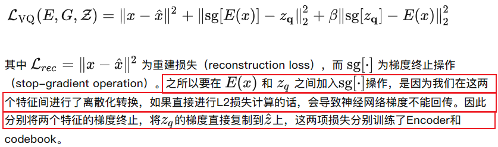
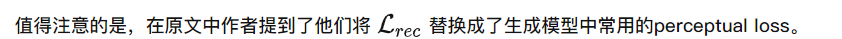
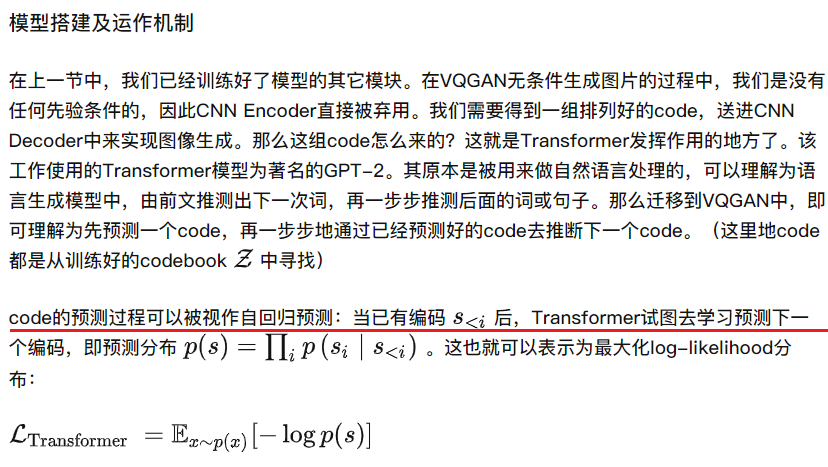

# VQ_GAN

[toc]

<!-- ## motivation

Transformer 架构不包含交互局部性的内置归纳先验，因此可以自由学习其输入之间的复杂关系。然而，这也意味着他必须学习所有关系，而CNN的设计目的是利用“局部之间具备更大的联系”这一先验知识。故而Transformer很昂贵，此外对于长序列（eg high-resolution images）不可行（计算复杂度与输入成二次方增加）。

于是作者思考，能否有效地编码归纳图像偏差，同时保留Transformer的灵活性？
作者提出将CNN的偏置与Transformer的表现力结合。

作者使用卷积的方法学习context-rich的视觉部分的codebook，然后学一个全局composition。

## Approch

  

相对于普通的图像生成模型，VQGAN的突出点在于其**使用codebook来离散编码模型中间特征**，并且**使用Transformer（GPT-2模型）作为编码生成工具**。

codebook的思想在VQVAE中已经提出，而VQGAN的整体架构大致是将VQVAE的编码生成器从pixelCNN换成了Transformer，并且在训练过程中使用PatchGAN的判别器加入对抗损失。以下两节将更详细介绍codebook和Transformer两部分的运作机制。

### 离散编码特征

自编码器（AutoEncoder）类型中，在VQVAE中提出的离散编码方式中，编码出来的每一维特征都是离散的数值，这样做符合一些自然界的模态。将特征离散化的关键就是VQ, 即vector quatization。

  

==训练方法：==
在训练（图像重建）过程中，模型将进行训练使得x与 $\hat{x}$ 尽可能接近。这么一来，模型除Transformer之外的部分就都已经搭建好了，这里已经包括了CNN编码器$E$，CNN解码器$G$，以及Codebook $\mathcal{Z}$ .因此，就需要同时训练这三个子模块。这个训练过程中，**自监督损失**如下:

  

  

  

> 训练D使$max\ logD(x)$，使判别器D尽可能正确
> 训练G使$min\ log(1-D(G(z)))$，使生成器G生成的图片的尽可能地不被D判别出来，即使判别器D尽可能犯错；z为随机噪声；此处的$\hat{x}$是重建之后的图片（$\hat{x} = G(z_q) = G(q(E(x)))$）
> 判别器的目的是尽可能地分开数据，生成器的目的是尽可能分不开数据，直到达到纳什均衡

==合并==
  
当两项损失组合在一起，我们获得了VQ的离散能力，GAN的丰富表达能力和自动编码器的编码能力，这使得我们更厉害。

### Transformer自回归式生成

CNN更多地是关注到局部特征，计算量也相对小；而Transformer则采用长距离注意力，拥有着全局感受野。在本文提出的VQGAN中，**Transformer则是被用来作为code生成器来使用**，以此来生成出超高分辨率的图像。

  

  

### 总结

两阶段：
训练一个VQVAE模型：
先随机化一个codebook，给一个x，encoder为$\hat{z}$，然后从开始随机的codebook中得到最近的$z_q$，然后decoder为$\hat{x}$；

训练一个Transformer来学习第一步中的离散编码向量序列间的关系：
无条件生成应该是从codebook中先随机采样一个点，然后根据Transformer（GPT2）自回归地生成后续的点，然后去decoder出图片。

<!-- Related:
[知乎](https://zhuanlan.zhihu.com/p/515214329) -->

这篇文章的标题叫驯化transformer来生成高解析度图像。我们知道**图像的序列长度远比自然语言高**。自然语言模型往往将生成序列的长度控制在1024或512内，**但如果将自然语言模型里的transformer用来自回归式逐位生成像素的话，1024的长度只能生成32*32大小的图像**。并且，attention的计算复杂度是随着序列长度的增长以平方级增长的，这样就限制了能生成图像的大小。虽然相比于CNN，**transformer并不对输入进行任何先验的假设**（例如平移不变性，局部性等）并且**因此能够很好地拟合输入间复杂的关系**，但这种普适泛化性也意味着你**需要更充足的训练和更广泛的搜索范围**。

那么有没有办法既兼具CNN的先验偏置，又兼具transformer建模序列的泛化性？
这篇文章主要在探讨如何解决这个问题。作者提出了以下洞见：**CNN的归纳偏置可以很好地概括图像的底层结构特性**（例如它的局部性），**但这种偏置对于语义层面（即图像的整体理解，全局把握）的建模用处不大**。

**（A）训练**
所以作者提出了一种CNN+GAN+Transformer的结构来生成高精度图像。
具体来说分为两个步骤：
**（1）训练stage1**
图片x经过encoder(CNN)编码得到$\hat{z}$，和codebook对照量化为$z_q$，通过generator/decoder(CNN)将$z_q$生成为重构图，送入Discriminator判断，在VQ-VAE的基础上引入了GAN loss.
> ==Discriminator只在stage1训练和使用==
> 第一项为感知损失perceptual loss

  

**（2）训练stage2**
将encoder, decoder(generator), codebook固定，在训练一个Transformer（GPT-2）来学习第一步里的离散编码向量序列间的关系。

**（B）推理**
丢掉Encoder，从codebook中采样一个初始码字，输入Transformer（单向的GPT-2）预测下一个码字，而后再预测下一个码字，以此类推。Transformer得到的Zq输入Decoder生图，即可生成随机的新图。

  

  

  

  

[知乎](https://zhuanlan.zhihu.com/p/572156692)
