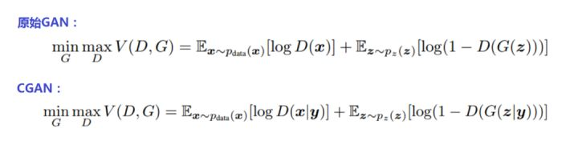
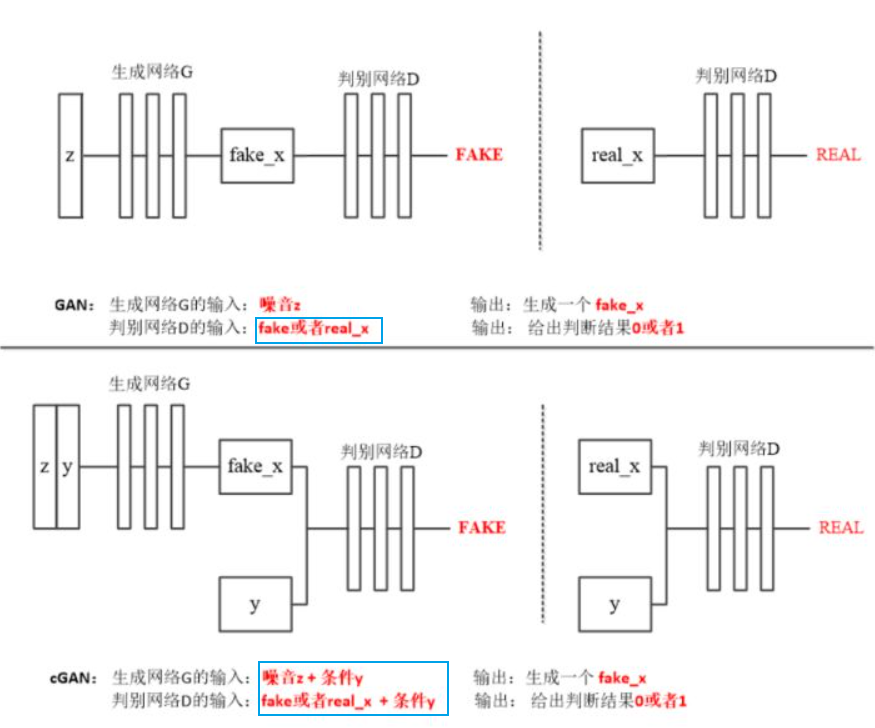
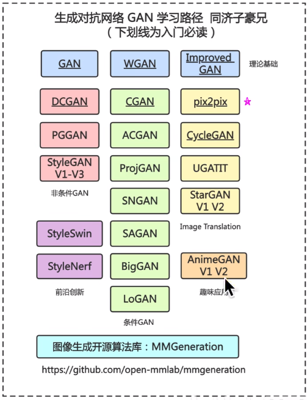
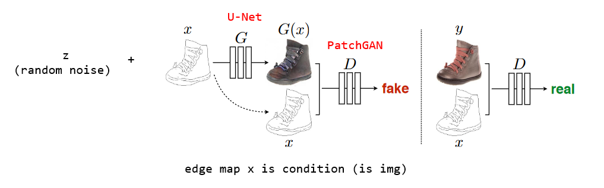
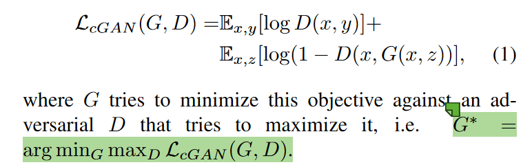
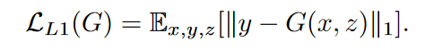
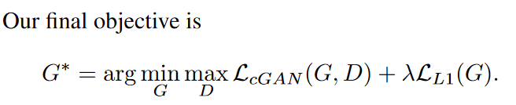
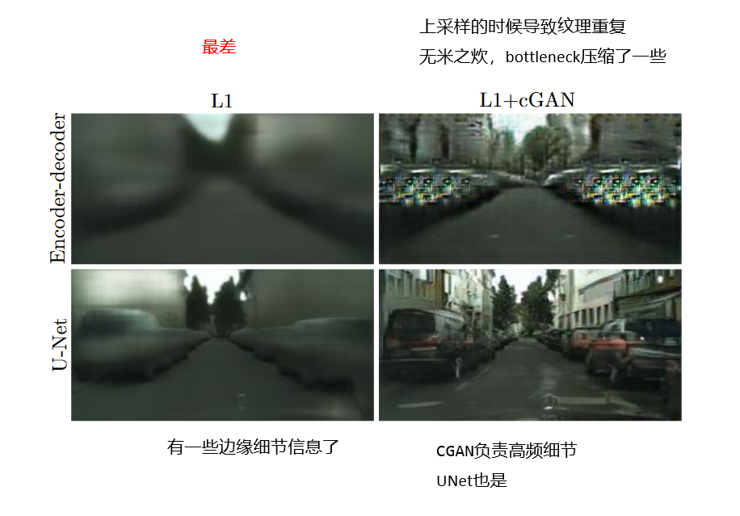

# pix2pix

## 补充

### CGAN

Conditional GAN是style transfer的精神始祖。

给GAN“加按钮”的方法竟然如此简单粗暴，要做仅仅就是“把按钮加上去”——训练时将控制生成类别的标签连同噪声一起送进生成器的输入端，这样在预测时，生成器就会同样根据输入的标签生成指定类别的图片了。判别器的处理也是一样，仅仅在输入加上类别标签就可以了。

原理也是十分简单，我们知道GAN要干的就是拟合数据的概率分布，而CGAN拟合的就是条件下的概率分布。

  

原始GAN的优化目标是在判别器最大化真实数据与生成数据差异的情况下，最小化这个差距，以训练生成器，能够将输入的正态分布的随机噪声z尽可能完美的映射为训练集数据的概率分布。

而上面CGAN公式中的条件y就是咱给GAN装的“钮”。加上了这个条件按钮，GAN优化的概率期望分布公式就变成了CGAN优化的条件概率期望分布公式。即CGAN优化的目标是：在条件Y下，在判别器最大化真实数据与生成数据差异的情况下，最小化这个差距。训练CGAN的生成器时要同时送入随机噪声z和和条件y。就是这么简单！

  

## 正文

paper: Image-to-Image Translation with Conditional Adversarial Nets (CVPR2017)

learning path
  

类似于自动语言翻译，我们将自动image-to-image translation定义为在给定足够的训练数据的情况下，将场景的一种可能表示形式转换为另一种表示形式的任务。
在pix2pix之前，传统上，每一个任务都是用单独的专用模型进行分别处理，而pix2pix提出了一个通用框架。

此前，CNN扛大旗作为DL中的牛马（workhorse），但我们需要告诉CNN它需要最小化的目标是什么，比如去拟合L2距离，L2距离会导致结果模糊（ContextEncoder论文中指出）。简而言之，CNN往往需要一些专家先验知识去搞一个具体的优化目标。

那我们能不能训练一个更高层次的目标——“和真实图像不可区分”，那么GAN出来了。GAN的生成器会自动生成可以误导判别器的图像，生成的图片就不模糊了（模糊的图很容易判别出来）；而且GAN能够自适应地学到数据的分布。

cGANs是指不管是生成器还是判别器，要输入一张图片作为条件，然后去生成和这张图片对应的一张图像。原始的CGAN论文中使用输入去控制输出的类别，即这个condition是指一个数字，而在image-to-image translation任务中这个condition变成了一个image，根据此image去生成一张对应的image，使得生成的图像既像真鞋，又和输入图像对应。

## related work

过去的image-to-image translation被认做事逐像素的分类或者回归，即假设像素之间条件独立，然而并非如此。

conditional GAN学到的是一个**structured loss**，认为像素与像素之间是有关的。

本文生成器用的是U-Net，判别器用的是卷积的PatchGAN分类器（在image上的小patch(e.g. 8x8)上去判别是不是real-image，这样细节更好）。

## method

对抗损失：
  
L1距离：鼓励生成图像与输入图像在像素上接近（受ContextEncoder启发）
  

综合loss：
  

### Generator

用的U-Net，skip-connection可以很好地传递细粒度的信息。（因为bottleneck层使信息丢失）

### Discriminator

使用的是PatchGAN，作者叫这个判别器为Markovian Discriminator（马尔科夫判别器），patch之间是相互独立的，把每个小图快当做单张图像，符合马尔科夫假设。
> 马尔科夫假设是指状态之间是相互独立的，在已知目前状态（现在）的条件下，它未来的演变（将来）不依赖于它以往的演变 (过去)。
> 此处马尔科夫随机场：假设两个像素的距离足够远，超过一个patch的直径，便可以假设这两个像素是独立无关的。

一般来说，高频信息（边缘、噪声、细节）难以捕捉到，低频信息（概貌、轮廓）更统一捕获到。
此处，让判别器捕捉高频信息（初衷），L1损失函数捕捉低频信息。

如何用Discriminator捕获高频信息？
用局部小图块的尺度进行判别，即PatchGAN，把图分作NxN的patch，然后对每个patch进行二分类判定。然后加起来做平均得到最终的结果。当N比较大，patch比较小的时候，patchGAN的参数更少，运行更快。
PatchGAN可以对每个小块的纹理和颜色判别真伪。

## 实验

  

reference:
[CGAN](https://zhuanlan.zhihu.com/p/302720602)
[pix2pix](https://www.bilibili.com/video/BV1wY4y1k7Tc/?spm_id_from=333.337.search-card.all.click)
