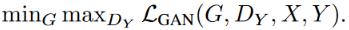

# CycleGAN

[toc]

## 重点

- 可以不用paired data，使用unpaird data from two set/domain
- generator的输入不是传统中GAN中的random noise，而是img from one domain，然后translate to another domain
- 有两个Generator:G,F和两个Discriminator:DY,DX，DY用于判别G(x)和y的真伪

各模型输入输出总结：
  

## Abstract

img-to-img translation任务的目标：使用aligned image pairs去训练学习输入图片到输出图片之间的映射
问题：很多任务没有paired training data
本文：**无需paired img**，学习去translate an img from source domain X to target domain Y

本文的目标是学习一个映射G: X->Y 使得G(X)和Y难以区分
由于这个mapping is **highly under-constrained(高度欠约束)**，所以本文将它与其逆映射F: Y->X进行couple耦合，并引入cycle consistency loss(循环一致性)来强制执行F(G(X)) ≈ X，反之亦然

## Introduction

  

虽然我们缺乏paired img的监督，但是我们可以使用supervision at the level of sets
**来自两个域(集合)的数据是相互独立的，不一定需要成对出现**

## Method

### Adversarial Loss

原始GAN中的loss
  
原始GAN中x是真实图片，z是random noise，G(z)是生成的图片，要求与x无法区分，始终在一个域X内。

CycleGAN中有两个Generator:G,F ，两个Discriminator: DY,DX；
下面以G和DY为例（DY去判别生成的G(x)和Y的真伪）：
**==CycleGAN中生成器G的输入不再是噪声z，而是域X(斑马)中的图片x==，生成器G的目标是使其生成的样本G(x) (伪造马)和域Y (马)中的样本尽可能相似；判别器的输入是域Y中的img y (真马)，或者伪造的G(x) (伪造马)，要求区分开来**
  
  
**对于生成器F和判别器DX，原理类似**：F输入y输出F(y)；DX输入域X中的img x，或者伪造的F(y)
> y是域Y中的real sample，x是域X中的real samp

### Cycle Consistency Loss

尽管上述的对抗性损失能够让生成器G和生成器F学习到域Y和域X的分布，能够让生成的图像更加真实，但它不能保证能生成我们想要的图像，没有保证从x得到G(x)时图像的内容不变，**因为G(x)只需要符合域Y分布即可**，并没有对其施加约束，所以x到G(x)包含很多种可能的映射。
> 在训练中经常会碰到这样一种情况，通过x得到的fake y，会越来越倾向于成为一个能骗得过判别器的值，生成器会慢慢发现，不管送进来的x是什么样，只要我生成的图越像y，就越能骗过判别器，因此只要生成跟y一样的图就好了。但这样的y是我们不想要的，**我们希望保留x中content的成分，只去改变里面style**。因此，设计了这个循环一致性损失。

因此，单独的对抗性损失不能保证学习到的函数可以将单个输入 xi 映射到期望的输出 yi。为了进一步减少可能映射函数的空间，我们认为映射函数应该cycle-consistent

  
> 两个Generator:G,F ，两个Discriminator: DX,DY

b图中，要求符合**forward cycle consistency:**  $x\rightarrow G(x)\rightarrow F(G(x)) \approx x$

c图中，要求符合**backward cycle consistency:**  $y\rightarrow F(y)\rightarrow G(F(y)) \approx y$

文章使用cycle consistency loss去激励incentiveze这一行为:

  

### Full Objective

  

  

模型可以看做是两个autoencoder，i.e. X->X和Y->Y; 然而这些autoencoder渔鸥特殊的内部结构：通过中间表示将图像映射到自身，**中间表示是将图像转换到另一个域**（而常见autoencoder一般是压缩似的中间表示）

### Identity loss [optional]

文中在painting->photo中引入一个额外的identity loss去鼓励保留输入和输出之间的颜色映射关系
  

  

> 生成器G用来生成y风格图像，那么把y送入G，应该仍然生成y，只有这样才能证明G具有生成y风格的能力。因此G(y)和y应该尽可能接近。根据论文中的解释，如果不加该loss，那么生成器可能会自主地修改图像的色调，使得整体的颜色产生变化。如图2所示。

## Architecture

  
  

## thinking

照这个思路的话
去噪图片的data：
a set of clean img
a set of noisy img
imgs from diff sets are independent
