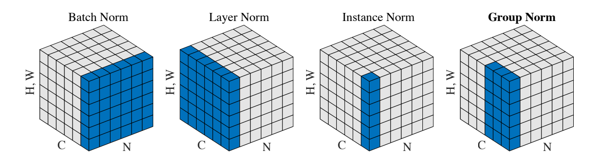
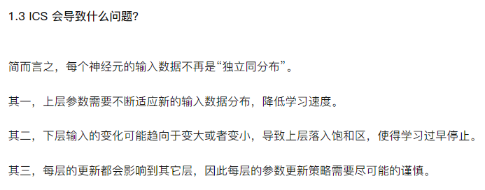
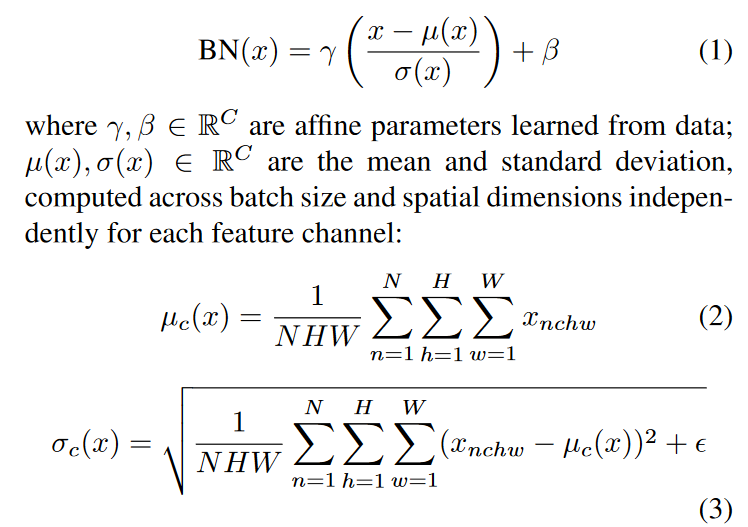
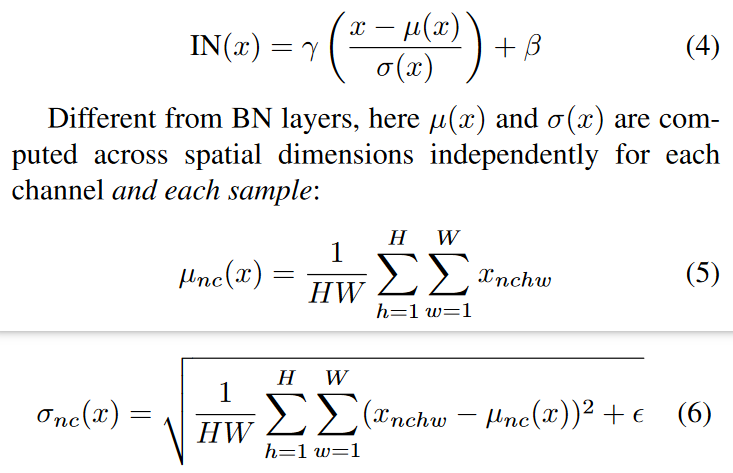
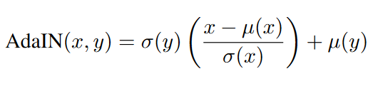
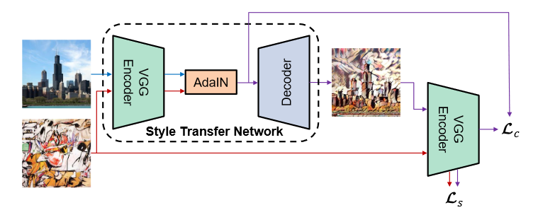

# Adain

Adain is a machine learning model that transforms the style of an image.

Adain将content img特征的均值和方差对齐到style img的均值和方差

## Batch Normal

  

深度神经网络模型的训练为什么会很困难？其中一个重要的原因是，深度神经网络涉及到很多层的叠加，而每一层的参数更新会导致上层的输入数据分布发生变化，通过层层叠加，高层的输入分布变化会非常剧烈，这就使得高层需要不断去重新适应底层的参数更新。

Google 将这一现象总结为 Internal Covariate Shift，简称 ICS.

> 由于高层的网络梯度更新的比较快，底层的更新的慢，当底部更新的时候，高层又得重新学

通过BN可以对一个batch的数据特征进行归一化，使特征符合均值为0方差为1的分布  

BN归一化每个channel的均值和方差

  

## Instance Norm

for each channel and each sample

Ulyanov等发现，将BN替换为Instance Normalization（IN），可以提升风格迁移的性能。IN的操作跟BN类似，就是范围从一个batch变成了一个instance，计算公式如下：
  

## Adaptive Instance Norm(AdaIN)

AdaIN接受一个content input(x), style input(y)，然后simply aligns the channel-wise mean and variance of x to match those of y.
> Unlike BN, IN, AdaIN has no learnable affine parameters.

  

式子可以理解为，先去风格化（减去自身均值再除以自身标准差），再风格化到style image的风格（乘style image的标准差再加均值）(simply scale the normalized content input with $\sigma(y)$, and shift it with $\mu(y)$)

  

训练时，先用VGG提取content image和style image的特征，然后在AdaIN模块进行上式的操作，然后用于VGG对称的Decoder网络将特征还原为图像，然后将还原的图像再输入到VGG提取特征，计算content loss和style loss

> - content loss 是VGG16第四层的L2距离
> 需要注意的是 Content loss和之前paper定义的有所不同，如图所示，用的是经过AdaIN变换过的feature map计算L2 loss，而非encoder的输出。
> - 前人的style loss 是前四层的feature map的Gram Matrix，本文应该不是，本文基于“风格与均值和方差相关”的假设，通过二者的均值、方差的L2距离来衡量Style loss
> - VGG固定不动，训练的目的是得到一个牛逼的Decoder