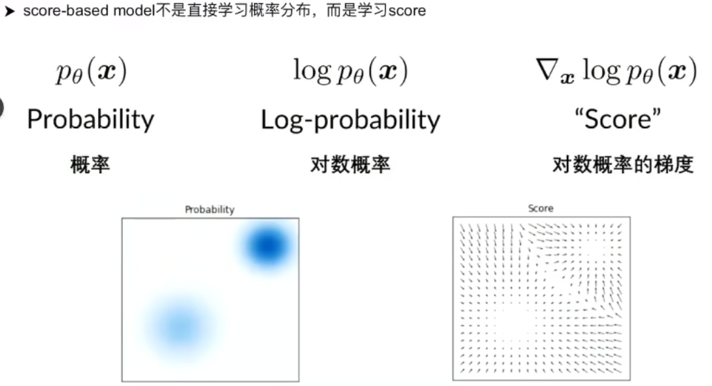
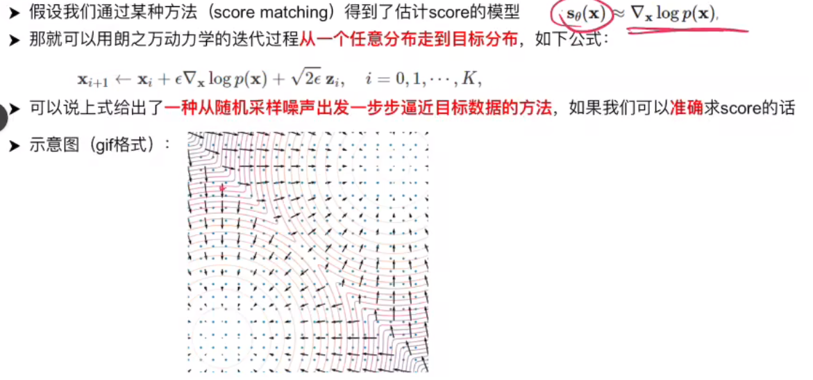
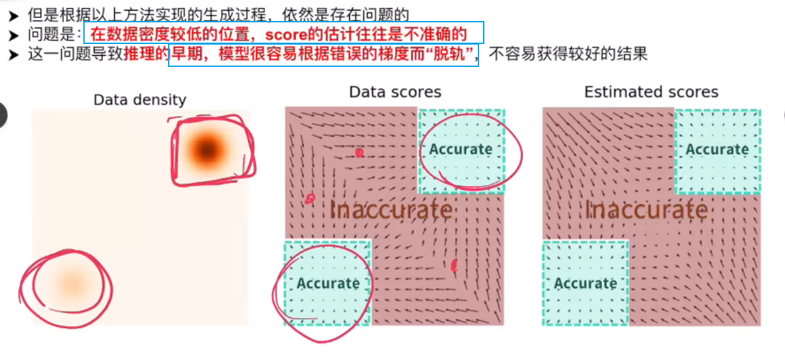
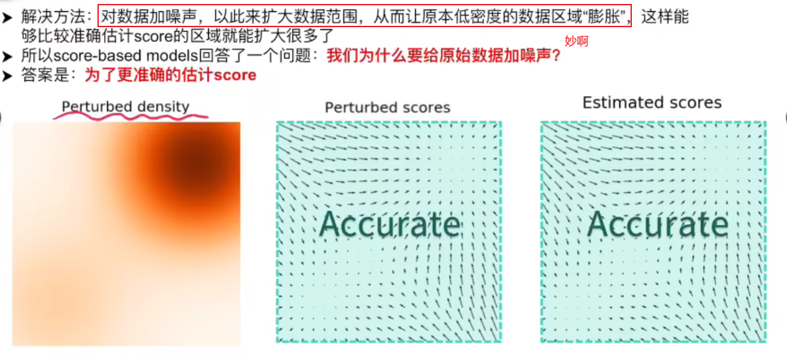
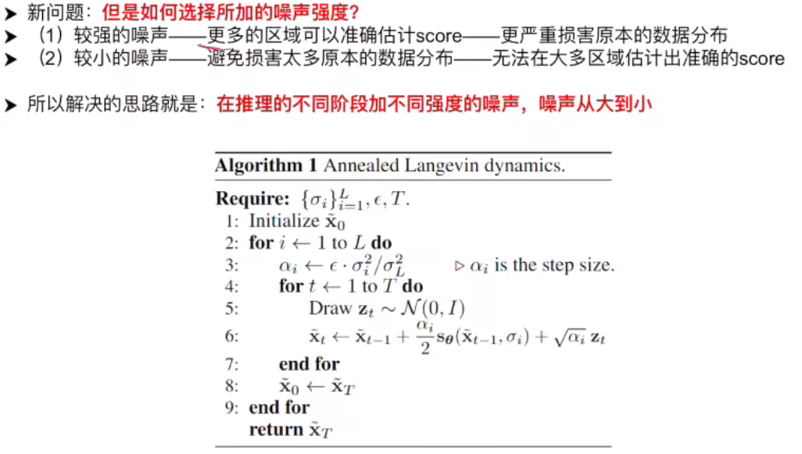
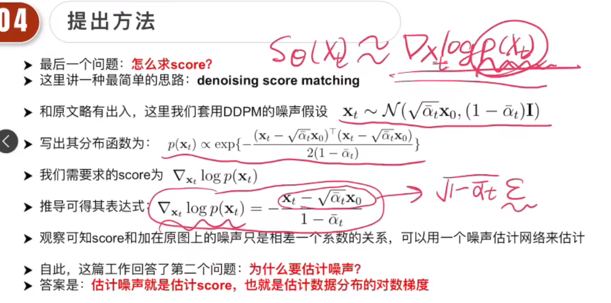

# Score-based model

paper: Generative Modeling by Estimating Gradients of the Data Distribution

核心：

1. 什么是score？
2. 为何要给数据加噪声？
   1. 是为了更准确地求score，因为在低密度的数据范围内score的估计是不准的。
3. 为什么要估计噪声？
   1. 因为估计噪声等价于估计score，估计score也就是估计数据分布的对数梯度。拿到了梯度就可以慢慢走到目标数据范围，完成采样生成。

---

score是指对数概率的梯度
  
传统的生成模型会去学习一个概率分布$p_{\theta}(x)$，如左下角图片所示，颜色越深，概率密度越大。

score的示意图由右下角所示，梯度是一个个方向，指向数据密度高的位置。我们按照梯度所指方向行走，便能走到密度最大的地方，便可生成想要的结果。

  

  

  

==但是加噪的同时又改变了原始数据分布==

所以这里面就有一个权衡：

  
在推理早期的时候可以加很大的噪声，因为此时距离我们的目标数据分布比较远，只有加大噪声才可以在当前位置估计出准确的score(梯度方向)，到推理的中后期可以加较小的梯度，因为此时距离我们的目标分布很近，需要用小噪声保证我们到达更加准确的数据分布位置

算法中，第一个for循环代表又L个级别，在每个级别内步长$\alpha_i$和**噪声的强度**$\sigma_i$，然后在每个级别中会采样大T步。如果T为1，就类似于采样L步，这和ddpm采样是很类似的。

所以score-based model或者DDPM都是要训练一个网络估计出所加的噪声。

---

==score-based 与 DDPM==

DDPM中为何要在原始图片中加噪？
因为要更准确地估计score。

DDPM为什么仅仅是train了一个去噪模型就可以达到一个生成效果？
因为估计噪声等价于估计score，等价于估计梯度。

[reference link](https://www.bilibili.com/video/BV1VP411u71p/?spm_id_from=333.999.0.0&vd_source=31f382886b368673a25ce3ff23e82bfc)
