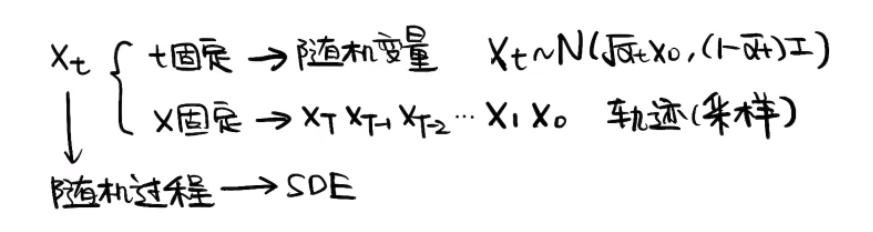
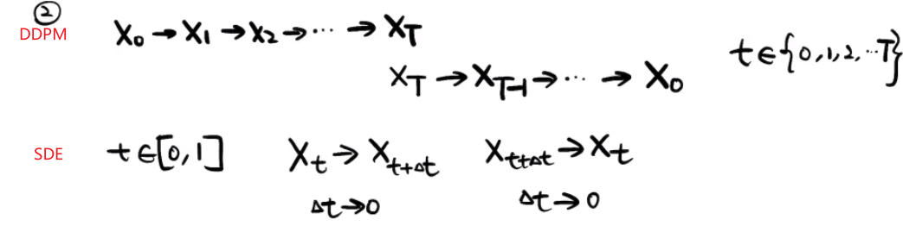
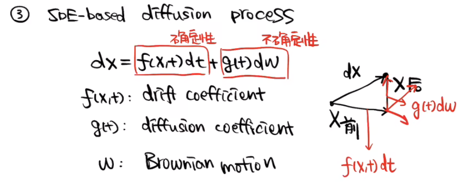
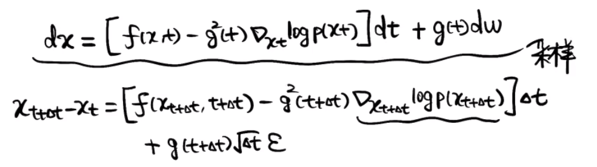

# SDE

paper: SDEdit: Guided Image Synthesis and Editing with Stochastic Differential Equations(ICLR'21)

> 被称作是diffusion model发展中最重要的工作

SDE利用随机微分方程将DDPM类和score-based model进行了统一。

1.为何要用SDE描述扩散模型？
因为扩散模型的研究对象x_t是一个随机过程，然后可以用随机微分方程描述一个随机过程。

> xt是关于x和t的函数
> 对于xt而言，当t固定的时候，可以将xt视作一个随机变量，满足某高斯分布。当所有的x固定的话，我们就有了这个采样轨迹。

2.SDE从离散到连续（更加一般）
  

3.基于SDE的扩散过程(SDE-based diffusion process)
扩散过程是一个确定性过程(漂移系数)+不确定性过程(dw是一个不确定性噪声扰动，g(t)是扰动强度)

  

4.重建过程
  
关键还是求score

