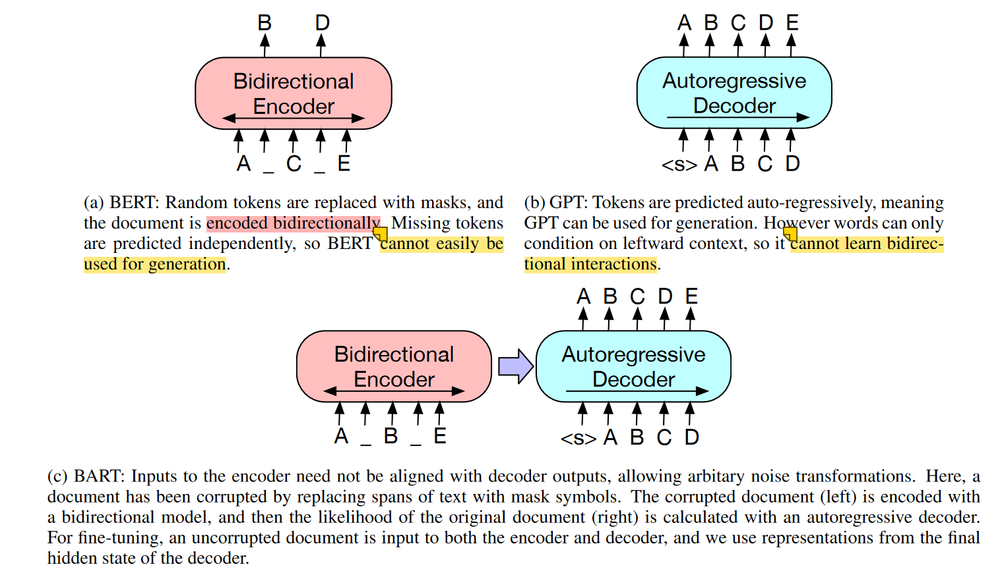
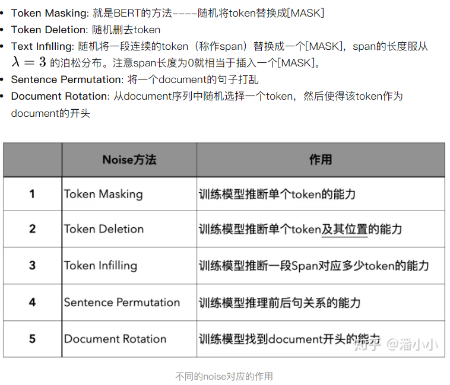

# BART

BART: Denoising Sequence-to-Sequence Pre-training for Natural Language Generation, Translation, and Comprehension

Bidirectional and Auto-Regressive Transformers

==first==

BERT + GPT结合体
也即encoder + decoder

  

BART是一个encoder-decoder的结构，其encoder端的输入是加了噪音的序列，decoder端的输入是right-shifted的序列，decoder端的目标是原序列。模型设计的目的很明确，就是在利用encoder端的双向建模能力的同时，保留自回归的特性，以适用于生成任务

==second==

相对于BERT中单一的noise类型(只有简单地用[MASK] token进行替换这一种noise)，BART在encoder端尝试了多种noise
  
