# Note

[toc]

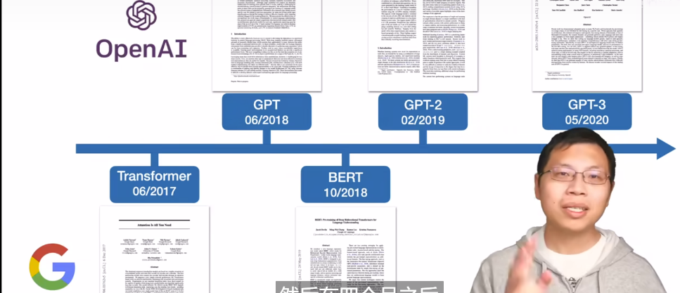  

$Related Work$

$feature-based$：代表作$ELMo$：用了双向的信息，但是网络架构用的是传统的$RNN$
$fine-tuning$：代表作$GPT$：用的是新的$Transformer$架构，但只能处理单向信息，从左到右，有局限性。

$BERT$用的是带掩码的语言模型（$MLM$），可左右一块看，类似完形填空（$cloze\ task$）（单向是预测未来），这就允许训练**很深的双向**语言模型。

**Bert证实在没标号的大量的训练数据上训练得到的模型要好于有标号的少量的训练数据上训练得到的模型。同样的思路现在被用于CV。**

transformer训练的时候输入的是一个**序列对**（如翻译的中英文对，因为**编码器和解码器会分别输入一个序列**，一个中文一个英文）
而BERT既可以输入单个句子又可以输入两个并在一块的句子（序列对），因为**BERT只有一个编码器**。
BERT输入是词元本身的嵌入+属于哪个句子的嵌入+句子序列中位置的嵌入，Transformer中位置信息是手动构造出来的矩阵，但BERT中不管哪条句子、句子的哪个位置对应的向量表示都是通过学习得来

---

BERT整体是一个自编码语言模型（Autoencoder LM），并且其设计了两个任务来预训练该模型。

- 第一个任务是$Mask\ LM$
- 第二个任务$Next\ Sentence\ Prediction$

BERT 相较于原来的 RNN、LSTM **可以做到并发执行**，**同时提取词在句子中的关系特征，并且能在多个不同层次提取关系特征，进而更全面反映句子语义**。
缺点：模型参数太多，而且模型太大，少量数据训练时，**容易过拟合**。

## BERT怎么使用Transformer的

BERT 只使用了 Transformer 的 **Encoder** 模块，原论文中，作者分别用 12 层和 24 层 Transformer Encoder 组装了两套 BERT 模型。

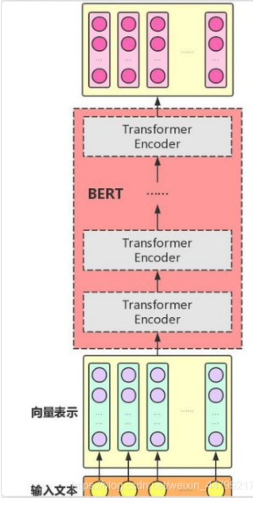  

$需要注意的是，与 Transformer 本身的 Encoder 端相比，BERT 的 Transformer\ Encoder 端输入的向量表示 = Token\ Embeddings + Segment\ Embeddings + Position\ Embeddings$。
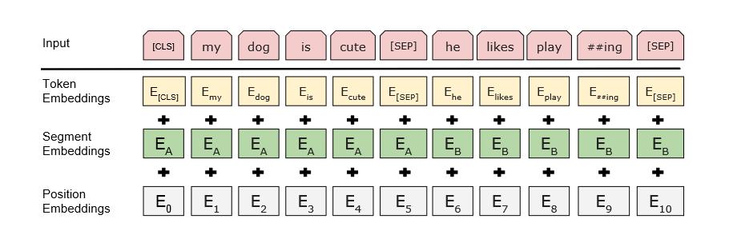  
其中：

- token embeddings: 就是对input中的所有词汇（包括特殊词汇[CLS],[SEP]）都做正常的embedding（如随机初始化，maybe可以word2vec）
- segment embeddings: 对于NSP任务，第一个句子全用0来表示(直到[SEP])，第二个句子全用1表示；（transformer中没有的）
- position embeddings：不同与transformer中的position encoding，**而bert使用的是让模型随机初始化，然后自动学习出来**，比如

Transformer中位置信息是通过正余弦函数手动构造出来的矩阵，但BERT中不管哪条句子、句子的哪个位置对应的向量表示都是通过学习得来
> Transformer的输入: word embedding + positional encoding(正余弦相对编码)

## BERT是如何训练的

### Mask LM任务

给定一句话，随机抹去这句话中的一个或几个词，然后用一个特殊的符号[MASK]来代替它们，要求根据剩余词汇预测被抹去的几个词分别是什么，如下图所示。

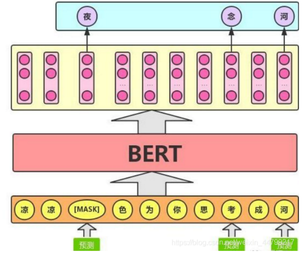  

**策略：**
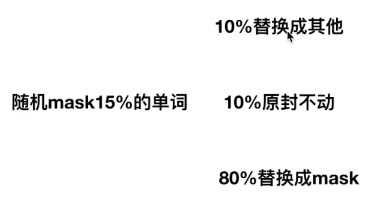  

**源码：**
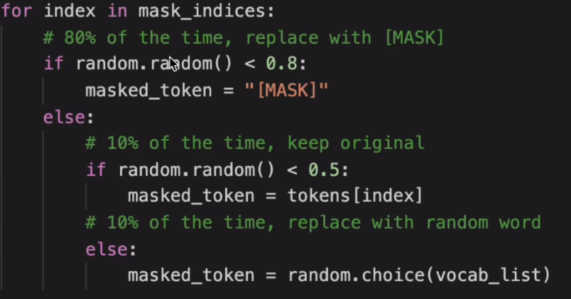  
> mask_indices对应的是15%的单词，tokens是所有的

这么做的主要原因是（uncertain）：在后续微调任务中语句中并不会出现 [MASK] 标记，而且这么做的另一个好处是：预测一个词汇时，模型并不知道输入对应位置的词汇是否为正确的词汇（10% 概率），这就迫使模型更多地依赖于上下文信息去预测词汇，并且赋予了模型一定的纠错能力。上述提到了这样做的一个缺点，其实这样做还有另外一个缺点，就是每批次数据中只有 15% 的标记被预测，这意味着模型可能**需要更多的预训练步骤来收敛**。
**MASK LM的本质是打破文本原有的信息，让模型去从周围文本中学习各种信息，最终达到一个重建的目的**

### Next Sentence Prediction

在双向语言模型的基础上额外增加了一个**句子级别的连续性预测任务**，即预测输入 BERT 的两段文本**是否为连续**的文本，引入这个任务可以更好地让模型学到连续的文本片段之间的关系。
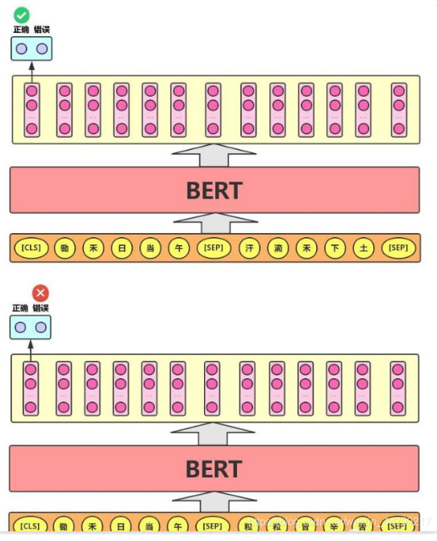  

**NSP样本**如下：

- 从训练语料库中取出两个连续的段落作为正样本（连贯性预测）
- 从**不同的文档中**随机创建一对段落作为负样本（主题预测）

缺点：
主题预测(简单)和连贯性预测合并为一个单项任务
> albert的正负样本都来自于同一个文档，正样本是连续的，负样本是将其颠倒即可

Next Sentence Prediction 任务实际上就是段落重排序的简化版：只考虑两句话，判断是否是一篇文章中的前后句。在实际预训练过程中，文章作者从文本语料库中随机选择 50% 正确语句对和 50% 错误语句对进行训练，与 Masked LM 任务相结合，让模型能够**更准确地刻画语句乃至篇章层面的语义信息**。

本质上来说NSP就是一个二分类任务：就是在句子的开头加一个[CLS]，在训练的时候，将CLS的输出向量接一个二分类器去做一个二分类任务。
> CLS并不代表整个句子的语义信息(二分类任务并非是去编码整个句子的语义信息)

  

**BERT 模型通过对 Masked LM 任务和 Next Sentence Prediction 任务进行联合训练**，==使模型输出的每个字 / 词的向量表示都能尽可能全面、准确地刻画输入文本（单句或语句对）的整体信息，为后续的微调任务提供更好的模型参数初始值==

### BERT的输入输出

**BERT 模型通过查询字向量表将文本中的每个字转换为一维向量，作为模型输入；模型输出则是==输入各字对应的融合全文语义信息后==的向量表示**。
此外，模型输入除了字向量(英文中对应的是 Token Embeddings)，还包含另外两个部分：

- Segment Embeddings：该向量的取值在模型训练过程中自动学习，用于**刻画文本的全局语义信息，并与单字/词的语义信息相融合**
- Position Embeddings：由于出现在文本不同位置的字/词所携带的语义信息存在差异（比如：“我爱你”和“你爱我”），因此，BERT 模型对不同位置的字/词分别附加一个不同的向量以作区分

### BERT，GPT，ELMo的对比

**关于特征提取器:**

- ELMo采用双层双向LSTM进行特征提取, 然后再进行**特征拼接来融合语义信息**.
- GPT和BERT采用Transformer进行特征提取.
  - BERT采用的是**Transformer架构中的Encoder模块**.
  - GPT采用的是**Transformer架构中的Decoder模块**.
- 很多NLP任务表明**Transformer的特征提取能力强于LSTM**, 对于ELMo而言, 采用1层静态token embedding + 2层LSTM, 提取特征的能力有限.

**单/双向语言模型:**

- 只有GPT采用单向语言模型, 而ELMo和BERT都采用双向语言模型.
- ELMo虽然被认为采用了双向语言模型, 但**实际上是左右两个单向语言模型==分别提取特征, 然后进行特征拼接, 这种融合特征的能力比BERT一体化的融合特征方式弱==**.
- BERT的双向语言模型采用Transformer的Encoder模块, Encoder只采用了padding mask, 可以同时看到context before上文信息, 以及context after下文信息.
- GPT的单向语言模型采用了经过修改后的Decoder模块, Decoder采用了look-ahead mask, 只能看到context before上文信息, 未来的信息都被mask掉了.

**BERT, GPT, ELMo各自的优点和缺点**
**ELMo:**
优点:
ELMo根据上下文动态调整word embedding, 可以解决Word2Vec无法解决多义词的问题。
**缺点:**
ELMo使用LSTM提取特征的能力弱于Transformer.
ELMo使用**向量拼接的方式融合上下文特征的能力弱于Transformer**.

**GPT:**
优点:
GPT使用了Transformer提取特征, 使得模型能力大幅提升.
缺点:
GPT只使用了单向Decoder, **无法融合未来的信息**.

GPT可以做自然语言理解任务NLU和自然语言生成任务NLG，而BERT只能NLU，无法直接用于文本生成。

**BERT:**
优点:
BERT使用了双向Transformer提取特征, 使得模型能力大幅提升.
添加了两个预训练任务, MLM + NSP的多任务方式进行模型预训练.
缺点:
**模型过于庞大, 参数量太多, 需要的数据和算力要求过高**, 训练好的模型应用场景要求高.
**更适合用于语言嵌入表达, 语言理解方面的任务, 不适合用于生成式的任务，如机器翻译**

### 如何提升bert下游任务表现

一般做法：

- 获取google 中文bert
- 基于任务数据进行微调

trick：（可提高1-3个点）

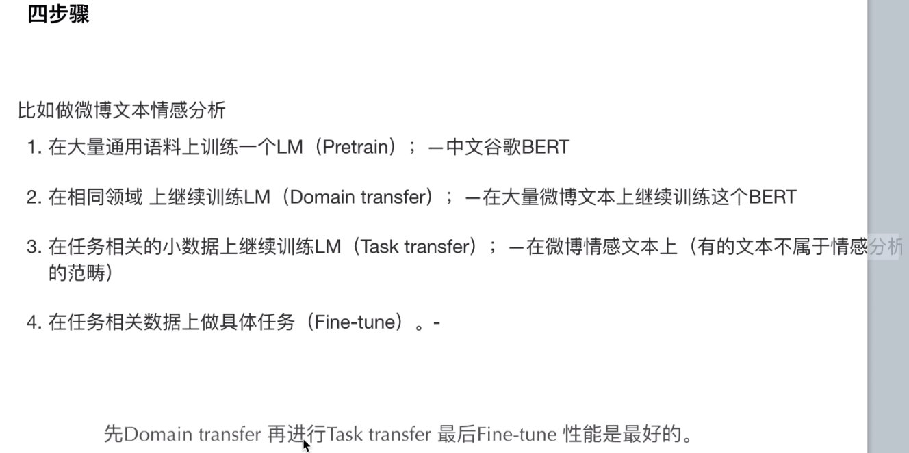  

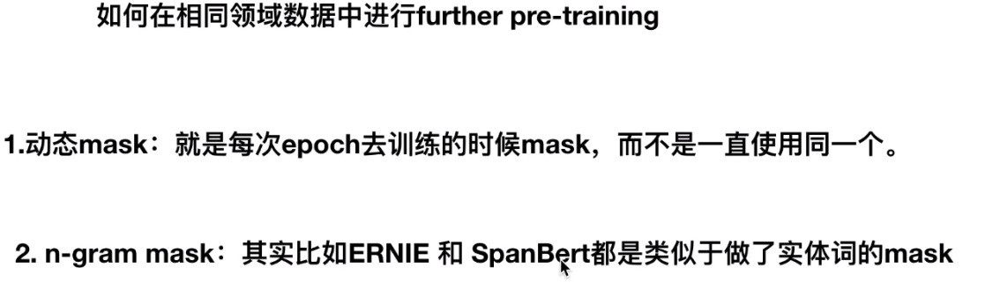  

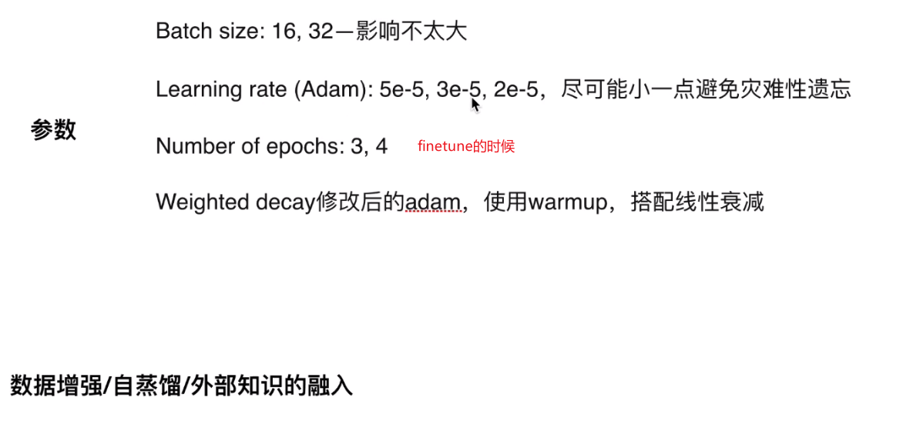  

## 源码实操

输入的三个embedding都是(N, 768)维度(N为token数目)
经过n个encoder之后输出仍然是(N, 768)

然后第一个CLS token对应的输出(1, 768)的输出接到一个二分类(768->2)进行NSP任务；（二分类损失函数）
然后MLM任务：对于MASK这个token对应的768接一个linear层:768->22128(词表大小)，再进行softmax（其中可以计算多分类交叉熵损失）
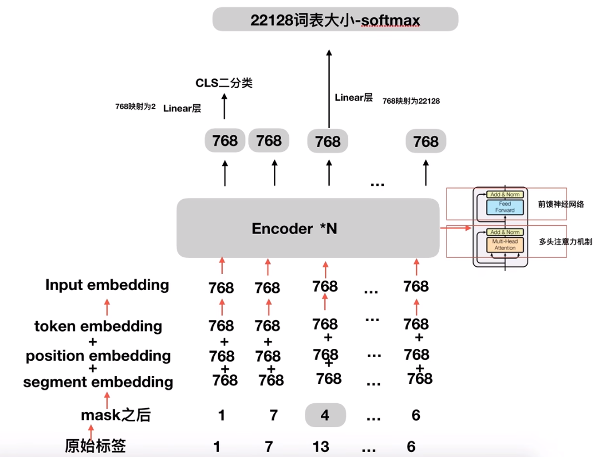  

<!-- 
参考：
[CSDN](https://blog.csdn.net/weixin_44799217/article/details/115374101?ops_request_misc=%257B%2522request%255Fid%2522%253A%2522166614671616800184159320%2522%252C%2522scm%2522%253A%252220140713.130102334..%2522%257D&request_id=166614671616800184159320&biz_id=0&utm_medium=distribute.pc_search_result.none-task-blog-2~all~top_positive~default-2-115374101-null-null.142^v59^js_top,201^v3^control&utm_term=BERT&spm=1018.2226.3001.4187)
[CSDN](https://blog.csdn.net/Decennie/article/details/119793548?ops_request_misc=&request_id=&biz_id=102&utm_term=bert%E5%92%8Celmo%E5%8C%BA%E5%88%AB&utm_medium=distribute.pc_search_result.none-task-blog-2~all~sobaiduweb~default-0-119793548.142^v59^js_top,201^v3^control&spm=1018.2226.3001.4187)
[bilibili](https://www.bilibili.com/video/BV1Ey4y1874y/?p=2&spm_id_from=pageDriver&vd_source=31f382886b368673a25ce3ff23e82bfc) -->
