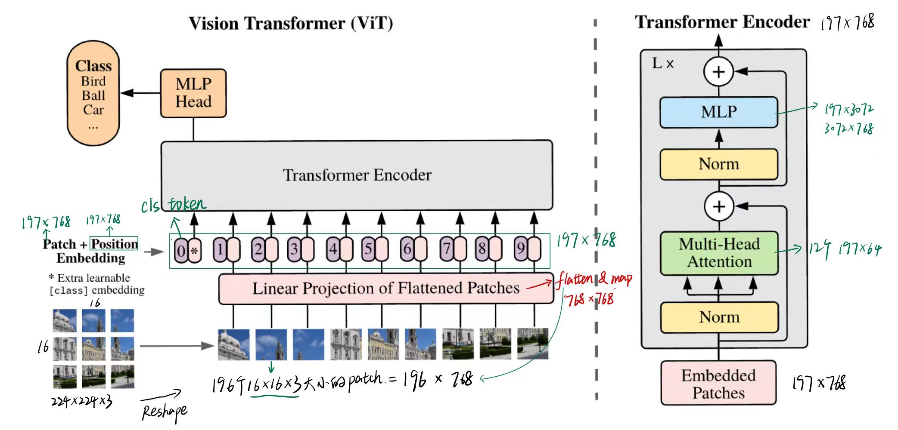
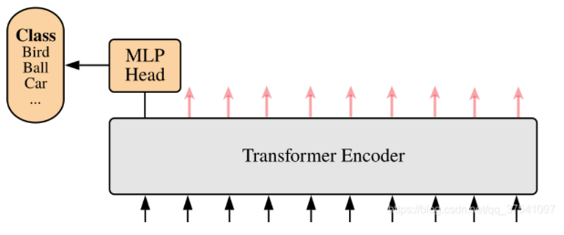
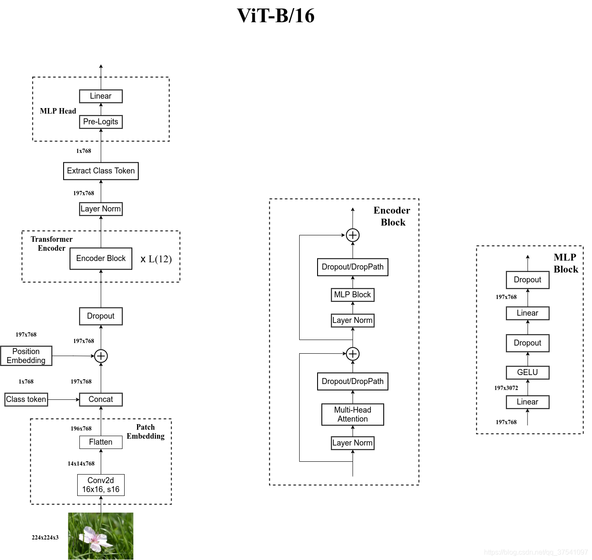

# Note

[toc]

ViT（vision transformer）是Google在2020年提出的直接将transformer应用在**图像分类**的模型，后面很多的工作都是基于ViT进行改进的。
ViT的思路很简单：直接**把图像分成固定大小的patchs，然后通过线性变换得到patch embedding**，这就类比NLP的words和word embedding，由于transformer的输入就是a sequence of token embeddings，所以将图像的patch embeddings送入transformer后就能够进行特征提取从而分类了。
ViT模型原理如下图所示，其实ViT模型**只是用了transformer的Encoder来提取特征**（原始的transformer还有decoder部分，用于实现sequence to sequence，比如机器翻译）。

  

## 讲解

### 优缺点

优点：

- 推翻了CNN在CV届的统治地位
- 打破了CV和NLP之间的壁垒，为多模态的发展奠定了基础

### 前言

由于transformer中自注意力机制是**不同token之间两两进行互动**（计算复杂度是N^2），然后进行加权求和。而当时硬件能支持的序列长度也就几百到上千，那么将2d图像转换为1d序列，最直观的方式是将每个像素点当成是最小元素，一般来说较小的分类任务图片大小是224*224，转成1d为5万多，显然不行，分割啥的更大尺寸更不用说了。

### Embedding层(Linear Projection of Flattened Patches)

flatten the patches and map to D dimensions with a trainable linear projection（flatten & 映射到embedding）

#### Patch Embedding

对于ViT来说，首先要将原始的2-D图像转换成一系列1-D的patch embeddings。
对于图像数据而言，其数据格式为[H, W, C]是三维矩阵明显不是Transformer想要的。所以需要先通过一个Embedding层来对数据做个变换。

本文将224x224的图片分成14x14个大小为16x16 pixel的patch。那么1d序列长度就只有14*14=196个元素，然后将每一个16x16的patch当做一个元素(NLP中的token)，通过一个FC层线性映射成linear embedding（一维向量），然后输入到Transformer中。

以ViT-B/16为例，每个Patche数据**shape为[16, 16, 3]**通过"Linear Projection of Flattened Patches"层的flatten & map得到一个长度为768的向量（后面都直接称为token）。[16, 16, 3] -> [768]。

在**代码实现中，直接通过一个卷积层来实现**。 以ViT-B/16为例，直接使用一个卷积核大小为16x16，步距为16，卷积核个数为768的卷积来实现。通过卷积[224, 224, 3] -> [14, 14, 768]，然后把H以及W两个维度展平即可[14, 14, 768] -> [196, 768]，此时正好变成了一个二维矩阵，正是Transformer想要的。（196个token，每个token长768）

#### Position Embedding

**我们知道自注意力是两两进行交互，所以本身不存在顺序问题**，但图片是一个整体，是有顺序的，若图片颠倒，图片就变了。
transformer和CNN不同，**需要position embedding来编码tokens的位置信息**，这主要是因为self-attention是permutation-invariant（排列不变性），即**打乱sequence里的tokens的顺序并不会改变结果**。**如果不给模型提供patch的位置信息，那么模型就需要通过patchs的语义来学习拼图，这就额外增加了学习成本**

这里的Position Embedding采用的是一个可训练的参数（1D Pos. Emb.），是直接叠加在tokens上的（add），所以shape要一样。以ViT-B/16为例，拼接[class]token后shape是[197, 768]，那么这里的Position Embedding的**shape也是[197, 768]**。

**然后如果就此放入Transformer得到输出，那么这么多输出该拿哪个做最后的分类呢？那么再次借鉴BERT，引入特殊字符class token。**

#### class token

由于所有token两两交互，所以class这个token和其他embedding进行交互的时候能学到有用的信息，从而只需要根据class token的输出进行分类判断即可。

这个[class]token是一个可训练的参数，数据格式和其他token一样都是一个向量，以ViT-B/16为例，就是一个长度为768的向量，与之前从图片中生成的tokens拼接在一起，Cat([1, 768], [196, 768]) -> [**197**, 768]。

### Transformer Encoder

多头注意力机制（MSA）的计算量是和$N^2$成正相关的，所以ViT的输入是patch embeddings，而不是pixel embeddings，这有计算量上的考虑。MSA之后接一个FFN，包括两个FC层，第一层将输入节点个数翻4倍[197, 768] -> [197, 3072]，第二个全连接层会还原回原节点个数。

### MLP Head (最终用于分类的层的结构)

上面通过Transformer Encoder后输出的shape和输入的shape是保持不变的，以ViT-B/16为例，输入的是[197, 768]输出的还是[197, 768]。这里我们只是需要分类的信息，所以我们只需要提取出[class]token生成的对应输出就行（最后一层的输出的第一个位置$Z^0_L$），即[197, 768]中抽取出[class]token对应的[1, 768]。接着我们通过MLP Head得到我们最终的分类结果。MLP Head原论文中说在训练ImageNet21K时是由Linear+tanh激活函数+Linear组成。但是迁移到ImageNet1K上或者你自己的数据上时，只用一个Linear即可。

  

### 完整架构

  

参考：
[CSDN](https://blog.csdn.net/qq_37541097/article/details/118242600?ops_request_misc=%257B%2522request%255Fid%2522%253A%2522166623327316782425119295%2522%252C%2522scm%2522%253A%252220140713.130102334..%2522%257D&request_id=166623327316782425119295&biz_id=0&utm_medium=distribute.pc_search_result.none-task-blog-2~all~top_positive~default-1-118242600-null-null.142^v59^js_top,201^v3^control_2&utm_term=ViT&spm=1018.2226.3001.4187)

---

**ViT用的是有监督的训练方式**。
**我们最初的实验显示自监督预训练的也还不错，但自监督预训练和大规模监督预训练之间仍然存在很大差距。**

用的是Transformer的Encoder模块，和BERT完全一样。

当在没有强正则化的 ImageNet 等中型数据集上进行训练时，这些模型产生的准确度比同等大小的 ResNet 低几个百分点。这种看似令人沮丧的结果可能是意料之中的：
因为ViT缺乏一些归纳偏置（inductive bias）
> CNN的归纳偏置：
> locality（局部性）：假设图片相邻的区域有相邻的特征，非常合理
> translation invariance（平移不变性）：==？？？==

但是在有足够的的数据进行大规模预训练之后，效果是好于归纳偏置了。
undefined
