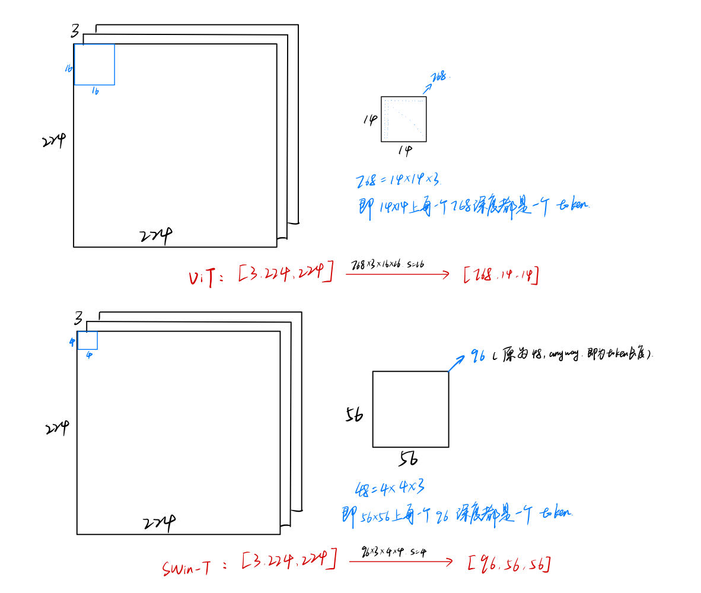

# Note

[toc]

## 解决了什么问题

ViT在视觉领域只能用于分类，而SwinTransformer证明了transformer可作为视觉领域的通用骨干网络（包括分类、检测、分割和视屏等领域）

ViT将图片打成16*16的patch，每个patch自始至终代表的尺寸一样

> 对于检测任务，**多尺度的特征**是非常重要的，比如FPN将多个卷积层出来的特征的感受野是不一样的，能抓住物体不用尺度的特征，能很好地处理物体不同尺度的问题。
> 对于分割任务，UNet对于处理物体不同尺寸的问题，提出了skip connection的方法。

ViT只能用于单一尺寸，不适合处理密集预测型的任务。此外ViT的自注意力始终在整张图上进行，是全局建模，其复杂度是图像的平方倍，复杂度太高。

SwinTransformer在小窗口内计算自注意力，只需保证小窗口大小固定（该窗口内自注意力计算复杂度固定），那复杂度和图像的大小成线性关系。（利用了局部性理论：语义相近的不同物体大概率还是出现在相连的地方）

ST中的Patch Merging类似于池化层，使感受野增大，抓住了多尺度特征

ST在连续的自注意力层之间Shift Windows，使m层中某窗口中的像素在m+1层可能移动到另一个窗口，这样就可以和其他像素进行互动，拥有了更大的感受野

motivation
直接把transformer移至到CV中面临的挑战：

- 尺度不一致的问题
- 图像分辨率太大

## 1. 解释

  

这个图中，我们说ViT==下采样16倍==，下采样的意思是对于一个样值序列间隔16个样值取样一次，有缩小图片的作用。ViT中将224的图片切割为16x16大小，得到14x14个patch，我们用16x16的卷积完成任务，下采样的意思是**整体**图片高宽降低了16倍，下采样后**整体**图片高宽变为14x14，因为我们将左上角16x16大小的小图搞成了1x1.

对于Swin-T中，我们说==开始下采样4倍==，意思是**整体**图片高宽降低了4倍，变成了56x56，因为我们将左上角4x4大小的小图卷积合并成了1x1.

## 2. 框架

  

四个stage，每个stage之后图片尺寸减半，channel翻倍。

### 2.1 patch embedding层

包括patch partition + Linear Embedding

原文操作：将[224,224,3]的图片，patch partition为56x56=3136个patch，shape=[4,4,3]，然后本应flatten为48(4x4x3)，此处flatten为96(一个token的长度)，故而得到[56*56,96]

具体实现：直观上可以直接将image按4x4大小的patch直接切开，分成56x56个patch，但是实际实现是使用4x4的卷积得到56x56个patch

卷积核[96,4,4,stride=4]（直接一步到位96），卷积层输入为[3,224,224]（实际上默认图片按CHW排序）,输出为[96,56,56]，然后flatte后为转置为[56*56,96] 即[num_tokens, token]

  

**结论：**
我们想将图片[3,224,224]划分为56x56个patch[3,4,4]，每个patch作为Transformer的一个token。
卷积中，卷积核大小为[4,4]，它便对应着图片的一个patch，比如上图，将左上角卷积核所在区域三个通道映射到卷积后的56x56特征图的左上角的一个点，通道数为96(48)，也即卷积后的结果，每个点在深度方向上组织成为一个token(3x4x4)(96)

==核心：并非56x56是一个patch，而是每一个位置在深度方向上(48)组成一个patch（token）.==

### 2.2 patch merging

patchMerging和patchEmbed都要进行下采样，开始的patchEmed下采样四倍（通过4*4卷积核卷积的方式），而patchMerging下采样两倍（方式如下图所示——先按窗口按位置取出得到4块，在通道方向上拼接，再通道减半即可）。

patchMerging功能见问题1；

**patch merging** 的作用的下采样，下采样之后高宽减半，channel翻倍；方法：假设特征矩阵高宽4*4，以2x2大小为一个窗口，将窗口中相同位置上的像素取出，得到四个矩阵，然后在深度方向上拼接，然后在channel方向上进行layer norm的处理，然后使用全连接层(1x1卷积)将channel数减半。
  

### 2.3 W-MSA（基于窗口的多头自注意力机制）

普通MSA是对图中每一个像素求QKV，求得的每一个像素的Q要和特征图的每一个像素的K进行匹配。

W-MSA将特征图分成多个windows，在每个window的内部计算MSA，不同window之间没有任何通讯。

目的：减少计算量；详见问题2,3；
缺点：**窗口之间无法进行信息交互**，感受野会变小。故而有了shifted window

### 2.4 SW-MSA（Shifted Window）

目的：实现不同window之间的信息交互；可以融合上一层不同窗口之间的信息。

问题：四个windows变成了九个windows(周围的窗口可padding为方块)，故而计算量又增加了。详见问题4,5；

### 2.5 相对位置偏置 relative position bias

相对于ViT中的绝对位置编码，此处为相对位置编码，

## 3. 问题

### 3.1 如何生成多尺度特征？patch merging的意义是什么？

CNN的多尺度来源于池化操作。池化能够增大每一个卷积核能看到的感受野，使得每次池化后的特征抓住物体的不同尺寸。所以ST提出了类似的操作，patch merging，将相邻的小patch合成一个大patch，这样大patch就能够看到前面四个小patch看到的内容，感受野就增大了，同时抓住了多尺度的特征。将这种多尺度的特征图扔给FPN就可以做检测了，扔给UNet就可以分割了。

### 3.2 为什么要在窗口中做自注意力而非全局？

因为全局自注意力计算会导致与tokens成平方倍的计算复杂度，这不适于处理很多下游任务，尤其是密集预测型的任务（图像分割），或者是非常大尺寸的图片的时候，全局自注意力是非常贵的的。
同一个物体的不同部位或者语义相近的不同物体，还是大概率会出现在相邻的地方，所以即使在一个小范围的local中计算自注意力也是够用的，全局计算自注意力对于CV任务来说是有些浪费资源的。

### 3.3 为什么利用了locality这个inductive bias计算复杂度就从N2变成N了？

假设每个图片有$h\times w$个patches
$$
\Omega(MSA) = 4hwC^2+2(hw)^2C
$$
> 标准多头自注意力机制
> 公式由来见[视频](https://www.bilibili.com/video/BV13L4y1475U?t=2071.7)
> 注意：A(nxm) * B(mxn)的复杂度为O(n x m x n) [矩阵乘法复杂度详见](https://blog.csdn.net/qq_39463175/article/details/111818717?ops_request_misc=&request_id=&biz_id=102&utm_term=%E7%9F%A9%E9%98%B5%E4%B9%98%E6%B3%95%E7%9A%84%E5%A4%8D%E6%9D%82%E5%BA%A6&utm_medium=distribute.pc_search_result.none-task-blog-2~all~sobaiduweb~default-1-111818717.142^v63^control,201^v3^control,213^v2^t3_control1&spm=1018.2226.3001.4187)
> 按照第一层特征图作为示例，56x56x96, h=w=56, Channel=96
> $\Omega(MSA)=4\times 56\times 56\times 96^2 + 2(56\times56)^2\times96\approx 116M+1888M=2004M$

$$
\Omega(W\text{-}MSA)=4hwC^2+2M^2hwC
$$
> 局部的多头自注意力机制
> M=7, 表示窗口中的patch大小
> $\Omega(MSA)=4\times 56\times 56\times 96^2 + 2\times7^2\times56 \times56 \times 96\approx 116M+29M=145M$
> **可见从(hw)^2变为了hw，从N2变为了N**

### 3.4 为何要做shifted window？以及如何做shifted window？

因为基于窗口的self-attention虽然解决了内存和计算量的问题，但窗口和窗口之间无法通信了，就达不到全局建模了，会限制模型的能力。所以得想法方法让窗口和窗口之间互相通信起来。我们先做基于窗口之间的self-attention（W-MSA），然后再做基于移动窗口的self-attention（SW-MSA）。

### 3.5 我们shifted window之后，四个窗口变成了九个窗口，计算复杂度大大增加怎么办？而且shifted之后的窗口大小不一，无法将其打包到一个batch进行计算啊？

shifted window之后，窗口数量从$\lceil{\dfrac{h}{M}}\rceil \times \lceil \dfrac{w}{M}\rceil$变为了$(\lceil{\dfrac{h}{M}}\rceil + 1) \times (\lceil \dfrac{w}{M}\rceil+1)$

作者提出的**高效的批次计算移动后窗口自注意力的方式，通过cyclic shift将9个窗口变为4，然后借助mask机制合理地计算自注意力**：
  

### 3.6 mask如何实现的？

  

比如这张shifted之后的图，我们不希望块36之间计算自注意力，由于向右下移动$(\lfloor\frac{M}{2}\rfloor, \lfloor\frac{M}{2}\rfloor)$，此处移动了3格，所以块3共4行，块6共3行，分别flatten为28，21个向量，然后与其转置计算注意力，得到的矩阵**36和63都是不想要的，33和66是想要的**，故使用绿色的掩码模板。将矩阵和模板相加，很小的数softmax之后变为0。

四个窗口详见下图：
  

讲解详见[视屏](https://www.bilibili.com/video/BV13L4y1475U?t=2729.1)，巨妙！！

  
