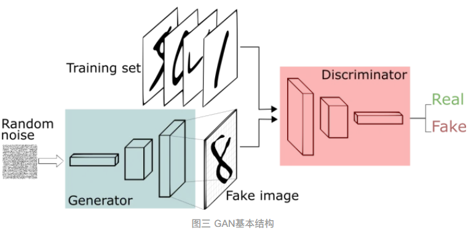
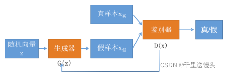
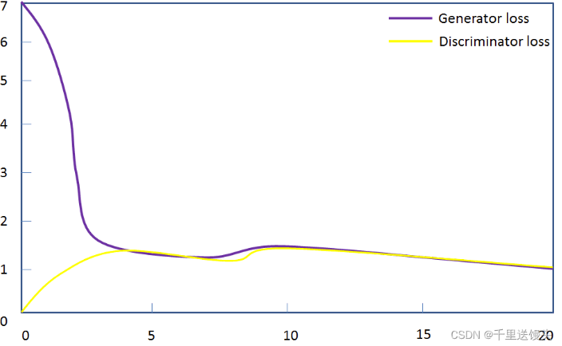
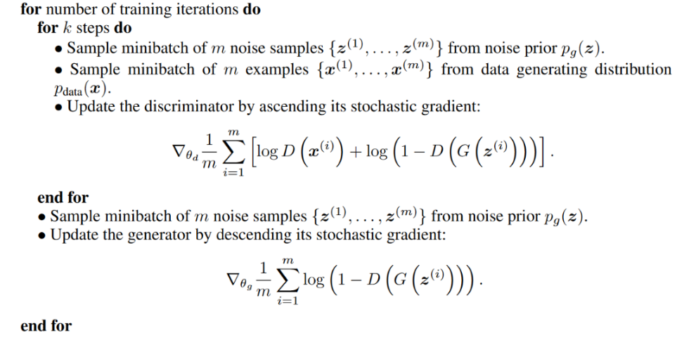
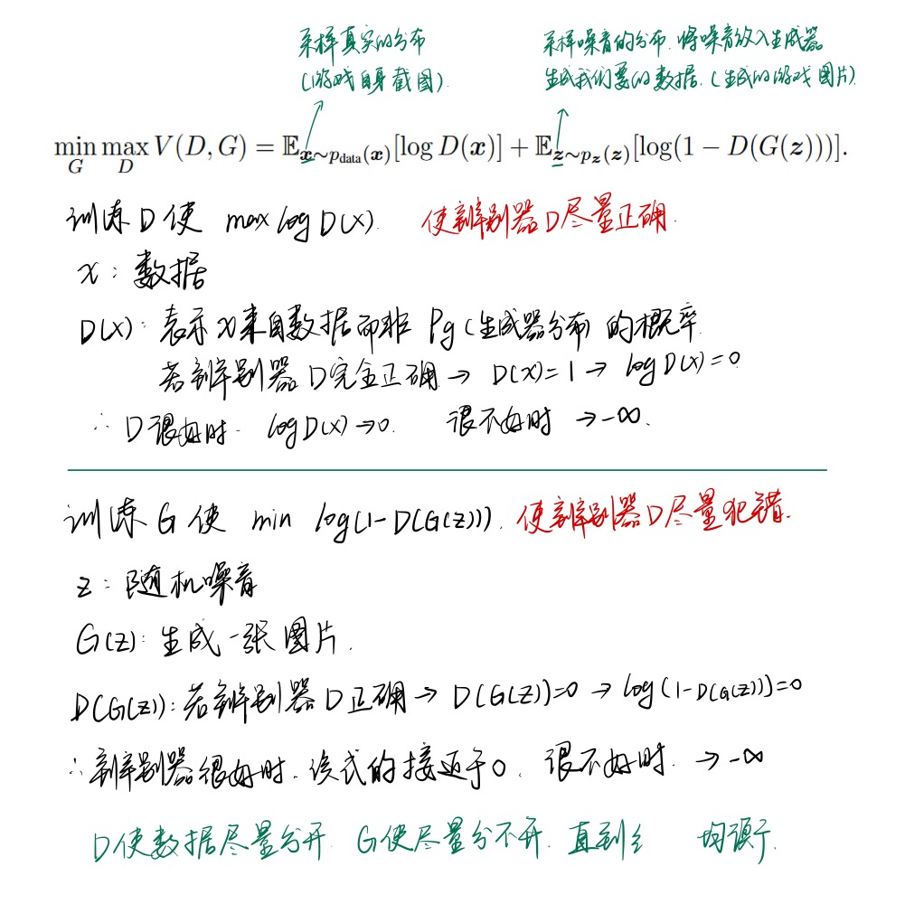
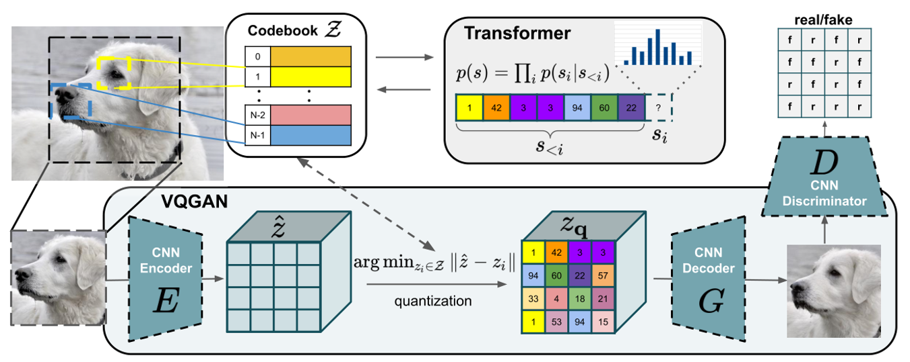

# Note

[toc]

## 背景

### 判别式模型和生成式模型

给定输入x和标签y

**判别式模型 (Discriminative Model)**：直接**对条件概率p(y|x)进行建模**，常见判别模型有：线性回归、决策树、SVM、KNN、神经网络等；

**生成式模型 (Generative Model)**：**对联合分布概率p(x,y)进行建模**，常见生成式模型有：隐马尔可夫模型HMM、朴素贝叶斯模型、高斯混合模型GMM、LDA等；
  

区别：

- 生成式模型更普适；判别式模型更直接，目标性更强
- **生成式模型关注数据是如何产生的，寻找的是数据分布模型**；**判别式模型关注的数据的差异性，寻找的是最优分类面，不能反映数据本身的特性**
- **由生成式模型可以产生判别式模型，但是由判别式模式没法形成生成式模型**
  

生成模型意味着对**输入特征和标签信息**的联合分布进行建模，无监督信息意味着不存在标签，则在无监督生成模型中，是**对输入特征的概率密度函数进行建模**

## 正文

==生成模型可以被认为类似于一个造假者团队，试图制造假币并在不被发现的情况下使用它，而判别模型类似于警察，试图检测区分出假币。
二者不断学习，造假者不断提升造假技能，警察提升辨别能力，直到假货与真品无法区分（造假者胜利）。==

### 基本结构

生成网络（Generator）负责**生成模拟数据，最终目的是“骗过”判别器**，判别网络（Discriminator）负责**判别输入的数据是真实的（来自数据集）还是生成的（来自生成器）**。生成网络要不断优化自己生成的数据让判别网络判断不出来，判别网络也要优化自己让自己判断得更准确。二者关系形成对抗，因此叫对抗网络。

  

  

### 训练方式

#### 整体

如下图二者博弈过程：生成器生成假数据，然后**将生成的假数据和真数据**都输入判别器，判别器要判断出哪些是真的哪些是假的。判别器第一次判别出来的肯定有很大的误差，然后我们**根据误差来优化判别器**。现在判别器水平提高了，生成器生成的数据很难再骗过判别器了，所以我们得**反过来优化生成器**，之后生成器水平提高了，然后反过来继续训练判别器，判别器水平又提高了，再反过来训练生成器，就这样**循环往复，直到达到纳什均衡**。
  

#### 生成器

对于生成器，输入需要一个n维度向量，输出为图片像素大小的图片。因而首先我们需要得到输入的向量。
> 这里的生成器可以是任意可以输出图片的模型，比如最简单的全连接神经网络，又或者是反卷积网络等。

这里**输入的向量我们将其视为携带输出的某些信息**，比如说手写数字为数字几，手写的潦草程度等等。由于这里我们**对于输出数字的具体信息不做要求，只要求其能够最大程度与真实手写数字相似**（能骗过判别器）即可。所以我们使用随机生成的向量来作为输入即可，这里面的随机输入最好是满足常见分布比如均值分布，高斯分布等。

#### 判别器

判别器不用多说，往往是常见的判别器，输入为图片，输出为图片的真伪标签。

#### 训练过程

- 初始化判别器D的参数$\theta_d$和生成器G的参数$\theta_g$。
- 从真实样本中采样m个样本$\{x^1,x^2,...,x^m\}$，从先验分布噪声中采样m个噪声样本$\{z^1, z^2, ...,z^m\}$并通过生成器获取m个生成样本$\{\hat{x}^1,\hat{x}^2,...,\hat{x}^m\}$。**固定生成器G，训练判别器D尽可能好地准确判别出真实样本和生成样本**.
- 循环**k次更新判别器**之后，**使用较小的学习率来更新一次生成器的参数**，**训练生成器使其尽可能能够减小生成样本与真实样本之间的差距**，也相当于尽量使得判别器判别错误。
- 多次更新迭代之后，最终理想情况是使得判别器判别不出样本来自于生成器的输出还是真实的输出。亦即最终样本判别概率均为0.5。

k是一个超参数，不能太小也不能太大。
> **k太大了，也就是判别器上来就训练的很好，警察很厉害，上来就给造价币的一锅端了，那假币工艺就无法改进了。若k太小了，也就是判别器训练的不咋地，也就是警察无力吗，造假者随便造点东西，警察都看不出来，那就没动力去改进我的工艺了。so，最好两方势力相当，相爱相杀（苏美冷战）**

  

#### 损失函数

损失函数(loss function)是用来估量模型的预测值与真实值的不一致程度（即误差）

生成网络的损失函数：$L_G=H(1,D(G(z)))$

> 1. G 代表生成网络，D代表判别网络，H代表交叉熵，**z是输入随机数据**。D(G(z)) 是对生成数据的判断概率，1代表数据绝对真实，0代表数据绝对虚假。H(1,D(G(z))) 代表判断结果与1的距离。显然**生成网络想取得良好的效果，那就要做到，让判别器将生成数据判别为真数据**（即D(G(z))与1的距离越小越好）
> 2. 一般是让损失函数最小 -> 对生成数据的判断概率和1距离越小 -> 将生成数据更多地判别为真数据

判别网络的损失函数：$L_D=H(1,D(x)) + H(0,D(G(z)))$
> **x是真实数据**，这里要注意的是，H(1,D(x))代表真实数据与1的距离，H(0,D(G(z)))代表生成数据与0的距离。显然，识别网络要想取得良好的效果，**就想让真实数据就是真实数据，生成数据就是虚假数据**（即真实数据与1的距离小，生成数据与0的距离小）

生成网络和判别网络损失函数有了，便可基于损失函数利用BP算法和最优化方法（e.g. 梯度下降）对参数进行更新，即不断提升两个网络的性能，最终使生成网络和判别网络达到成熟状态（都学到合理的映射函数）

  

最后：

1. GAN是无监督学习
2. GAN用有监督学习的损失函数来做无监督学习，训练比较高效，标号是数据是采样的数据还是生成的数据

## VQ-GAN

  

VQGAN的突出点在于使用了codebook离散编码模型中间特征，并且使用Transformer（GPT2）作为编码生成工具。

VQGAN的整体架构大致是将VQVAE的编码生成器从pixelCNN换成了Transformer，并且在训练过程中使用PatchGAN的判别器加入对抗损失。以下两节将更详细介绍codebook和Transformer两部分的运作机制。