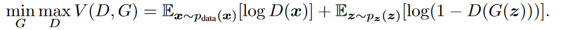
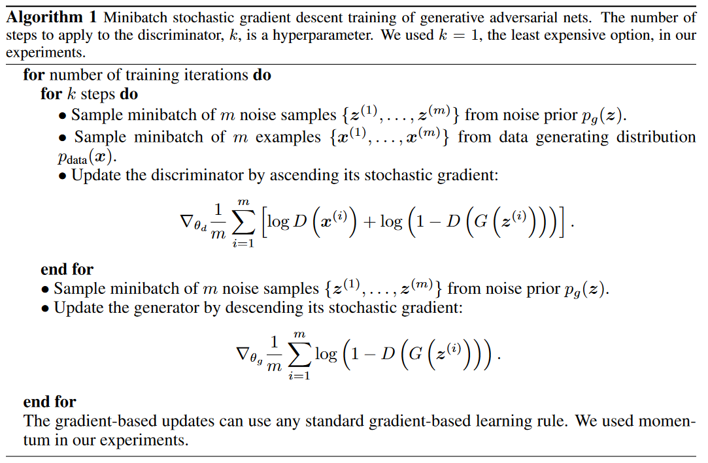

# Note

[toc]

## 正文

==生成模型可以被认为类似于一个造假者团队，试图制造假币并在不被发现的情况下使用它，而判别模型类似于警察，试图检测区分出假币。
二者不断学习，造假者不断提升造假技能，警察提升辨别能力，直到假货与真品无法区分（造假者胜利）。==

### 基本结构

生成网络（Generator）用来**学习真实图像分布**，负责**生成模拟数据，最终目的是“骗过”判别器**，判别网络（Discriminator）负责**判别输入的数据是真实的（来自数据集）还是生成的（来自生成器）**。生成网络要不断优化自己生成的数据让判别网络判断不出来，判别网络也要优化自己让自己判断得更准确。二者关系形成对抗，因此叫对抗网络。

  

  

### 训练方式

#### 整体

如下图二者博弈过程：生成器生成假数据，然后**将生成的假数据和真数据**都输入判别器，判别器要判断出哪些是真的哪些是假的。判别器第一次判别出来的肯定有很大的误差，然后我们**根据误差来优化判别器**。现在判别器水平提高了，生成器生成的数据很难再骗过判别器了，所以我们得**反过来优化生成器**，之后生成器水平提高了，然后反过来继续训练判别器，判别器水平又提高了，再反过来训练生成器，就这样**循环往复，直到达到纳什均衡**。
  

#### 生成器

对于生成器，输入需要一个n维度向量，输出为图片像素大小的图片。因而首先我们需要得到输入的向量。
> 这里的生成器可以是任意可以输出图片的模型，比如最简单的全连接神经网络，又或者是反卷积网络等。

这里**输入的向量我们将其视为携带输出的某些信息**，比如说手写数字为数字几，手写的潦草程度等等。由于这里我们**对于输出数字的具体信息不做要求，只要求其能够最大程度与真实手写数字相似**（能骗过判别器）即可。所以我们使用随机生成的向量来作为输入即可，这里面的随机输入最好是满足常见分布比如均值分布，高斯分布等。

#### 判别器

判别器不用多说，往往是常见的判别器，输入为图片，输出为图片的真伪标签。

#### 损失函数

**举个栗子：**
假如要生成4K游戏画面图，我们的目的是去学习生成器在数据x上的分布$p_g$，x是一个长为800万维的多维随机变量（4K对应800万像素，每个像素是一维随机变量），我们认为每个像素的值都是由分布$p_g$进行控制的。第一个办法：反汇编游戏代码，找到代码，就知道怎么生成的800万维的图片了。这个途径代表着我们要去构造分布$p_g$，计算上是比较复杂的。

本文思路：不用管游戏程序是怎么设计的，我们看到的虽然是4K的游戏图，但实际上，就是一些属性变量控制，比如哪个人物出现在哪个位置，在干什么事情，假设是一个100维（一个差不多大小的向量）的向量足以表达背后隐藏的一些逻辑，然后再学一个MLP（MLP理论上可拟合任何一个函数），让MLP强行把随机变量z映射成想要的x，使其很像就行。好处：便于计算，缺点：黑盒。

**损失函数讲解：**
在训练D的同时，也会训练G，训练G去最小化log(1-D(G(z)))，使得D尽可能地犯错
> log(1-x)单减，所以要让D(G(z))尽可能地大，即让D尽可能犯错；

总结一下我们要训练两个模型，D和G，目标函数是two-player minmax game with function V(G,D)：

  

==先max D==：若D完美，第一项趋于0，第二项趋于0，若D最差，两项都趋于$-\infin$，故让整个式子取最大值得到可以完美分类的D。
> max D的含义是，要优化D需要让整体式子取最大值。

==再min G==：若G完美，第一项无关，第二项趋于$-\infin$，若G最差，第一项无关，第二项趋于0，故让整个式子取最小值得到可完全骗过D的G。

所以目标函数中有两个东西，max D和min G，这不同于我们一般的只有min or max，所以此处是两个模型相互对抗。直到纳什均衡（Nash equilibrium）。

#### 训练算法

小批量梯度下降法训练GAN，k是一个超参数，即训练D的次数。

1. 先从分布$p_g(z)$采样m个噪声样本$z^{(i)}$(生成的图)，再从数据分布$p_{data}(x)$采样m个真实样本$x^{(i)}$(真实的图)。(pg是此时的生成器构建的生成模型，z是随机噪音)
2. 通过随机梯度==上升==法对D的参数$\theta_d$进行更新
3. 循环步骤1,2共k次
4. 从分布$p_g(z)$采样m个噪声样本$z^{(i)}$
5. 通过随机梯度==下降==法对G的参数$\theta_g$进行更新
6. 如此重复1-5 iteration次。

  

所以：

- 损失函数的两项是交替进行的，先对D进行更新，也即进行max D V(D,G)，然后对G进行更新，也即min G V(D,G)，如此循环博弈，直至均衡。
- 更新D的时候可以一次更新k次，更新G就一次。保证D有足够的更新，否则去更新G来糊弄D意义不大（警察很菜，小偷也没动力去改进造假技术），但也不能更新的过好，因为此时D(G(z))变为0了，对其进行求导就不好操作了（警察直接给小偷一锅端了）。so，最好两方势力相当，相爱相杀（苏美冷战）
- 如何判断是否收敛是个复杂的问题，一方不动另一方还在动算不算收敛？如果两方都在相互抖动算不算收敛。总的来说GAN的收敛非常不稳定。之后有非常多的工作对齐进行改进。

---

最后：

1. GAN是无监督学习
2. GAN用有监督学习的损失函数来做无监督学习，训练比较高效，标号是数据是采样的数据还是生成的数据
