# Note

[toc]

## 0.脉络

1. AutoEncoder是利用神经网络进行数据降维的模型，其Decoder部分自然被视作生成模型；我们是否可以在隐空间中随机采样，然后生成图片？
不可以，因为AE的隐空间不具备足够的规则性；AE的训练目的是尽可能地减少重建损失，而不管隐空间应该如何去组织。

2. 所以**为了保证隐空间足够规则，我们在训练过程中引入显式的正规化，这便得到了VAE**；
那么VAE既要保证尽可能地减少重建损失，又要保证隐空间足够规则。

VAE不同于将输入encoder为隐空间中的单个点，VAE将输入encoder为隐变量中的概率分布；然后从该分布中采样隐空间中的一个点，然后对采样点decoder并计算重建误差，然后反向传播；

一般编码为正态分布，但均值和方差应该是有encoder学习得到；同时这个均值和方差需要进行约束，实际上是通过强制其分布接近标准正态分布来完成规则化；（标准正态分布很好，见2）

故损失函数分为两项：重建误差（优化编码解码方案） + 正则化项（使encoder返回的分布尽可能接近标准正态分布）

q：VAE是加了正则项的AE吗？
a：正则化/规则化（regularization）：就是在需要训练的目标函数上加一些规则/限制；就是在你的模型中加入某些规则，或者说加入某些先验知识，从而可以缩小空间，减少求出错误解的可能性。
a：是，VAE的训练经过正规化以避免过拟合

## 1.AutoEncoder

VAE是AE(自编码器)的变种，AE是无监督学习的一种；无监督学习的目标是找出隐含在数据中的模式或结构，而监督学习的目标是找到x->y的映射；
AE如下图所示，类似于一个**非线性的PCA**，是一个**利用神经网络**进行数据降维的模型：
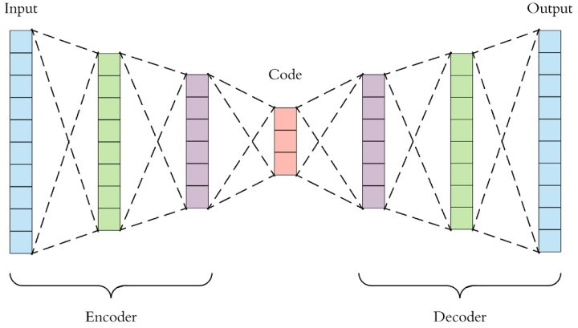
> 最大的特点是中间隐藏层的神经元(latent variable/code)个数非常少，中间层向量有降维的作用，所以从本质上说，自编码器是一种数据压缩算法

AE包括一个Encoder：$z = g(X)$，它的输出$z$我们称作编码
AE包括一个Decoder：$\tilde{X}=f(z)$

我们**希望解码器得到的$\tilde{X}$尽可能地接近$X$**，所以AE常用一个**重建损失函数**$l=||X-\tilde{X}||^2$。如此，**我们可以认为latent code囊括了输入数据X中的大部分信息**，达到了数据降维的目的。
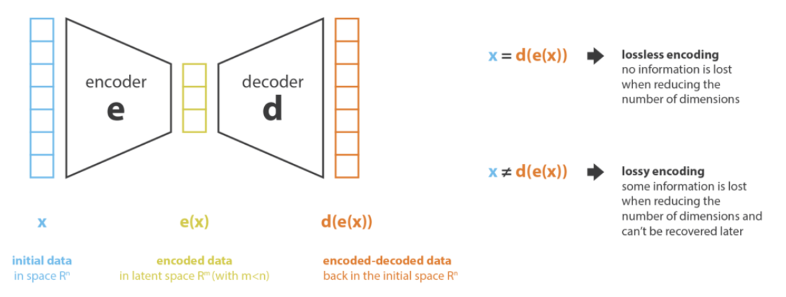  
[image from](https://towardsdatascience.com/understanding-variational-autoencoders-vaes-f70510919f73)

然后我们假如输入$X$是图片数据，那么从低维的latent code $z$ -> $\tilde{X}$的过程便可视为**生成模型**

如果直接在低维空间随机采样一些$z$，生成的图片$f(z)$基本都是没意义的噪声（AE的z是从Encoder生成的），原因是我们没有显式地对$z的分布P(z)$进行建模，我们并不知道哪些z能够生成有用的信息。
> 我们用来训练$f(z)$的数据很有限，只有对极少部分的z会生成有意义的图片；而维度诅咒的原因，数据永远不够；

于是在AE的基础上，我们需要**对$z$的分布$p(z)$进行显式的建模**（**先验prior**），如此便得到了VAE；
> 连续型的分布即概率密度函数：**概率密度类似于物体中某一点的密度**，概率类似于物体的体积。

### 1.1 AE为何不能用于生成数据？

一旦对自编码器进行了训练，我们既有编码器又有解码器，但是仍然没有办法来产生任何新内容。原因是隐空间不够规则。

**我们来看一下什么叫不够规则？**什么叫规则？（后文）
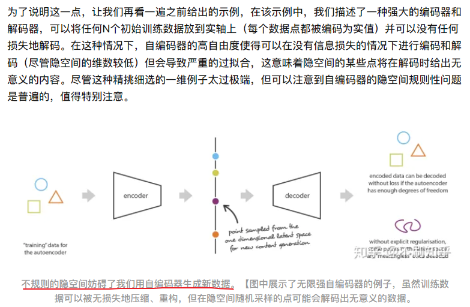  

**在自编码器的训练任务中，没有什么东西保证能够得到这种结构**：**自编码器仅以尽可能少的损失为目标进行训练，而不管隐空间如何组织**。

**什么叫规则？？？**

为了使生成过程成为可能，我们**期望隐空间具有规则性**，那么什么是规则性，这可以通过两个主要属性表示：
**连续性**（隐空间中的两个相邻点解码后应该比较相似）
**完整性**（针对给定的分布，从隐空间采样的点在解码后应提供“有意义”的内容）

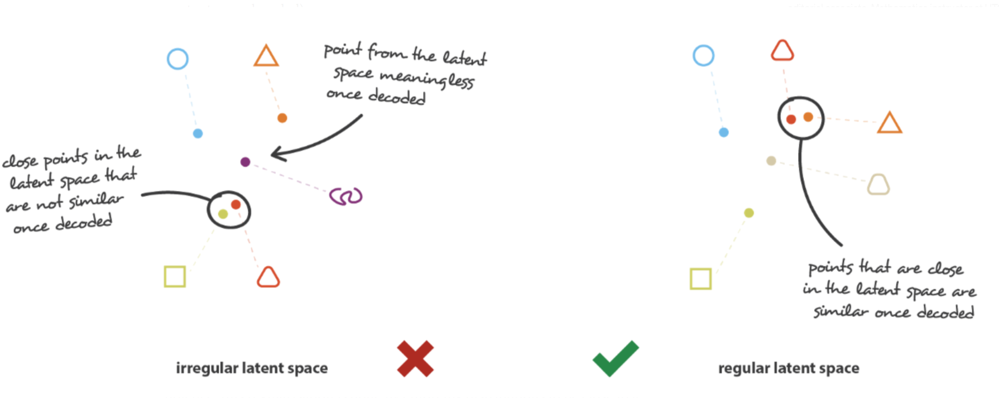  
如图所示，不规范隐空间中临近的点解码后不相似（正方形和三角形），而且有的点无法解析出有意义的数据（紫色图形）

## 2.VAE由来

因此，**为了能够将我们的自编码器的解码器用于生成目的**，我们必须**确保隐空间足够规则**。获得这种规律性的一种可能方案是**在训练过程中引入==显式的正规化==**（regularisation）。因此，变分自编码器可以定义为一种自编码器，**其训练经过正规化以避免过拟合**，并确保隐空间具有能够进行数据生成过程的良好属性。

和AE一样，VAE由编码器和解码器组成，经过训练以使重构误差最小。此外，**为了引入隐空间的某些正则化**，我们对编码-解码过程进行了一些修改：**==我们不是将输入编码为隐空间中的单个点，而是将其编码为隐空间中的概率分布。然后对模型进行如下训练==**：

- 首先，**将输入编码为在隐空间上的分布**；
- 第二，**==从该分布中采样隐空间中的一个点==**；
- 第三，**对采样点进行解码并计算出误差**；
- 最后，误差通过网络**反向传播**。

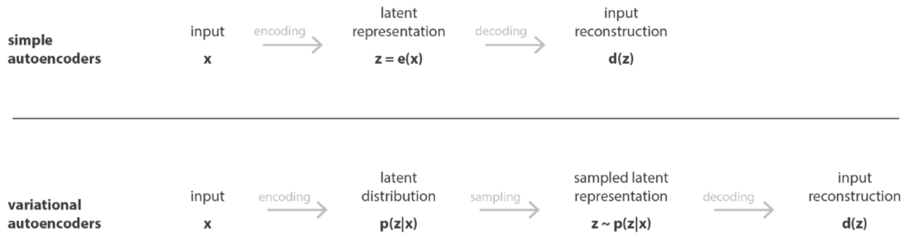  
AE和VAE的差异：**VAE把原始数据X编码为隐空间中的分布，在解码时是从该分布中采样一个点进行解码；而AE是把X编码为因空间中的单个点，在解码时直接对这个点进行解码。**

实践中，**选择正态分布作为编码的分布**，使得我们==可以训练编码器来返回描述高斯分布的均值和协方差矩阵==。
> 补充：正态分布可以将原先离散的编码点变成连续的无限的编码分布曲线

将输入编码为**具有一定方差**而不是单个点的分布的原因是这样可以非常自然地表达隐空间规则化：编码器返回的分布被强制接近标准正态分布。这样可以实现隐空间的局部规则化和全局规则化。
局部规则化：通过方差控制
全局规则化：通过均值控制

因此，在训练VAE时损失函数分为两部分：
第一部分是一个“**重构项**”（在最后一层），“重构项”倾向于使编码解码方案尽可能地更好
第二部分是一个“**正则化项**”（在隐层）通过**使编码器返回的分布接近标准正态分布，来规范隐空间的组织**。该正则化项为**返回的分布**与**标准高斯之间的KL散度**。
  
重构项：优化编码-解码
正则化项：使隐空间规则化

**==为何在损失函数中加正则化项？==**
如果不加，那么模型只会去最小化重建误差，而我们将原始数据x编码为隐空间的高斯分布这个设想会被忽略，最终表现得像普通AE一样。具体说，**编码器可能返回具有方差很小的分布**（往往是点分布），**或者返回具均值差异巨大的分布**（数据在隐空间中彼此相距很远）。在这两种情况下，返回分布的限制都没有取得效果，并且不满足连续性和/或完整性。

> 最后一句话解释：==方差太小会导致均值处密度太高，两个分布中间的密度太小，生成的样本会缺少相似性；如果方差适中，但均值相差太远的话，也会造成分布中间密度太小，生成的样本缺少与这两个分布的相似性。==

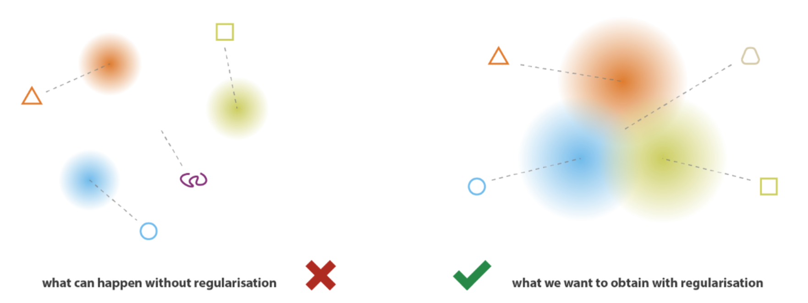  

因此，为了避免这些影响，我们==必须同时对编码器返回的分布均值和协方差矩阵进行正则化==。实际上，**通过强制分布接近标准正态分布来完成此正则化**。这样，**我们要求协方差矩阵接近于单位阵，防止出现单点分布，并且均值接近于0，防止编码分布彼此相距太远**。

使用此正则化项，我们可以**防止模型在隐空间中的编码相互远离**，并**鼓励尽可能多的返回分布发生“重叠”**，从而满足预期的连续性和完整性条件。**自然地，对于任何正则化项，都会以训练数据上更高的重建误差为代价。**所以，一般会取个平衡，实际操作中也可以调整重建误差和KL散度之间的权重；

总结：

==VAE是将输入编码为分布而不是点的自编码器，并且其隐空间结构通过将编码器返回的分布约束为接近标准高斯而得以规范化。==

## 3.VAE数学细节

以下我们通过数学，使我们可以严格证明正则化项的合理性。
> 需要建立一个明确的概率框架，并且需要使用变分推理技术。

$x$表示数据变量，是由潜变量$z$生成的（不是样本x）；因此，每个数据点x，其生成过程为：

- 从先验分布$p(z)$中采样一个z
- 按条件概率$p(x|z)$采样出数据x

在这种概率模型下，我们可以重新定义编码器和解码器的概念。实际上，与考虑使用**确定性**编码器和解码器的简单自编码器（$e(x)和d(z)$）不同，我们现在将考虑这两个对象的概率版本。自然地，**“概率解码器”由$p(x|z)$定义**，描述**由给定已编码变量到解码变量的分布**，而**“概率编码器”由$p(z|x)$定义**，描述**由原始变量到编码变量z的分布**。

此时，我们假设隐变量z遵循先验分布$p(z)$。
> 回顾贝叶斯定理：p(z)为先验分布，p(z|x)为后验分布，p(x|z)为**似然性(由‘因’导致‘果’的可能性)**
> 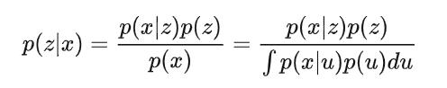  

我们==假设隐变量z的分布p(z)服从**标准**高斯分布，假设p(x|z)为高斯分布==，**其均值由变量z的确定性函数$f$定义，协方差矩阵的形式为正常数$c$乘以单位矩阵$I$**；假定函数f属于记为F的函数族；所以我们有：
$$
p(z) \sim \mathcal{N}(0,I)\\
p(x|z) \sim \mathcal{N}(f(z), cI), f\in F,c>0
$$

now，理论上来说，有了$p(z)和p(x|z)$，根据上图贝叶斯公式，$p(z|x)$就出来了，但**由于分母处的积分**，但这需要采样大量的z，代价极大，很棘手；我们**需要使用变分推理**之类的近似技术。

==为何要求$p(z|x)$？？==
因为知道了$p(z|x)$就可以使采样出来的z和x具有更大的相关性
给定输入数据x，VAE的encoder输出p(z|x)
给定输入数据x
$$
p(x)=\int_z p(z)p(x|z)dz
$$
根据MLE原理，使我们的输入x出现的概率越大越好

### 变分推理公式

变分推理是一种去**近似复杂分布**的技术。
具体想法为设置一个参数化的分布族，并在该族中寻找目标分布的最佳近似；
> 比如高斯分布族，参数为不同的均值和协方差

<!-- 该族中最好的对象是使给定的近似误差测量值(KL散度)最小化的元素；

Here，==我们通过高斯分布$q_x(z)$来近似$p(z|x)$，其均值和协方差由参数$x$的两个函数$g和h$定义。$g和h$函数分别属于后面确定但可以参数化的函数族G和H==
$$
q_x(z)\sim \mathcal{N}(g(x), h(x)), g\in G, h\in H
$$
> $q_x(z)就是q(z|x)$的意思，他是对$p(z|x)$的近似

ok，现在需要通过优化函数$g和h$（实际上是他们的参数）来最小化近似分布$q_x(z)$和真实分布$p(z|x)$之间的KL散度，从而从该族中找到最佳近似。即我们要找最优的$g^*和h^*$：

  

> 此处第二项我们让q和p(z)越近越好，而q是p(x|z)的近似，p(z)是标准正态，所以说我们让编码器编码的分布p(x|z)与标准正态分布越接近越好

到此为止，如果函数$f$已知，则我们可以使用变分推理技术来近似后验分布$p(z|x)$；
> 也就是高斯分布$q_z(x)$的参数有了

但实际上，**定义==解码器==的函数$f$是未知的，需要求解**。
由上图变分推论公式可知，P(z|x)可以从p(z)和p(x|z)近似，其中$p(z)\sim N(0,I), p(x|z)\sim N(f(z), cI)$，所以我们需要优化的对象是c和函数f，c决定了分布的协方差，f决定了分布的均值；

我们最开始的目标是寻找一种性能良好的编码解码方案，同时其隐空间要足够规则，可用于生成目的。
对于解码器，**隐空间的规则性不用他管，他需要做的是让编码解码方案做到最好**，隐空间的规则性和他无关。

所以f如何选取自然就如下所示：

对于给定的输入x，当我们从分布$q_x^*(z)$中采样z，接着从分布$p(x|z)$中采样$\hat{x}$，我们希望最大化$\hat{x}=x$的概率：

  

  

可以注意到常数c，它决定了前两个条件之间的平衡。c越高，我们对模型中的概率解码器假设f(z)周围的方差就越大，我们也就越关注正则化项（如果c低，则相反）。

**其实：我们是首先利用解码器decoder求出了p(x|z)，然后利用编码器encoder求出了q(z|x)，也即p(z|x)的近似。**==对吗 和下面矛盾啊==

上面几段说了一大堆，其实就两个意思：

1. 最优的fgh其实就要满足两个目标，一个是我从近似出来的隐空间分布$q_x$中采样z然后解码，希望它能和原数据x比较像；第二个是这个$q_x$应该像一个标准正态分布。
2. 这是符合我们之前“尽可能无损重构+正则项”的总体思路的

## 最后

我们的优化过程中以来从编码器获得的分布p(z|x)中采样z，但是这种采样操作时不可导的；所以引入冲参数技巧$reparametrisation\ trick$，使其可以进行梯度下降。
定理：如果z遵循均值为g(x)协方差为h(x)的高斯分布，则z可表示为：
  

   -->

---
---
从新写公式

VAE的先验是假定数据的样本点x的分布可通过正态分布来生成出来；
我们不妨假设$p(z)\sim N(0,I)$，

那么数据的产生过程：
1 从先验分布$p(z)$中采样$z_i$
2 根据条件分布$p(X|z_i)$，用$z_i$生成$x_i$

我们看下decoder
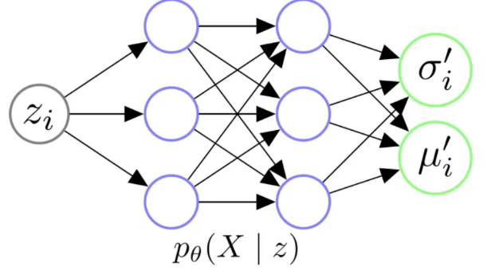  
我们输入采样的$z_i$，希望decoder能够学会一个映射，输出$z_i对应的X的分布p_\theta(X|z_i)$
> $\theta$是decoder要学习的参数

我们再假设，给定任意$z_i$后，X都服从独立的高斯分布
$p_\theta(X|z_i)=N(\mu_i, \sigma_i^2*I)$
这样，给定$z_i$，decoder就可以拟合出$\mu_i和\sigma_i^2$，我们就得到了$p(X|z_i)$，那么我们就可以从p(z)中采样，然后根据$p(X|z_i)$生成图片了。

---
我们的终极目标是弄一个逼近真实分布$p(x)$的$p_\theta(x)$
根据全概率公式：
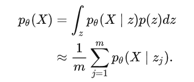  
如此一来，我们只要从p(z)中采样很多$z_i$出来，就能算出$p_\theta(X)了$，我们利用极大似然估计的思想，**让数据集出现的概率最大化**：
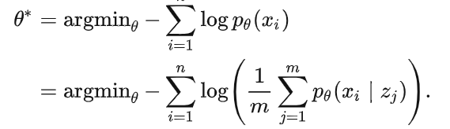  
这样就求得了$p_\theta(X)$，理论可行。但实际中由于我们不知道x与z的关系，我们需要采样极多的$z_i$，所以直接从$p(z)中采样z_i$，用来估计$p_\theta(X)$的策略不可行。

解决方法就是在encoder中引入$p_\theta(z|x_i)$，假如我们知道了$p_\theta(z|x_i)$，我们可以将$x_i$给到encoder，算出$p_\theta(z|x_i)$，然后直接在这个分布中采样$z_i$，（**从该分布中采样的z_i和x_i关系很大，可以省去很多采样的步骤**）给到decoder，算出$p_\theta(X|z_i)$，然后利用极大似然优化模型。

那怎么算$p_\theta(z|x_i)$呢
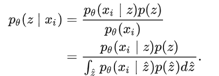  
首先看一下贝叶斯公式，可以看到分母仍然需要采样大量的$z_i$，不可行。

那就请出变分贝叶斯
我们让$q_\phi(z|x_i)$去逼近真实的$p_\theta(z|x_i)$，q分布由$\phi$参数化的encoder拟合，如果二者足够逼近，encoder就得到了$z|x_i$的分布；

那么如何拟合q呢
首先根据贝叶斯公式可以证明后验分布p(z|x_i)服从高斯分布
我们令对任意$x_i$都有：
$q_\phi(z|x_i)=N(\mu_i, \sigma_i^2*I)$

这样的话，整个VAE架构就出来了：
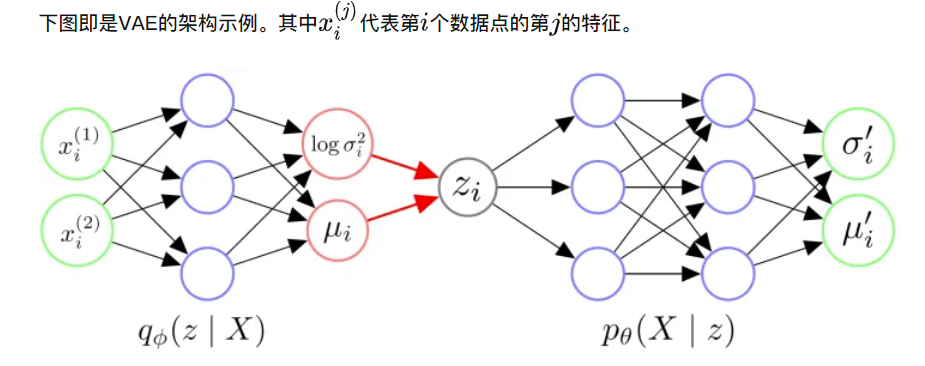  
首先给encoder输入一个数据点$x_i$，通过神经网络，得到$\mu_i和\sigma_i^2$，我们得到了分布$q_\phi(z|x_i)$，它近似于z服从的$p_\theta(z|x_i)$。
有了$q_\phi(z|x_i)$，我们就可以采样一个$z_i$，这个$z_i和x_i相似$，输入到decoder，让其拟合$p_\theta(X|z_i)$，得到分布$p_\theta(X|z_i)$之后，我们从中采样得到$x_i$（==实际中，人们不采样，直接将模型输出的均值作为给定$z_i生成的数据点x_i$==）

重参数技巧：
在上图前向传播的过程中，由于我们要对从p(z|x_i)中采样z_i,这个采样函数是不能进行反向传播的。所以作者提出了重参数技巧：
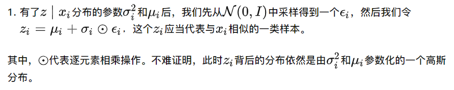  
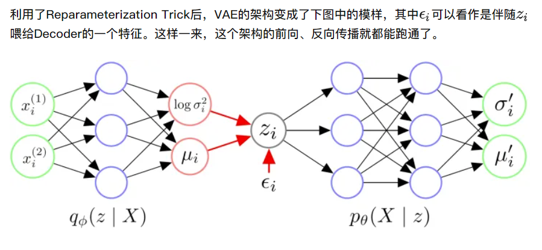  

ok，我们来做一点推理：
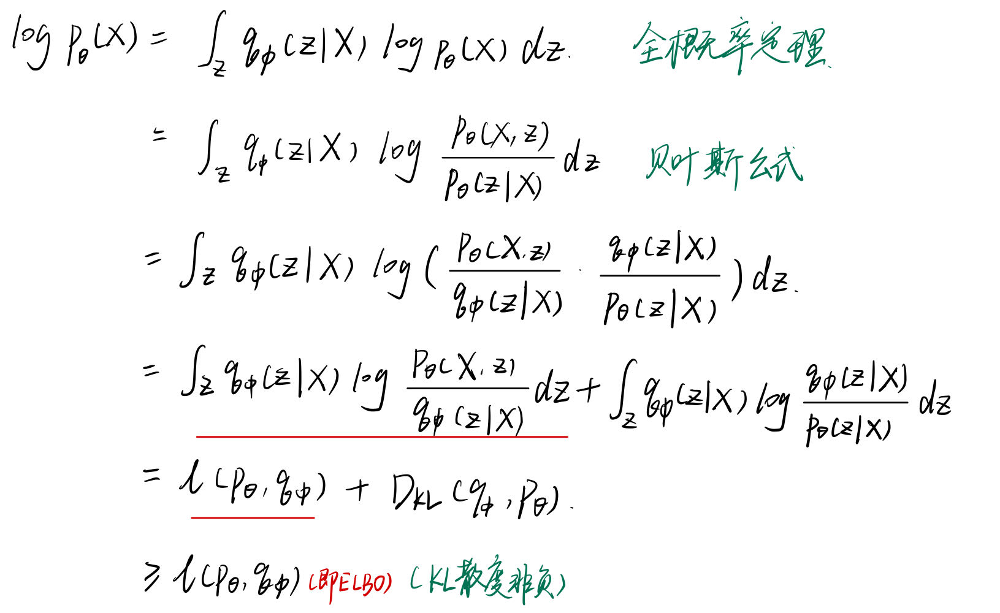  
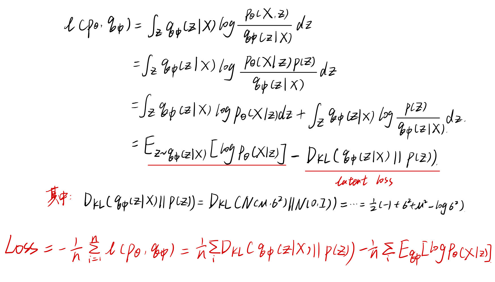  

我们便得到了损失函数，我们最小化这个损失函数的时候：
第一项，是最小化q(z|x)和p(z)之间的KL散度，也就是让我们的近似分布越接近标准正态分布越好
第二项，含义是由z重建出样本x的似然概率，越大越好

---
至此，我们已经可以训练得到一个VAE了，模型训练结束后，我们从p(z)中采样z_i，再给decoder，就可以生成可能的数据点了。

最后我们谈一下VAE最大的问题：生成的图片是模糊的。

补充：p(z)可以是其他分布
VQVAE假设其为离散的均匀分布，那一个整数如何生成图片呢？
答案是，加个词表，每一行包括数值+向量
