# DDPM and DDIM

## DDPM

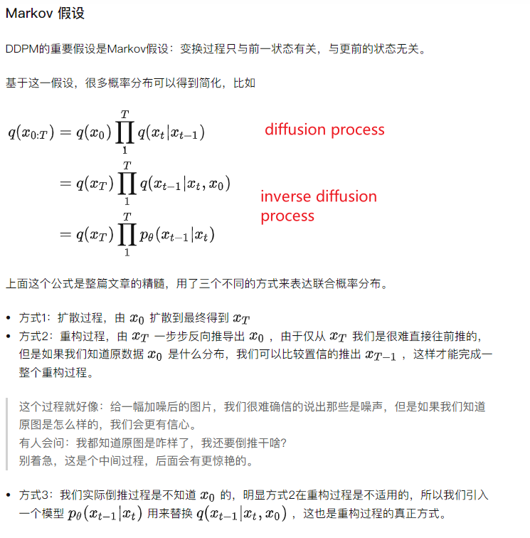  

参考满足马尔科夫链假设的条件概率形式

### diffusion process

$\beta=\textit{np.linspace}(0.0001, 0.02, T)$
$\alpha=1-\beta, \bar{\alpha}=\prod\alpha_i$

  
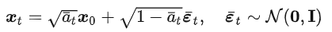  

上面的线性过程，也可以看成是从一个高斯分布中采样，具体实现也是借助重参数化的技巧。

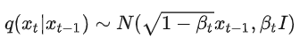  

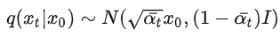  

### inverse diffusion process

**训练过程**
我们希望$q(x_{t-1}|x_t)$，但没法推。所以使用神经网络$p_\theta(x_{t-1}|x_t)$来近似。
$q(x_{t-1}|x_t,x_0)$是可以推出来的，需要有x_0。
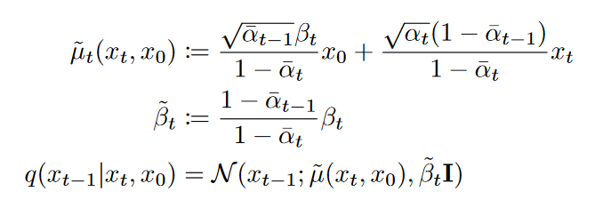  
应该是训练阶段可以直接拿到x0然后训练学习分布用的

---

**采样过程**
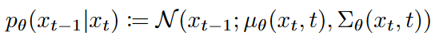  

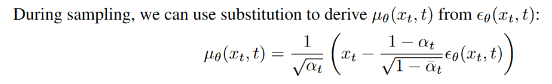  

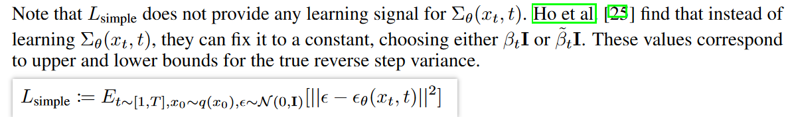  

  

---
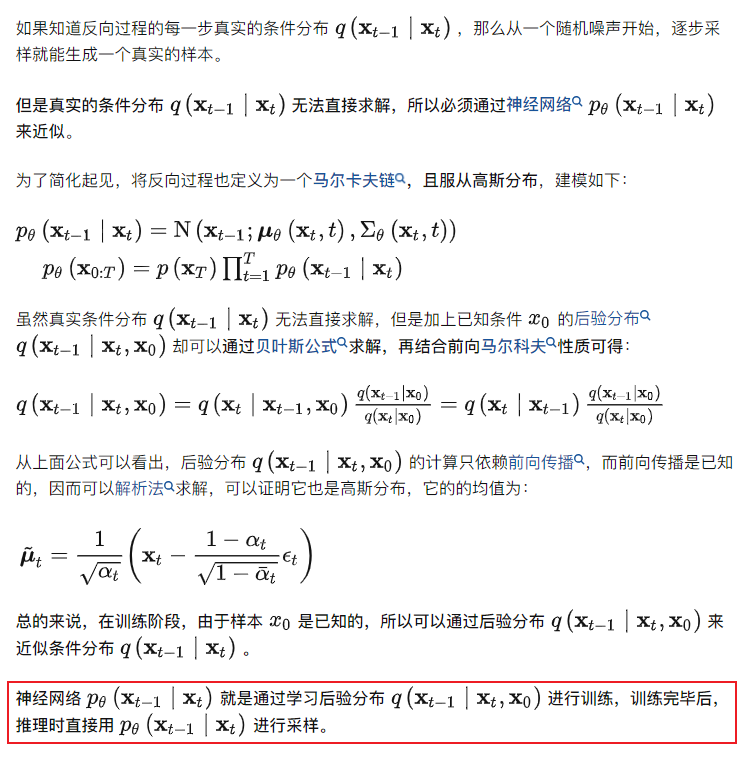  
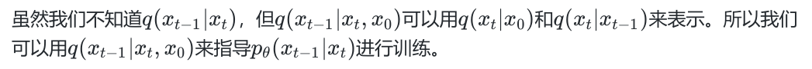  

---

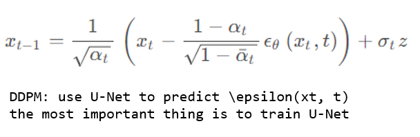  

## DDIM

扔掉马尔科夫假设
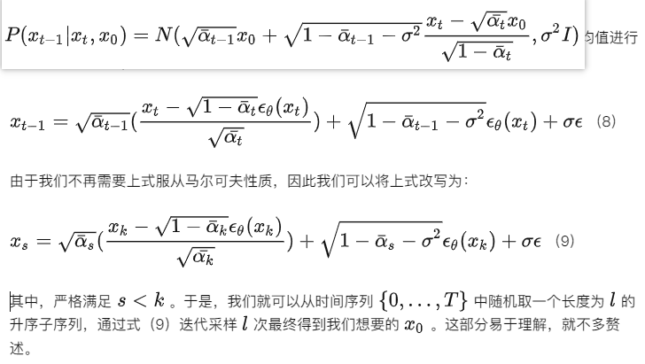  
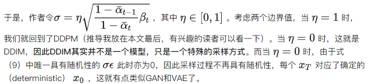  

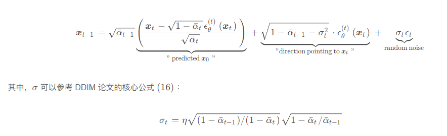  
