# Note

[toc]

## 背景知识

生成模型分类：

- seq2seq，自回归解码
- 基于GAN：不显式建模，直接生成数据
- Flow模型：数学严谨，可逆
- 基于VAE
- diffusion

## 正文

### 背景

2015年提出DPM（Diffusion Probabilistic Models扩散概率模型）
2020年提出DDPM（Denoising Diffusion Probabilistic Models去噪扩散概率模型）

#### Maximum Likelihood Estimation

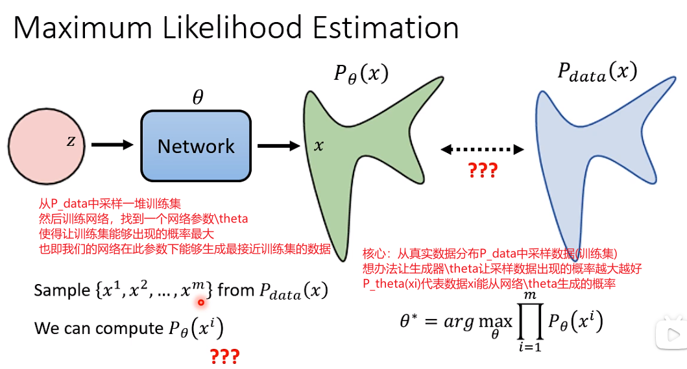  

从KL divergence角度验证最大似然估计的合理性

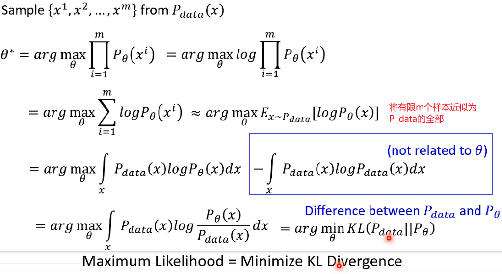  

**对于生成模型而言，比如VAE, flow-based, diffusion model都是试图maximize likelihood，等价于minimize KL divergence，GAN不同，它是试图minimize某一个divergence，通常不是minimize KL divergence，最原始的GAN是minimize JS divergence，后来WGAN是minimize Wasserstein divergence。**

### DDPM

#### 概述

核心思路：（与VAE很类似）
扩散过程：将海量的图像信息，通过某种统一的方式encoder成一个高斯分布。
逆扩散过程：从高斯分布中随机采样一份数据，并进行decode，预期即可生成一个有现实含义的图像；

  

---

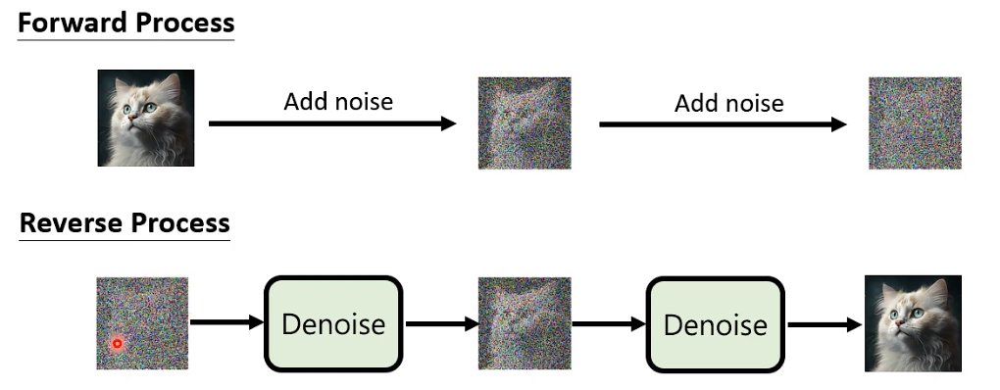  

---

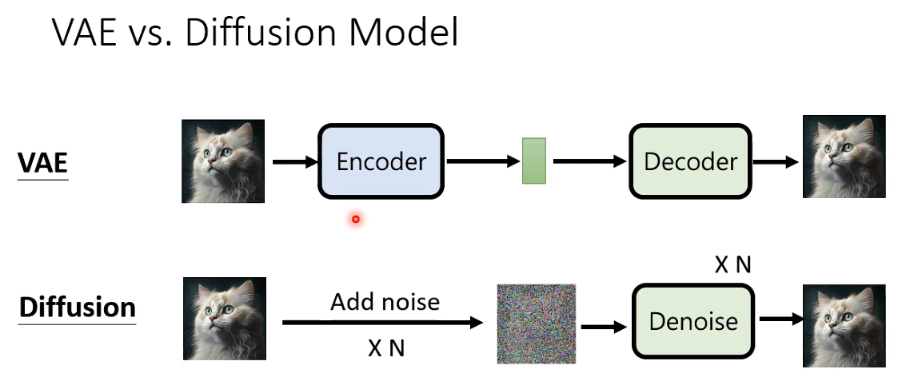  
加噪类似于VAE中的encoder

---

==algorithm==
核心：

1. 扩散过程是不断增加噪音直到数据变成随机噪音$x_T \sim \mathcal{N}(0,I)$，扩散过程一般是固定的，通过使用预定义好的variance schedule
   1. 其实扩散过程其实是一步从x0得到的，而非step-by-step
2. 训练过程：重复以下过程直至收敛：从训练集中采样x0，采样一个$t\in (1,T)$，采样一个随机噪声$\epsilon$，然后前向过程直接得到带噪图$x_t=\sqrt{\bar a_t}x_0+\sqrt{1-\bar a_t} \epsilon$，然后根据指望模型去预测t时刻的$\epsilon$，然后根据L1 loss优化，便得到了一个不错的预测噪声的模型。
3. 采样/推理过程：先从高斯分布采样一个噪声xT，然后进行T步以下操作：UNet由输入xt和t预测噪声$\epsilon$，然后进而计算得到$x_{t-1}$的均值，然后取出方差$\sigma_t$，最终得到$x_{t-1}$
   1. 均值为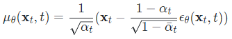  
   2. 方差$\sigma_t^2$可以是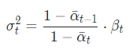，**文章简化为**$\sigma_t^2=\beta_t$  
   3. ==model根据xt和t预测噪声即可，然后根据推导公式得到x_{t-1}==

> ==code 见实验部分==

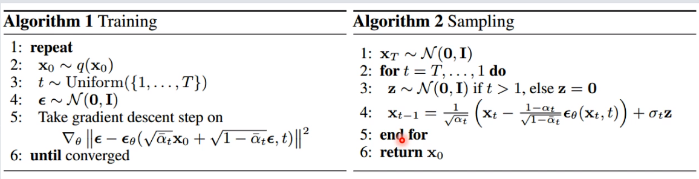  

> DM中一般将$x_0$视作clean image，将$x_T$视作纯噪声$x_T\sim N(0,I)$

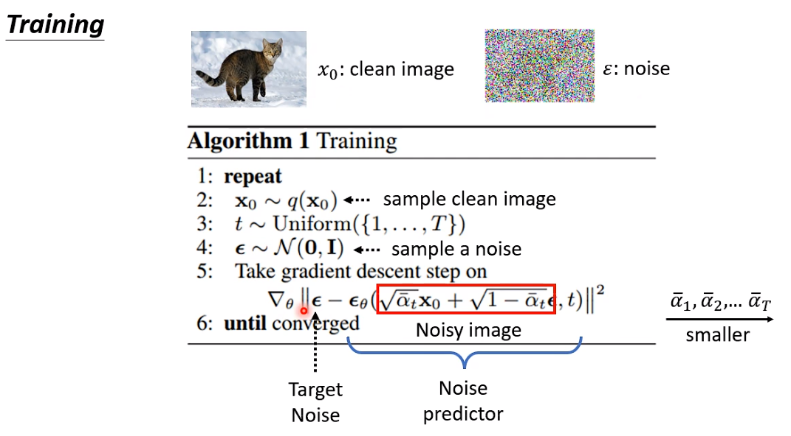  

> $\overline{\alpha}_1, \overline{\alpha}_2, ..,\overline{\alpha}_T$需要提前准备好

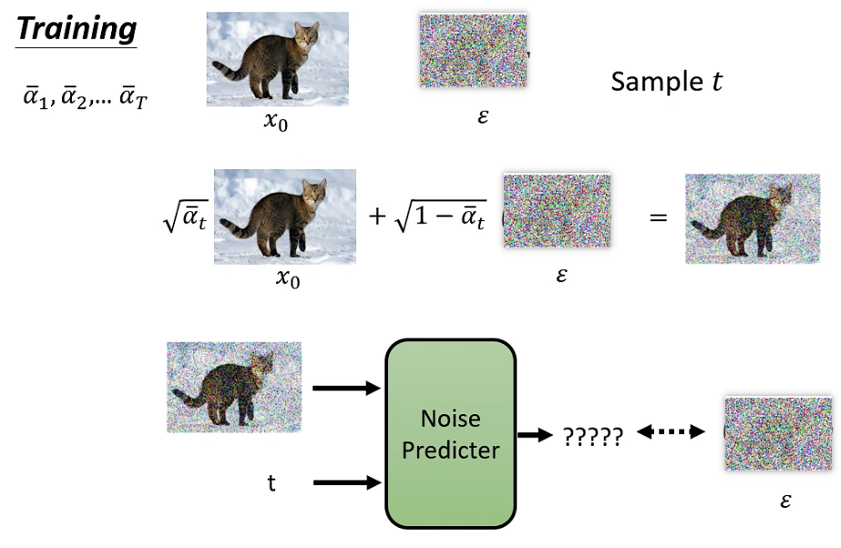  

T越大，代表红框中噪声$\epsilon$系数越大，即所加噪声越多
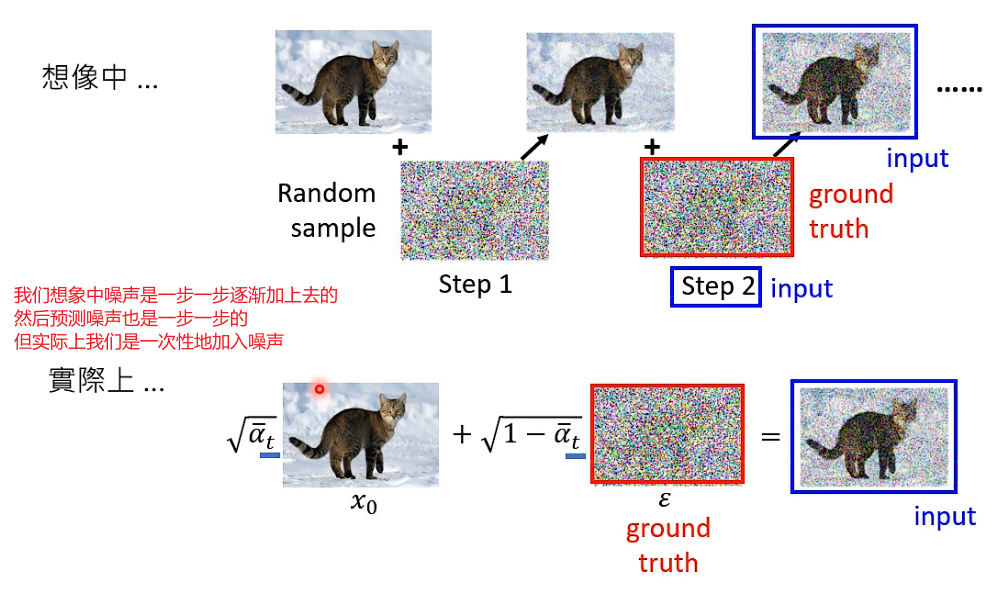  

---

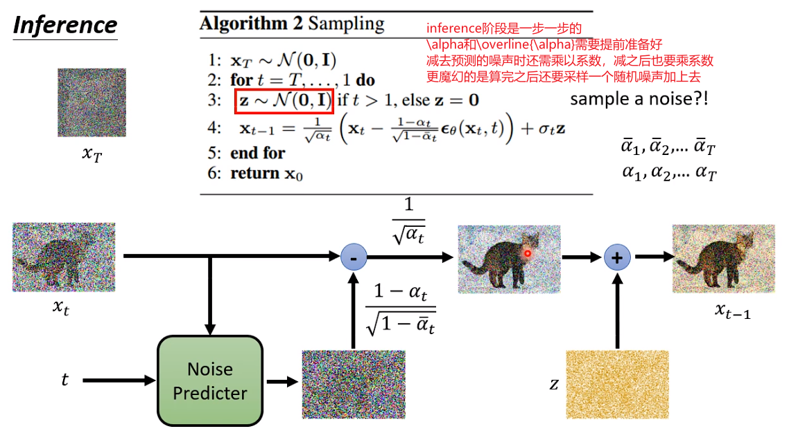  
加一个随机噪声是因为让结果更好（实验得到）

> $\overline{\alpha}_1, \overline{\alpha}_2, ..,\overline{\alpha}_T$和$\alpha_1, \alpha_2,...,\alpha_T$需要提前准备好
> train不是一步一步的，inference是一步一步的

---
---

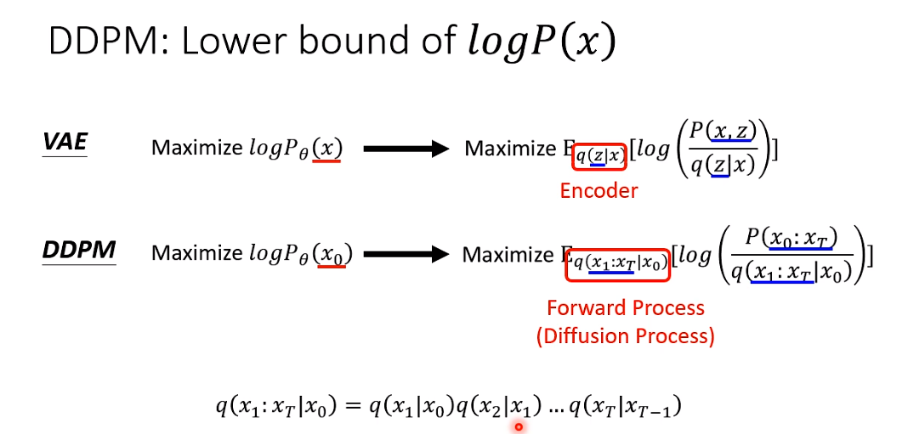  

#### 扩散阶段

给定**初始数据分布$x_0\sim q(x)$**，其中$q(x)$可以为任意分布，我们不断地向分布中添加高斯噪声，该噪声的标准差是以==固定值==$\beta_t$而确定的，均值是以固定值$\beta _t$和当前$t$时刻的数据$x_t$决定的。
每一次转换都是在==上一次(即当前状态，无需过去状态)生成的图像基础上添加一些噪声。该过程为马尔科夫过程==。

> 往往称不同step的方差预先设定为variance/noise schedule，一般，越后面的step方差越大，==扩散过程一般是固定的，没有可学习的参数==。

- 随着$t$的不断增大，添加的噪音越来越多，最终数据分布$x_T$变成了一个各项独立的高斯分布。$x_T \sim \mathcal{N}(0,I)$

$$
q(x{_t}|x{_{t-1}})=N(x{_t};
\sqrt{1-\beta{_t}}x{_{t-1}},\beta{_t}\boldsymbol{I})\tag{1}
$$

**$\sqrt{1-\beta{_t}}$是均值，$\beta{_t}\boldsymbol{I}$是方差**

$$
q(x_{1:T}|x_0)=q(x_1,x_2...x_T|x_0)=\prod_{t=1}^T q(x_t|x_{t-1})
$$

- 任意时刻的$q(x_t)$可以完全基于$x_0$和$\beta _t$计算出来，而不需要迭代，首先定义$\alpha{_t}=1-\beta{_t},\bar a_t= \prod_{i=1}^T a_i$

$$
\begin{aligned}
x_t&=\sqrt{1-\beta{_t}}x{_{t-1}}+\sqrt{\beta{_t}}z_{t-1}\\
&=\sqrt{a{_t}}x{_{t-1}}+\sqrt{1-a{_t}}z_{t-1}\\
&=\sqrt{a{_t}a{_{t-1}}}x{_{t-2}}+
\sqrt{a{_t}(1-a_{t-1})}z_{t-2}+\sqrt{1-a{_t}}z_{t-1}\\
\end{aligned}
$$

$z$为噪音，由均值为0，方差为1的正态分布产生。$\sqrt{a{_t}(1-a_{t-1})}z_{t-2}$服从$N(0,a_t(1-a_{t-1}))$，$\sqrt{1-a{_t}}z_{t-1}$服从$N(0,1-a_t)$，==两者相加可以化成一个随机变量$z$的形式，服从$N(0,1-a_ta_{t-1})$==

$$
\begin{aligned}
x_t&=\sqrt{a{_t}a{_{t-1}}}x{_{t-2}}+
\sqrt{1-a{_t}a{_{t-1}}}\bar z_{t-2}\\
&=\sqrt{a{_t}a{_{t-1}...a_2a_1}}x_0+
\sqrt{1-a{_t}a{_{t-1}...a_2a_1}}\bar z_t\\
&=\sqrt{\bar a_t}x_0+\sqrt{1-\bar a_t}\bar z_t
\end{aligned}
$$

> $\bar{z}_{t-2}$意思是指合并两个高斯分布
> $\bar{\alpha_t}=\alpha_1\alpha_2...\alpha_t$
> 两个独立的高斯分布具有可加性：$N(0,\sigma_1^2I)+N(0,\sigma_2^2I) \sim N(0,(\sigma_1^2+\sigma_2^2)I)$

最终得到

$$
x_t=\sqrt{\bar a_t}x_0+\sqrt{1-\bar a_t}\bar z_t\tag{2}
$$

$$
q(x{_t}|x_0)=N(x{_t};\sqrt{\bar a_t}x_0,(1-\bar a_t)\boldsymbol{I})\tag{3}
$$
即，==当给定原始图像$x_0$，$x_T$不需要真的执行T次操作，而是可以直接根据上述公式采样得出==。
如下图所示：
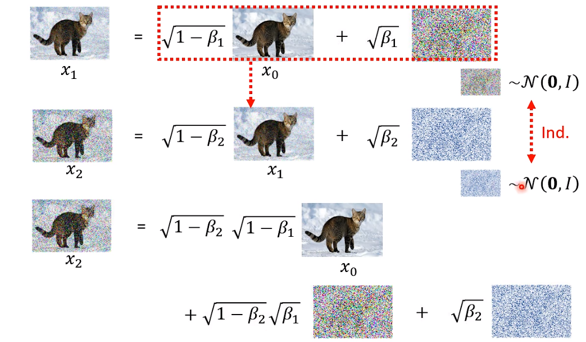  

---

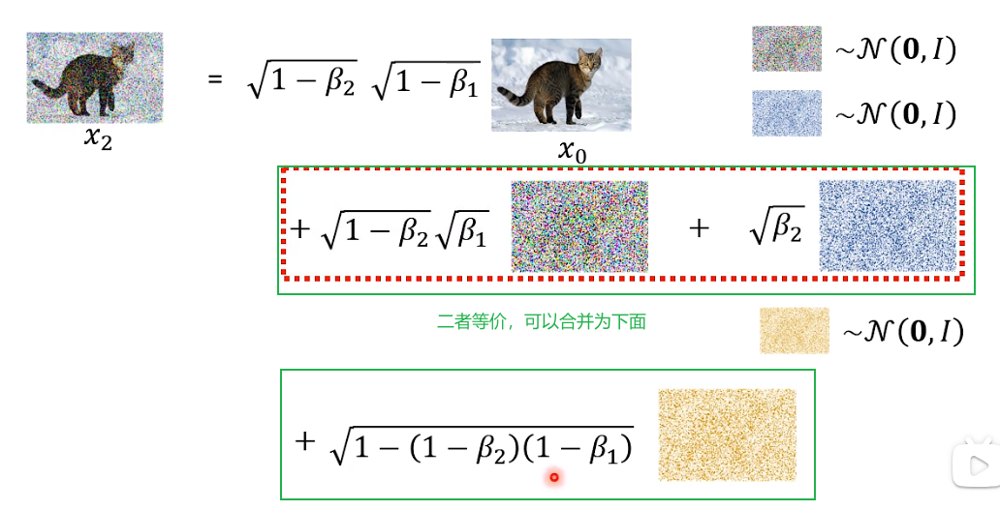  

---

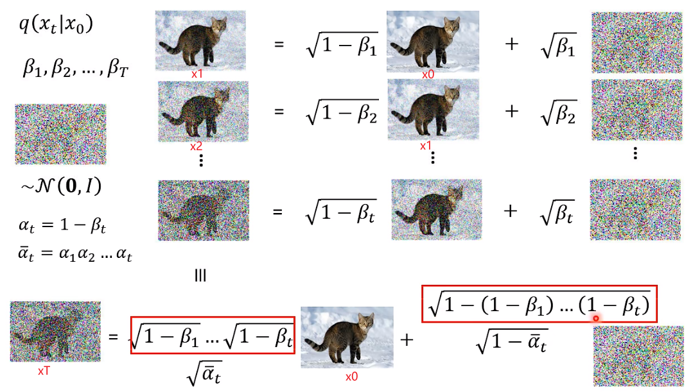  

要点：

1. ==扩散过程表面上看来是一步步增加噪声的过程，实际上从x0可以一步到位得到xT==
2. 每一步的噪声是高斯噪声，加噪用方差参数控制
3. 方差是提前定义好的，正向扩散过程是无参模型

#### 逆扩散过程

扩散过程是将数据噪音化，逆扩散过程就是一个去噪的过程，从一个随机噪音$x_T \sim \mathcal{N}(0,I)$开始，根据反向过程的每一步的真实分布$q(x_{t-1}|x_t)$，逐渐去噪生成一个真实的样本，所以逆扩散过程就是生成数据的过程。

  

---
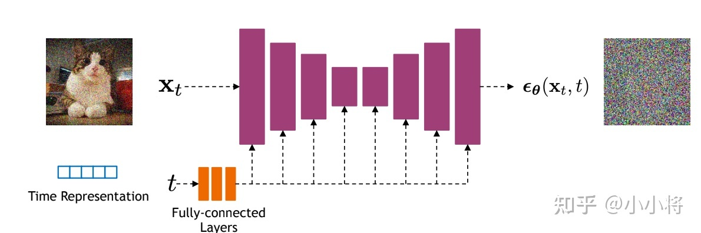  
由于我们需要让每一个step的图像大小一致，所以我们采用Autoencoder架构作为噪声预测模型。此处我们采用基于residual block和attention block的U-Net模型。

==U-Net的输入是$x_t$和time embedding输出是预测的噪声$\epsilon_\theta(x_t,t)$。据此便可求出$\mu_\theta(x_t, t)$，然后便可求得分布$p_\theta(x_{t-1}|x_t)$，反向传播就出来了。==
**我们逆扩散过程需要T个噪音预测模型，实际处理时，我们通过增加一个time embedding（类似transformer中的position embedding）将timestep编码到网络中，故而只需训练一个参数共享的UNet。具体的，是将time embedding插入到每个残差块中。**

这个time embedding是为了告诉扩散模型当前是反向扩散的第几步，欲使UNet共享参数，又欲使不同step得到不同的效果（我们想让模型在最开始先生成一些粗糙的轮廓，后面再逐步精细，而非每一步生成一样的东西）。

> UNet中部分stage中加入了self-attention模块增加全局建模能力

#### loss

  

> ==$\epsilon$是我们正向添加的已知的固定的噪声，$\epsilon_\theta$函数是对应的反向过程中的UNet网络结构，$x_t$是输入，$t$是输入的time embedding==
> $x_t$可以视作$x_0和\epsilon$的混合，$x_t$为随机采样的$x_0$和时间步长t和噪声$\epsilon$来产生的
> 函数$\epsilon_\theta(x_t,t)$用来预测$x_t$的噪声分量
> 所以目标函数就是实际误差和预测误差之间的均方误差。

  

### 实验

1 参数方案设置
step=1000
方差$\beta_1=10e-4$线性增加到$\beta_T=0.02$

```python
# Beta逐渐增大的方案
def generate_linear_schedule(T, low, high):
    return np.linspace(low, high, T)
```

2 训练过程（参考概述章节）

```python
def get_losses(self, x, t, y):
    # 输入clean img, t
    # 采样noise
    noise = torch.randn_like(x)
    # 前向得到带噪图perturbed_x (即x_t)
    perturbed_x = self.perturb_x(x, t, noise)
    # 由UNet预测estimated_noise
    estimated_noise = self.model(perturbed_x, t, y)
    # 计算loss
    if self.loss_type == "l1":
        loss = F.l1_loss(estimated_noise, noise)
    elif self.loss_type == "l2":
        loss = F.mse_loss(estimated_noise, noise)
    return loss # 训练的时候minimize就完事儿了

def forward(self, x, y=None):  # x: clean img
    b, c, h, w = x.shape
    device = x.device

    # if h != self.img_size[0]:
    #     raise ValueError("image height does not match diffusion parameters")
    # if w != self.img_size[0]:
    #     raise ValueError("image width does not match diffusion parameters")
    
    t = torch.randint(0, self.num_timesteps, (b,), device=device)  # choose a `t` in (0,T)；batchsize大小的
    return self.get_losses(x, t, y) 
```

2.2 前向过程得到xt

```python
# extract目的是从张量a中提取索引t指定的元素，并将结果reshape
def extract(a, t, x_shape):
    b, *_ = t.shape
    out = a.gather(-1, t)
    return out.reshape(b, *((1,) * (len(x_shape) - 1)))

def perturb_x(self, x, t, noise):
    # 即从参数schedule中提取t索引对应的参数
    return (
        extract(self.sqrt_alphas_cumprod, t, x.shape) * x +
        extract(self.sqrt_one_minus_alphas_cumprod, t, x.shape) * noise
    ) 
```

3 推理过程

```python
def remove_noise(self, x, t, y, use_ema=True):
    # 很多工作在采样时都采用ema优化生成结果
    if use_ema:
        return (
            (x - extract(self.remove_noise_coeff, t, x.shape) * self.ema_model(x, t, y)) *
            extract(self.reciprocal_sqrt_alphas, t, x.shape)
        )
    else:
        # 这些参数都很简单 按公式写即可
        # model根据xt和t预测噪声即可，然后根据推导公式得到x_{t-1}
        return (
            (x - extract(self.remove_noise_coeff, t, x.shape) * self.model(x, t, y)) *
            extract(self.reciprocal_sqrt_alphas, t, x.shape)  # reciprocal倒数
        )

@torch.no_grad()
def sample(self, batch_size, device, y=None, use_ema=True):
    if y is not None and batch_size != len(y):
        raise ValueError("sample batch size different from length of given y")

    # 采样xT
    x = torch.randn(batch_size, self.img_channels, *self.img_size, device=device)
    
    for t in range(self.num_timesteps - 1, -1, -1): # T-1,...,0
        t_batch = torch.tensor([t], device=device).repeat(batch_size)  # 这里的t不用做成embedding?
        x = self.remove_noise(x, t_batch, y, use_ema) # 从x_t得到x_{t-1}的**均值**

        if t > 0:  # t>0时加上方差项（等于0不用）
            x += extract(self.sigma, t_batch, x.shape) * torch.randn_like(x)
    
    return x.cpu().detach()
```

4 UNet网络结构
> 实际上其他一些网络也OK，只需要保证支持输入xt和t，能够输出z即可（z和xt维度一致）

```python
def forward(self, x, time=None, y=None):
    ip = self.initial_pad
    if ip != 0:
        x = F.pad(x, (ip,) * 4)

    if self.time_mlp is not None:
        if time is None:
            raise ValueError("time conditioning was specified but tim is not passed")
        
        time_emb = self.time_mlp(time)  # time=t \in (0,T)
    else:
        time_emb = None
    
    if self.num_classes is not None and y is None:
        raise ValueError("class conditioning was specified but y is not passed")
    
    ### 以下为经典UNet
    x = self.init_conv(x)
    skips = [x]
    # 下采样
    for layer in self.downs:
        x = layer(x, time_emb, y)
        skips.append(x)
    # middle
    for layer in self.mid:
        x = layer(x, time_emb, y)
    # 上采样
    for layer in self.ups:
        if isinstance(layer, ResidualBlock):
            x = torch.cat([x, skips.pop()], dim=1) # 后进先出； 出栈
        x = layer(x, time_emb, y)

    x = self.activation(self.out_norm(x))
    x = self.out_conv(x)
    ###
    if self.initial_pad != 0:
        return x[:, :, ip:-ip, ip:-ip]
    else:
        return x
```

4.1 time embedding是怎么得到的

```python
time_emb = self.time_mlp(time)  # time: t \in (1,T)

# positionEmedding大概是有一个embedding table，然后做非线性变换得到新的embedding作为目前的embedding，以指示目前是第t步
self.time_mlp = nn.Sequential(
        PositionalEmbedding(base_channels, time_emb_scale),# TODO 此处用的类似于bert的position embedding公式
        nn.Linear(base_channels, time_emb_dim),
        nn.SiLU(),
        nn.Linear(time_emb_dim, time_emb_dim),
    ) if time_emb_dim is not None else None

class PositionalEmbedding(nn.Module):
    __doc__ = r"""Computes a positional embedding of timesteps.

    Input:
        x: tensor of shape (N)
    Output:
        tensor of shape (N, dim)
    Args:
        dim (int): embedding dimension
        scale (float): linear scale to be applied to timesteps. Default: 1.0
    """

    def __init__(self, dim, scale=1.0):
        super().__init__()
        assert dim % 2 == 0
        self.dim = dim  # 512
        self.scale = scale  # 1

    def forward(self, x):
        device = x.device
        half_dim = self.dim // 2  # 256
        emb = math.log(10000) / half_dim
        emb = torch.exp(torch.arange(half_dim, device=device) * -emb) # shape [256]
        emb = torch.outer(x * self.scale, emb)
        emb = torch.cat((emb.sin(), emb.cos()), dim=-1)
        return emb
```

4.2 time embedding是怎么作为条件送入到layer的

```python
x = layer(x, time_emb, y)

# 只在residual block layer中使用了time embedding

class ResidualBlock(nn.Module):
    __doc__ = r"""Applies two conv blocks with resudual connection. Adds time and class conditioning by adding bias after first convolution.

    Input:
        x: tensor of shape (N, in_channels, H, W)
        time_emb: time embedding tensor of shape (N, time_emb_dim) or None if the block doesn't use time conditioning
        y: classes tensor of shape (N) or None if the block doesn't use class conditioning
    Output:
        tensor of shape (N, out_channels, H, W)
    """
    def __init__(self, ...):
        ...
        # 在原来计算的time embedding基础上做Linear
        self.time_bias = nn.Linear(time_emb_dim, out_channels) if time_emb_dim is not None else None
        # 类别只有此处的使用embedding层
        self.class_bias = nn.Embedding(num_classes, out_channels) if num_classes is not None else None
       ...
    
    def forward(self, x, time_emb=None, y=None):
        """x -> norm/act/conv -> + linear(act(time_embedding))  有点类似于bert的positional embedding"""
        out = self.activation(self.norm_1(x))
        out = self.conv_1(out)

        if self.time_bias is not None:
            if time_emb is None:
                raise ValueError("time conditioning was specified but time_emb is not passed")
            out += self.time_bias(self.activation(time_emb))[:, :, None, None]

        if self.class_bias is not None:
            if y is None:
                raise ValueError("class conditioning was specified but y is not passed")

            out += self.class_bias(y)[:, :, None, None]

        out = self.activation(self.norm_2(out))
        out = self.conv_2(out) + self.residual_connection(x)
        out = self.attention(out)

        return out
```

---

概括和推导可参考：
Diffusion models beat GANs on image synthesis.
[李宏毅2023机器学习](https://www.bilibili.com/video/BV1TD4y137mP?p=42)
[code reference](https://www.bilibili.com/video/BV1nB4y1h7CN/)
[code github](https://github.com/abarankab/DDPM)