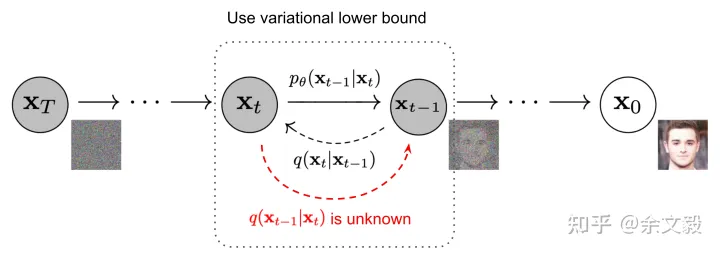
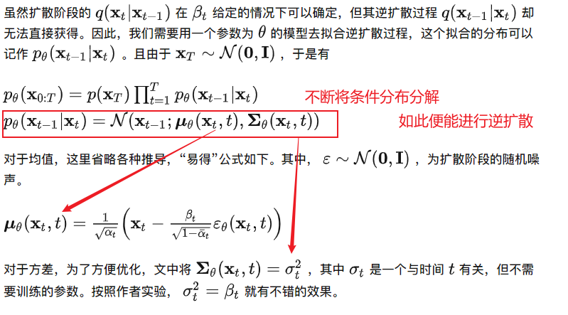
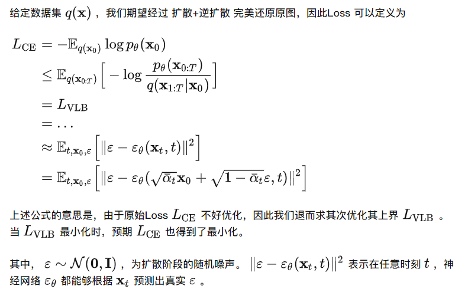
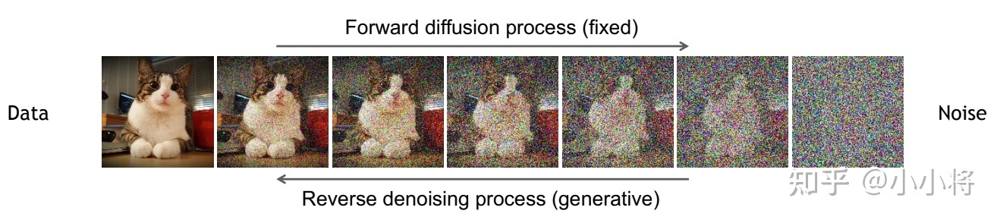

# Note

[toc]

## 背景知识

生成模型分类：

- seq2seq，自回归解码
- 基于GAN：不显式建模，直接生成数据
- Flow模型：数学严谨，可逆
- 基于VAE
- diffusion

## 正文

### 背景

2015年提出DPM（Diffusion Probabilistic Models扩散概率模型）
2020年提出DDPM（Denoising Diffusion Probabilistic Models去噪扩散概率模型）

### DDPM

核心思路：（与VAE很类似）
扩散过程：将海量的图像信息，通过某种统一的方式encoder成一个高斯分布。
逆扩散过程：从高斯分布中随机采样一份数据，并进行decode，预期即可生成一个有现实含义的图像；

  

#### 扩散阶段

给定**初始数据分布$x_0\sim q(x)$**，其中$q(x)$可以为任意分布，我们不断地向分布中添加高斯噪声，该噪声的标准差是以==固定值==$\beta_t$而确定的，均值是以固定值$\beta _t$和当前$t$时刻的数据$x_t$决定的。
每一次转换都是在==上一次(即当前状态，无需过去状态)生成的图像基础上添加一些噪声。该过程为马尔科夫过程==。

> 往往称不同step的方差预先设定为variance/noise schedule，一般，越后面的step方差越大，==扩散过程一般是固定的，没有可学习的参数==。

- 随着$t$的不断增大，添加的噪音越来越多，最终数据分布$x_T$变成了一个各项独立的高斯分布。$x_T \sim \mathcal{N}(0,I)$

$$
q(x{_t}|x{_{t-1}})=N(x{_t};
\sqrt{1-\beta{_t}}x{_{t-1}},\beta{_t}\boldsymbol{I})\tag{1}
$$

$$
q(x_{1:T}|x_0)=q(x_1,x_2...x_T|x_0)=\prod_{t=1}^T q(x_t|x_{t-1})
$$

- 任意时刻的$q(x_t)$可以完全基于$x_0$和$\beta _t$计算出来，而不需要迭代，首先定义$\alpha{_t}=1-\beta{_t},\bar a_t= \prod_{i=1}^T a_i$

$$
\begin{aligned}
x_t&=\sqrt{1-\beta{_t}}x{_{t-1}}+\sqrt{\beta{_t}}z_{t-1}\\
&=\sqrt{a{_t}}x{_{t-1}}+\sqrt{1-a{_t}}z_{t-1}\\
&=\sqrt{a{_t}a{_{t-1}}}x{_{t-2}}+
\sqrt{a{_t}(1-a_{t-1})}z_{t-2}+\sqrt{1-a{_t}}z_{t-1}\\
\end{aligned}
$$

$z$为噪音，由均值为0，方差为1的正态分布产生。$\sqrt{a{_t}(1-a_{t-1})}z_{t-2}$服从$N(0,a_t(1-a_{t-1}))$，$\sqrt{1-a{_t}}z_{t-1}$服从$N(0,1-a_t)$，两者相加可以重参数化成一个随机变量$z$的形式，服从$N(0,1-a_ta_{t-1})$

$$
\begin{aligned}
x_t&=\sqrt{a{_t}a{_{t-1}}}x{_{t-2}}+
\sqrt{1-a{_t}a{_{t-1}}}\bar z_{t-2}\\
&=\sqrt{a{_t}a{_{t-1}...a_2a_1}}x_0+
\sqrt{1-a{_t}a{_{t-1}...a_2a_1}}\bar z_t\\
&=\sqrt{\bar a_t}x_0+\sqrt{1-\bar a_t}\bar z_t
\end{aligned}
$$

> $\bar{z}_{t-2}$意思是指合并两个高斯分布

最终得到

$$
x_t=\sqrt{\bar a_t}x_0+\sqrt{1-\bar a_t}\bar z_t\tag{2}
$$

$$
q(x{_t}|x_0)=N(x{_t};\sqrt{\bar a_t}x_0,(1-\bar a_t)\boldsymbol{I})\tag{3}
$$
即，当给定原始图像$x_0$，$x_T$不需要真的执行T次操作，而是可以直接根据上述公式采样得出。

要点：

1. 扩散过程是逐层增加噪声的过程
2. 扩散过程是马尔科夫链
3. 每一步的噪声是高斯噪声，加噪用方差参数控制
4. 方差是提前定义好的，正向扩散过程是无参模型

#### 逆扩散过程

扩散过程是将数据噪音化，逆扩散过程就是一个去噪的过程，从一个随机噪音$x_T \sim \mathcal{N}(0,I)$开始，根据反向过程的每一步的真实分布$q(x_{t-1}|x_t)$，逐渐去噪生成一个真实的样本，所以逆扩散过程就是生成数据的过程。

  

#### loss

  

> ==$\epsilon$是我们正向添加的已知的固定的噪声，$\epsilon_\theta$函数是对应的反向过程中的UNet网络结构，$x_t$是输入，$t$是输入的time embedding==
> $x_t$可以视作$x_0和\epsilon$的混合，$x_t$为随机采样的$x_0$和时间步长t和噪声$\epsilon$来产生的
> 函数$\epsilon_\theta(x_t,t)$用来预测$x_t$的噪声分量
> 所以目标函数就是实际误差和预测误差之间的均方误差。

#### 总结

扩散过程是不断增加噪音直到数据变成随机噪音$x_T \sim \mathcal{N}(0,I)$，扩散过程一般是固定的，通过使用预定义好的variance schedule。

相比于VAE，diffusion model的latent code和原始数据同纬度，而VAE是bottleneck类型
  

概括和推导可参考：
Diffusion models beat GANs on image synthesis.
