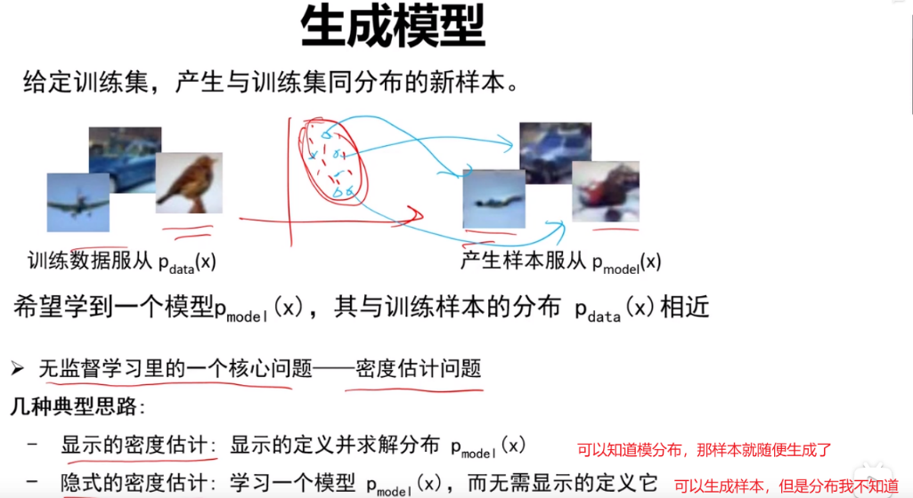
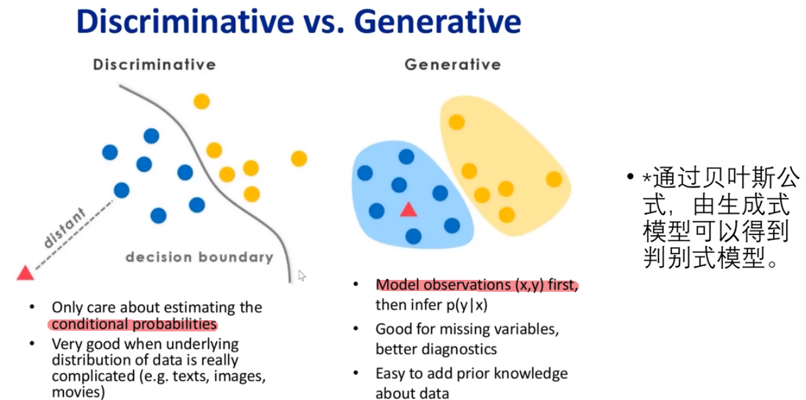
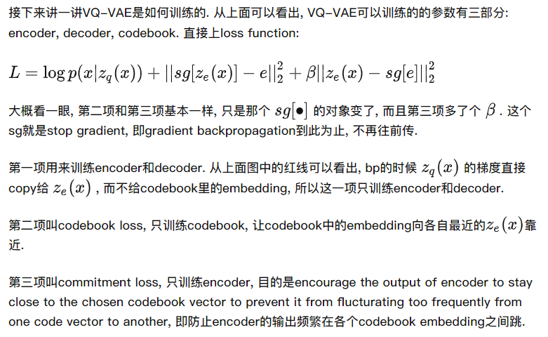

# Generative models

[toc]

## 背景

### 判别式模型和生成式模型

给定输入x和标签y

**判别式模型 (Discriminative Model)**：直接**对条件概率p(y|x)进行建模**，常见判别模型有：线性回归、决策树、SVM、KNN、神经网络等；

**生成式模型 (Generative Model)**：**对联合分布概率p(x,y)进行建模**，常见生成式模型有：隐马尔可夫模型HMM、朴素贝叶斯模型、高斯混合模型GMM、LDA等；
  

区别：

- 生成式模型更普适；判别式模型更直接，目标性更强
- **生成式模型关注数据是如何产生的，寻找的是数据分布模型**；**判别式模型关注的数据的差异性，寻找的是最优分类面，不能反映数据本身的特性**
- **由生成式模型可以产生判别式模型，但是由判别式模式没法形成生成式模型**
  

生成模型意味着对**输入特征和标签信息**的联合分布进行建模，无监督信息意味着不存在标签，则在无监督生成模型中，是**对输入特征的概率密度函数进行建模**

## 生成类任务

**目标**：估计分布函数P(x)，然后从分布函数中采样x
**难点**：**样本点太少，而我们要去预测看不见的点的概率密度**。由于维度诅咒：样本点再多，也没有我的样本空间大；
> 如果有足够多的样本点，能够覆盖所有的x，并且所有样本点都采样足够多次，那么可以直接统计出每个样本点x的概率密度；

**解决方法**：加入人类设定的先验$prior$知识，限制搜索空间，使得规模能被计算机计算。

- 比如对于一些样本点求其拟合函数：加入先验“拟合函数为二次函数”，那就大大简化了
- GPT的先验：对于词表示相近的词，他们产生的句子也是相近的
- GAN的先验：**假定数据的样本点x的分布可通过正态分布来生成出来；**

## 生成模型评价指标-IS FID

评价一个生成模型，最主要的两点：生成的图片是否清晰？生成的图片是否多样？

### Inception Score

IS-Inception Score：$IS(G) = exp(E(D_{KL}(p(y|x))||p(y)))$
p(y|x)的熵越低，生成的图像的质量越好；p(y)的熵越高，生成图像的多样性越好。所以我们需要让让两个分布之间的KL散度越大越好，生成的图片更加清晰、多样！
**IS越大，生成图片的清晰度和多样性越好。**

### Fréchet Inception Distance

FID-Fréchet Inception Distance：用来计算真实图像和生成图像之间的距离。**FID值越小说明结果越好，说明生成的图片和真实图像之间相似度越高**。

### Peak Signal to Noise Ratio

峰值信噪比PSNR：
图像与影像压缩中典型的峰值讯噪比值在30dB 到50dB 之间，愈高愈好。

PSNR接近50dB ，代表压缩后的图像仅有些许非常小的误差。
PSNR大于30dB ，人眼很难察觉压缩后和原始影像的差异。
PSNR介于20dB 到30dB 之间，人眼就可以察觉出图像的差异。
PSNR介于10dB 到20dB 之间，人眼还是可以用肉眼看出这个图像原始的结构，且直观上会判断两张图像不存在很大的差异。

## GAN

原理：左右手互博，训练一个生成器网络G和一个判别器网络D
G：**给定一个随机噪声**，希望他能生成一个比较真实的图片，目的是“骗过”判别器
D：负责判别输入的数据是真实的（来自数据集）还是生成的（来自生成器）
两个网络彼此较量形成对抗关系，二者都不断提高自己，所以最后能够生成比较真实的图片

**优点：**

- 因为GAN就是以假乱真，所以图像**很逼真**，保真度非常高，有时候人眼都不好区分
- 相比VAE, GAN没有变分下界,如果鉴别器训练良好,那么生成器可以完美的学习到训练样本的分布.换句话说,GAN是渐进一致的,但是VAE是有偏差的，因为VAE优化对数似然的下界,而不是似然度本身,这看起来导致了VAE生成的实例比GAN更模糊
- GAN应用到一些场景上，比如图片风格迁移，超分辨率，图像补全，去噪，避免了损失函数设计的困难，只要有一个的基准，直接上判别器，剩下的就交给对抗训练了

**缺点：**

- GAN不适合处理离散形式的数据，比如文本
- 训练不够稳定，因为要同时训练两个网络，难以达到纳什均衡，很容易坍塌
- **多样性差，不太具备原创性**，它的多样性来自于最开始的随机噪声
- 不是一个概率模型，生成是隐式的，你不知道他做啥的，遵循什么分布
- 难以捕捉完整的数据分布

## ARM(autoregressive models)

优点：很好地估计概率密度
缺点：计算复杂度高、顺序采样将其限制在低分辨率图像上

## AE

autoencoder是将原图x经过encoder成为bottleneck，然后经过decoder为x'，希望重建误差最小。
主要目的是学latent code特征的，然后拿去做分类、检测等任务。也就是说他学到的不是概率分布，无法对其进行采样，不能做生成任务

## DAE

Denoising AutoEncoder去噪自编码器：先将原图x进行一定程度的打乱，变成$x_{corrupted}$，然后后续和AE一样，最终让模型重建出x而不是$x_{corrupted}$；
即在AE基础上，通过向输入注入噪声（打乱），然后利用含噪声的样本重构不含噪声的干净的输入，这种训练策略也使得DAE能够学习到更能反映输入数据的本质特征。

**优点：**

- 模型比较稳健，也不容易过拟合；因为图像冗余性太高了，即使把原图做一些污染也没问题，有点类似MAE

**缺点：**

- 和AE一样不是做生成的，因为他并没有学一个分布，主要目的是学bottleneck特征的，然后用作分类、检测等任务

## VAE

Variational autoencoder：因为如果从AE的latent code中采样生成图片，由于隐空间没有规则性，无法生成想要的图片。故VAE在AE优化重建误差的基础上同时保证隐空间的规则性，因此，考虑将输入编码为一个接近标准正态分布的分布，而不是向AE一样编码成一个点。
生成图片时，从隐空间分布中采样一个点便可通过decoder进行生成了。

**优点：**

- 因为学的是概率分布，然后从分布中抽样，所以生成图片的**创造性和多样性很好**

缺点：

- VAE生成的**图片比较模糊**

**对比GAN和VAE**
GAN的generator和VAE的decoder类似，都是通过一个随机输入产生图片。
GAN和VAE的最大区别在于如何判断生成图片的质量，VAE直接对真实图片和生成图片进行像素级别的监督，而GAN是通过一个学习一个判别器D来让真实图片和生成图片的整体判断趋于一致。

正是由于度量方式的不同，导致VAE和GAN之间各有优缺点:
VAE由于中间的latent code是由输入图片编码产生的，导致latent code编码和图片对应性更强，生成图像更加规则，又由于像素级别的监督，无法更好的关注全局信息，导致生成图片模糊；
而GAN由于随机输入和图片对应性弱，导致生成图像容易跑偏，又由于判别器是对图像整体进行判断的，生成图片连续性更强，可以生成更加清晰的图片。因此，可以结合GAN和VAE的优点进一步产生更加规则清晰的图片(实际上后续很多生成模型的研究都是围绕这一点展开的)。

## VQ-VAE

vector-quantised VAE：对VAE做量化

为何要量化？

VAE的隐变量z的每一维都是一个连续的值, 而VQ-VAE最大的特点就是z的每一维都是离散的整数。

即使现实中声音图像是连续的，但当你表示出来的时候一般都是离散化了的，比如图像变成像素，语音被抽样，从回归变成了分类；

离散化之后才可以进行输入到transformer进行处理，此外也便于scale模型。

如何进行量化？

VQ：首先搞一个codebook，这个codebook是一个embedding table，可将codebook理解为聚类的中心，大小假设为（8192，568），那就意味着有8192个聚类中心；然后当我们给定一个图片，编码为一个特征图向量vector，我们在这个table中找到和vector（输入图片）最接近的一个embedding，用这个embedding的index来代替这个vector，存在z矩阵中(latent code)；
然后后续就用不上特征图向量vector了，而是将index对应的codebook中的embedding拿出来生成一个新的特征图向量fq(quantised feature vector)，这个特征是很可控的，优化起来比较容易，然后从这个特征图中解码出图片即可。

  

**训练过程**
  

related：[VAE](https://zhuanlan.zhihu.com/p/91434658)

## DALL-E

基于VQ-VAE的工作

## Diffusion model

往图片中不断加噪声，直至服从标准正态分布的噪声，然后 在反向不断恢复生成图片。反向中所有的模型共享参数，只不过你需要抽样很多次，所以推理的时候最慢，开销远远大于其他模型

**逆扩散过程使用什么模型？**
由于逆扩散的时候图片大小不变，一般使用UNet，也可以用其他的；UNet是一个CNN，先搞个编码器不断缩小图片，然后用一个解码器不断恢复图片，前后两个图片尺寸大小一致；为了让恢复的更好，添加了很多skip connection ，直接把信息从前面推过来，能恢复一些细节；

优点：

- 多样性比较好

缺点：

- 保真度比较差，比不过GAN；

但后来的一些列工作改善了保真度的问题，比如DDPM，improved DDPM，diffusion model beat GAN，GLIDE，DALLE2等等；著名的是**guidance technique**，牺牲多样性来获得保真度。

diffusion model和VAE的区别：

- 扩散模型的encode过程是固定的，而VAE是学习得到的
- VAE的bottleneck比输入小很多，而扩散模型一样
- 扩散模型有步数的概念，需要time embedding

**2015年diffusion model想法成型。**
**2020/06 DDPM开山之作，贡献有三：**
其一：之前大家都觉得要用Xt预测Xt-1，但本文提出预测从Xt到Xt-1我们的噪声是怎么加的；
其二：以前如果你要预测一个正态分布需要学均值和方差，而作者发现你只需要预测这个均值就行，方差定成一个常数，效果就已经很好了，再次降低模型优化的难度
其三：加了一个time embedding输入，告诉U-Net模型现在到了反向扩散的第几步，因为我们的UNet是共享参数的，而我们想让模型在最开始先生成一些粗糙的轮廓，后面再逐步精细，而非每一步生成一样的东西。

**2020年底 improved DDPM(OpenAI)**
.

1. 还是学了方差，效果变得更好
2. 从一个线性添加噪声的schedule改为了按余弦形式添加噪声，效果也不错，类似学习率的schedule吧
3. 尝试了使用更大模型，效果更好了，这对OpenAI那可是好消息，所以继续推进

2021/05 Diffusion models beat GANs on image synthesis

1. 提出classifier guidance的方法，去引导模型采样和生成，使生成的图像更加逼真，而且也大大加速了反向采样的速度，25次采样就能获得一个图片；

> 我们之前一般得1000个step才可以完成

**GLIDE**
提出classifier free guidance
