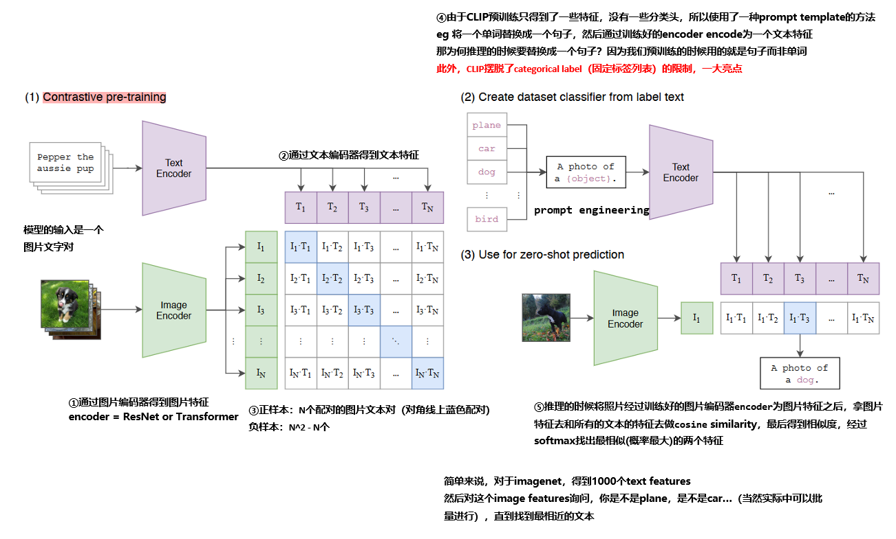
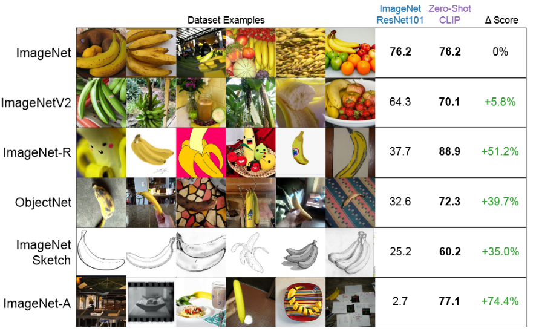

# CLIP

[toc]

因为和自然语言处理结合，CLIP学出来的特征和我们用语言所描述的某个物体已经产生了强烈的联系。

2020年10月随着google提出ViT之后cv领域涌现了一大批vit的工作，除了vit，OpenAI在2021年1月发布了DALL-E和CLIP影响力同样非凡，这两个模型都属于结合图像和文本的多模态模型，**DALL-E是基于文本来生成模型**的模型，**CLIP是用文本作为监督信号来训练可迁移的视觉模型**，同样引发了新的研究高潮。

==本质：利用text信息监督视觉任务预训练，本质就是将分类任务化成了图文匹配任务，效果可以全监督方法相当。==

==预训练阶段使用对比学习，利用文本的提示做了zero-shot的迁移学习==

## 1. Motivation

CV中，最常用的**迁移学习方法**是预训练-微调式，通常预训练是有监督训练，需要大量标注数据，标注成本太高，所以近年来，出现了一些自监督学习方法（无监督预训练+有监督微调），包括基于对比学习的方法MoCo和SimCLR，和基于图像掩码的方法MAE和BeiT。

但自监督在下游任务上仍然需要有监督微调，无法实现zero-shot。但NLP中zero-shot比较成熟了，有很多自回归(GPT)或者掩码类型(BERT)的任务无关的模型表现得非常好。

所以NLP领域的text-to-text，也就是文字进文字出，并没有做一个什么特殊的下游任务，那么如此在应用到一个下游任务的时候不用去研究一些特殊处理，那么能不能将这种框架运用于CV领域？也就是使用大量易收集的图片文本对，去训练一个可在下游任务上实现zero-shot的模型。

We have investigate whether it is possible to transfer the success of ==task-agnostic web-scale pre-training== in NLP to CV.

## 2. 正文

CLIP全称$Contrastive\ Language\text{-}Image\ Pre\text{-}training$，即一种**基于对比文本-图像对的预训练方法**\模型。CLIP是基于对比学习的多模态模型，CLIP的**训练数据是文本-图像对**：一张图像和它对应的文本描述，这里希望通过对比学习，**模型能够学习到文本-图像对的匹配关系**，模型如下图所示：

  
概括一下过程：
==对比预训练学习：==

1. 通过图片编码器得到图片特征 encoder = ResNet or Vision Transformer，通过文本编码器得到文本特征 encoder = Text Transformer or Continuous Bag Of Words(CBOW)
2. 然后将N个图片特征和N个文本特征进行两两结合得到$N^2$个可能的文本-图像对的相似度(Cosine Similarity)，然后得到N个正样本(N个配对的图片文本对（对角线上蓝色配对）)，剩下的$N^2-N$个样本是负样本，那么==CLIP的训练目标==就是**最大化正样本的相似度，同时最小化负样本的相似度**。

预训练伪代码如下所示：

```python
# image_encoder - ResNet or Vision Transformer
# text_encoder - CBOW or Text Transformer
# I[n, h, w, c] - minibatch of aligned images
# T[n, l] - minibatch of aligned texts (batchsize, length of text)
# W_i[d_i, d_e] - learned proj of image to embed
# W_t[d_t, d_e] - learned proj of text to embed
# t - learned temperature parameter

# 分别提取图像特征和文本特征
I_f = image_encoder(I) #[n, d_i]
T_f = text_encoder(T) #[n, d_t]

''' 对两个特征通过投影层进行线性投射，（**学习如何从单模态到多模态**），得到相同维度的特征，并进行l2归一化,，就得到了最终的用来对比的n个图像和文本特征'''
I_e = l2_normalize(np.dot(I_f, W_i), axis=1)
T_e = l2_normalize(np.dot(T_f, W_t), axis=1)

# 计算缩放的余弦相似度：[n, n]
logits = np.dot(I_e, T_e.T) * np.exp(t)

# 对称的对比学习损失：等价于N个类别的cross_entropy_loss
labels = np.arange(n) # 对角线元素的labels
loss_i = cross_entropy_loss(logits, labels, axis=0)
loss_t = cross_entropy_loss(logits, labels, axis=1)
loss = (loss_i + loss_t)/2 '''计算对称式的目标函数'''
```

==zero-shot预测==
与常见的CV模型“预训练-微调”策略不同，CLIP可直接实现zero-shot的图像分类，即预训练好了之后，应用到下游分类任务上无需再使用任何训练数据，

1. 由于CLIP预训练只得到了一些特征，并没有什么分类头，所以需要用其他的方法，CLIP根据任务的分类标签构建每个每个类别的描述文本（$prompt\ template$）:eg $A\ photo\ of\ \{label\}$，然后将文本送入**预训练好的**text encoder得到对应的文本特征；
   > eg 对于imageNet任务，只需将1000个label改为句子即可；并且打破了categorical label（固定标签列表）的限制
2. 将要预测的图像送入预训练好的image encoder得到相应的图像特征，然后与1000个文本特征计算cosine similarity，将相似度送入softmax，找出相似度最大的文本对应的label作为图像分类预测结果。

数据集：
OpenAI从互联网收集了共4个亿的文本-图像对，论文称之为**WebImageText(WIT)**，孕育出来了CLIP和DALLE两篇工作，物有所值

## 3. question

### 3.1 什么叫利用自然语言监督信号来预训练视觉模型？为何这么做？

Natural language supervision意思就是用一个图像-文本对，而非图像-单词对进行训练。

为什么要用自然语言的监督信号来训练一个视觉模型？？？

1. 互联网上公开了大量的图像-文本对形式的数据，方便收集。我们现在只需要去网上下载文字图像配对，不用做其他标注步骤。
2. 现在的监督信号是一个文本，而非N选1的标签了，那模型的输入输出自由度就大了很多，容易扩展。
3. 正因为训练时将图片和文字绑定在了一起，所以==现在学到的特征不再单单的是一个视觉特征，而是一个多模态的特征，语义性非常强，迁移效果非常好==（详见下图）。**而单模态学的都只是视觉特征（如MOCO，MAE）**，很难做zero shot的迁移。


**因为和自然语言的结合，所以CLIP学出来的视觉特征和我们用语言所描述的某个物体已经产生了强烈的联系。** 比如一个香蕉，不论是自然图像中出现的香蕉，还是动漫中的香蕉，还是素描的香蕉还是加过对抗性样本的香蕉，CLIP都能知道它对应的是香蕉单词迁移效果非常好，而imageNet101效果不行。

### 3.2 分类的时候为什么将确切exact的单词换为global句子？

1. 因为在预训练的时候用的是句子而非单词。
2. 有些单词有多个不同的含义

### 3.3 CLIP有哪些创新点？

#### 打破了categorical label的限制

categorical label是固定标签限制，比如imageNet限制为1000类，这可以简化模型的训练和数据集的搜集，但限制了模型的泛化性，不易扩展。你可以随意收集图片文本对，不管类别的限制，好收集好训练。**新意度拉满**

#### 将视觉的语义和文字的语义联系到了一起

学到了多模态的特征，语义信息更加丰富。

#### 迁移能力很强

能通过zero-shot的方式在很多数据集上取得很好的效果

#### prompt engineering

prompt learning的核心是通过构建合适**prompt 提示/文本引导**来使预训练模型能够直接应用到下游任务，这和之前的预训练+微调属于不同的范式。本文提出了一种prompt ensembling的集成提示的方法，本文用了80中prompt template

### 3.4 有哪些局限和不足？

1. 虽然很多数据集上zero-shot可以干掉res50，but很多数据集上res50和SOTA差了很远，所以性能强，但并非强到不可一世。虽说扩大模型可以继续变强，但达到SOTA大概得1000倍，OpenAI也无能为力。
2. 在细分类的数据集上，效果不咋地。
3. 在更难的任务中，效果不咋地，比如数一数图片中有多少个物体。
4. 虽然在自然图像中做得很好，但在做推理的时候，当数据和训练的数据差的很远的时候（即训练中没出现过类似的图片时），CLIP泛化性很差，比如MNIST数据集。（训练集中并没有MNIST那种图片）
5. CLIP是从你给定的类别中做的选择，相比而言“直接去生成图像的标题”会更加灵活，即生成一个新的输出（GPT化），可惜受限于计算资源的问题。以后可能会将对比学习的目标函数和生成式的目标函数结合在一起
6. 数据利用不高效，用的数据太多了。
7. 数据没清洗，可能带有社会政治偏见。

最后
CLIP新意度拉满、有效性拉满、解决的问题大小 拉满。
