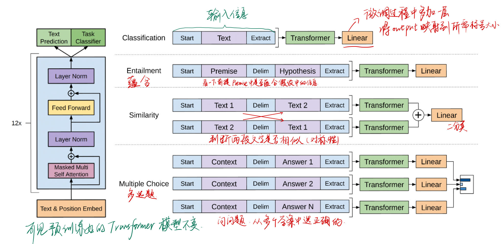
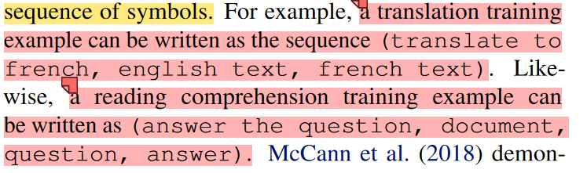

# Note

[toc]

GPT1只使用Transformer的Decoder模块；
BERT只使用Transformer的Encoder模块，BERT Base比GPT1好(1.2亿参数)，然后还训练了一个BERT Large(3.4亿参数)

GPT2技术路线不变，依然用Decoder模块，然后收集了比BERT更大的数据集，训练了更大的模型(15亿参数)，比BERT Large大，然后提出了**zero-shot**设定（在做下游任务时，不需要下有任务的任何标注的信息）(*新意度拉得很高，但有效性不足*)

GPT3数据和模型都比GPT2大了100倍（1750亿个参数），暴力出奇迹，效果非常惊艳
（*补充有效性，降低新意度，将zero-shot改为few-shot*）

## GPT1

GPT的''预训练-微调''思想其实八九年在cv领域已经很火热，但由于NLP领域没有类似于ImageNet这种大规模标记好的数据。但GPT中使用的是**没有标号的数据**进行预训练。

GPT的这个目标函数是更难的，预测未来肯定比完形填空（BERT）更难，所以GPT1效果要弱于BERT，但作者不断推进，搞到GPT3之后功能相当炸裂（天花板高于BERT了）

不同下游任务的输入
  

## GPT2

我们知道GPT1中对于不同下游任务的输入进行了不同的构造（开始符、中间符和结束符），模型不认识这些符号，但是微调的时候，给定一些labeled训练样本使模型可以认识这些符号的含义。
但此时，要做zero-shot（做下有任务的时候模型不能被调整），所以不能在下游任务的输入引入一些模型不认识的符号。所以，此处用了“特殊分割符-prompt提示”（2018年McCann的工作）
  

巨大模型加上全程无监督学习zero shot确实使有一些任务表现很好，但有一些任务表现不咋地。但实验表明随着模型量和数据量的增加，表现在变得更好。

## GPT3

给一些labeled样本，但不给太多，可控。
在做下游任务的时候不需要微调和梯度更新
最后，我们发现 GPT-3 可以生成人类评估者难以将其与人类撰写的文章区分开来的新闻文章样本。