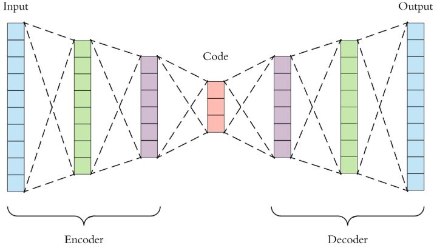

# VAE

[toc]

## 基础回顾

latent variable：隐变量/潜在变量/latent code:是指通过模型从观测数据中推断出来的变量，一般指隐含层输出的向量。

无监督学习：
样本只有x，没有标签y。
目标是**找出隐含在数据中的模式或结构**；而有监督学习的目标是找到x->y的映射。
举例：聚类、降维、特征学习（auto-encoder）、密度估计等。

## Autoencoder（无监督学习）

在说VAE之前，自然要先说到传统的**自编码器 (Autoencoder)**。下图即是一个自编码的实例。**自编码器类似于一个非线性的PCA**，是一个**利用神经网络来给复杂数据降维**的模型。
AutoEncoder的输出和输入有相同的维度，而不同于分类任务中输出是类别数。
> 最大的特点是中间隐藏层的神经元个数非常少，中间层向量有降维的作用，所以从本质上说，自编码器是一种数据压缩算法。

  

  

自编码器包含一个编码器$z = g(X)$，它的输出$z$我们称作编码，$z$的维度往往远小于输入$X$的维度。自编码器还包括一个解码器$\tilde{X}=f(z)$；
> $X$为数据集的集合，$x_i$为数据集中的一个样本

我们希望解码器解码得到的$\tilde{X}$能够尽可能的接近$X$，所以自编码器一个常用的损失函数是。$\ell = \|X - \tilde{X}\|^2$。这样一来，模型训练结束后，==我们就可以认为编码z囊括了输入数据X的大部分信息，也因此我们可以直接利用z表达原始数据，从而达到数据降维的目的.==

我们现在仔细研究一下这个模型的解码器。$g: \mathbb{R}^d  \rightarrow \mathbb{R}^{C \times H \times W}$。**==这个解码器只需要输入某些低维向量z，就能够输出高维的图片数据X==**。**==那我们能否把这个模型直接当做生成模型，在低维空间$\mathbb{R}^d$中随机生成某些向量z，再喂给解码器f(z)来生成图片呢？==**

答案是：YES! 运气好的话我们可以得到一些有用的图片，但是对绝大多数随机生成的z，只会生成一些没有意义的噪声f(z)。

为什么会这样呢？这是因为我们**没有显性的对z的分布p(z)进行建模**，我们并**不知道哪些z能够生成有用的图片**。我们用来训练f(z)的数据是有限的，f可能只会对极有限的z有响应。而$\mathbb{R}^d$又是一个太大的空间，如果我们只在这个空间上随机采样的话，我们自然不能指望总能恰好采样到能够生成有用的图片的。

在Autoencoder的基础上，==显性的对z的分布$p(z)$进行建模，使得自编码器成为一个合格的生成模型==，我们就得到了**Variational Autoencoders**，即今天的主题，**变分自编码器**。

<!-- ## 推导（Derivation）

对于自编码器来说，z的分布是不确定的，因此只能在$\mathbb{R}^d$上采样、碰运气。我们为什么不给定z一个简单的分布，将采样的空间缩的很小呢？我们不妨假设，$z \sim \mathcal{N}(0, I)$，其中$I$代表一个**单位矩阵**。也就是说，我们将z看作是一个**服从标准多元高斯分布**的多维随机变量。

### Decoder

  
   -->

---
把一堆真实样本通过编码器网络变换成一个理想的数据分布，然后这个数据分布再传递给一个解码器网络，得到一堆生成样本，生成样本与真实样本足够接近的话，就训练出了一个自编码器模型。那VAE(变分自编码器)就是**在自编码器模型上做进一步变分处理**，**使得编码器的输出结果能对应到目标分布的均值和方差**，如下图所示。

## 设计思路

VAE最想解决的问题是什么？当然是如何**构造编码器和解码器，使得图片能够编码成易于表示的形态，并且这一形态能够尽可能无损地解码回原真实图像**。

  
Deep Auto-Encoder模型如上图所示，其中encoder和decoder皆为神经网络，不再像PCA那样通过奇异值分解SVD这种数学方法计算变化矩阵。因为**神经网络具备强大的拟合能力，使得编码（Code）的维度能够比原始图像（X）的维度低非常多**。
Deep Auto-Encoder能够把一个784维的向量（28*28图像）压缩到只有30维，并且解码回的图像具备清楚的辨认度。
  

至此我们构造出了一个重构图像比较清晰的**自编码模型**，但是这并没有达到我们真正想要构造的生成模型的标准，因为，**对于一个生成模型而言，解码器部分应该是单独能够提取出来的**，并且对于在规定维度下任意采样的一个编码，都应该能通过解码器产生一张清晰且真实的图片。

我们先来分析一下现有模型无法达到这一标准的原因。

如下图所示，我们用一张全月图和一张半月图去训练一个AE，经过训练，模型能够很好地还原出这两张图片。接下来，我们在latent code上中间一点，即两张图片编码点中间处任取一点，将这点交给解码器进行解码，直觉上我们会得到一张介于全月图和半月图之间的图片（比如阴影面积覆盖3/4的样子）。然而，实际当你那这个点去decode的时候你会发现**AE还原出来的图片不仅模糊而且还是乱码**的。一个直观上的解释是AE的Encoder和Decoder都使用了DNN，DNN是一个非线性的变换过程，因此在latent space上点与点之间transform往往没有规律可循。

  

如何解决这个问题呢？一个思想就是==引入噪声，扩大图片的编码区域，从而能够覆盖到失真的空白编码区==。其实说白了就是**通过增加输入的多样性从而增强输出的鲁棒性**。当我们给输入图片进行**编码之前引入一点噪声，使得每张图片的编码点出现在绿色箭头范围内，这样一来所得到的latent space就能覆盖到更多的编码点**。此时我们再从中间点抽取去还原便可以得到一个我们比较希望得到的输出，如下所示：

虽然我们为输入图片增添了一些噪声使得latent space能够覆盖到比较多的区域，但是还是有不少地方没有被覆盖到，比如上图右边黄色的部分因为离得比较远所以就没编码到。因此，我们是不是可以**尝试利用更多的噪音，使得对于每一个输入样本，它的编码都能够覆盖到整个编码空间？**只不过这里我们需要保证的是，**对于源编码附近的编码我们应该给定一个高的概率值，而对于距离原编码点距离较远的，我们应该给定一个低的概率值**。没错，总体来说，我们就是要**将原先一个单点拉伸到整个编码空间**，即==将离散的编码点引申为一条连续的接近正态分布的编码曲线==，如下所示：
  

这种**将图像编码由离散变为连续的方法，就是变分自编码的核心思想**。

## VAE的模型架构

  

在auto-encoder中，编码器是直接产生一个编码的，但是在VAE中，为了给编码添加合适的噪音，**编码器会输出两个编码**，一个是原有编码$(m_1,m_2,m_3)$，另外一个是**控制噪音干扰程度的编码**$(\sigma_1,\sigma_2,\sigma_3)$，是为随机噪音码$(e_1,e_2,e_3)$分配权重，然后加上exp的目的是为了保证这个分配的权重是个正值，最后将原编码与噪音编码相加，就得到了VAE在code层的输出结果$(c_1,c_2,c_3)$。其它网络架构都与Deep Auto-encoder无异。

损失函数方面，除了必要的**重构损失reconstruction errot**外，VAE还增添了一个损失函数（见上图Minimize2内容），不加会出现这样的问题：**为了保证生成图片的质量**越高，**编码器希望噪音对自身生成图片的干扰越小，于是分配给噪音的权重越小**，这样**只需要将$(\sigma_1,\sigma_2,\sigma_3)$赋为接近负无穷大的值**就好了。所以，第二个损失函数就有**限制编码器走这样极端路径**的作用，这也从直观上就能看出来，$exp(\sigma_i)-(1+\sigma_i)$在$\sigma_i=0$处取得最小值，于是$(\sigma_1,\sigma_2,\sigma_3)$就会避免被赋值为负无穷大。

## VAE的作用原理

我们知道，对于生成模型而言，主流的理论模型可以分为隐马尔可夫模型HMM、朴素贝叶斯模型NB和高斯混合模型GMM，而VAE的理论基础就是**高斯混合模型**。

**高斯混合模型：任何一个数据的分布，都可以看作是若干高斯分布的叠加。**
  
如图所示，如果P(X)代表一种分布的话，存在一种拆分方法能让它表示成图中若干浅蓝色曲线对应的高斯分布的叠加。这种拆分方法已经证明出，当拆分的数量达到512时，其叠加的分布相对于原始分布而言，误差是非常非常小的了。(类似于**全概率公式**，但此时未必符合全概率公式的条件)

$$
P(x)=\sum _m P(m)P(x|m)
$$
> P(m=1)表示第一个绿色的高斯模型发生的概率

一种方法：直接**用每一组高斯分布的参数作为一个编码值**实现编码。

从正态分布中采样一个Z（所有蓝色点），就得到了很多个高斯组件，这样合并起来可以得到P(x)；

**混合高斯模型只能解决有限个高斯组件的混合问题；而VAE用了无限个高斯组件，这通过神经网络来实现：给定一个$z_i$（一个蓝色点），去学习一个对应的均值$\mu(z_i)$和方差$\sigma(z_i)$，然后在用这个均值和方差去生成图像；**

  

---
---
---
---

## VAE推导

我们**加入先验**：确定$z$服从标准高斯分布$N(0,I)$，将采样空间缩小。
此时我们可以认为数据集$X$是由某个随机过程生成的，z是这个随机过程中的隐变量。步骤：

- 从先验分布$p(z)$中采样得到样本$z_i$
- 根据$z_i$，从条件分布$p(X,z_i)$中采样得到一个数据点$x_i$

### Decoder

先给Decoder输入一个从标准正态分布$p(z)$中采样得到的$z_i$，然后希望Decoder学会一个映射，输出$z_i$对应的X的分布，即$p(X|z_i)$
然后又给出**先验假设**：给定采样的$z_i$后，$X$都服从独立的高斯分布：
$$
p(X|z_i)\sim N(\mu_{z_i}, \sigma_{z_i})
$$

Decoder拟合出$\mu_i和\sigma_i$之后，就知道了$p(X|z_i)$具体的分布。

### 目标

对于生成模型，我们的目标是对数据本身的分布$p(X)$建模；如果能得到一个逼近真实分布$p(X)$的$p_\theta(X)$，那么就可以从中采样，生成一些可能的数据点。

那么如何对$p_\theta(X)$建模？
$$
p_\theta(X)=\int_z p_\theta(X|z)p(z)dz \approx \frac{1}{m}\sum_{j=1}^m p_\theta(X|z_j)
$$

---

## 梳理

目的：生成模型想要对P(X)进行建模
> P(X)是一个生成手写数字图片的分布，从该分布中采样的$x_i$代表不同数字和样式的图片

已有：一些手写数字图像$X：\{x_1,x_2,...,x_N\}$
so，如何构建P(X)?

### 极大似然估计

我们一般用极大似然估计法去**根据样本估计总体**，但我们一般用其估计总体的**参数**（“模型已定，参数未知”），此处我们需要求的是总体分布，怎么办？
**添加先验假设**：P(X)服从高斯分布$N(\mu, \sigma^2)$
那么我们就将分布估计问题转化为了参数估计问题。

MLE假设采样的训练数据服从独立同分布，故分布可分解为：
$$
L(\theta;X) = P(X;\theta)=\prod_{i=1}^n p(x_i;\theta)
$$
此式也称作**似然函数**，我们要最大化似然函数，
$$
\hat{\theta} = \mathop{\arg\max}\limits_\theta \prod_{i=1}^n p(x_i;\theta)\\
=\argmax\limits_{\theta} \sum_{i=1}^n lnp(x_i;\theta)\\
=\argmin\limits_\theta -\sum_{i=1}^n lnp(x_i;\theta)
$$
如此根据MLE求解出$\theta$，便可得到分布P(X)，随后便可采样；

但MLE存在的问题：

1. 我们引入了先验假设：P(X)服从某分布，分布的选择是需要领域知识或先验的，需要对生成过程很了解，否则如果选择的分布和真实分布不一致，那么结果可能很差
2. 手写体例子中图像是$784 = 28 \times 28$维的向量。如果假设$P(X) \sim \mathcal{N}(\mu, \Sigma)$, 那么高斯分布的参数 $\mu$ 就是784维的向量，$\Sigma$就是784维的方阵。参数量这么大，**需要的训练数据是非常巨大的**，很难满足要求。

故实际中，MLE无法实现。

### 隐变量模型

考虑手写体数字例子，一般我们在写数字的时候会首先想到要写哪个数字同时脑子里想象它的样子，然后才是写下来形成图像。这个过程可以总结成两个阶段（隐变量模型）：

- 决定数字及其他影响因素，用**隐变量**z来表示
- 根据隐变量z生成数字图像x

数学模型为：
$$
P(X) = \int P(X|z;\theta)P(z)dz
$$
> 类似于全概率公式，不知道这个z是否符合完备事件组；

通常假定z服从一个没有未知量的分布，比如**标准**正态分布$N(0,I)$。

$P(X|z;\theta)$可以换成$f(z;\theta)$
$P(X|z;\theta)$这种条件分布形式可以显式地表明X依赖于z生成
$f(z;\theta)$表示一个带有参数$\theta$的**确定性函数**
> 确定性函数：函数的返回值完全由输入参数决定

隐变量模型**把概率密度估计问题转换成了函数逼近问题**，更加容易求解。（所以我们就没有了MLE中需要先假定P(X)的分布的问题）
隐变量模型背后的关键思想是：**任何一个概率分布经过一个足够复杂的函数后可以映射到任意概率分布**；此处，z服从标准高斯分布，采样后经过函数$f(z;\theta)或P(X|z;\theta)$的变换后可以变成手写数字的真实分布；

