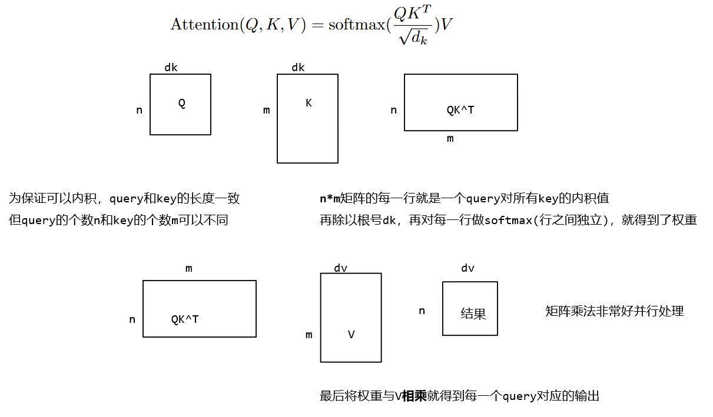

# Note

## encoder and decoder

编码器和解码器的区别：
编码器一次性可看到整个句子
解码器只能一个一个地生成（自回归$auto-regression$:根据自己前面预测过的词预测自己（后面待预测的词））
由于解码是自回归的，所以预测的时候你当然不能看见后面的输出，但注意力机制中每次能看到整个完整的输入，所以在解码器训练时，在预测第t个时刻的输出时不能看到t时刻之后的输入：通过一个带掩码的注意力机制。

## attention

注意力函数是一个将一个query和一些key-value对映射成一个输出的函数（query, keys, values, output均为向量），具体来说，输出output是value的加权和（所以输出维度和value维度一样），每个value的权重是这个value对应的key和query的相似度（compatibility function）计算而得。

### Scaled Dot-Product Attention

输入：queries和keys（维度都为dk）
values和output维度都为dv
**首先计算query和所有keys的内积（dot product）**（内积值越大，表示两个向量之间的相似度越高,内积为0表示两个向量正交，即没有相似度）
然后除以$\sqrt{d_k}$（即向量$QK^T$的长度）
接着用一个softmax得到权重（一给定一个query，假设给定n个键值对的话，就得到了n个值，放入softmax就得到了非负和为1的权重）
最后将权重作用到values上就得到输出

  

然后对于**mask处理**，是将t之后的值换成很大的负值(eg -1e10)，而该值进入softmax做指数是就会变成零。所以计算t时刻的output时就只用到了前t-1个v值。

本模型中的注意力机制：
左下角：