# Note

[toc]

## 背景知识

### encoder and decoder

编码器和解码器的区别：
编码器一次性可看到整个句子
解码器只能一个一个地生成（自回归$auto-regression$:根据自己前面预测过的词预测自己（后面待预测的词））
由于解码是自回归的，所以预测的时候你当然不能看见后面的输出，但注意力机制中每次能看到整个完整的输入，所以在解码器训练时，在预测第t个时刻的输出时不能看到t时刻之后的输入：通过一个带掩码的注意力机制。

### attention

> 背景知识：
> 向量内积表征两个向量之间的夹角，还表征一个向量在另一个向量上的投影$ab=||a||\ ||b||cos\theta$，投影值越大说明两个向量**相关度越高**，如垂直向量之间无关。
> 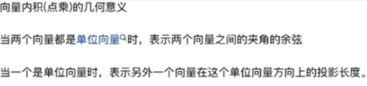  
---
注意力函数是一个将一个query和一些key-value对映射成一个输出的函数（query, keys, values, output均为向量），具体来说，==**输出output是value的加权求和**，每个value的**权重是这个value对应的key和query的相似度**==（compatibility function）计算而得。

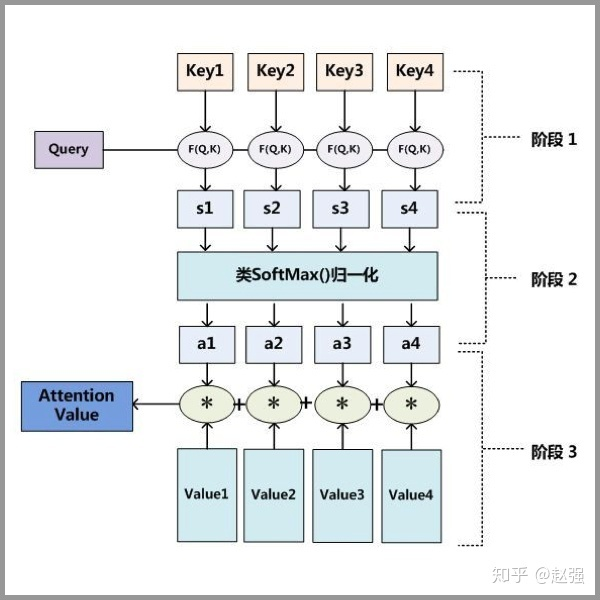  

第一步： query 和 key 进行相似度计算，得到权值
第二步：将权值进行归一化，得到直接可用的权重
第三步：将权重和 value 进行加权求和

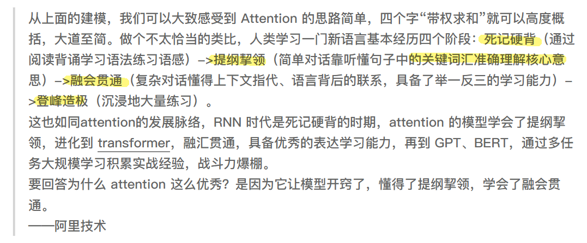  

### Scaled Dot-Product Attention

输入：queries和keys（维度都为dk）
values和output维度都为dv

1. **首先计算query和所有keys的内积（dot product）**（内积值越大，表示两个向量之间的相似度越高,内积为0表示两个向量正交，即没有相似度）
   1. 矩阵$QK^T$表示$Q$矩阵中每个行向量与$K$矩阵每个列向量的内积，得到的$n*m$矩阵表示n个$query$分别与$m个key$之间的关联度。
2. 然后除以$\sqrt{d_k}$
   1. 原因：为了防止维数过高时的值过大导致softmax函数反向传播时发生梯度消失
3. 接着用一个softmax得到权重（一给定一个query，假设给定n个键值对的话，就得到了n个值，放入softmax就得到了非负和为1的权重）
4. 最后将权重作用到values上就得到输出

  

然后对于**mask处理**，是将t之后的值换成很大的负值(eg -1e10)，而该值进入softmax做指数是就会变成零。所以计算t时刻的output时就只用到了前t-1个v值。

本模型中的注意力机制：
左下角：

## transformer正文

### 解决问题

由于$RNN(包括LSTM)$计算限制为顺序执行（只能随时间从左往右或者从右往左），这带来了两个问题：

- 限制了模型的并行能力，$t$时间片的计算依赖$t-1$时刻的计算结果
- 顺序计算的过程中信息会丢失，尽管LSTM等门机制的结构一定程度上缓解了长期依赖的问题，但是对于**特别长期的依赖现象**，LSTM依旧无能为力

**故**提出了完全采用$Attention$的$Transformer$

- 它不是顺序结构，具备更好的并行性

---

### encoder&decoder in transformer

Transformer的本质上是一个$Encoder-Decoder$的结构。
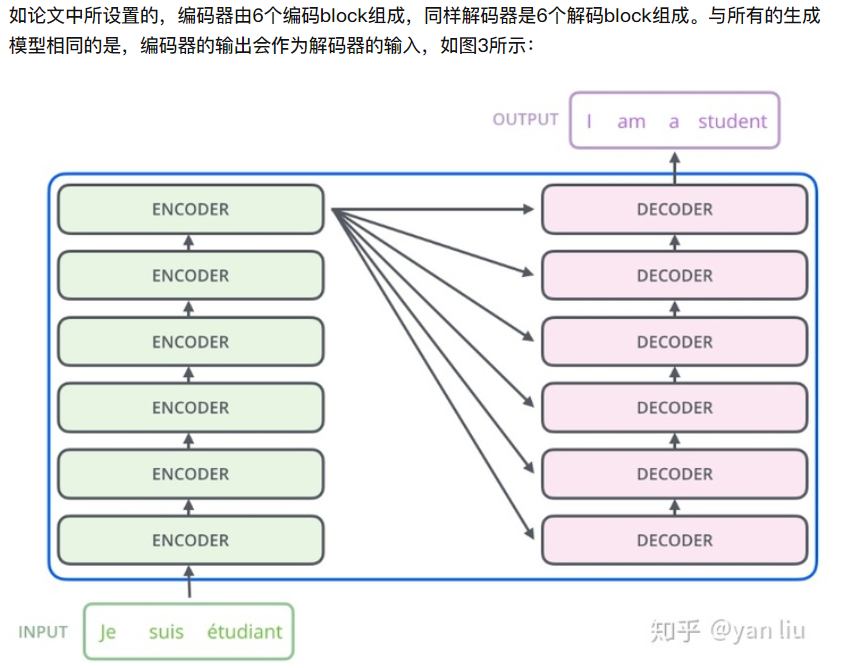  

**$encoder$结构**

输入是**单词的Embedding**，再加上**位置编码**，主要包括$self-attention和Feed\ Forward模块$；再额外加了一些处理，比如Skip Connection，做跳跃连接，然后还加了Normalization层。

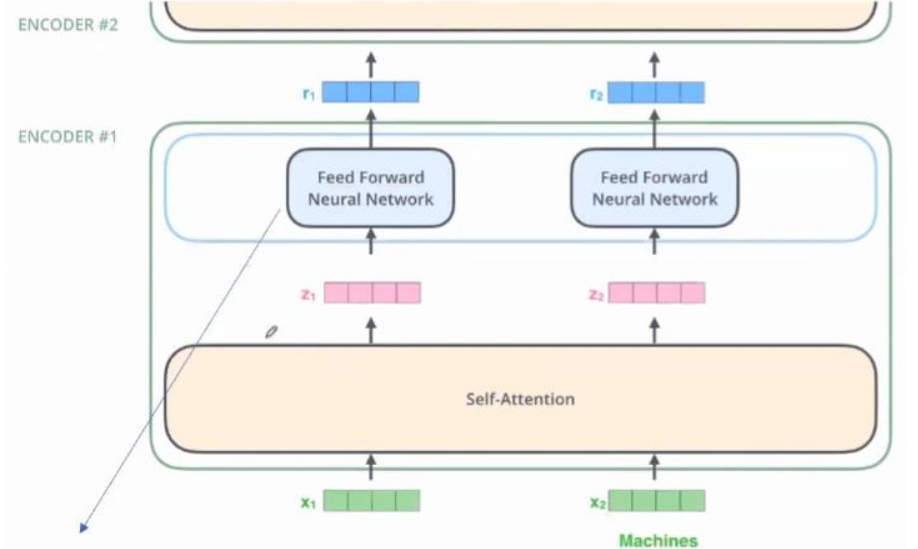  

自注意力模块：
$$
Attention(Q,K,V) = softmax(\frac{QK^T}{\sqrt{d_k}})V
$$

全连接模块：(两层全连接，中间有个ReLU)
$$
FFN(Z) = ReLu(ZW_1+b_1)W_2+b_2=max(0,ZW_1+b_1)W_2+b_2
$$

其中Z表示注意模块的输出。

注意：Self-Attention框里是所有的输入向量**共同参与**了这个过程，也就是说，和**通过某种信息交换和杂糅**，得到了中间变量和。而**全连接神经网络是割裂开**的，和各自**独立**通过全连接神经网络，得到了和。（所以叫做$Position-wised\ FFN$）

**$Decoder$结构**：
第一次输入是前缀信息，之后的就是上一次产出的Embedding，加入位置编码；
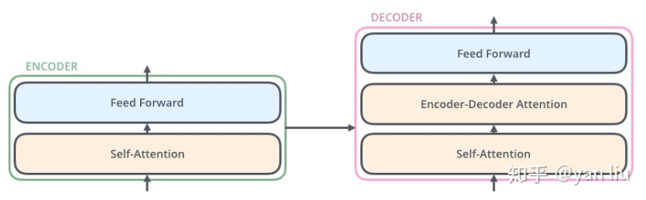  

- Self-Attention：**当前翻译**和**已经翻译**的前文之间的关系；
- Encoder-Decnoder Attention：**当前翻译**和**编码的特征向量**之间的关系。

---

### self-attention模块

为什么叫Self-Attention呢，**就是一个句子内的单词，互相看其他单词对自己的影响力有多大**

attention和self-attention的区别：
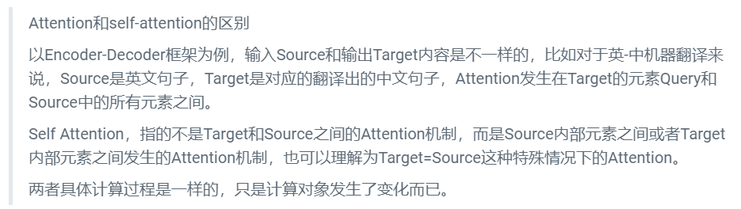  

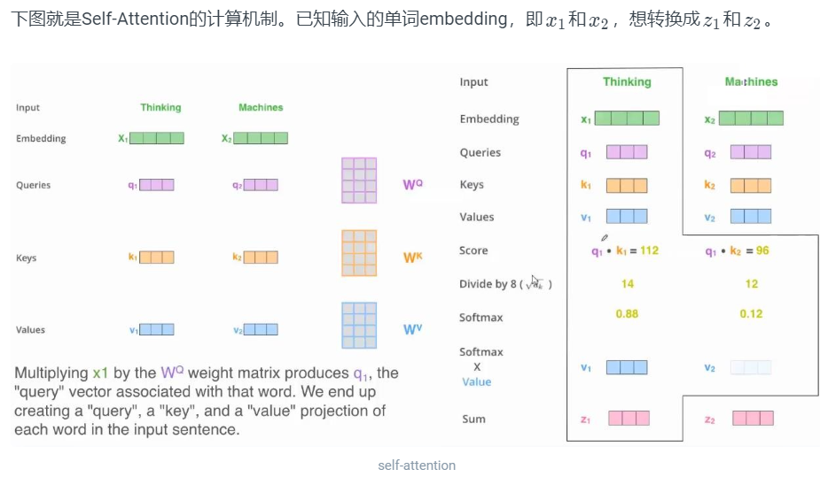  

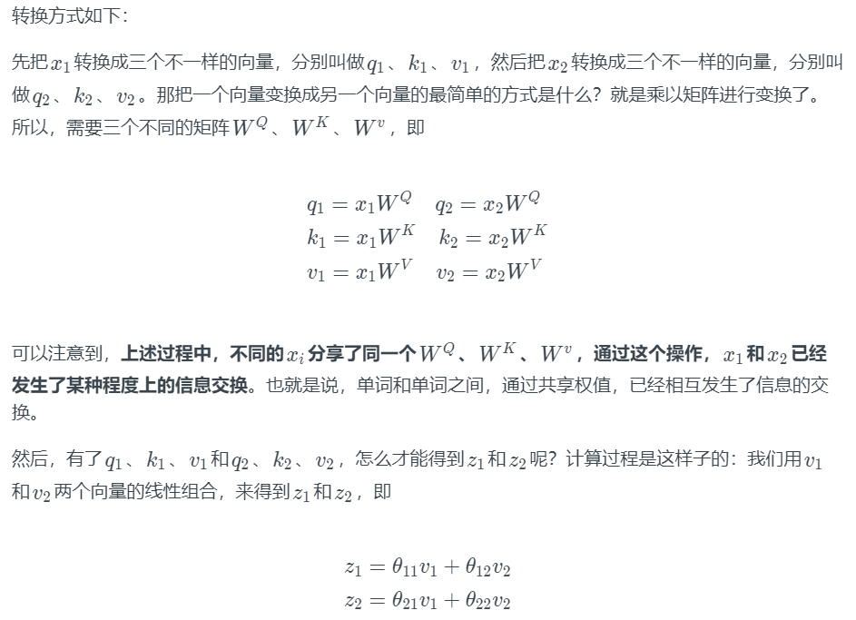  

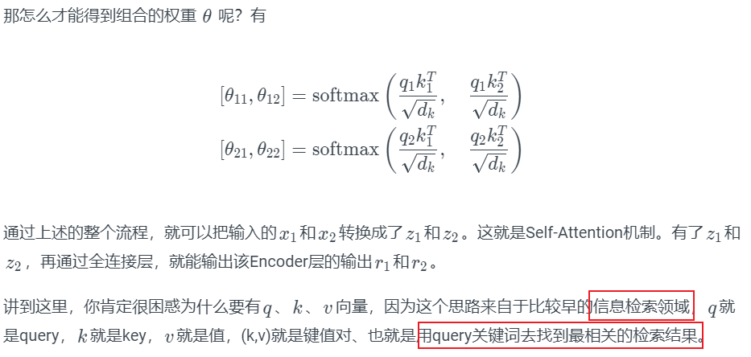  

实际计算过程中是采用基于矩阵的计算方式（矩阵加速更快）：
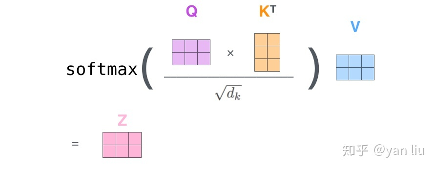  

### multi-headed Attention

如果用不同的$W^Q$、$W^K$、$W^V$，就能得到不同的Q、K、V。**multi-headed Attention就是指用了很多个不同的$W^Q$、$W^K$、$W^V$。**

**优点**：可以让Attention有更丰富的层次。有多个Q、K、V的话，可以分别从多个不同角度来看待Attention。这样的话，输入，对于不同的multi-headed Attention，就会产生不同的z。
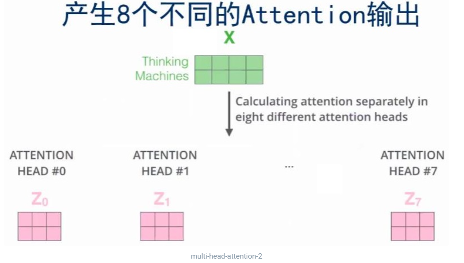  

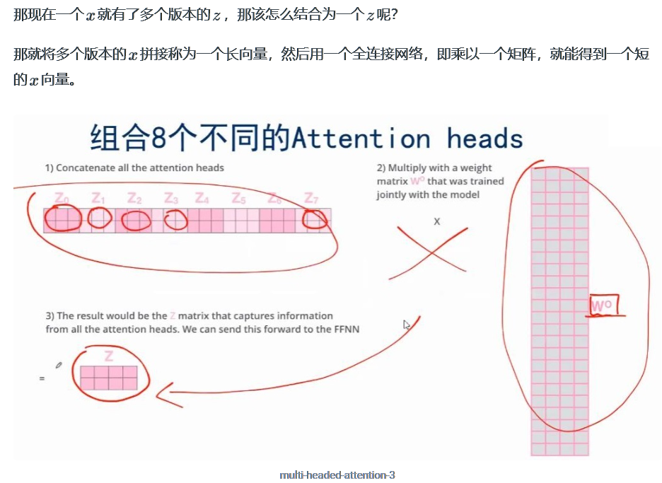

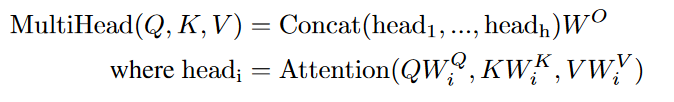  

### 词向量Embedding

我们输入的是一个个的词($token$：eg '我','很','开心')，然后将其映射成一个向量，$embedding$就是给定任何一个词，去学习一个长为$d$的向量来表示它。
> 分词就是将句子、段落、文章这类型的长文本，分解为以字词（token）为单位的数据结构。

Encoder输入的是单词x的embedding格式
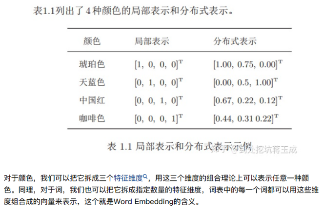  
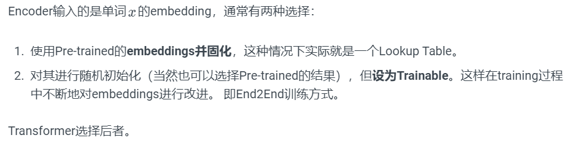  

### 位置编码Positional Encoding

首先我们发现$attention$**是不会有时序信息的**，“输出时value的加权和，权重是query和key之间的距离”，这跟序列信息无关。这意味着我给你一句话，任意打乱后（语义肯定变了），attention结果仍然一致（顺序会变，但值不变），这有问题。
> RNN是将上一时刻的输出作为本时刻的输入，so可时序。

**$attention$是在输入中加入时序信息**。我们用长为512位的向量表示embedding向量，同时用等长的向量表示$positional\ encodeing$,具体的值使用周期不同的sin和cos函数算出来的。

---
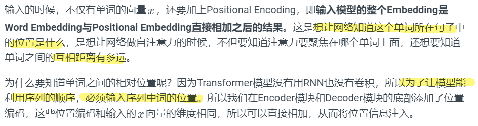  

具体计算方法：[详见here](https://luweikxy.gitbook.io/machine-learning-notes/self-attention-and-transformer)

### skip connection & Layer Normalization

Add & Norm模块接在Encoder端和Decoder端每个子模块的后面，其中Add表示残差连接，Norm表示LayerNorm；Encoder端和Decoder端每个子模块实际的输出为：
$$
LayerNorm(x+Sublayer(x))
$$
