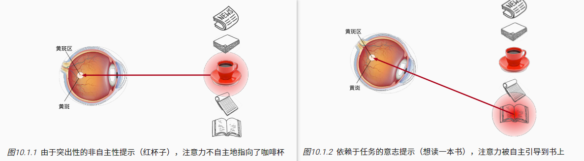
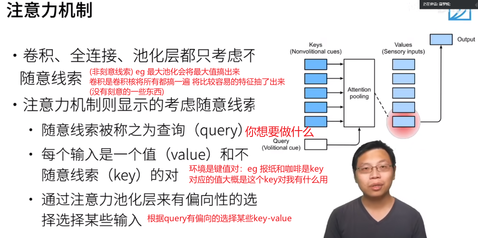

# Note

注意力是稀缺的，而环境中的干扰注意力的信息却并不少。 比如我们的视觉神经系统大约每秒收到位的信息， 这远远超过了大脑能够完全处理的水平。 幸运的是，我们的祖先已经从经验（也称为数据）中认识到 “并非感官的所有输入都是一样的”。 在整个人类历史中，这种只将注意力引向感兴趣的一小部分信息的能力， 使我们的大脑能够更明智地分配资源来生存、成长和社交， 例如发现天敌、找寻食物和伴侣。

  
即非自主性与自主性的注意力提示。

受试者使用非自主性和自主性提示有选择性地引导注意力。前者基于突出性，后者则依赖于意识。

  
**注意力机制中，通过query（随意线索）和key（不随意线索）来有偏向性的选择输入。**