# Record

## LeNet

单GPU 2080Ti

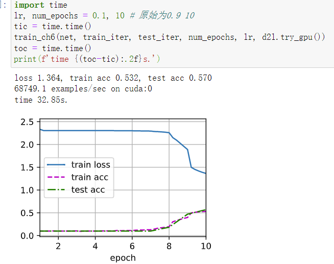  

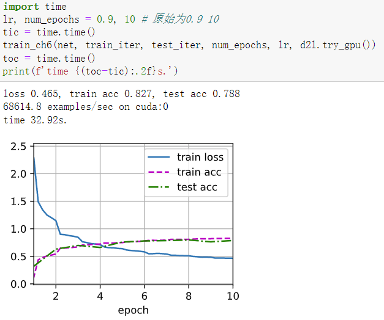  

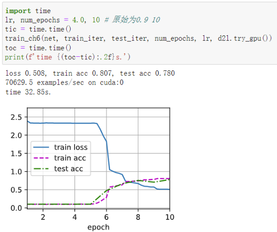  

在epoch一致时，学习率从0.1-10递增变化的影响观察如下：

- 时间上：一致
- examples/sec：基本在70000
- loss：从0.1递增到2.5都是一直递减，然后缓慢上升最后直接封顶
- 训练集精度：从0.1-3基本是递增的，然后降低然后为0
- 测试集精度类似（未能观测出过拟合问题）

> 开始loss递减原因：学习率更大，收敛了更多
> 然后loss递增原因：学习率过大，逐渐无法收敛，步伐太大，直接跳过了最优值。

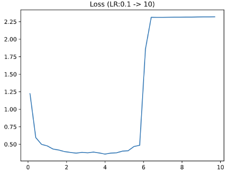  

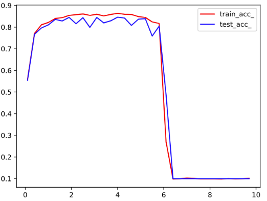  

在固定epoch的时候，学习率比较小时，误差比较大是因为模型还未收敛，需要更多的epoch才行，下图证实：
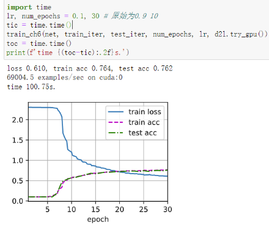  
（与上文0.1对比，其loss低很多）

**故学习率较小时模型收敛缓慢，需要更多次的epoch**
如果学习率过小，那将看起来像是平行线，基本不收敛。
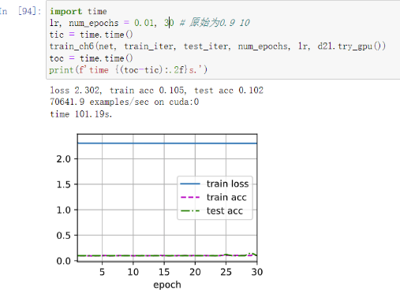  

**总结：**

- 学习率设置太小，网络收敛非常缓慢，需要更多epoch。
- 学习率设置太小，可能会进入局部极值点就收敛，没有真正找到的最优解，换句话说就是它步长太小，跨不出这个坑。
- 学习率设置太大，可能会不收敛  

在学习率一致时，epoch从5-100变化的影响：

- epoch过少时欠拟合
- 随着epoch的提升，loss持续下降直到平缓，训练集准确率和测试集准确率都持续上升，差距应该是会逐渐变大，发生过拟合（但此处不明显）
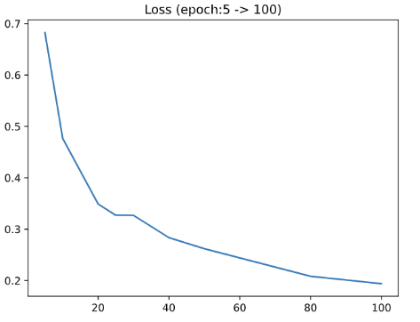  
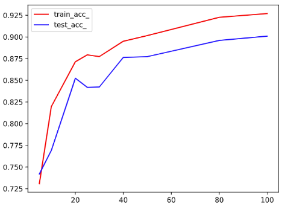  

## AlexNet

LeNet
  
AlexNet
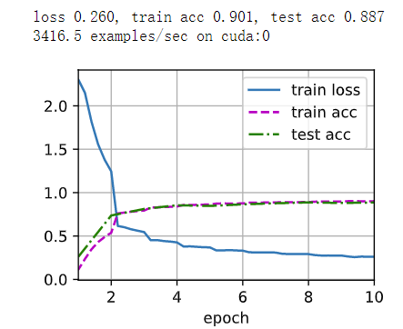  
> examples/sec锐减
> loss更低，准确率更高

VGGNet
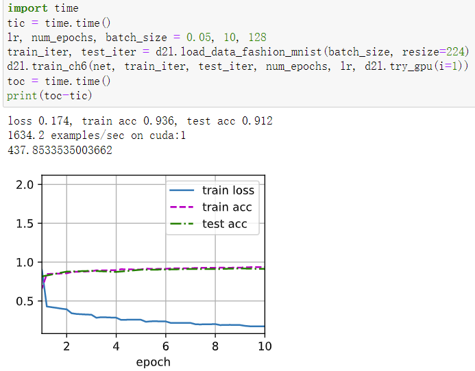  
> 通道数减少4倍（计算量降低16倍）后仍然很慢

ResNet
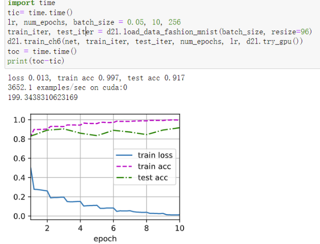  
> 很快
> 貌似有点过拟合
